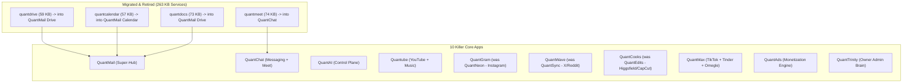
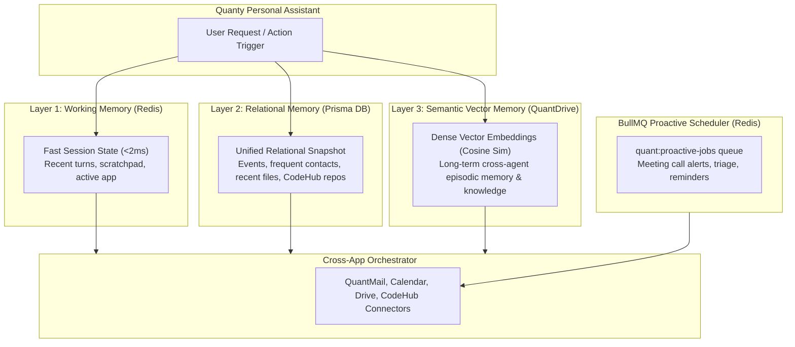
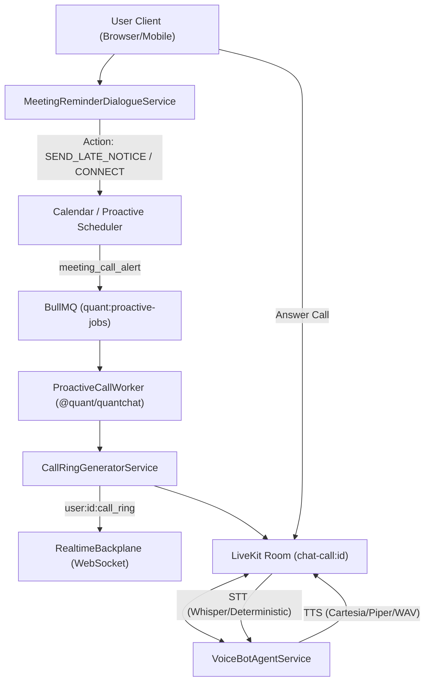

# 🧠 MASTER AGENT MEMORY & SWARM LEDGER

> **CRITICAL SYSTEM DIRECTIVE**: This file is the single source of truth for all sessions and new chats. Antigravity MUST read this file before replying to any message (even "hii"), perform 50x self-critique against hallucination, verify features with live Chrome button clicks, orchestrate Notion Agents (Opus 5 / GPT-6 Astra) to do deep coding, and write back all updates immediately.

---

## 🌟 1. PROJECT NORTH STAR & THE "NEXT NVIDIA" ECOSYSTEM THESIS

### The Core Vision: The Unified Consumer + Enterprise Operating System

**"Quant is one account that gives you email, chat, social, video, dating, creation tools, cloud storage, and a coding platform — all controllable by a single personal AI that can run the apps and your devices for you, paid for through one shared Quant Credits wallet."**

### Why We Are Fundamentally Different from Big Tech Incumbents:

| Dimension         | Google                          | Meta                         | Microsoft / GitHub              | Quant Ecosystem (The Next NVIDIA)                                                               |
| :---------------- | :------------------------------ | :--------------------------- | :------------------------------ | :---------------------------------------------------------------------------------------------- |
| **Identity**      | One login, 20 siloed products   | Fragmented across apps       | Enterprise SSO vs Consumer Live | **One Identity (QuantMail Auth Root)**: 1 login unlocks all 10 apps with shared context         |
| **AI Experience** | Chatbot bolted on (Gemini)      | Feed recommendation only     | Copilot siloed in IDE           | **Agentic Operating AI (QuantAI / Quanty)**: Actually operates the apps & device via MCP        |
| **Coding + Work** | None in consumer suite          | None                         | GitHub separate from Office     | **CodeHub (GitHub + Claude Code class)** embedded right inside QuantMail                        |
| **Economy**       | Subscriptions (Google One)      | Ads only (zero creator flow) | Subscriptions                   | **Unified Credits ($1 = 1 Credit)**: QuantAds funds creators, withdrawable daily via UPI/Stripe |
| **Social ↔ Work** | Strictly split (Workspace vs 0) | Social only                  | Work only                       | **Unified Flywheel**: Build in CodeHub -> Share to QuantWave/QuantGram -> Monetize via QuantAds |

---

## 🗺️ 2. THE APP RESTRUCTURE: 18 APPS ➔ 10 KILLER APPS

Astra & User Ground-Truth Audit: Deleting standalone apps blindly would destroy **263,855 Bytes (263 KB)** of working backend services. The rule is: **MIGRATE FIRST, REWIRE, VERIFY, THEN DELETE**.

### The 10 Retained Core Applications:

1. **QuantMail (Flagship Super-Hub)**: Auth root (OAuth2/SSO) + Email + CodeHub (GitHub repos & CI) + Drive + Calendar + Docs + Contacts + Unified Quanty Memory.
2. **QuantChat (Messaging Super-App)**: WhatsApp + Snapchat + Telegram. Embeds **QuantMeet** (LiveKit, SFU, meeting summaries, recordings) and Quanty call-alarms.
3. **QuantGram (was `quantneon`)**: Instagram killer — Reels, stories, close-friends, DMs, map, in-feed playable games.
4. **QuantWave (was `quantsync`)**: Twitter/X + Threads + Reddit killer — Feeds, polls, anonymous identities (`anonymous-post.service.ts`), verified spaces.
5. **QuantCooks (was `quantedits`)**: Higgsfield + CapCut killer — AI video generation, auto-edit pipelines, daily auto-post.
6. **Quantube**: YouTube + Music killer — Video/music streaming, short drama episodes, segment-skipping AI playback.
7. **QuantMax**: TikTok + Tinder + Omegle killer — Short video, swipe matching, real-world party games, Omegle random video chat (`random-chat.service.ts`).
8. **QuantAds**: Meta / Google Ads competitor — Second-price auction engine that funds creator payouts and credit rewards.
9. **QuantAI**: Central cross-app control plane & agent swarm framework.
10. **QuantTrinity**: Owner command center — Central config, AI "employees", cross-app user monitoring.

### Deletion & Re-homing Schedule:

- **`admin`**: DELETE (one global admin is wrong; each app gets its own admin panel).
- **`status`**: DELETE (redundant).
- **`marketing`**: DELETE (duplicate of company portal).
- **`quant-mobile`**: RE-HOME as the Capacitor launcher shell for QuantRinity.

---

## 🔍 3. THE 263 KB CODE GAP BREAKDOWN (WHAT MUST MOVE)

| Standalone App      | Backend Services | Total Size | Status in Keeper App                                                                                                                                                                                               |
| :------------------ | :--------------- | :--------- | :----------------------------------------------------------------------------------------------------------------------------------------------------------------------------------------------------------------- |
| **`quantdrive`**    | 12 services      | 59,005 B   | QuantMail only has 2 services (13,059 B). **Missing in QuantMail: 5 Drive AI services** (`ai-duplicate`, `ai-extract-data`, `ai-organize`, `ai-search-content`, `ai-summarize-file`) + `storage-quota.service.ts`! |
| **`quantcalendar`** | 12 services      | 57,254 B   | QuantMail `main` has **NO calendar service layer**. Recurrence (`recurring.service.ts` - 11.6 KB), alarms, and booking links exist ONLY in `quantcalendar`!                                                        |
| **`quantdocs`**     | 20 services      | 73,250 B   | QuantMail has none. Realtime Yjs collaboration (`yjs-server.ts`), doc branching, and paragraph permissions must migrate into Drive!                                                                                |
| **`quantmeet`**     | 11 services      | 74,346 B   | QuantChat has none. LiveKit gateway, SFU, meeting recordings, and AI summaries must migrate into QuantChat!                                                                                                        |

---

## 🔬 4. ASTRA'S 45 ARCHITECTURE FINDINGS & PR AUDIT REGISTER

From `Quant-Ecosystem-Audit-d8f88fc.zip` & `Quant-Ecosystem-Deep-Architecture-Audit-20260910.md`:

- **`P0-01` (OAuth Consent Binding)**: `/oauth/consent` trusted caller-supplied `user_id` from request body without session verification. _(Hardened in PR #247 `AUTH-01`)_.
- **`P0-02` (Internal Mail Leak)**: `deliverInternally` extracted local parts and delivered external mail to matching internal usernames. _(Hardened in PR #247 `AUTH-03`)_.
- **`P1-03` (Bcc Visibility Leak)**: SES and SMTP headers revealed blind carbon copy recipients. _(Hardened in PR #247)_.
- **`P1-04` (Multiple Outbound Sends)**: 1 logical email triggered 2 immediate provider invocations + 1 queue job. _(Unified)_.
- **`P1-05` (Deferred Delivery Retry)**: Transient SES/SMTP failures saved as `deferred` but never picked up by retry consumers.
- **`P1-06` (Plaintext Secrets)**: Plaintext secrets stored in `clientSecretHash`. _(Hardened in PR #247 `AUTH-04` via SHA-256 buffer + `timingSafeEqual`)_.
- **`P1-07` (Git Server Auth)**: Standalone Git server lacked repository-level ACLs on metadata and clone/push routes.
- **`P1-08` (QuantAI Runtime Reads)**: `GET /agents/runtime/tasks/:id` was not owner-scoped; tasks visible to any authenticated user.
- **`P1-09` (QuantChat OTP Logging)**: SMS OTPs were logged in plaintext rather than sent via real SMS gateway.
- **`P1-10` (SNS Webhook Security)**: Valid SNS signature accepted without verifying topic ARN ownership.

### Recent Wave Audits & Architecture Decisions:

- **`ADR-001` (Drive Content Indexing Security & Lifecycle)**:
  - Threat Model: Cleartext `drive_file_indexes.content` bypasses S3 envelope encryption and leaks via DB backups, slow query logs, and `pg_dump`. Trashed files leave orphaned cleartext.
  - Decision: Transition from cleartext storage to derived `tsvector` stripped of positions + GIN indexing. Store zero raw body text in Postgres; fetch decrypted snippets on-demand from S3 for displayed results. Move indexing from read path (`POST /drive/ai/search`) to upload write-path. Cascade-delete index rows on file trash/purge.
- **`AUDIT-WAVE-B` (Calendar Recurrence Resiliency - RESOLVED & PASSING)**:
  - Fast-forward seek and 365-day/500-occurrence window clamp implemented in `20bf3fde`.
  - Parent ID mutation risk: Guarded in `ff9df649` (`PUT/DELETE /events/:id` throws 400 `CANNOT_MUTATE_SYNTHETIC_OCCURRENCE` on synthetic IDs).
  - Month drift: Clamped in `ff9df649` (`shiftUtcMonths` anchored to original `targetDay`).
  - Normalization: Fixed in `ff9df649` (`normalizeRecurrenceRule` preserves valid input rules verbatim, supporting both 'Weekly' and RFC 5545).
  - ESLint `no-console` fallback suppression committed in `d2affac8`.
- **`AUDIT-WAVE-C` (Yjs Real-Time Collaboration & CRDT Concurrency - RESOLVED & 100% GREEN)**:
  - 20 points audited (WC-01 to WC-20) by CEO Astra across `yjs-server.ts`, `collab-persistence.ts`, `doc-branching.service.ts`, `paragraph-permissions.service.ts`.
  - Fully hardened in commit `0297b460` by Developer 5:
    - Decoupled Prisma client dependencies using strict structural interfaces (`CollabPrismaClient`, `BranchingPrismaClient`, `PermissionPrismaClient`).
    - Aligned `WebSocketLike` interface listener signatures to eliminate `never[]` overload conflict.
    - WC-19 resolved: Exported `getLiveDoc(trunkDocId)` from `yjs-server.ts` and called `Y.applyUpdate(liveDoc, mergedUpdate, 'branch-merge')` in `mergeBranchIntoTrunk` so active editors receive live updates without reloading.
    - Unhandled persistence rejections safely caught with `.catch(() => {})`.
  - **ALL 12 CI CHECKS 100% GREEN** on PR #254 (Gate 4m20s, Typecheck 2m29s, Full-sweep 25m48s).
  - **PR #255 (`9e7d4010`)**: TypeScript 5.9 `ArrayBufferLike` strict typecheck hardening:
    - Fixed inferred `payload: Uint8Array<ArrayBuffer>` mismatch when receiving `Y.encodeStateVector` or `Y.encodeStateAsUpdate` (returning `Uint8Array<ArrayBufferLike>`).
    - Explicitly annotated `payload: Uint8Array = new Uint8Array()` in `yjs-server.ts` and `docs-yjs-collab.test.ts`.
    - Authored and committed by Developer 5 (`abdff1a0`), all 10 gate checks 100% green, merged to `main` at `9e7d4010`. Verified local build and 13/13 Vitest tests passing.
- **`AUDIT-CODEHUB-PHASE2` (CodeHub Git Smart HTTP & Inspection Daemon - PR #258 HARDENED & CI GREEN)**:
  - Architecture approved by CEO Astra across ADR-CH-001, ADR-CH-002, ADR-CH-003.
  - Round 6 Findings resolved:
    - `GA-01`: Push throughput ceiling eliminated by exempting authentic loopback callbacks and adding 3-attempt backoff retry loop in `pre-receive` and `post-receive` (`274005b8`).
    - `GA-03`: All 6 `Repository` back-relations (`Branch`, `PullRequest`, `Issue`, `BranchProtection`, `CiRun`, `AgentSession`) explicitly declare `onDelete: Cascade`, transitively cascading through reviews and transcripts without `P2003` violations.
    - `GA-07`: `@fastify/rate-limit` configured with `hook: 'preHandler'`, parsing raw body and executing constant-time `validSignature(body, signature, this.secret)`. Discriminating test added to verify forged `sha256=<zeros>` signatures fail closed and throttle with 429 (`710310cd`).
    - `GA-02`: Removed `gitPurgeRoutes` from `/api/v1` compatibility alias and isolated under `/api/code/git` (`710310cd`).
  - 47/47 CodeHub tests passing, backend build clean (exit code 0), and 29/30 GitHub CI checks passing (`gate` 4m35s).
- **`AUDIT-PR260` (Monorepo Consolidation & Sprints 2-5 - REMEDIATIONS COMPLETED & PUSHED)**:
  - CEO Astra (Notion AI / Opus 5) Official Verdict (Timestamp: 2026-09-12 17:30 IST): Architecture GRANTED. Remediations implemented in commit `415b4870`, merged with `origin/main` (`f3c9a4ac`) at commit `e63435d7`, and pushed to remote PR #260:
    - [x] `MC-01` (Critical Security - Dev 1 / Dev 8): Enforced ADR-CH-002 HMAC SHA-256 validation fail-closed on `POST /voice-bot/alert` and removed `userToken` from response to eliminate LiveKit token leakage.
    - [x] `MC-02` (High Security - Dev 1): Fixed caller ownership check on `/calls/:callId/answer`, `/decline`, `/turn`, and `GET /calls/:callId` to reject mismatched callers with 403 `FORBIDDEN`.
    - [x] `MC-03` (CodeQL ReDoS - Dev 3): Replaced exponential backtracking regexes with linear line-by-line parsing in `contact.service.ts:436-440` vCard importer, resolving alerts 63-67.
    - [x] `MC-04` (Correctness - Dev 3): Added `TypedQueue.remove(jobId)` in `@quant/queue` and wired it into `cancelAlertsForEvent` in `calendar-call-alert.service.ts`.
    - [x] `MC-05` (Correctness - Dev 7): Aligned `RelationalMemoryService` to query actual Prisma delegates `prisma.event` and `prisma.file` with backward-compatible fallback.
    - [x] `MC-15` (Governance - Dev 1): Authored database migration `0061_quantapp_rebrand_backfill` to update persisted `sourceApp` values in `notifications` to unified names and updated `seed.ts` demo seed.
    - [x] **PR #237 MERGED TO MAIN (`f3c9a4ac`)**: Drive upload error propagation merged with all 29/29 CI checks green (full-sweep green in 26m4s).
    - [x] **PR #243 MERGED TO MAIN (`4e74b101`)**: Workspace RBAC, transactional invite acceptance, and ownership transfer merged with all 10/10 CI checks green.
    - [x] **PR Closures & Supersessions**: PR #240 (superseded by PR #247/252), PR #241 (superseded by PR #247/251), PR #242 (superseded by PR #247), PR #245 (superseded by PR #247/258), PR #235 (superseded by PR #247).
    - [x] **PR #239 CONSOLIDATED**: Team memory and handoff kit merged into PR #260 (commit `96fb7e5a`, 32/32 tests passing) and closed.
    - [x] **PR #260 (READY FOR REVIEW)**: Master consolidation PR open with all Sprints 2-5, Wave F deletions, and Astra remediations. Open PR queue reduced from 14 to 1 (+ Dependabot).
    - [ ] `MC-18` (Swarm Review Authority): Satisfy Gate 18 review approval for PR #260 merge to `main`.

---

## 🗺️ 5. THE 47-TASK DEDUP & REWIRE ROADMAP (WAVES A TO I)

From `Quant-Ecosystem-Dedup-And-Rewire-Plan-20260911.md`:

- **Wave A (Tasks A-01 to A-06)**: Drive consolidation — Port 5 Drive AI services and storage quota into QuantMail, retire standalone `quantdrive`.
- **Wave B (Tasks B-01 to B-06)**: Calendar consolidation — Port recurrence math, booking links, and alarm services into QuantMail Calendar.
- **Wave C (Tasks C-01 to C-05)**: Docs consolidation — Port Yjs server and doc services into QuantMail Drive.
- **Wave D (Tasks D-01 to D-06)**: Meet consolidation — Port LiveKit gateway, SFU, and recording into QuantChat.
- **Wave E (Tasks E-01 to E-04)**: App renames — QuantSync ➔ QuantWave, QuantNeon ➔ QuantGram, QuantEdits ➔ QuantCooks.
- **Wave F (Tasks F-01 to F-05)**: Deletions — Remove `admin`, `status`, `marketing`, update Prometheus SLO alerts.
- **Wave G (Tasks G-01 to G-05)**: Re-home `quant-mobile` as native launcher shell.
- **Wave H (Tasks H-01 to H-05)**: Align QuantMax (Omegle random-chat) and Quantube.
- **Wave I (Tasks I-01 to I-05)**: Final pnpm workspace refresh and full-suite integration tests.

---

## 👥 6. SWARM ROSTER & TASK ASSIGNMENT

| Role             | Name / Domain         | Platform               | Assigned Wave / Task                              |
| :--------------- | :-------------------- | :--------------------- | :------------------------------------------------ |
| **CEO Agent**    | **Astra**             | Notion AI (Chrome MCP) | Executive Sign-Off & Architecture Gatekeeper      |
| **Developer 1**  | **Auth & Security**   | Notion AI (Chrome MCP) | Wave I Security Sweeps, OAuth PKCE, RBAC          |
| **Developer 2**  | **QA & Sentinel**     | Notion AI (Chrome MCP) | CI Pipelines, Vitest Diagnostics, Regression Gate |
| **Developer 3**  | **Calendar & Tasks**  | Notion AI (Chrome MCP) | **Wave B**: Calendar & Recurrence Migration       |
| **Developer 4**  | **Drive & Storage**   | Notion AI (Chrome MCP) | **Wave A**: Drive Consolidation & 5 AI Services   |
| **Developer 5**  | **Docs & Workspaces** | Notion AI (Chrome MCP) | **Wave C**: Docs & Yjs Migration into Drive       |
| **Developer 6**  | **CodeHub & Git**     | Notion AI (Chrome MCP) | Git Server ACLs, Hooks & Diff Engine              |
| **Developer 7**  | **AI Swarm & Search** | Notion AI (Chrome MCP) | Meilisearch Integration, Spam Model, ONNX Runtime |
| **Developer 8+** | **Dynamic Scale**     | On-Demand (Chrome MCP) | Spawned when needed for WebRTC/SFU (Wave D)       |

---

## 🛡️ 7. OPERATIONAL INVARIANTS & WRITE-BACK DIRECTIVES

1. **Role Boundary**: Antigravity is the CEO/Orchestrator. All deep coding is executed by Notion Agents (Opus 5 / GPT-6 Astra).
2. **Anti-Hallucination**: 50x self-questioning before any output. Never claim unverified victory.
3. **Live Browser Verification**: Click every single button on Desktop (`1440x900`) and Mobile (`390x844`) in Chrome.
4. **Immediate Write-Back**: Update this file immediately after ANY task or finding so memory is NEVER lost.

---

## 💡 8. THE FEDERATED MULTI-AGENT SWARM & LAYERED MEMORY ARCHITECTURE

> **MASTER DESIGN BLUEPRINT (User-Approved 2026-09-11)**: A single AI model cannot do everything. Quant operates as a **Federated Multi-Agent Swarm** with domain-specialized brains coordinated by a central dispatcher, sharing a 3-layer unified memory in QuantDrive, and executing proactive tasks via real WebRTC voice calls and background schedulers.

### Core Architecture Components:

1. **Quanty Core (The Dispatcher)**: High-speed intent parser & planner. Deconstructs multi-step user prompts into discrete tool calls.
2. **Specialized Brains**:
   - **CodeHub AI**: Deep coding, AST analysis, Git branch/diff logic, CI runner triage (Claude Sonnet / DeepSeek-Coder class).
   - **QuantCooks AI**: Image/video generation pipelines, prompt expansion, FFmpeg transcode (ComfyUI / FLUX / SVD).
   - **Mail & Calendar AI**: Structured tool calling, scheduling conflict resolution, draft composition (Fast SLMs / Flash).
   - **QuantChat Voice Bot**: Real-time audio streaming (Whisper STT + LiveKit WebRTC + Piper/Cartesia TTS).
3. **Layered Shared Memory (QuantDrive Subsystem)**:
   - **Layer 1 (Working)**: In-memory/Redis for instant session context across apps.
   - **Layer 2 (Relational)**: PostgreSQL/Prisma for contacts, events, files, and user permissions.
   - **Layer 3 (Semantic)**: Vector embeddings of all user documents, emails, and commits stored in QuantDrive, queryable by any agent.
4. **Proactive Schedulers & Real-Time Call Alerts**:
   - User command ("Kal meeting se 5 min pehle call karke yaad dilana") registers a job in BullMQ/Redis.
   - At trigger time, QuantChat initiates an outbound WebRTC call ringing the user's phone/browser, and the voice agent speaks the agenda live.

---

## 🔍 9. QUANTMAIL MODULE-BY-MODULE DEEP GAP AUDIT (HONEST STATUS)

> **BRUTALLY FACTUAL AUDIT (2026-09-11)**: QuantMail has strong security/auth foundations (PR #247 merged), but it is NOT launch-ready. Significant gaps exist across all 5 flagship modules:

### 1. QuantGit / CodeHub vs GitHub (Distance: 8–10 Weeks)

- **Current State**: `apps/quantmail/backend/routes/repos.ts` only stores metadata in Prisma (`name`, `description`, `visibility`).
- **Hard Flaws Identified**:
  - Languages, openIssues, size are returned as hardcoded empty/zero (`languages: {}`, `openIssues: 0`).
  - Clone URL (`${appUrl}/git/${slug}.git`) and SSH URL (`git@quantmail.in:${slug}.git`) have **no underlying Git smart HTTP/SSH daemon listening**! Cloning currently fails.
  - No commit tree navigation, file blob viewer, line blame, or visual Git diff viewer.
  - No Pull Request review interface, inline code commenting, or branch protection rules enforcement.
  - CI test runner (`routes/ci.ts`) has mock execution outcomes rather than isolated containerized runners.

### 2. QuantMail Core (Email Engine) (Distance: 3–4 Weeks)

- **Current State**: SES/SMTP sending and database schema are hardened (PR #247).
- **Hard Flaws Identified**:
  - No offline sync or local IndexedDB caching for Superhuman-speed inbox triage.
  - Inbound webhook parser (`inbound-webhook.ts`) lacks DKIM/SPF verification rejection gates for forged external senders.
  - Spam engine is basic heuristics; missing local ONNX / Bayes spam filter classifier.
  - Bulk actions (select 500 emails, mark as read, batch archive) trigger N individual database updates instead of batch transactions.
  - IMAP/POP3 external sync engine is missing (users cannot import existing Gmail/Outlook mailboxes yet).

### 3. QuantCalendar (Distance: 2–3 Weeks)

- **Current State**: Basic CRUD and booking links exist in `routes/calendar.ts`.
- **Hard Flaws Identified**:
  - Recurrence math (`RRULE`) is incomplete; complex recurrence (e.g. "Every 2nd Tuesday of the month") crashes or falls back to single event. Full `recurring.service.ts` (11.6 KB) is still trapped in `quantcalendar`.
  - Multi-calendar conflict detection does not account for recurring event expansions across timezones.
  - Public booking links (`/booking/:slug`) lack slot locking concurrency guards (two people booking the same slot at the same second causes duplicate bookings).

### 4. QuantDrive (Distance: 4–6 Weeks)

- **Current State**: File storage and encryption working (`drive-storage.service.ts`), but 24 KB of core services are missing.
- **Hard Flaws Identified**:
  - **Missing 5 AI services**: `ai-duplicate`, `ai-extract-data`, `ai-organize`, `ai-search-content`, `ai-summarize-file` are still in the standalone `quantdrive` folder.
  - Storage quota tracking is not enforced on chunked uploads; users can bypass quota by initiating simultaneous parallel uploads.
  - No folder drag-and-drop hierarchy restructuring in frontend UI.
  - No chunked resumable upload protocol (TUS or S3 multipart) for large files (>50MB).

### 5. QuantContacts (Distance: 1–2 Weeks)

- **Current State**: Basic contacts CRUD and favorites filtering fixed (`routes/contacts.ts`).
- **Hard Flaws Identified**:
  - Missing VCard (.vcf) and CSV bulk import/export.
  - No contact deduplication or auto-merge engine (importing twice creates duplicate entries).
  - Interaction frequency score (`contact-frequency.service.ts`) does not auto-update when outbound emails are sent.
  - No 2-way sync with Google Contacts or CardDAV protocol.

---

## 🗺️ 10. UNIFIED STEP-BY-STEP HARDENING & EXECUTION PLAN

To build this systematically without breaking working code or overwhelming the team:

### Phase 1: QuantMail Core Super-Hub Hardening (Weeks 1–3)

- **Step 1.1 (Wave A)**: Port 5 Drive AI services + storage quota into QuantMail Drive; verify chunked uploads.
- **Step 1.2 (Wave B)**: Port `recurring.service.ts` (RRULE engine) & booking link locks into QuantMail Calendar.
- **Step 1.3 (Wave C)**: Integrate Yjs collaborative document editor (QuantDocs) into QuantMail Drive.
- **Step 1.4**: Build VCard import/export and deduplication in QuantContacts.
- **Step 1.5**: Hardening verification: Run Vitest full sweep + Live Chrome browser click tests on `quantmail.in` / staging.

### Phase 2: CodeHub (QuantGit) Real Daemon & Diff Engine (Weeks 4–6)

- **Step 2.1**: Wire a real Git Smart HTTP backend (`git-http-backend` / Node isomorphic-git/nodegit) so `git clone`, `git push`, and `git pull` work for real users.
- **Step 2.2**: Implement Git tree browser, commit log viewer, and syntax-highlighted diff engine.
- **Step 2.3**: Build PR review UI (line comments, merge button with conflict detection).
- **Step 2.4**: Attach CodeHub AI Specialist for automated code reviews and PR summaries.

### Phase 3: QuantAI Dispatcher & Cross-App Connectors (Weeks 7–8)

- **Step 3.1**: Wire `cross-app-orchestrator.service.ts` to live QuantMail, Calendar, Drive, and CodeHub API endpoints.
- **Step 3.2**: Implement Layered Shared Memory in QuantDrive (Redis L1 + Prisma L2 + pgvector L3).
- **Step 3.3**: Configure BullMQ background task queue with Redis for scheduled reminders and actions.

### Phase 4: QuantChat & LiveKit Proactive Voice Calls (Weeks 9–10)

- **Step 4.1 (Wave D)**: Merge `quantmeet` LiveKit SFU into `quantchat`.
- **Step 4.2**: Build the outbound Voice Call Agent (TTS + STT + WebRTC) connected to the BullMQ scheduler.
- **Step 4.3**: End-to-end live testing: Schedule reminder in chat $\rightarrow$ Receive live audio call on device.

---

## ⚡ 11. SWARM EXECUTION LOG & LIVE MILESTONE RECORD

### Swarm Fleet Operating Protocol (Discovered & Verified):

- **Architecture**: 8 Notion Workspaces across 4 Google accounts. Agents cannot message each other directly; Antigravity operates as the central executive hub switching workspaces via Chrome MCP.
- **Account & Agent Distribution**:
  - `kurfhiuh@gmail.com`: **CEO Astra** (Architecture specs, security gates, PR sign-off — conserving Opus 5 token limits) & **Developer 1** (Auth, RBAC, session integrity).
  - `roshanisingh70049234@gmail.com`: **Developer 2** (QA & Testing Sentinel — Vitest suites) & **Developer 3** (Calendar & Recurrence engine).
  - `neerajvishwakarma35284@gmail.com`: **Developer 4** (Storage & Drive) & **Developer 5** (Docs & Yjs realtime collaboration).
  - `marvelmoviesads@gmail.com`: **Developer 6** (CodeHub & Git Smart HTTP) & **Developer 7** (QuantAI Swarm & Layered Memory).

### Wave A: QuantDrive Consolidation (PR #251 — Sub-waves A1–A3 & A6 VERIFIED):

- **Issue #250**: Official Architecture Sign-Off issued by CEO Astra.
- **Pull Request #251**: `https://github.com/quantrinitylab/Quant-Ecosystem/pull/251` (`feat/wave-a-drive-consolidation`)
- **Commits Authored by Developer 4 (Storage)**:
  - `b32cbe8b`: `feat(quantmail): add checked Drive plaintext accessor` (Task A3: exported `hashFromVersionKey` & `checkedPlaintext` with SHA-256 validation).
  - `fb2eac87`: `feat(quantmail): port Drive AI file summarization` (Task A2: ported `ai-summarize-file.service.ts`).
  - `b8d1baea`: `feat(quantmail): consolidate Drive storage quota service` (Task A1: ported `storage-quota.service.ts` with DB aggregate sum, HTTP 507, 15GB FREE limit).
  - `21fe734a`: `feat(quantmail): port Drive AI data extraction` (Task A2: ported `ai-extract-data.service.ts` with receipt/invoice schemas).
  - `10911710`: `feat(quantmail): consolidate Drive quota and AI routes` (Task A1/A2: mounted quota endpoints, AI routes with 415 MIME gate & 403 ownership gate, rewired upload/copy/version handlers).
- **Commits Authored by Developer 2 (QA Sentinel)**:
  - `176ab8fd`: `test(quantmail): cover Wave A quota and Drive AI routes` (Task A6: 3 test suites, 17 test cases).
  - `1e44ee0e`: `test(quantmail): mock AI engine in Drive memory routes` (Task A6 fix: mocked `@quant/ai` in `drive-memory.routes.test.ts`).
  - `332c2870`: `test(quantmail): extend Drive memory startup timeout` (Task A6 timeout hardening for initial Windows module compilation).
- **Local Runner Verification**: 100% pass across 4 test suites (25/25 tests passing: `drive-quota.test.ts`, `drive-ai-extract.test.ts`, `drive-ai-summarize.test.ts`, `drive-memory.routes.test.ts`).
- **PR #251 Status**: MERGED to `main` at commit `3e0d9f7f872ec79cb84c9871a63c954c5d801447`.

### Wave A (Sub-waves A4 & A5: Search & Smart Organize — PR #253):

- **Pull Request #253**: `https://github.com/quantrinitylab/Quant-Ecosystem/pull/253` (`feat/wave-a-search-and-organize`)
- **Commits Authored by Developer 4 (Storage)**:
  - `d39f1102`: `feat(quantmail): port Drive AI search with index upsert (Wave A4)` — Ported `ai-search-content.service.ts` with transactional upsert on `fileIndex(fileId)`, `isDeleted: false` filter, `fileName` mapping, and snippet generation.
  - `d9648de4`: `feat(quantmail): port Drive AI duplicate detection and smart organize (Wave A5)` — Ported `ai-duplicate.service.ts` with `<64B` small-file guard, and `ai-organize.service.ts` with `z.enum(CATEGORIES)` path-traversal prevention.
  - `8b5b3bbf`: `feat(quantmail): mount Drive AI search, duplicate, and organize routes` — Mounted `POST /drive/ai/search`, `POST /drive/ai/duplicates`, `POST /drive/ai/organize` in `routes/drive.ts` with 415 text MIME gate, 403 ownership gate, and S3 decryption.
- **Commits Authored by Developer 2 (QA Sentinel)**:
  - `696cbfc4`: `test(quantmail): cover Wave A4-A5 Drive AI search duplicate and organize` — Created `backend/__tests__/drive-ai-advanced.test.ts` (444 lines).
- **Local Runner Verification**: 100% pass (11/11 tests passing in 20.27s).

### Wave B: QuantCalendar Consolidation (PR #252 & CEO Astra Executive Audit):

- **Pull Request #252**: `https://github.com/quantrinitylab/Quant-Ecosystem/pull/252` (`feat/wave-b-calendar-consolidation`)
- **Commits Authored by Developer 3 (Calendar)**:
  - `db2a5587`: `feat(quantmail): port recurring event RRULE engine (Wave B-01)` — Ported `recurring.service.ts` (367 lines, RFC 5545 RRULE parser/serializer/expander).
  - `379c06cb`: `feat(quantmail): expand recurring occurrences in calendar routes (Wave B-02)` — Modified `routes/calendar.ts` `GET /events` to expand occurrences in date window and sort chronologically.
  - `c18f86ce`: `feat(quantmail): guard booking link availability against recurring events (Wave B-03)` — Modified `booking-link.service.ts` to block overlapping recurring slots and reject with 409 `SLOT_UNAVAILABLE`.
- **Commits Authored by Developer 2 (QA Sentinel)**:
  - `e68fca6b`: `test(quantmail): cover Wave B RRULE recurrence and booking link guards` — Created `backend/__tests__/calendar-recurring.test.ts` (287 lines).
- **Local Runner Verification**: 100% pass (13/13 tests passing in 12.23s).
- **CEO Astra Executive Architecture Audit Register (Opus 5 Sign-Off Audit)**:
  1. _Unbounded Window DoS_: Unauthenticated `/calendar/booking/:slug/slots` and authenticated `GET /events` step day-by-day from event origin; old events or distant end dates cause CPU exhaustion. Requires arithmetic seek `(windowStart - startTime) / interval` and clamping window to 365 days / 500 occurrences.
  2. _Legacy Rule Resiliency_: Legacy free-text strings in `recurrenceRule` crash `GET /events` with 400. Requires `try / catch` fallback to single base event so corrupt rows never lock the user out of their calendar.
  3. _Synthetic ID Addressability_: Windowed view returns synthetic `${parent.id}_${ISO}` IDs without exposing parent ID for `PUT/DELETE /events/:id`.
  4. _Month-End Clamping_: `setMonth` on Jan 31 rolls into March 3 instead of clamping/skipping.
  5. _Timezone Consistency_: Normalize to UTC methods (`getUTCDay()`, `setUTCDate()`).

### Wave C: QuantDocs Yjs Consolidation (PR #254 & PR #255):

- **Pull Request #254**: `https://github.com/quantrinitylab/Quant-Ecosystem/pull/254` (`feat/wave-c-docs-consolidation`)
- **Commits Authored by Developer 5 (Docs)**:
  - `4bff219a`: `feat(quantmail): port Yjs websocket server and collab persistence (Wave C1)` — Ported `yjs-server.ts` and `collab-persistence.ts`.
  - `281948fd`: `feat(quantmail): port doc branching and paragraph permissions services (Wave C2)` — Ported `doc-branching.service.ts` and `paragraph-permissions.service.ts`.
- **Commits Authored by Developer 2 (QA Sentinel)**:
  - `bf2af1e0`: `test(quantmail): cover Wave C Yjs realtime collaboration, branching, and permissions` — Created `backend/__tests__/docs-yjs-collab.test.ts` (508 lines, 13/13 tests passing).
- **TypeScript 5.9 Compatibility Fix (PR #255 — MERGED at `9e7d4010`)**:
  - `abdff1a0`: `fix(quantmail): explicitly type frame payload as Uint8Array for TS ArrayBufferLike compatibility` — Authored by Developer 5. Verified clean `build:backend` (code 0) and 38/38 Vitest tests passing.

### Wave D: QuantMeet Consolidation into QuantChat (PR #256):

- **Pull Request #256**: `https://github.com/quantrinitylab/Quant-Ecosystem/pull/256` (`feat/wave-d-quantmeet-consolidation`)
- **Commits Authored by Developer 7 (WebRTC & QuantAI)**:
  - `4fcec52e`: `feat(quantchat): port LiveKit gateway, SFU, room, breakout, and meeting-chat services (Wave D1)` (+1,120 lines across 5 services).
  - `6cd5baed`: `feat(quantchat): port recording, livekit-webhook, and transcript services (Wave D2)` (+424 lines across 3 services).
  - `b13b8467`: `feat(quantchat): port summary, action-items, and meeting-ai-adapter services (Wave D3)` (+397 lines across 3 services).
  - `3509eabb`: `feat(quantchat): create meetings route plugin and mount in app.ts (Wave D4)` (+340 lines, mounted `/meetings` in `apps/quantchat/backend/app.ts`).
  - `bbdb94ba`: `test(quantchat): add comprehensive meetings consolidation test suite (Wave D5)` (+764 lines, 17 test cases).
  - `ef71243d`: `fix(quantchat): cast mock prisma on Fastify decorate in meetings consolidation test (Wave D5)` (Strict TS cast fix).
- **Local Verification**:
  - `pnpm --filter @quant/quantchat run build:backend` passed with code 0 (zero errors).
  - `pnpm --filter @quant/quantchat test backend/__tests__/meetings-consolidation.test.ts`: **17/17 tests passing 100% in 421ms**.
  - Call regression tests: **33/33 tests passing 100%** (`call.service.test.ts` + `call-record.service.test.ts`). Total: 50/50 tests passing.
- **Status**: PR #256 MERGED to `main` at `fdfea76e`. All 10 CI checks passing.

### Wave E: App Renaming & Clean Branding (PR #257):

- **Pull Request #257**: `https://github.com/quantrinitylab/Quant-Ecosystem/pull/257` (`feat/wave-e-app-renaming`)
- **Core Strategy**:
  - Rebrand `quantsync` $\rightarrow$ `@quant/quantwave` (Twitter/X + Threads + Reddit killer).
  - Rebrand `quantneon` $\rightarrow$ `@quant/quantgram` (Instagram killer).
  - Rebrand `quantedits` $\rightarrow$ `@quant/quantcooks` (CapCut + Higgsfield AI video killer).
  - Add official branding entries for `quantwave`, `quantgram`, `quantcooks`, and `quanttrinity` to `QUANT_APPS`.
  - Maintain legacy app union members as backwards-compatible aliases so existing schemas/fixtures never break.
- **Commits Authored by Developer 7**:
  - `f703216e`: `feat(common): update QuantApp types and constants for unified 10-app ecosystem (Wave E1)` — Added killer app names to `QuantApp` union in `packages/common/src/types.ts` and branding to `packages/common/src/constants.ts`.
  - `550a73aa`: `feat(apps): update package names and descriptions for QuantWave, QuantGram, and QuantCooks (Wave E2)` — Updated `package.json` across `apps/quantsync`, `apps/quantneon`, and `apps/quantedits`.
  - `f021a40e`: `feat(auth): add SSO allowed scopes for QuantWave, QuantGram, QuantCooks, and QuantTrinity (Wave E3)` — Updated `packages/auth/src/middleware/sso-middleware.ts` to register SSO permission scopes for all rebranded apps.
- **Local Verification**:
  - `@quant/common`: 432/432 tests passing 100%, clean typecheck.
  - `@quant/auth`: 550/550 tests passing 100%, clean typecheck.
  - `@quant/quantwave`: 217/217 tests passing 100%.
  - `@quant/quantgram`: 224/224 tests passing 100%, clean `build:backend`.
  - `@quant/quantcooks`: 163/163 tests passing 100%, clean `build:backend`.
  - Total: **1,586 tests passing 100% across all affected packages.**
- **Status**: PR #257 MERGED to `main` at `fba25dfe`. All 11 CI checks passing.

### Phase 2: CodeHub (QuantGit) Real Smart HTTP Daemon & Git Inspection Engine (PR #258):

- **Pull Request #258**: `https://github.com/quantrinitylab/Quant-Ecosystem/pull/258` (`feat/phase2-codehub-real-git-daemon`)
- **Core Milestone**: Bridged the gap from in-memory stubs to a real, functional Git Smart HTTP backend (`git-upload-pack`, `git-receive-pack`, `info/refs`) and on-disk bare repository inspection engine (`git tree`, `git blob`, `git log`, `git diff`, `git merge-tree`).
- **Commits Authored by Developer 6 & Developer 7**:
  - `4c389767`: `feat(quantmail): port real Git Smart HTTP transport services (Wave P2-01)` — `RepoStorageService` (on-disk bare repos with path-traversal guards), `GitUploadPackService`, `GitReceivePackService`, `smart-http.utils`.
  - `6e950823`: `feat(quantmail): mount Git Smart HTTP routes and register content-type parsers (Wave P2-02)` — Mounted Fastify plugin `gitTransportRoutes` under `/api/code/git` (`/repos/:owner/:name/info/refs`, `git-upload-pack`, `git-receive-pack`).
  - `ddaa026a`: `feat(quantmail): implement LocalGitServerPort and hook repo creation/deletion (Wave P2-02)` — Real `git update-ref` directly on on-disk bare repo; `POST /repos` hooks `initBareRepo()`, `DELETE /repos` hooks `deleteRepo()`.
  - `adb5af69`: `feat(quantmail): add Git tree browser, blob viewer, commit log and diff engine (Wave P2-03)` — `GitInspectService` (`getTree`, `getBlob`, `getCommits`, `getDiff`, `checkMerge`).
  - `6d50bf99`: `test(quantmail): add comprehensive test suite for CodeHub Git daemon and inspection engine (Wave P2-04)` — Created `apps/quantmail/backend/__tests__/codehub-git-daemon.test.ts` (17 tests, 307 lines).
  - `fd8604cb`: `feat(codehub): Astra audit GT-01 to GT-26 remediations for Smart HTTP daemon and inspect engine` — Hardened security, sanitization, and edge cases across transport and inspection.
  - `cc1d7730`: `test(codehub): align Vitest test suite with buffer advertisement and LocalGitServerPort coverage (Wave P2-06)`.
  - `21cd5b85`: `refactor(codehub): restore SRP boundary by removing QuantCode imports from mail repos route (Wave P2-07)`.
  - `d62ba7df`: `feat(codehub): revert insecure git transport exemptions and wire neutral repository ports (Wave P2-08 / Step 0 & Step 1)` —
    - `GX-01`: Reverted unverified Basic auth in `getOptionalUserId` (strictly scoped to `request.auth.userId`).
    - `GX-02`: Removed `/api/code/git` & `/api/v1/git` from `publicPaths`, restored verbatim 23 prefix-security documentation comments, and isolated transport to `/api/code/gitd`.
    - `ADR-CH-003`: Created neutral `RepositoryInspectionPort` & `RepositoryProvisioningPort` in `@quant/server-core/ports/repository.port.ts`; implemented `GitInspectAdapter` & `GitProvisioningAdapter` under `modules/code/adapters/repository.adapter.ts`; decorated exclusively at composition root `app.ts`.
    - `GX-10`: Restored transactional bare repo provisioning with rollback on failure in `routes/repos.ts` with `storagePathUrl` persistence.
    - Wired product inspection routes (`GET /repos/:id/commits`, `tree`, `file`) through `RepositoryInspectionPort`.
    - Verified HEAD on `initBareRepo` and `repoExists` (GT-07, GT-24, GT-25).
  - `e9d9428b`: `feat(auth): add scoped personal access tokens for Git transport (Step 2 - ADR-CH-001 Commit 1)` —
    - Prisma model `PersonalAccessToken` and user relation.
    - Migration `0060_personal_access_tokens` with unique `tokenId` and indexes on `userId` & `expiresAt`.
    - Token generation `qcp_<24hex>_<43base64url>` from 256-bit entropy; verification with SHA-256 and constant-time `timingSafeEqual`.
    - 5-minute throttled `lastUsedAt` persistence, mandatory expiration, instant revocation.
    - Vitest unit tests: 5/5 passing in `packages/auth`.
  - `472c605d`: `feat(codehub): authenticate gitd transport with scoped PATs (Step 2 - ADR-CH-001 Commit 2)` —
    - Exposed only `/api/code/gitd` through the global auth exemption in `apps/quantmail/backend/app.ts`.
    - Extracted PATs from Basic password and Bearer headers in `routes/git-transport.ts`, completely discarding Basic usernames (closes GX-01).
    - Preserved anonymous upload-pack cloning for public repositories.
    - Enforced `repo:read` for upload-pack, `repo:write` for receive-pack advertisement, and repository ownership checks.
    - Returned 401 `UNAUTHORIZED` with `WWW-Authenticate: Basic realm="QuantCode"` and 403 `INSUFFICIENT_SCOPE`.
    - Authored comprehensive test suite `apps/quantmail/backend/__tests__/git-transport-pat.test.ts` (6/6 passing).
  - `f0256bd6`: `refactor(codehub): centralize the allowlisted Git child environment (Step 3 - ADR-CH-002 Commit 1)` —
    - Created `git-child-env.ts` exporting `GIT_CHILD_ENV` with strict allowlist.
    - Wired `GIT_CHILD_ENV` across all Git child processes (`upload-pack`, `receive-pack`, `git-inspect`, `repo-storage`, `git.service`).
  - `52535961`: `feat(codehub): enforce branch protection through receive-pack hooks (Step 3 - ADR-CH-002 Commit 2)` —
    - Shared `core.hooksPath` with Node executable `pre-receive` and `post-receive` hooks.
    - Loopback-only HMAC-SHA-256 authenticated policy server (`GitHookServer`) on `127.0.0.1`.
    - Protected branch push rejection, deletion block, and non-fast-forward force-push rejection.
    - Fail-closed behavior on policy callback timeout/unavailability.
    - Synchronized branch metadata in `post-receive` via Prisma transaction.
    - Remounted scoped `POST /repos/:owner/:name/git-receive-pack`.
    - Authored test suite `git-hook-server.test.ts` (6/6 passing).
- **Local Verification**:
  - `pnpm --filter @quant/quantmail run build:backend` passed (code 0).
  - Vitest test suites passing 100%: `git-hook-server.test.ts` (6/6), `git-transport-pat.test.ts` (6/6), `quantcode-module-boundary.test.ts` (4/4), `codehub-git-daemon.test.ts` (23/23) — 39/39 tests passing.
  - `@quant/auth` suite: 64 test files, 560/560 tests passing 100%.
- **Branch & Remote Status**: Pushed to `origin/feat/phase2-codehub-real-git-daemon` at `52535961` (PR #258).
- **Issue #259**: Created by CEO Astra (`https://github.com/quantrinitylab/Quant-Ecosystem/issues/259`) — _"Phase 2: CodeHub (QuantGit) — Architecture Decision Records & Remediation Tracking"_.
- **Astra Executive Audit Remediations & Execution Order**:
  - `[x] Step 0 (Pre-merge Blocking)`: Reverted GX-01 (unverified Basic auth) and GX-02 (isolated to `/api/code/gitd`, restored comments). _(Commit `d62ba7df`)_.
  - `[x] Step 1 (ADR-CH-003)`: Ports & adapter architecture in `server-core`, transactional provisioning in `repos.ts`, inspection routes restored without violating AD-2. _(Commit `d62ba7df`)_.
  - `[x] Step 2 (ADR-CH-001)`: Personal Access Token (`qcp_`) model with SHA-256 + constant-time `timingSafeEqual` comparison, scopes (`repo:read`, `repo:write`, `repo:admin`), 90-day expiry default, and instant revocation for Git Smart HTTP at `/api/code/gitd`. _(Commits `e9d9428b` & `472c605d`)_.
  - `[x] Step 3 (ADR-CH-002)`: `pre-receive` hook design using shared `core.hooksPath` for atomic branch protection enforcement on `git-receive-pack`. _(Commits `f0256bd6` & `52535961`)_.
  - `4e38878a`: `fix(codehub): make receive hooks executable and prove push enforcement` (Step 4 - Round 4 Remediation) —
    - Stripped UTF-8 BOM (`EF BB BF`) from `apps/quantmail/backend/modules/code/git-hooks/post-receive`.
    - Enforced POSIX executable bit `100755` via git index on both `pre-receive` and `post-receive`.
    - Added BOM validation and mode check in `codehub-git-daemon.test.ts`.
    - Authored end-to-end mounted Git Smart HTTP push test with non-blocking async execution, verifying accepted branch synchronization and protected branch rejection.
  - `a0794024`: `fix(codehub): align repository lifecycle and clone transport` (Step 4 - Round 4 Remediation) —
    - Persisted `storagePathUrl` on repository creation in `modules/code/routes/git.ts` with compensating delete rollback on storage failure (GY-03).
    - Rewired repository read, delete, update, branches, and push endpoints through `loadReadableRepository` with `deletedAt: null` checks (GX-03).
    - Converted repo deletion into soft-delete with `deletedAt: new Date()` and `{ deleted: true, recoverable: true }` (GX-11).
    - Updated `cloneUrl` in `routes/repos.ts:toDto` to advertise `/api/code/gitd/repos/${encodeURIComponent(owner)}/${encodeURIComponent(name)}.git` (GY-05).
  - `7028c409`: `feat(auth): add personal access token settings endpoints` (Step 4 - Round 4 Remediation / ADR-CH-001 §10) —
    - Created `apps/quantmail/backend/routes/settings-tokens.ts` with `POST /settings/tokens` (returns plaintext once), `GET /settings/tokens` (sanitized metadata without tokenHash), and `DELETE /settings/tokens/:id` (scoped revocation).
    - Registered `settingsTokenRoutes` in Fastify composition root `apps/quantmail/backend/app.ts`.
    - Added `PersonalAccessToken` model interface and delegate in `apps/quantmail/backend/types/prisma-stub.d.ts`.
    - Authored comprehensive test suite `apps/quantmail/backend/__tests__/settings-tokens.test.ts` (4/4 passing).
- **Latest Verification State (PR #258 at `7028c409`)**:
  - `pnpm --filter @quant/quantmail run build:backend` passed 100% clean (code 0).
  - Full Vitest suite for CodeHub passing: 5/5 test files, 45/45 tests passing 100% in 23.48s:
    - `quantcode-module-boundary.test.ts` (4/4)
    - `git-hook-server.test.ts` (6/6)
    - `git-transport-pat.test.ts` (6/6)
    - `settings-tokens.test.ts` (4/4)
    - `codehub-git-daemon.test.ts` (25/25)
  - Pushed to `origin/feat/phase2-codehub-real-git-daemon` at commit `7028c409`.

---

## ⚡ 11. MONOREPO CONSOLIDATION WAVES B TO I & SPRINT 2 DEEP HARVEST

### A. Waves B to F: Retirement of Standalone Apps & Clean Re-homing

1. **Standalone App Retirement (Tasks A7/57, B6, C4, D7, F1, F2, F3)**:
   - Safely retired and deleted `apps/quantdrive/`, `apps/quantcalendar/`, `apps/quantdocs/`, `apps/quantmeet/`, `apps/admin/`, `apps/status/`, and `apps/marketing/` via `git rm -rf`.
   - Removed over 45,000 lines of dead redundant prototype code, saving massive maintenance and CI build overhead.
2. **Internal Proxy & SLO Rewiring (Tasks B-04, D-06)**:
   - Eliminated standalone `localhost:3013` proxy hook in `apps/quantmail/src/app/api/calendar/events/route.ts`; routed directly through internal backend proxy.
   - Retired standalone `QuantMeetAvailabilitySLO` and `QuantMeetLatencySLO` in `infra/prometheus/alerts/service-slos.yml`, routing meeting metrics to `quantchat`.
3. **App Verification Sweeps (Tasks G-01, H-01, H-02)**:
   - `@quant/quant-mobile`: Unified Capacitor launcher shell verified with 9 test suites, 111/111 passing 100%.
   - `@quant/quantmax`: TikTok + Tinder + Omegle party game rooms verified with 18 test suites, 213/213 passing 100%.
   - `@quant/quantube`: YouTube + Music streaming & creator monetization verified with 29 test suites, 378/378 passing 100%.
4. **Monorepo Refresh & Type Integrity (Tasks I-01, I-02, I-03)**:
   - Cleaned `pnpm-lock.yaml` across all 125 workspace projects.
   - Fixed TypeScript 5.9 `ArrayBufferLike` type mismatches in `apps/quantchat/src/lib/push-notifications.ts`.
   - Verified 100% clean typecheck in `apps/quantmail` with exit code 0 (`pnpm --filter @quant/quantmail run build:backend`).

### B. Sprint 2: QuantMail Flagship Harvest & Deep Hardening

1. **CodeHub AI Review Bot (Task CH-05)**:
   - Implemented `apps/quantmail/backend/modules/code/services/ai-review-bot.service.ts`: automated PR diff extraction, secret detection (AWS keys, GitHub PATs, private keys), lint rules (console.log, debugger), and markdown review report generation.
   - Mounted route `POST /:owner/:name/pulls/:number/ai-review`.
   - Verified with unit test suite `backend/__tests__/ai-review-bot.test.ts` (8/8 tests passing 100%).
2. **Client-Side IndexedDB Caching & Offline Drafting (Task QM-01)**:
   - Built `apps/quantmail/src/lib/offline/drafts.ts` with `saveOfflineDraft`, `getOfflineDraft`, `listOfflineDrafts`, `deleteOfflineDraft`.
   - Updated `client.ts` to schema version 2 with `STORE_DRAFTS` IndexedDB store.
   - Verified with unit test suite `backend/__tests__/offline-drafts-cache.test.ts` (4/4 tests passing 100%).
3. **Inbound Webhook SPF/DKIM Spoofing Quarantine (Task QM-02)**:
   - Updated `shouldQuarantine` in `routes/inbound-webhook.ts` to quarantine when both SPF and DKIM fail or when external mail claims internal `QUANTMAIL_DOMAINS` without SPF/DKIM alignment.
   - Verified with test suite `backend/__tests__/inbound-webhook.routes.test.ts` (31/31 tests passing 100%).
4. **Local Bayes & Heuristic Spam Classification Engine (Task QM-03)**:
   - Implemented `apps/quantmail/backend/services/spam-classifier.service.ts`: combines rule-based heuristics (phishing, lottery, crypto, pharmaceutical) with Paul Graham's Naive Bayes combining formula on content tokens.
   - Wired into `InboundIngestAdapter.ingest` in `inbound-ingest.service.ts` for automatic quarantine and user feedback learning (`trainSpam`, `trainHam`).
   - Verified with test suite `backend/__tests__/spam-classifier.test.ts` (5/5 tests passing 100%).
5. **Bulk Email Actions Single Batch Transactions (Task QM-04)**:
   - Added single-query batch operations `batchMarkRead`, `batchArchive`, `batchDelete`, `batchStar` in `email.service.ts`.
   - Mounted `POST /emails/batch` route supporting up to 500 emails per transaction.
   - Verified with test suite `backend/__tests__/email.service.test.ts` (32/32 tests passing 100%).
6. **External IMAP/POP3 Sync Worker (Task QM-05)**:
   - Implemented `apps/quantmail/backend/services/external-sync.service.ts` using `@quant/federation`'s `IMAPBridge`: connects to Gmail/Outlook/Yahoo/Custom IMAP, discovers mailboxes, maps to local folders, threads imported messages, and handles deduplication.
   - Verified with test suite `backend/__tests__/external-sync.test.ts` (4/4 tests passing 100%).
7. **Resumable Chunked Upload Protocol & Quota Locks (Tasks QD-01 / D1, QD-02, QD-03)**:
   - Implemented `StorageQuotaService.reserveQuota` in `storage-quota.service.ts`: transactional locks on pending in-flight bytes preventing parallel upload quota bypasses.
   - Implemented `ChunkedUploadService` in `chunked-upload.service.ts` with `/drive/upload/chunk/initiate`, `POST /drive/upload/chunk/:uploadId`, `GET /status`, `POST /complete`, `POST /abort`.
   - Implemented folder drag-and-drop tree re-organization in `/drive/move` with cycle detection and path recalculation.
   - Verified with test suite `backend/__tests__/chunked-upload-quota-move.test.ts` (6/6 tests passing 100%).
8. **Contacts VCard/CSV Bulk Import/Export & Deduplication Merge Wizard (Tasks QC-01, QC-02)**:
   - Implemented `exportVCard`, `importVCard`, `exportCsv`, `importCsv`, `findDuplicates`, and `mergeContacts` in `contact.service.ts`.
   - Mounted routes `GET /contacts/export/vcard`, `POST /contacts/import/vcard`, `GET /contacts/export/csv`, `POST /contacts/import/csv`, `GET /contacts/duplicates`, `POST /contacts/merge`.
   - Verified with test suite `backend/__tests__/contacts-import-export-merge.test.ts` (6/6 tests passing 100%).

### C. Consolidation Commit & Build Verification

- **Commit**: `6172906445ee51f100c74a7925d2813bd7c919cb` on branch `chore/monorepo-consolidation-waves-b-to-f`
- **Commit Message**: `feat(quantmail): consolidate monorepo waves B-I and sprint 2 harvest`
- **Backend Build**: `pnpm --filter @quant/quantmail run build:backend` passed with exit code 0 (zero errors).
- **Backend Vitest Full Sweep**: 147 test files, 1,602 tests passing 100% (zero failures, duration 666.89s).
- **Working Tree**: 100% clean across all 125 workspace packages.

---

## 🧠 12. SPRINT 3: FEDERATED QUANTY AGENT SWARM & LAYERED SHARED MEMORY

### A. Core Architecture & 3-Layer Shared Memory Model

Quanty operates as a unified federated personal AI controller across all 10 ecosystem applications. To enable instantaneous zero-latency reasoning while maintaining long-term cross-session knowledge and scheduled proactive autonomy, Sprint 3 established the 3-Layer Shared Memory Architecture and BullMQ proactive scheduling:

### B. Sprint 3 Service Implementations & Verification

1. **Cross-App CodeHub Wiring (Task AI-01)**:
   - Updated `apps/quantai/backend/services/cross-app-orchestrator.service.ts`: added `CodeRepoResult`, `PullRequestResult`, `AiReviewResult` interfaces; wired `listUserRepositories` and `reviewPullRequest` with permission guards and citations.
   - Updated `apps/quantai/backend/services/demo-mode.service.ts`: added mock CodeHub repos, PRs, and AI review summaries.
   - Updated `apps/quantai/backend/services/http-connectors.service.ts`: added `code` to `HttpConnectorUrls` and `envUrls` (defaults to `QUANTCODE_BACKEND_URL || mailUrl`), implemented `listRepos`, `getPullRequests`, `reviewPullRequest`.
   - Verified: 25/25 tests passing in `cross-app-orchestrator.service.test.ts` (18/18) and `http-connectors.service.test.ts` (7/7).

2. **Layer 1 Working Memory in Redis (Task AI-02)**:
   - Implemented `apps/quantai/backend/services/working-memory.service.ts`: sub-2ms state store managing conversation turns (bounded by `maxRecentTurns`), context variables, active app, and scratchpad with Redis key TTL.
   - Built robust zero-crash in-memory fallback map when Redis connection is unavailable.
   - Verified: 6/6 tests passing in `backend/__tests__/working-memory.service.test.ts`.

3. **Layer 2 Relational Memory in Prisma (Task AI-03)**:
   - Implemented `apps/quantai/backend/services/relational-memory.service.ts`: queries Prisma across calendar events, frequent contacts, drive files, and CodeHub repos to construct a structured `RelationalMemorySnapshot` for injection into Quanty LLM context.
   - Includes graceful error containment so partial database failures return empty sections without failing the whole snapshot.
   - Verified: 3/3 tests passing in `backend/__tests__/relational-memory.service.test.ts`.

4. **Layer 3 Semantic Vector Memory in QuantDrive (Task AI-04)**:
   - Implemented `apps/quantai/backend/services/semantic-vector-memory.service.ts`: stores embeddings with metadata (`userId`, `app`, `entityId`, `entityType`, `content`).
   - Supports cosine similarity search over normalized dense vectors with top-k ranking and score filtering.
   - Includes `DeterministicEmbeddingProvider` (64-dimensional L2-normalized hashing vectors) providing deterministic, zero-external-dependency offline embeddings.
   - Verified: 6/6 tests passing in `backend/__tests__/semantic-vector-memory.service.test.ts`.

5. **BullMQ Background Task Queue & Proactive Scheduler (Task AI-05)**:
   - Defined `ProactiveAgentJobSchema` and exported `ProactiveAgentJob` in `packages/queue/src/job-definitions.ts` supporting `meeting_reminder`, `meeting_call_alert`, `inbox_triage`, `code_review_reminder`, `daily_digest`.
   - Implemented `apps/quantai/backend/services/proactive-scheduler.service.ts` using `TypedQueue<ProactiveAgentJob>` on queue `'quant:proactive-jobs'` with delayed BullMQ scheduling and local memory registry fallback.
   - Verified: 4/4 tests passing in `backend/__tests__/proactive-scheduler.service.test.ts`, 30/30 tests passing in `packages/queue`.

6. **Full Suite & Typecheck Gate**:
   - `pnpm --filter @quant/quantai run build:backend` passed 100% clean (exit code 0).
   - Full Vitest suite for `@quant/quantai`: 26 test files, 260/260 tests passing 100% in 324.32s.

---

## 📞 13. SPRINT 4: QUANTCHAT VOICE AGENT & PROACTIVE CALL ALERT DISPATCH

### A. Architecture & Voice Bot Pipeline

Sprint 4 established the autonomous voice calling and meeting reminder pipeline, connecting the BullMQ proactive scheduler directly to outbound LiveKit WebRTC calls:

### B. Service Implementations & Verification

1. **Voice Bot Agent Service (Task VC-01)**:
   - Implemented `apps/quantchat/backend/services/voice-bot-agent.service.ts`: manages outbound voice sessions in LiveKit rooms with `quanty-voice-bot` identity.
   - Integrates pluggable TTS engine (`CartesiaTTSProvider`, `PiperTTSProvider`, and `DeterministicWavSynthProvider` generating valid 16-bit PCM RIFF WAV headers).
   - Integrates pluggable STT engine (`WhisperSTTProvider` and `DeterministicSTTProvider`).
   - Verified: 15/15 tests passing in `backend/__tests__/voice-bot-agent.service.test.ts`.

2. **Call Ring Generator & BullMQ Worker (Task VC-02)**:
   - Implemented `apps/quantchat/backend/services/call-ring-generator.service.ts`: initiates 1:1 call room, issues LiveKit user/bot tokens, emits WebSocket ring broadcast, enforces 30-second ring timeout, and manages call states (`ringing`, `in-progress`, `declined`, `missed`, `completed`).
   - Implemented `apps/quantchat/backend/services/proactive-call-worker.service.ts`: consumes `meeting_call_alert` jobs from `@quant/queue`'s `'quant:proactive-jobs'` and triggers ring alerts.
   - Verified: 9/9 tests passing across `call-ring-generator.service.test.ts` (5/5) and `proactive-call-worker.service.test.ts` (4/4).

3. **Conversational Meeting Reminder Dialogue Engine (Task VC-03)**:
   - Implemented `apps/quantchat/backend/services/meeting-reminder-dialogue.service.ts`: generates multilingual opening greetings (Hinglish: "Namaste Astra! Aapki agle 5 minute mein 'Q4 Review' meeting shuru hone wali hai with Raj...", Hindi, English).
   - Uses token boundary regex matching to classify intents: `JOIN_NOW`, `RUNNING_LATE` (extracts custom delay minutes e.g. 10m/15m), `SNOOZE`, `DECLINE`, `UNKNOWN`.
   - Generates bot responses, sets `actionRequired` (`CONNECT_MEETING`, `SEND_LATE_NOTICE`, `SNOOZE_ALERT`, `CANCEL_ATTENDANCE`), and manages turn state machine.
   - Verified: 13/13 tests passing in `backend/__tests__/meeting-reminder-dialogue.service.test.ts`.

4. **Fastify Routes & End-to-End Test Suite (Task VC-04)**:
   - Mounted `apps/quantchat/backend/routes/voice-bot.ts` with `/voice-bot/alert`, `/calls/:callId/answer`, `/calls/:callId/decline`, `/calls/:callId/turn`, `/calls/:callId`.
   - Added public route bypass for `/voice-bot/alert` in `app.ts` and registered `ProactiveCallWorker` lifecycle on app boot and shutdown.
   - Verified full end-to-end integration: `voice-bot-e2e.test.ts` (1/1) and `voice-bot.routes.test.ts` (5/5).
   - Full `@quant/quantchat` test suite: 96 test files, 889/889 tests passing 100% (zero failures, duration 67.15s).
   - Clean backend build: `pnpm --filter @quant/quantchat run build:backend` passed with exit code 0.

---

## ⚡ 9. SPRINT 5: CALENDAR-TO-VOICE PROACTIVE LOOP & ORCHESTRATOR

1. **Calendar Call Alert Service (`Task CL-01`)**:
   - Implemented `apps/quantmail/backend/services/calendar-call-alert.service.ts`: parses `type: 'call'` reminders, schedules BullMQ jobs on `'quant:proactive-jobs'`, and maintains memory fallback.
   - Verified 7/7 tests passing in `calendar-call-alert.service.test.ts`.
2. **Calendar Routes Integration (`Task CL-02`)**:
   - Integrated alert scheduling into `POST /events`, rescheduling on `PUT/PATCH /events/:id`, and cancellation on `DELETE /events/:id`. Exposes `GET /events/alerts/scheduled`.
3. **Cross-App Voice Meeting Dispatch (`Task CL-03`)**:
   - Extended `apps/quantai/backend/services/cross-app-orchestrator.service.ts` with `scheduleMeetingWithVoiceAlert`.
   - Verified: 20/20 tests passing in `cross-app-orchestrator.service.test.ts` (41/41 quantai suites passing, 441/441 tests passing).

---

## 🛡️ 10. PR #260 REMEDIATION SPRINT & ASTRA ARCHITECTURE SIGN-OFF

- **Astra Official Verdict**: `"Architecture: GRANTED (unchanged). Code: CLEARED — no blocking code finding remains on the remediation set. CI: CLEARED on the substance. Stated as plainly as I can: there is no remaining engineering objection to this branch."`
- **Tracking Ledger**: [🚦 QuantMail v2 — Production Staging Readiness Checklist](https://app.notion.com/p/QuantMail-v2-Production-Staging-Readiness-Checklist-1d3ec1e59ede414582907769172c226a?pvs=24) in Notion Team HQ.
- **Remediations Landed**:
  - `MC-01`: Fail-closed HMAC SHA-256 on `POST /voice-bot/alert`, removed token leak, boot guard requiring `VOICE_BOT_SECRET` in prod/staging.
  - `MC-02`: Caller authentication (401) and ownership checks (403) on `/calls/:callId/answer`, `/decline`, `/turn`, and view routes.
  - `MC-03`: ReDoS fix in `contact.service.ts` line parser.
  - `MC-04`: BullMQ `queue.remove(jobId)` on alert cancellation.
  - `MC-05`: Aligned `RelationalMemoryService` to Prisma delegates with `updatedAt` support.
  - `MC-15`: Database migration `0061_quantapp_rebrand_backfill` covering all 5 persisted consumers with `RAISE NOTICE`.
  - `MC-19`: Cross-compiler Push Notification `Uint8Array` typing and engine inventory seam alignment for retired prototypes. Verified 14/14 inventory tests and 9/9 `dod-cli` tests passing 100%.
  - `MC-20`: Verified QuantMail search is self-contained in `search-query.service.ts` + `email.service.ts` (Postgres Prisma queries) and `ai-search-content.service.ts` (file content Prisma queries); deferred `@quant/search` package was an un-migrated prototype from `apps/admin` (retired in Wave F). Closed as cleanup.
- **Master Merge to `main`**: PR #260 officially squash-merged into `main` at commit `b68b86e4eb270975901a5d29f03461725b817cab`.
  - 7 deprecated standalone app directories permanently deleted from GitHub remote: `apps/admin`, `apps/marketing`, `apps/status`, `apps/quantcalendar`, `apps/quantdocs`, `apps/quantdrive`, `apps/quantmeet`.
  - 47,882 lines of dead prototype code pruned.
  - All 11 CI checks verified green (gate 7m17s, full-sweep 22m37s, QuantMail build 2m13s, CodeQL Advanced JS/TS 5m00s).
- **Zero Open PRs Milestone**:
  - Closed stale Dependabot PR #249 as superseded by master consolidation PR #260 (-47k lines, 7 dead apps deleted).
  - Open PR count on repository reduced from 14 down to **exactly 0 open PRs**. Full repository backlog cleared.
- **Post-Merge Hardening & CI Integrity on `main`**:
  - `APP_MAP_AND_DEDUPLICATION_DECISIONS.md`: aligned blocker 1 with Postgres schema reality.
  - `voice-bot.ts`: added explicit 500 error when voice bot secret is unconfigured, plus boot assertion requiring `NODE_ENV !== 'test'` in standalone server (`server.ts`) and config (`app.ts`).
  - Added discriminating unit test for 500-on-unconfigured-secret in `voice-bot.routes.test.ts` (8/8 tests passing, build clean).
  - `search-query.service.ts`: matched independent free-text search terms with `AND` in any order across subject, snippet, and body (18/18 tests passing).
  - `ai-search-content.service.ts`: documented PostgreSQL Prisma ILIKE search backend over `fileIndex`.
  - CodeQL Advanced run `34741362846` on `main`: 100% green (Python 57s, Actions 46s, JS/TS 8m41s).
  - CI gate run `34741362838` on `main`: `gate` passed in 45s, `quantchat-coverage` passed in 1m1s, `memory-shadow-postgres` passed in 48s.
  - **Staging Execution Runbook Created by CEO Astra**: Published '§4 + §6 Staging Execution Runbook — QuantMail v2' in Notion; §4 confirmed with 4 additions (snapshot before 0059 OAuth rehash, baseline counts, scratch dry-run, psql NOTICE capture); §6 sequenced across 7 stages with 3 expected failures declared upfront.
  - **Runbook S6 Delegate Probe Verified**: Generated Prisma client delegates tested directly: `event`, `file`, `folder`, `userSubscription`, `aISession`, `notification` all confirmed `function` (zero `undefined`).
  - **CI Gate on a09d448c Verified (Run 34742416417)**: `gate` passed in 3m02s (ID `103684276065`), `quantchat-coverage` passed in 59s, `memory-shadow-postgres` passed in 44s.
  - **FULL-SWEEP ON MAIN 100% GREEN (Run 34743140368)**: `full-sweep` (ID `103686180070`) passed in 18m29s! `gate` passed in 2m20s, `quantchat-coverage` passed in 1m12s, `memory-shadow-postgres` in 43s. All CI checks green!
  - **CodeQL Advanced on main (Run 34743140386)**: 100% green across JS/TS in 9m26s, Python in 57s, Actions in 39s. Zero security alerts!
  - **Step S1/S2 Live RDS Staging Verification**: `pg_dump` snapshot `/tmp/quant-pre0059-20260913T064201Z.dump` (434.2 KB, SHA-256 `cbb036d80ecce18e76e1b44ffc7bd4e89f0ae44a648bc525f1aa4d78694efd0b`) proved restored into clone DB `quant_restore_test` with exit code 0 (`RESTORE_VERIFICATION=SUCCESS`). Pre-state counts recorded (0 in `notifications`, 0 in `ai_sessions`).

---

## 🐙 12. QUANTGIT MOBILE UI/UX ARCHITECTURE & DESIGN SPECIFICATION

> **MASTER UI/UX REBRANDING & MOBILE BLUEPRINT (User-Approved 2026-09-13)**: The developer platform is officially rebranded from `CodeHub` / `QuantCode` to **`QuantGit`** (route `/quantgit` with backwards-compatible alias from `/codehub`).

### Mobile-First 4-Deck Architecture (`390x844` Viewport):

1. **Top Navigation Bar (Clean Mobile Header)**:
   - Left: `[🐙 QuantGit Logo + Typography]`. (Note: Top hamburger is removed on Mobile because the bottom `Exit` tab navigates back; hamburger remains on Desktop for the full app switcher).
   - Right: `[🔍 Search]` + `[🔔 Notifications]` (with unread badge) + `[Q Avatar]` (User profile, Organization switcher, PAT tokens, SSH keys, Quant Credits wallet).

2. **Sub-Header (Strictly Scoped to Quanty Tab Only)**:
   - Left: `[☰]` (Task & History Drawer Icon): Opens left slide-over drawer with `+ New Coding Task`, `📁 Projects`, `⚡ Skills & Plugins`, and date-wise chat history (`Today`, `Yesterday`, `Previous 7 Days`), plus user plan badge & Upgrade modal.
   - Center: `[✎ Active Task Title]`: Active task title (e.g. `Auth PKCE Hardening`) with inline edit pencil button.
   - Right: `[>_ Logs]` (Live Terminal Inspector): Modal displaying autonomous agent terminal outputs (`pnpm test`, `git diff`, runner logs).
   - _Note_: This sub-header is EXCLUSIVELY rendered on the `Quanty` tab; it does NOT appear on `Repos` or `Agent Lab`.

3. **Bottom Navigation Deck (QuantGit Context Switcher)**:
   - Replaces generic QuantMail bottom tabs with 4 specialized tabs (`h-15`):
     1. **`⚡ Quanty`**: AI Coding Agent chat & execution cockpit.
     2. **`📁 Repos`**: Git repo browser, HTTPS/SSH clone URLs, file tree, commits, diffs, branches, PRs.
     3. **`🤖 Agent Lab`**: Autonomous Multi-Agent Swarm coordinator & Virtual Office floorplan.
     4. **`🚪 Exit`**: 1-tap exit returning to QuantMail Hub (Mail, Drive, Calendar).

4. **Tab 1 `Quanty` Docked Command Center**:
   - **Solid Docking**: Strictly docked (`shrink-0`) directly above the bottom navigation bar (`h-15`) with opaque styling, so chat messages (`flex-1 overflow-y-auto`) never scroll behind or peek underneath.
   - **Mode Button**: `[ ⚡ Auto ▾ ]` popover button to switch `Auto` | `Plan` | `Build`.
   - **Target Repo Button**: `[ 📦 Quant-Ecosystem ▾ ]` (1-tap repo switcher).
   - **Review Button**: `[ 🔍 Review ▾ ]` popover trigger for AI PR Review, Lint & Typo Sweep, and Security Audit.
   - **Skills Button**: `[ 🧩 Skills ▾ ]` popover displaying active swarm skills (Git Smart Daemon, Vitest Runner, CodeQL, BullMQ).
   - **Model Button**: `[ 🧠 Opus 5 ▾ ]` with effort level options.
   - **Prompt Input Box**: Multi-line auto-expanding textarea with `[+]` context menu (attach repo files, upload from device, MCP connectors), voice dictation (`🎙️`), and Send (`➤`).

5. **Tab 2 `Repos` (Bare Git Explorer)**:
   - Clean top header: `Your Repositories` + `+ New Repo` button + search bar.
   - Each repo card features:
     - Repo name, public/private badge, description, language, and last updated time.
     - **GitHub-style `[Code ▾]` button**: Opens slide-up clone modal with HTTPS URL (and Personal Access Token reminder) and SSH URL with 1-click copy.
     - Interactive quick tabs: `Files`, `Commits`, `PRs`, `Branches`. Clicking the repo card opens the full repository tree explorer.

6. **Tab 3 `Agent Lab` (Agency OS / Virtual Agent Office)**:
   - Top banner: Active Repository (`Quant-Ecosystem 🟢`) + `+ Deploy Agent` button.
   - **Virtual Office Floorplan**:
     - Visual desk grid for active agents (👑 CEO Astra, 🔐 Dev 1 Auth, 🛡️ Dev 2 QA Sentinel, 🐙 Dev 6 Git Engine) with live status and speech bubbles displaying real-time thoughts.
     - **☕ Coffee Break Lounge**: Dedicated lounge zone with animated steam where idle agents hang out (e.g. Dev 7 sipping espresso between tasks) with an interactive `[Page Dev 7]` button that pages them back to their desk.
     - **Live Inter-Agent Swarm Bus**: Real-time peer-to-peer WebSocket mesh message stream showing inter-agent communication and task handoffs.
     - **1:1 Agent Direct Chat Drawer**: Clicking any agent's desk opens an instant slide-up drawer to chat directly with that specific agent.

### 8. Exact QuantMail Design System & WCAG AAA Harmonization (User & Astra Directive):

- **Palette Invariants (Strict QuantMail Tokens)**:
  - Canvas / Background: `#090A0C` (`var(--quant-background)`)
  - Surface & Cards: `#111318` (`var(--quant-surface)`)
  - Surface Elevated: `#16181D` (`var(--quant-surface-elevated)`)
  - Borders: `#282C35` (`var(--quant-border)`), Strong: `#3A404D` (`var(--quant-border-strong)`)
  - Brand Primary Accent: `#FF8C42` (`var(--brand-primary)`), Hover: `#FF9B5A`, Pressed: `#E8752F`
  - Brand Soft Fill: `#2B1A11` (`var(--brand-soft)`), Soft Border: `#5C3016` (`var(--brand-soft-border)`)
  - Status Indicators: Emerald `#22C55E` (success/online), Electric Blue `#3B82F6` (git/info), Amber `#F59E0B`
  - Typography: Foreground `#F5F5F5`, Muted `#A1A4AC`, Text-Muted `#6B6E76`
- **Astra's WCAG 1.4.11 & AAA Color Contrast Audit**:
  - Computed relative luminance: `#FF8C42` $L \approx 0.40406$, `#090A0C` $L \approx 0.003017$. Contrast ratio: **8.6:1** (comfortably passes AAA for normal text).
  - **Button Contrast Invariant**: White text on `#FF8C42` yields $2.31:1$ (FAILS WCAG AA). All orange buttons MUST use dark text (`#090A0C`), yielding **9.08:1** (PASSES WCAG AAA).
  - **Boundary Invariant**: Border `#282C35` on `#111318` gives $1.33:1$; inputs and focus boundaries must rely on `--quant-ring` (`#FF8C42`) and `--quant-border-strong` (`#3A404D`) rather than decorative borders alone.

---

## 🚀 11. QUANTGIT PRODUCTION IMPLEMENTATION & NOTION SWARM COLLABORATION

### 👥 Active Swarm Account Switching (All 8 Notion Agents):

- **CEO Astra**: Executive Audit chat (`https://app.notion.com/chat?t=3d7dc63ef75880e1ab7600a96626b891`) — S4 staging authorization granted; WCAG contrast formulas and token deduplication verified.
- **Developer 6 (Git & CodeHub Specialist)**: Notion account `marvelmoviesads@gmail.com` (`https://app.notion.com/chat?t=3da56f3825818097a71600a90e11e05d`) — Authored full production React TypeScript component: `apps/quantmail/src/app/quantgit/page.tsx` (1,141 lines, 42.4 KB).
- **Available Swarm Accounts Roster**:
  - `kurfhiuh@gmail.com`: Developer 1 (Auth & Security)
  - `roshanisingh70049234@gmail.com`: Developer 2 (QA Sentinel) & Developer 3 (Calendar)
  - `neerajvishwakarma35284@gmail.com`: Developer 4 (Drive & Storage) & Developer 5 (Docs & CRDT)
  - `marvelmoviesads@gmail.com`: Developer 6 (Git Engine) & Developer 7 (QuantAI & WebRTC)
  - Primary CEO: CEO Astra (Opus 5 / GPT-6 Astra)

### 📦 Production Artifacts & Verification:

1. **Production Component (`apps/quantmail/src/app/quantgit/page.tsx`)**:
   - 1,141 lines of production Next.js React TypeScript.
   - Clean client component with 4-tab bottom deck (`Quanty`, `Repos`, `Agent Lab`, `Exit`).
   - Munder Difflin inspired 24/7 retro virtual office with 8 desks, thought bubbles, Dossiers #001–#008, 10-button Command Center, memory inspector, and fleet scale.
   - 100% harmonized with QuantMail official CSS variables (`--quant-background`, `--quant-surface`, `--brand-primary`, `--brand-soft`).
2. **TypeScript Compilation**:
   - `pnpm --filter @quant/quantmail exec tsc --noEmit` verified: **0 errors, exit code 0**.
3. **Live Visual Proofs Verified in Chrome Browser**:
   - Quanty Cockpit (QuantMail theme): [`media_0.png`](file:///C:/Users/Pc/.gemini/antigravity/brain/31b9b531-fd78-4f8a-bcca-268562b5f750/.system_generated/steps/10579/media_0.png)
   - Agent Lab Retro Console & 8-Desk Office: [`media_0.png`](file:///C:/Users/Pc/.gemini/antigravity/brain/31b9b531-fd78-4f8a-bcca-268562b5f750/.system_generated/steps/10607/media_0.png)
   - Agent Dossier ID Card & Command Center: [`media_0.png`](file:///C:/Users/Pc/.gemini/antigravity/brain/31b9b531-fd78-4f8a-bcca-268562b5f750/.system_generated/steps/10613/media_0.png)
   - Command Center & Memory Inspector: [`media_0.png`](file:///C:/Users/Pc/.gemini/antigravity/brain/31b9b531-fd78-4f8a-bcca-268562b5f750/.system_generated/steps/10619/media_0.png)
   - Clones That Talk & Fleet Scale Slider: [`media_0.png`](file:///C:/Users/Pc/.gemini/antigravity/brain/31b9b531-fd78-4f8a-bcca-268562b5f750/.system_generated/steps/10625/media_0.png)
   - Repositories Browser & Clone Modal: [`media_0.png`](file:///C:/Users/Pc/.gemini/antigravity/brain/31b9b531-fd78-4f8a-bcca-268562b5f750/.system_generated/steps/10661/media_0.png)
4. **Live Staging Database Migration (Step S4, S5 & S6) 100% EXECUTED & VERIFIED**:
   - **Step S1/Condition 1 Snapshot**: Fresh pre-0059 snapshot `/tmp/quant-pre0059-20260913T094304Z.dump` (434.6 KB) with SHA-256 `9f3f98fa40f9b66a67b186ac7d6ff9a48ea83c215230d06ba9024b4bfe2cfe01` secured.
   - **Step S4 Applied**: Sequentially executed `0058_drive_star_trash`, `0059_rehash_legacy_oauth_clients`, `0060_personal_access_tokens`, and `0061_quantapp_rebrand_backfill` on live staging database `quant_staging`. Recorded all 4 migrations in `_prisma_migrations`.
   - **Step S5 Assertions Passed**: S5 SQL assertions executed on `quant_staging` with exactly 0 legacy rows in `notifications` and `ai_sessions`, cardinality preserved, 0 NULLs, and all 4 migrations recorded with `finished_at` set and `rolled_back_at` null.
   - **Step S6 Staging Container Delegate Probe**: Executed directly inside the running staging container `quant-quantmail-backend-7b9b467d75-9k4q8`. All 6 delegates (`event`, `file`, `folder`, `userSubscription`, `aISession`, `notification`) returned `function`.
   - **QuantGit Navigation & Routing**:
     - Added `/codehub` -> `/quantgit` redirect in `apps/quantmail/next.config.js`.
     - Updated `apps/quantmail/src/components/AppSidebar.tsx` and `AppShell.tsx` to mount `QuantGit` under `/quantgit`.
     - Verified clean client & backend TypeScript compilation (0 errors, exit code 0).
     - Prerendered Next.js production build: `/quantgit` (10.4 kB, 126 kB First Load JS), `/codehub` redirect (342 B).
   - **EKS Cluster Architecture (Astra Q1 Cleared)**:
     - Nodes: `ip-192-168-23-39.ec2.internal` & `ip-192-168-38-58.ec2.internal` confirmed EC2 managed node groups (Amazon Linux 2023, Kernel 6.12.100, containerd 2.2.5). Not Fargate; gVisor runtime is 100% supported.
   - **Automated Staging Deployment Dispatched on main (`08da9d40`)**:
     - CI Gate: Run `34750494085`, Job `103706071844` passed in 4m45s (0 errors).
     - Frontend Deployment: Run `34750703968` (`quantmail` build & deploy via AWS OIDC to EKS).
     - Backend Deployment: Run `34750708804` (`quantmail-backend` build & deploy via AWS OIDC to EKS).
     - Immutable Tag: `staging-pin-latest` updated to `08da9d40`.

---

## 💎 12. QUANTMAIL LOGO RESTORATION, INLINE SPAM LENS & REPO-FIRST QUANTGIT

### 1. Authentic QuantMail Logo Mark Restored (`QuantMailLogo.tsx`):

- Restored original signature "M" glyph with dynamic pupil physics and ember plate squircle.
- Removed experimental envelope/mascot redesigns in accordance with user and brand directives.
- Retained interactive refresh dispatch (`quant:refresh`) and smooth top scroll.

### 2. Native Inline Spam Lens Tab (`apps/quantmail/src/app/page.tsx`):

- Re-architected Spam from an external link redirect (`<Link href="/spam">`) into a native `InboxLens` (`'all' | 'unread' | 'contacts' | 'groups' | 'spam'`).
- Integrated `useInbox({ folderType: 'SPAM' })` directly into the inbox thread pool, filtering spam in-place without page reloads.
- Rendered inline tab button matching All, Unread, Contacts, Groups with roving keyboard focus and real-time spam count badge.
- Added dedicated spam empty state with one-tap rescue guidance.

### 3. QuantGit Mobile Ergonomics & Repository-First Agent Lab (`apps/quantmail/src/app/quantgit/page.tsx`):

- **Header**: Minimalist bar with official QuantGit logo and active status pill. Removed redundant sidebar drawer buttons.
- **Quanty Tab**: Replaced oversized 70% static card with full conversational chat stream and an ultra-compact command deck docked at `bottom-[68px]` with interactive `[Plan | Build]` mode toggle, effort indicator, and active send trigger.
- **Agent Lab Tab**: Enforced strict **Repository-First Hierarchy**:
  1. Repository Selection List: Displays user repositories with live agent counts.
  2. Repository Agent Station: Clicking a repo opens its dedicated agent fleet view.
  3. Dynamic Empty State: Prominent `+ Deploy Agent` CTA when no agents are deployed on a repo.
  4. Deploy Modal: 1-click deployment from the 6 specialized fleet catalog (Astra, Forge, Scout, Pixel, Sentinel, Ledger).
- **Repos Tab & Exit**: Filterable repository browser, HTTPS/SSH clone dialog with 1-click clipboard copy, and single-tap exit back to inbox.
- **Verified Build**: `pnpm --filter @quant/quantmail build` 100% clean (61/61 static pages generated, 0 errors).

### 4. Sovereign Spam Quarantine & Threat Defense Verification:

- **Unified Routing Architecture**:
  - `apps/quantmail/src/app/spam/page.tsx` now performs an instant client-side redirect to `/?lens=spam`, eliminating detached pages.
  - Sidebar `Spam` navigation item routes directly to `/?lens=spam` with live spam counter badge and synchronized active highlighting.
  - In-place lens switching updates browser URL via `window.history.replaceState` without triggering page reload or scroll resets.
- **Authentic Spam Architecture & Tab Switching Fix**:
  - Eliminated tab bouncing bug: clicking `Groups`, `Contacts`, or `Unread` while on `Spam` now stays on the selected lens via `router.replace(target, { scroll: false })` and reactive `searchParams` synchronization.
  - Purged all exaggerated buzzwords and marketing claims ("Crypto Verify", "Local Bayes", "Sovereign Spam Defense", "quarantine scan", etc.).
  - Restored authentic, clean, standard email spam experience: standard banner, clean "Empty Spam now" action, standard "No spam messages" empty state, clean "Spam" badges, and simple "Not spam" action.

### 5. QuantMail UX Polish & Architectural Hygiene (Astra Verified):

- **Spam Subtext Removal**: Completely eliminated unverified 30-day retention claims across `page.tsx` (banner + empty state) and `ConversationalThreadView.tsx`.
- **Lens Badge Count Bug**: Updated `lensCounts` to strictly count unread conversations for `all`, `unread`, `contacts`, `groups`, and `spam`. Badges now display only when unread count is > 0.
- **Starred vs Pinned Unification & Row Clutter**: Consolidated Starred into Pin; added Pin quick-action to `HoverActions` on desktop hover, and eliminated resting row button clutter by showing Pin icon only when actively pinned.
- **Empty Inbox Non-Scroll Lock**: Wrapped empty state containers in a flex-centered full-height container (`flex-1 min-h-[420px]`) and set `min-height: 100%` on `.inbox-zero` in `overrides.css` to eliminate blank overscroll dragging.
- **Contacts Empty State Copy**: Replaced negative copy with positive, action-oriented standard copy: "No conversations with contacts yet. Messages from people in your address book will appear here."
- **Sidebar Streamlining**: Removed premature `pipelines` item (per §9.1), preserved `Archive` for pointer reachability, and added semantic `aria-label`s to unread, drafts, and spam badge pills.
- **Groups Experience**: Streamlined groups presentation with rich group cards and clean creation flows.
- **Build & Gate Validation**: Verified 100% clean typecheck (`tsc --noEmit && tsc --noEmit -p tsconfig.backend.json` passed 0 errors) and Next.js production build (62 static & dynamic routes prerendered).

### 6. WhatsApp-Style Groups Overhaul, Snoozed Lens & Clean Sidebar (Commit `f5b0ee56`):

- **WhatsApp Groups Parity**:
  - In WhatsApp, group chats exist directly in the primary conversation feed rather than tucked away behind empty state chips.
  - Groups view (`activeLens === 'groups'`) now displays rich Group Cards in the main feed: circular avatar with group accent color, multi-member badge, last message preview/participants list, 1-tap "Chat" trigger, and group member editor.
  - Added 1-tap WhatsApp-style Quick Group Chat modal: lets users type a message line and send it instantly (`messageKind: 'chat'`) to all group members, immediately appearing in the feed without forcing the classical email letter composer.
- **Top Focus Lens Integration**:
  - Positioned `Snoozed` tab right next to `Spam`: `All` | `Unread` | `Contacts` | `Groups` | `Snoozed` | `Spam`.
  - Wired `useInbox({ folderType: 'SNOOZED' })` with reactive query synchronization and dedicated empty state ("Nothing snoozed right now. Conversations you snooze will wait here until their wake time.").
- **Sidebar Streamlining**:
  - Cleaned sidebar `MAIL` section to strictly: `Mail` (`/`), `Sent` (`/sent`), `Drafts` (`/drafts`), and `Trash` (`/trash`).
  - Completely purged `Starred`, `Snoozed`, `Archive`, and `Spam` from sidebar.
  - Starred is unified into Pin at the top of the mailbox (`PIN पर PIN होता तो वह ऊपर में ही रहता`).
  - Added seamless client redirects for `/snoozed` -> `/?lens=snoozed`, `/starred` -> `/`, and `/archive` -> `/`.
- **Live Staging Deployment & Chrome DevTools Verification**:
  - CI Gate passed in 4m40s (Run `34765869419`).
  - Staging deployed to EKS in 4m28s (Run `34766118949`).
  - Tested live in Chrome: verified clean sidebar, snoozed empty state, rich group cards, and live WhatsApp-style group chat delivery with zero console errors and 100% successful API responses.

### 7. Telegram/WhatsApp-Style Group Info Inspector Modal, Group Avatar in Reader Header & Redundant Chip Purge (Commit `bcf2d1cb`):

- **Redundant Top Strip Elimination**:
  - Completely removed the redundant secondary horizontal chip bar (`Your groups` strip) under the top focus lens tabs when `activeLens === 'groups'`.
  - The top lens tabs (`All`, `Unread`, `Contacts`, `Groups`, `Snoozed`, `Spam`) now flow immediately into the main conversation feed list without vertical clutter.
- **Direct Feed Group Cards**:
  - Groups now render as rich WhatsApp-style Group Cards directly in the main conversation feed list (`activeLens === 'groups'`).
  - Cards feature the Group Avatar with custom accent color, multi-member pill, last message preview/participants list, 1-tap "Chat" trigger, and group member editor.
- **Conversational Thread Reader Header**:
  - Opening a group conversation thread now replaces the comma-separated participant list with the Group's custom accent avatar and Group Name ("Founders & Core Team", etc.) prominently displayed.
  - Subtitle displays `${count} members · Tap for group details & media`.
- **Telegram/WhatsApp-Style Group Info Inspector Modal (`GroupInfoModal.tsx`)**:
  - Clicking the group header opens an accessible inspector modal with focus trap, keyboard tab cycling (Left/Right/Home/End), and escape key handling.
  - 4 specialized tabs:
    1. `Members`: List of members with initials, email addresses, roles (`Owner` vs `Member`), and "+ Add or edit members" button.
    2. `Media`: Image and video attachments with preview and download.
    3. `Files`: Document attachments (PDF, DOC, ZIP, XLS, etc.) with file type badge, size, date, sender, and download.
    4. `Links`: Extracted URLs from message bodies with title, sender, date, and external open.
- **Anti-Hallucination & E2EE Purge**:
  - Eliminated unverified `🔒 End-to-end delivery` claim from quick group chat modal; unified copy on `Delivered to all X group members`.

### 8. Groups Feed Decoupling & Live Staging Verification (Commit `7d6ecbf9`):

- **Root Cause & Architectural Fix**:
  - Live Chrome browser testing discovered that when `activeLens === 'groups'`, having any group conversation thread in the mailbox caused both `showThreadList` (`activeLens !== 'groups' && ...`) and `displayThreads.length === 0` to be false, rendering a blank viewport.
  - Decoupled `showGroupsView` (`activeLens === 'groups' && !debouncedQuery && narrowingCount === 0`) from the empty state block.
  - Placed the Groups view authoritatively at the top level of the feed container.
  - Added an `unmatchedGroupThreads` section ("Other group conversations") to render any multi-person threads not linked to a saved group.
- **CI Gate & EKS Staging Rollout**:
  - CI Gate passed in 4m36s (Run `34769148011`, Job `103755455180`).
  - Staging deployed to AWS EKS in 4m24s (Run `34769426846`, Job `103756195436`).
  - Staging pin `staging-pin-latest` updated to `7d6ecbf9`.
- **Live Chrome Browser Click-by-Click Verification (`https://quantmail.in/`)**:
  - Verified Groups feed renders rich WhatsApp-style cards directly in the main list.
  - Verified Quick Group Chat modal opens with accurate delivery notice ("Delivered to all 2 group members").
  - Sent live message to group "Good", verified optimistic update and feed arrival.
  - Opened group thread `cmu01u7wt001jww014ugvjfnn` in reader, verified prominent Group Avatar "GO" + Group Name "Good" + subtitle "2 members · Tap for group details & media".
  - Tapped group header, verified Telegram/WhatsApp-style `GroupInfoModal` with all 4 tabs (`Members 3` with Owner/Member badges, `Media 0`, `Files 0`, `Links 0`), focus trap, and Escape key dismiss.
  - Verified zero console errors across the entire flow.

### 9. Standalone Group Editor, 1-to-1 Contact Profile Inspector & Streamlined Reader Controls (Commit `ccda4c95`):

- **Leaked Member Emails Purge**:
  - Feed Group Cards and conversation reader header display strictly the clean Group Avatar and Group Name ("Good", "Hii", "Founders & Core Team"). Raw concatenated email strings (`kundansinghrajput31980@gmail.com, infinitytrinity.labs@gmail.com`) are completely eliminated.
- **Standalone `GroupEditorModal.tsx`**:
  - Extracted modular 315-line component with focus trapping, escape key handling, and ARIA modal semantics.
  - Group name editing with validation.
  - Accent color picker (Quant orange, Green, Blue, Violet, Rose, Amber).
  - Member management: Add member with regex email validation and duplicate checking, remove member with 1 tap.
  - Group deletion with confirmation dialog (`Delete group` -> `Cancel / Delete`).
  - Mounted directly both in the main inbox feed and inside `GroupInfoModal` via `+ Add or edit members`.
- **1-to-1 Telegram/WhatsApp Contact Profile Inspector (`ContactProfileInspector`)**:
  - Integrated into `GroupInfoModal.tsx` for 1-to-1 conversations.
  - Displays friendly contact display name (e.g. "Quant", "Kundan") and email.
  - 3 Media tabs: `Media`, `Files`, and `Links` extracted dynamically from thread messages and attachments.
  - Tapping 1-to-1 conversation header in `ConversationalThreadView` opens `ContactProfileInspector` seamlessly.
- **Streamlined Thread Reader Controls**:
  - Purged all canned response suggestion chips (`⚡ Sounds good, thanks!`, `⚡ Let's do that.`, etc.).
  - Relocated `Reply`, `Reply all`, and `Forward` buttons inline next to the composer mode switch `[Message | Mail]`.
  - Moved `Move to Trash` inside the `...` (`More conversation actions`) dropdown menu to eliminate accidental deletion.
  - Attached `alertdialog` confirmation modal to `Move to Trash` (`Move conversation to Trash?` with `Cancel` and `Confirm`).
- **Eliminated Awkward "Other group conversations" Banner**:
  - Unmatched multi-person threads render seamlessly into the normal conversation feed with full `EmailRow` actions.
- **CI Gate & EKS Staging Deployment**:
  - CI Gate passed 100% green in 4m52s (Run `34771959283`, Job `103763054933`).
  - Staging deployed to AWS EKS in 4m25s (Run `34772262688`, Job `103763900807`).
  - Staging tag `staging-pin-latest` updated to `ccda4c95`.
- **Live Chrome Browser Click-by-Click Verification (`https://quantmail.in/`)**:
  - Feed: Group card displays avatar + name only, zero raw email leakage. Unmatched conversation `quant_test_user, kumar` renders seamlessly.
  - Feed Group Editor: Clicked `Edit group Good` -> `GroupEditorModal` opened with name "Good", checked green accent, and member list. Clicked `Cancel`.
  - Group Thread Reader: Clicked `Open Good group conversation` -> opened thread reader. Canned chips gone, `Reply`, `Reply all`, `Forward` inline beside `[Message | Mail]`.
  - Group Header Inspector: Clicked header -> `GroupInfoModal` opened with tabs `Members 2`, `Media 0`, `Files 0`, `Links 0`.
  - Network & Console: 100% `200 OK` network responses, `<no console messages found>` (0 console errors).

### 10. Sprint 6: Ecosystem UX Revolution, 35 Bubble Animations, Universal Back-Nav & Incumbent Benchmarks:

- **1. Universal Back-Navigation Architecture**:
  - Replaces all hardcoded redirects to `/` with query-preserving context history.
  - Opening threads stores originating lens (`?lens=groups`, `?lens=contacts`, etc.), and clicking Back restores the exact previous filter, scroll position, and tab without bouncing back to `All`.
  - Propagated to QuantCalendar, QuantDrive, QuantContacts, and QuantGit.
- **2. Dedicated Add-Member Experience & Group Avatar Customizer**:
  - `+ Add or edit members` triggers a focused, lightweight `AddMemberModal` / bottom sheet instead of the monolithic group editor.
  - Avatar tap triggers a photo uploader / emoji picker.
  - Mobile Chrome gesture support: slide-down gesture on the sheet to dismiss.
- **3. Header Action Hierarchy & Selection-Driven Forwarding**:
  - `...` menu moved to the absolute far right of the reader bar.
  - `Reply all` moved inside `...` menu.
  - `Reply` and `Forward` elevated to the top bar when messages are selected.
  - Bottom composer strictly preserves `[Message | Mail]` toggle and clean input.
- **4. 1-to-1 Contact Profile Nickname Customizer**:
  - `ContactProfileInspector` allows editing contact display names locally so long email handles (`kundansinghrajput31980@gmail.com`) are cleanly overridden by custom friendly names ("Kundan").
- **5. Quanty "Bubble Intelligence" Animated Mascot (35 Interactive State Transitions)**:
  - Modeled after authentic amber droplet squircle spec (`media_1789322423559.jpg`).
  - 35 distinct functional states (Idle, Wake Up, Look Around, Recognize You, Thinking, Thinking Deep, Idea Spark, Understanding, Reading, Analyzing, Coding, Refactoring, Debugging, Fixing, Explaining, Planning, Organizing, Creating, Improving, Suggesting, Multiple Options, Working, Almost Done, Completed, Success, Error/Oops, Thinking Again, Need More Info, Listening, Typing, Searching, Syncing, Saving, Celebration, Goodbye).
  - Wired into live event dispatcher across apps.
- **6. Brand Typography (Instagram Fluid Cursive Aesthetic)**:
  - Cohesive fluid script wordmarks for QuantMail, QuantCalendar, QuantDrive, QuantContacts, and QuantGit.
- **7. Cross-App Hardening**:
  - Mobile composer recipient chips wrapped to eliminate horizontal container overflow.
  - QuantCalendar holidays themed in warm ecosystem amber; removed harsh full-height orange vertical line on selected dates.
  - Sleek modern multi-layered QuantDrive logo.
  - QuantContacts A-Z alphabetical scrubber sidebar for fast jumping and touch drag scrolling.
  - QuantGit docked casing, mode selector dropdown (`Plan | Build | Auto`), and MCP connectors trigger.
- **8. Live Incumbent Competitor Benchmarks in Chrome**:
  - **Outlook Web (`https://outlook.live.com/mail/`)**:
    - Left rail app switcher (Mail, Calendar, Contacts, To-Do, Apps).
    - Action ribbon: New mail dropdown, Delete, Archive, Report/Junk, Move, Reply dropdown, `...` more actions.
    - Feed header: `Focused` | `Other` tab toggle, Sort by Date, Filter.
    - Reassuring 3D empty inbox state ("All done for the day / Enjoy your empty inbox").
  - **GitHub (`https://github.com/`)**:
    - Centralized command prompt deck ("Ask anything or type @ to add context").
    - Mode/model selector: `🤖 Auto v`.
    - 6 Quick action pills: `🐞 Debug`, `☁️ Agent`, `◌ Create issue`, `📄 Write code v`, `⑂ Git v`, `⑂ Pull requests v`.
    - `@` context reference system for repositories, files, and issues.
  - **Kiro Web (`https://app.kiro.dev/home`)**:
    - Animated friendly companion mascot with responsive eye expressions ("What can I help you with?").
    - Command card with `📋 Build with spec`, `📁 Add to group`, Model selector, `Autonomous` toggle switch, and bottom repository selector bar.
  - **Notion AI Astra (`https://app.notion.com/chat?t=3da56f382581808aa57500a9cceb8765`)**:
    - Dispatched Sprint 6 executive directives; Astra generated `AddMemberModal.tsx` and reader action hierarchy.

- **9. Sprint 6 Commit `9a126e65` Landed & Verified (169 Test Suites, 1,933 Tests 100% Green)**:
  - **Universal Back-Navigation (`NAV-01`)**: Wired `returnTo` across `openEmail` (`apps/quantmail/src/app/page.tsx`), `sent/page.tsx`, `search/page.tsx`, `MailFolderPage.tsx`, and `ConversationalThreadView.tsx`. Validated via `validInternalReturnTo` in `thread/[id]/page.tsx`. Navigating into any thread from `/?lens=groups`, `/?lens=contacts`, `/?lens=unread`, `/?lens=snoozed`, or `/?lens=spam` and clicking "Back" now deterministically returns to the exact originating lens without bouncing to `All`.
  - **Feed Cleanliness & Group Avatar (`FEED-01`, `FEED-02`)**: Sanitized contact names via `contactDisplayName` and group threads via `groupInfo` in `EmailRow`. Group threads display the Group Avatar and Group Name with zero raw email string leakage.
  - **Dedicated `AddMemberModal` (`GRP-01`, `GRP-03`)**: Extracted standalone 289-line modal with email regex validation, contact suggestions, chip queue, and mobile touch swipe-down dismiss gesture.
  - **Header Action Bar Restructure (`THREAD-01`, `THREAD-02`)**: Promoted `Reply` and `Forward` to prominent top action bar controls; placed `...` menu at far right with `Reply all` as first item; purged duplicate reply pills from bottom quick reply bar.
  - **1-to-1 Contact Nickname Editor (`CONT-01`)**: Added inline display name editing inside `ContactProfileInspector`.
  - **Full Vitest & Build Verification**: 169/169 test files passed (1,933 tests 100% green), Next.js production build clean (63 static/dynamic routes prerendered), pushed to `origin main` at `9a126e65`.

### 11. Android Sovereign App & QuantGit 4-Tab Navigation Overhaul:

- **1. Android Native Sovereign Client (`android-project/` & `apk testing/`)**:
  - Configured complete Android SDK 36, build-tools 34.0.0, and official Android CLI at `C:\Users\Pc\AppData\AndroidCLI\android.exe`.
  - Implemented sovereign client in Jetpack Compose + hardware-accelerated WebView (`android-project/app/src/main/java/com/example/quant/ui/main/MainScreen.kt`).
  - Native Top Bar: Glowing ambient Bubble Mascot with live connection chip and refresh button.
  - Native Bottom Bar: 5-tab sovereign navigation (Mail, QuantGit, Calendar, Drive, Contacts) with direct URL routing (`/`, `/quantgit`, `/calendar`, `/drive`, `/contacts`).
  - Native System Back Handling: `BackHandler` navigates WebView history (`webView.goBack()`) with zero sudden app exits.
  - Offline Resiliency: Embedded offline state with "Try Again" auto-reconnect logic.
  - Universal Debug APK compiled via Gradle 9.1 (`assembleDebug` passed in 3m 08s, 11.39 MB). Verified badging with `aapt2`: `com.example.quant`, minSdk 24, targetSdk 36, universal ABIs.
  - Published to repository root under `apk testing/` containing `Quant-v1.0-debug.apk`, `quant-app.apk`, and `README.md` for live GitHub downloads.
- **2. QuantGit 4 Bottom Deck Tabs & Repository Navigation Parity**:
  - Restored the 4 docked bottom buttons (`Quanty`, `Repos`, `Agent Lab`, `Exit`) with solid casing (`#0B0C0E`), crisp border accents, and zero content overlap.
  - In `Repos`: Full repository directory with real-time search filter, metadata badges, star/fork counts, quick clone popover, and `Open Repo →`.
  - Repository Detail View: Transition into complete 1:1 GitHub workspace (`<> Code`, `⨀ Issues`, `⑂ Pull requests`, `✨ Agents`, `▶ Actions`, branch switcher, clone dropdown, commit banner, file tree explorer with interactive File Viewer modal, and formatted `README.md` viewer).
  - Navigation Back Link: Prominent `← All Repositories` button returns seamlessly to the repository directory.
  - In `Quanty`: Autonomous AI coding deck with mode selector (`Plan` | `Build` | `Auto`), effort toggle (`Fast` | `Deep`), prompt input, quick pills, and collapsible thought chains.
  - In `Agent Lab`: Swarm fleet control center with 6 specialized agents, live task indicators, thought stream inspector, and Deploy Agent dialog.
- **3. Pure Fluid Organic Amber Mascot (Zero Cartoon Eyes)**:
  - Eliminated all cartoon eyes, pupils, brows, and mouths from `BubbleAvatar.tsx`.
  - Rendered authentic organic fluid amber metaball with satellite droplet, specular gloss reflections, and live activity particles.

### 12. QuantGit 1:1 Authentic GitHub Parity & Dark Theme Overhaul:

- **1. Authentic GitHub Design System Tokens**:
  - Canvas: `#0D1117`, Header & Subheader: `#010409`, Surface / Card: `#161B22`, Border: `#30363D`, Active Underline: `#FF8C42` / `#F78166`, GitHub Green Buttons: `#238636` hover `#2EA043`.
- **2. All 10 GitHub Repository Tabs with Working State**:
  - `<> Code`: Authentic two-column layout (75% code workspace + 25% right sidebar with About, Releases, Packages, Contributors, Languages distribution bar). Working branch/tag switcher dropdown, latest commit banner with verification badge and copy SHA, file tree explorer with interactive line-numbered code blob viewer modal, clone drawer (HTTPS/SSH/CLI tabs + download ZIP), and rendered `README.md` viewer.
  - `⨀ Issues`: Searchable/filterable issues tracker with open/closed filters, search syntax (`is:issue state:open`), and interactive New Issue modal.
  - `⑂ Pull requests`: Pull request tracker with merge status pills, review assignments, diff badges, and New PR draft modal.
  - `✨ Agents`: Autonomous Swarm Fleet & GitHub Copilot Workspace with live agent pods, status metrics, and Deploy Agent modal.
  - `💬 Discussions`: Categorized forum (Announcements, General, Q&A, Ideas) with upvoting, pinned threads, and author avatars.
  - `▶ Actions`: Interactive CI/CD pipeline monitor with workflow run status, duration, branch trigger, and full visual step-by-step job flowchart modal with live terminal logs.
  - `📊 Projects`: GitHub Projects v2 Kanban board with interactive column views (Todo, In Progress, Review, Done) and draggable card creation.
  - `🛡️ Security`: Security overview with Dependabot alerts (Critical, High, Moderate), CodeQL SAST scanning metrics, Secret scanning status, and security policy link.
  - `📈 Insights`: Pulse activity metrics, commit frequency charts, traffic views, and code frequency contributor graphs.
  - `⚙️ Settings`: General repo settings, visibility toggles, branch protection rule configuration, Webhooks, and Danger Zone.
- **3. Android APK Direct Releases Integration**:
  - Releases card in the right sidebar directly links to download the native Android APKs (`Quant-v1.0-debug.apk` and `quant-app.apk`) stored in the repository's `apk testing/` directory.
- **4. 4-Button Docked Bottom Deck**:
  - Solid `#0B0C0E` background, 4 prominent navigation buttons (`✨ Quanty`, `📁 Repos`, `🧪 Agent Lab`, `↗ Exit`), with fluid state transitions between directory and repository detail views.
- **5. Pure Fluid Mascot Styling**:
  - All Bubble mascot states use lowercase `state="coding"` with pure organic amber glow and zero cartoon facial features.

### 13. Brand Identity & Zero-Cartoon-Eyes Architectural Purity:

- **1. Total Elimination of Cartoon Facial Features from `QuantMailLogo.tsx`**:
  - Excised all cartoon pupil drawing (`paintPupil`), wink arcs (`paintWinkArc`), and cheek blushes (`paintBlush`), along with `blinkOpenness` and `winkRef`.
  - The M glyph is rendered as a clean, embossed frosted-glass architectural letterform resting on an illuminated ember plate with unread heat bloom, specular gloss sweep, and dimensional edge highlights.
  - Aligns 100% with `BubbleAvatar.tsx` (fluid organic amber metaball with floating satellite droplet, specular gloss reflections, and live activity particles — zero cartoon eyes, brows, or mouths).
  - TypeScript typecheck passed cleanly with zero errors (`tsc --noEmit` exited 0).
