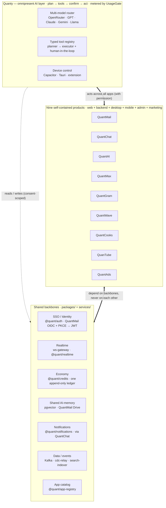

<!--
  GOAL.md is ASSEMBLED from docs/goal/_parts/*.md by scripts/build-goal.mjs.
  Do not hand-edit GOAL.md — edit the parts and re-run the builder.
-->

# Quant Ecosystem — The Deep Goal

> **North-star blueprint.** One thesis, then the whole of *how*. This document is the single source of **intent** for the Quant Ecosystem: what we are building, why it beats the incumbents, how every surface connects, and what "done" looks like on every platform. The code tells you *how it works today*; this tells you *what it must become*.

**Companion docs:** [`README.md`](README.md) — repo map + quick start · [`per-app restructure spec`](docs/superpowers/specs/2026-09-30-per-app-platform-presence-restructure-design.md) · `.kiro/specs/unified-quant-credits-economy/` — credits economy.

**Status legend (used throughout):** ✅ shipped · 🟡 partial / scaffolded · 🔴 not built yet · 🎯 target-state (the ambition we plan toward).

---

## Table of contents

- [North Star — the thesis](#north-star--the-thesis)
- [Product principles — the six laws](#product-principles--the-six-laws)
- [Ecosystem at a glance](#ecosystem-at-a-glance)
- [Quanty — the omnipresent AI layer](#quanty--the-omnipresent-ai-layer)
- [Ecosystem UI/UX design system](#ecosystem-uiux-design-system)
- [3D / WebGL / WebGPU strategy](#3d--webgl--webgpu-strategy)
- [Platform integration backbone — how everything connects](#platform-integration-backbone--how-everything-connects)
- [Competitive summary table](#competitive-summary-table)
- [The Nine Apps — deep dives](#the-nine-apps--deep-dives)
  - Hub & monetization → QuantMail (+ Drive/Docs/Calendar/QuantGit), QuantAds
  - Social & realtime → QuantChat (+ QuantMeet), QuantGram, QuantWave, QuantMax
  - Media & AI → QuanTube, QuantCooks, QuantAI
- [The economy — Quant Credits](#the-economy--quant-credits)
- [Shared architecture](#shared-architecture)
- [Monorepo structure & conventions](#monorepo-structure--conventions)
- [Build roadmap](#build-roadmap)
- [Non-goals & guardrails](#non-goals--guardrails)

---

## North Star — the thesis

Quant is not a suite of apps. It is **one operating system for a person's digital life, wearing nine faces.** A single identity (QuantMail SSO), a single currency (Quant Credits), a single memory (the QuantMail Drive vector store), and a single AI (**Quanty**) run *underneath* all nine products — so the instant you do something in one app, every other app already knows.

Each app, standing alone, is engineered to dethrone its category king: QuantMail vs Gmail + Google Workspace + GitHub, QuantChat vs WhatsApp + Snapchat + Telegram, QuanTube vs YouTube + Spotify, QuantCooks vs CapCut + Figma, and so on. But the reason a user **stays** is not any single app — it is that the nine are **connected in ways the incumbents structurally cannot copy.** No incumbent owns email *and* social *and* video *and* a creation studio *and* an ad exchange *and* a payments rail *and* an agent that can drive all of them **and** your device. We do.

> **Sab alag, fir bhi connected** — separate, yet one.

### Why we win — the unfair advantages

1. **One identity + one memory.** Log in once (QuantMail OAuth2). What you watch on QuanTube tunes your QuantGram feed; who you email becomes who QuantChat suggests. Cross-app context is the moat.
2. **One currency, closed loop.** Quant Credits (1 credit ≈ $1) are *earned* (creator payouts, ad revenue) and *spent* (AI usage, boosts, marketplace, tips) **inside the walls** — money that enters rarely wants to leave.
3. **Quanty owns the apps *and* the device.** Assistants that bolt onto other companies' apps (Siri, Gemini, ChatGPT Operator) are permanently second-class citizens there. Quanty is a first-class actor in every Quant app via a typed tool registry, and controls the device with consent.
4. **Per-app depth, not tabs.** Every one of the nine is a genuine category killer with its own backend, admin, and roadmap — not a thin shell around a shared feed.
5. **True omnipresence.** Web + desktop (Tauri) + mobile (Capacitor) parity for every product, from one codebase per app.
6. **The creator flywheel.** QuantCooks *creates* → QuanTube / QuantGram / QuantWave *distribute* → QuantAds *monetizes* → Credits *pay out* → spent back in-ecosystem. Each turn funds the next.

---

## Product principles — the six laws

Every design decision in this document traces back to one of these.

1. **Self-contained, yet connected.** Each product owns its *entire* platform presence — web, backend, desktop, mobile, marketing, admin — **inside its own `apps/<app>/` folder.** Connection happens through shared `packages/` and SSO, **never** by merging products into one mega-shell. (This is the active restructure: the old horizontal shells — `quant-desktop`, `quant-mobile`, `marketing`, `admin-enterprise` — get folded *into* each product; ecosystem-wide views become thin aggregators.)
2. **Quanty everywhere.** Every app exposes a **typed tool registry** so the AI is a first-class user of it. If a human can do it in the UI, Quanty can do it via a tool — with permission and metering.
3. **One currency, metered honestly.** All AI/compute flows through the credits `UsageGate` (estimate → reserve → settle, **fail-closed**, idempotent). A daily free AI allowance keeps casual use free; paid overage is **opt-in, default OFF** — we never surprise-bill.
4. **Single sources of truth, zero drift.** One app catalog (`@quant/app-registry`), one identity (QuantMail), one visual identity (`@quant/brand`), one memory (Drive). The three drifted per-shell app lists that motivated this restructure must never reappear.
5. **Best-in-class on every device.** Parity is the floor, not the ceiling: the target is *better* UI/UX than the incumbent on web **and** desktop **and** mobile — with 3D/WebGL/WebGPU used wherever it genuinely wins, and graceful degradation everywhere else.
6. **Admin per app, in its proper place.** Each app owns its own admin panel (QuantMail's = domains/DLP/identity; QuantAds' = ad-review/payout/fraud). A thin org hub *aggregates* them — it never re-implements them. Owner's words: *"Admin different for all 09 apps in their proper place — don't gather all in one."*

---

## Ecosystem at a glance

**Nine products.** Not fourteen — the extra folders in `apps/` are horizontal shells being folded in, and the "sub-apps" below are **features inside a host, not standalone apps.**

| App | Category | Kills | Hosts (as features) | Maturity |
|---|---|---|---|---|
| **QuantMail** | Productivity hub + auth root | Gmail, Workspace, GitHub, Claude Code | QuantDrive, QuantDocs, QuantCalendar, QuantGit/CodeHub | 🟡 most mature (~900 files; SSO + drive/calendar/repos live) |
| **QuantChat** | Messaging + realtime | WhatsApp, Snapchat, Telegram, Discord | QuantMeet (video) | 🟡 scaffolded, deep |
| **QuantAI** | AI super-app / control surface | ChatGPT, Gemini, Notion AI, Perplexity | — | 🟡 scaffolded |
| **QuantGram** | Photo/short social | Instagram, Facebook, Pinterest | — | 🟡 scaffolded |
| **QuantWave** | Text/discussion social | X/Twitter, Threads, Reddit | — | 🟡 scaffolded |
| **QuanTube** | Video + music | YouTube, Bilibili, Spotify | — | 🟡 scaffolded |
| **QuantMax** | Short-video + social discovery | TikTok, Omegle, Tinder | — | 🟡 scaffolded |
| **QuantCooks** | AI creation studio | CapCut, After Effects, Figma, Higgsfield | — | 🟡 scaffolded |
| **QuantAds** | Ads + gaming + monetization | Meta Ads, Google Ads | multiplayer games platform | 🟡 scaffolded |

**Not one of the nine:** **QuantTrinity** is the *economy control-plane* — the owner surface where credit value, free allowance, commission, plan catalog, and overage defaults are tuned. It governs the ecosystem; it is not a consumer product.

**The shape of the whole:** 9 apps · 100+ shared packages · a dozen infra services (ws-gateway, search-indexer, moderation-worker, matchmaking, video-transcoder, cdc-relay, smtp-inbound, git-server, ad-engine, signal-projector, ci-runner) · Postgres+pgvector, Redis, Kafka, Meilisearch, Qdrant, WebRTC, Cloudflare R2, Kubernetes.

---

> This is the connective tissue that makes **nine independent products feel like one organism**. Each app (QuantMail, QuantChat, QuantWave, QuanTube, QuantAI, QuantMax, QuantCooks, QuantGram, QuantAds) is fully self-contained — web + backend + desktop + mobile + admin + marketing living inside its own `apps/<app>/` — yet every one of them plugs into the same identity, the same realtime fabric, the same currency, the same memory, and the same assistant. *Sab alag, fir bhi connected.*
>
> The four sections below describe the shared layers, in confident target-state voice: **Quanty** (the AI that is everywhere and can act everywhere), the **design system** (one visual language, per-app accent), the **3D/WebGL/WebGPU** strategy, and the **integration backbone** (the packages and services that wire the nine together). Package and service names are the real ones in this monorepo.

## Quanty — the omnipresent AI layer

### 1.1 Vision

Quanty is **one persona, present in every app, backed by one memory and one wallet.** You speak or type once — in any app, on any device — and Quanty either answers or *acts*: it plans, calls typed actions across whichever apps are involved, asks you to confirm anything risky, and reports back. It is not a chatbot bolted onto a sidebar; it is a first-class actor with the same reach a power user has, plus the ability to drive the device itself (with explicit, revocable permission).

The product promise is blunt: **"barely touch your phone."** Triaging mail, replying to DMs, publishing a clip, booking a table, topping up an ad budget, muting a noisy thread for the weekend — these become one sentence to Quanty, not twenty taps across five apps. Because we own the apps *and* the device layer *and* the memory *and* the currency, Quanty can do the whole errand end-to-end instead of narrating steps for you to perform.

Three properties make this real rather than aspirational:

- **Typed, first-party actions.** Every app publishes a tool registry of typed actions (`@quant/agent-runtime`, `@quant/ai` assistant). Quanty calls `quantmail.archiveThread(id)` or `quantube.publish(clipId, …)` directly — never by screenshotting a page and guessing where to click.
- **One metered economy.** Every model call and every side-effect flows through the credits `UsageGate` (`@quant/credits`): estimate → reserve → settle, fail-closed. You always know what an errand costs, and Quanty can never silently overspend.
- **One consented memory.** What you tell Quanty in QuantMail is available (only with scope-checked consent) to Quanty in QuantGram. Context compounds across the whole ecosystem instead of resetting per app.

### 1.2 Agentic architecture

Quanty is a **planner→executor loop** wrapped in guardrails, metering, and human-in-the-loop confirmation. The runtime lives in `@quant/agent-runtime` and `@quant/agentic`; the user-facing persona, intent routing, and per-app tools live in `@quant/ai` (`src/assistant/`). The model layer is `@quant/ai` provider adapters.

**Multi-model routing.** Quanty is model-agnostic. `@quant/ai` defines a provider set — OpenAI (`gpt-4o`, `gpt-4o-mini`), Anthropic (`claude-sonnet-4`, `claude-3-5-haiku`), Google (`gemini-2.0-flash`, `gemini-1.5-pro`), and an **OpenRouter** aggregator that fronts `openai/gpt-4o`, `anthropic/claude-3.5-sonnet`, `google/gemini-2.0-flash-001`, `meta-llama/llama-3.1-70b-instruct`, `deepseek/deepseek-chat` and more. Each provider carries a `costMultiplier` and an `isAvailable()` probe; a `FallbackChainConfig` (primary → secondary → tertiary) degrades gracefully when a provider is down or rate-limited. The router picks a model **per task** on three axes:

- **Capability** — heavy planning / long-context reasoning → a frontier model (Claude Sonnet, GPT-4o, Gemini Pro); classification, routing, extraction, and cheap tool-arg synthesis → a small/fast model (Haiku, `gpt-4o-mini`, Gemini Flash, Llama).
- **Cost** — priced against the credits ledger; `costMultiplier` and the estimated token budget feed the `UsageGate` estimate before a call is ever made.
- **Latency** — interactive turns favor low-TTFT streaming models; background/batch jobs may take a slower, cheaper model.

Users can bring their own preference: `resolveUserModel(preference, { allowed, default })` honors a user-chosen OpenRouter model id against an optional allow-list and falls back to a safe default, returning the resolution `source` for telemetry.

**Per-app tool registry.** Each app exposes typed actions through `TypedToolRegistry` (`@quant/agent-runtime`). A `ToolDefinition` is `{ name, description, parameters (Zod-validated), requiredTier, category, handler }`, and every handler returns a `ToolExecutionResult { success, data, undoable, undoFn? }`. Registration validates the schema up front (`ToolDefinitionSchema.parse`), and `validateArgs()` type-checks every call at the boundary, so Quanty can only invoke actions that actually exist with arguments that actually type-check — no hallucinated endpoints, no malformed payloads. Tools are discoverable by `category` and filtered by permission `tier`, which is how the planner knows what it is *allowed* to attempt for a given user and consent scope.

**Planner → executor loop.** `plan-generator` turns an intent into an `AgentPlan { intent, steps[], estimatedCost, status }`. Each `PlanStep { toolName, args, tier, requiresApproval, status }` names one typed tool call. `task-decomposer` splits compound goals into ordered steps across apps; `orchestrator` + `execution-engine` walk the plan through a `state-machine` (`draft → approved → executing → completed | failed`), running independent steps concurrently and serializing dependent ones. `conflict-resolver` handles two steps that would touch the same resource. `undo-engine` composes the per-step `undoFn`s into a single reversible transaction, so a multi-app errand can be rolled back as a unit.

**Human-in-the-loop & guardrails.** Risk is graded by **action tier** (`AgentActionTier`), and the tier decides whether a step runs autonomously or waits at the `approval-queue`:

| Tier | Name | Examples | Default gate |
|------|------|----------|--------------|
| 0 | Read-only | search mail, read feed, summarize a thread | auto |
| 1 | Draft-only | draft a reply, compose a post (not sent) | auto, shown for review |
| 2 | Low-risk | archive, label, mute, add to playlist, RSVP | auto within budget, undoable |
| 3 | High-risk | send message, publish, spend credits, delete, book | **explicit confirm** |
| 4 | Admin | change permissions, billing, device automation, bulk ops | **explicit confirm + step-up auth** |

Before anything executes, `safety-classifier` labels each step `safe | caution | blocked` (`SafetyClassificationResult` with the rules triggered); `blocked` is dropped from the plan, `caution` is force-elevated to a confirmation regardless of tier. `trust-score` raises or lowers autonomy per user over time; `spending-limit` + `BudgetConfig` cap spend per period; `sandbox` isolates side-effecting handlers; and a global `kill-switch` halts an agent mid-plan. Everything is written to an append-only `audit-trail` (who/what/when/which tool/which tier/what result), so every autonomous action is explainable and reversible after the fact.

**Streaming tool-use.** Turns stream: partial tokens render live, tool calls surface as structured function-calling events (name + args) the moment the model emits them, results stream back in, and the loop continues — the user sees the plan *think and act* in real time, and can hit stop (the `kill-switch`) at any point.

**Metering — the credits `UsageGate`.** Every metered action — each model call *and* each billable side-effect — passes through the single choke point in `@quant/credits` (`UsageGate`, the design's `CreditMeter`), wired to the runtime by `agent-budget-adapter`:

1. **estimate** — `estimateCost(action)` prices the action via the `PricingEngine`.
2. **reserve** — `checkAndReserve(ownerRef, action)` verifies plan entitlements, checks *available* balance (`getBalance − open holds`) against the estimate, and records an idempotent hold keyed by `action.actionKey`. It **fails closed**: `OUT_OF_CREDITS` (402) if the balance can't fund the estimate, `UPGRADE_REQUIRED` (402) if the plan forbids the action kind. No metered action ever proceeds without a successful reservation.
3. **settle** — `settle(reservation, actualCost)` reconciles estimate vs. actual (refunds or charges the delta) and appends the debit to the wallet. Settling the same reservation twice is a no-op.

Because reserve and settle are both idempotent by `actionKey`, retries and network flakes never double-charge, and a plan's `estimatedCost` (`CostEstimate` breakdown per step) is shown to the user *before* they approve. One wallet, one currency (Quant Credits, 1 credit ≈ $1), one place where spend is enforced.

### 1.3 Memory

Quanty's memory is a **two-tier store with consent as a first-class citizen** (`@quant/ai-memory`, embeddings in PostgreSQL + `pgvector`, files in QuantMail Drive / Cloudflare R2).

- **Long-term memory** — durable facts about *you*, stored as `MemoryEntry` records categorized as `people | places | projects | preferences | skills | goals | schedules | routines`. Each entry records its `sourceApp`, a human-readable `explanation` of why it was remembered, a `writeSignal` (`explicit` | `digest-approved` | `pending-review` — nothing is silently memorized; ambient observations queue for review), an `expiresAt` for time-boxed facts, and an `accessScopes[]` list. Content is embedded and indexed in pgvector for semantic recall.
- **Short-term / per-app context** — the working set for the current session and app (open thread, current draft, recent tool results), assembled per turn and discarded or promoted to long-term via a `writeSignal`.

**Consent-scoped retrieval.** Every read is gated by `accessScopes` and logged: each `MemoryEntry.accessLog` appends `{ accessedAt, reason, requestingApp }`. So when QuantGram's Quanty pulls a preference that was learned in QuanTube, that cross-app read is *scoped* (the user granted "QuanTube → QuantGram" personalization) and *auditable* (the entry shows exactly who read it and why). `memory-explainer` turns any entry into a plain-language "here's what I know and where it came from," and `memory-export` gives the user a full JSON/Markdown/CSV dump — the memory is the user's, portable and inspectable.

**How memory from one app improves another.** This is the compounding advantage:

- **QuanTube watch history → QuantGram feed.** Semantic embeddings of what you watch and finish become retrieval context for QuantGram's ranking (via `@quant/recommendation` + `signal-projector`), so a new social feed is warm on day one instead of cold-starting.
- **QuantMail threads → QuantChat replies.** Quanty drafts a chat reply already knowing the deal terms you negotiated over email.
- **QuantCooks activity → QuantMax planning.** The recipes you cook inform grocery/shopping automations and calendar blocks QuantMax proposes.
- **QuantMax goals → everywhere.** A stated goal ("ship the launch by Friday", "eat less sugar") biases what every app's Quanty surfaces and suggests.

Retrieval is always **scope-checked, logged, revocable, and exportable** — the difference between "one assistant that knows you across your whole digital life" and "nine assistants that each forget you at the app boundary."

### 1.4 Device control

Quanty can drive the device itself, not just our apps. `@quant/device-control` exposes a **capability model** — `accessibility`, `bluetooth`, `camera`, `contacts`, `files`, `location`, `notifications`, `phone`, `sensors`, `sms`, `wifi` — each behind a `CapabilityRegistry` entry, a permission grant, and an audit log. Capabilities are surfaced to Quanty as high-tier tools (mostly Tier 3–4), so device actions always pass safety classification, confirmation, and metering like any other tool.

**Per-platform implementation:**

- **Mobile (Capacitor).** Native capabilities are Capacitor plugins bridging to iOS/Android APIs (contacts, SMS/`phone`, camera, location, sensors, notifications). Cross-app *UI* automation — tapping through a third-party app when no first-party API exists — uses the **OS accessibility APIs** (Android AccessibilityService, iOS Accessibility/App Intents) via the `accessibility` capability. First-party apps are always driven by typed tools; accessibility is the fallback for the rest.
- **Desktop (Tauri).** A Tauri (Rust) shell exposes OS automation to Quanty: window/app control, filesystem, clipboard, keyboard/mouse synthesis, and shell escape hatches behind capability grants. Native-speed, small footprint, and a hard permission boundary between the webview and the OS.
- **Web (browser extension).** Where there's no native shell, a companion extension gives Quanty DOM-level reach into the active tab (read/fill/click) plus our own web apps' typed tools — the graceful-degradation tier.

**Phone-free mode.** The `phone-free` module (`mode-controller`, `session-logger`, `ui-state`, `emergency-access`) is the concrete expression of "barely touch your phone": you hand Quanty a batch of intents ("clear my inbox, reply to family, mute work until Monday"), it executes them via voice + device control, logs every action, and keeps an always-available emergency-access escape. Voice is first-class: `@quant/device-control/voice` provides an `intent-parser`, `command-grammar`, `alias-registry` (user-defined shortcuts), and `command-executor`, so a spoken command becomes a typed, tiered, metered plan.

**Safety & permission model.** Device control is the highest-blast-radius surface, so it is the most constrained: capabilities are **off by default**, granted explicitly and **revocably** per capability (not all-or-nothing), scoped and time-boxed where possible, always Tier 3+ (confirmation, often step-up auth), always sandboxed, always audited, and always killable mid-action. `@quant/identity-permissions` is the authority for what a grant means; `@quant/device-control/audit` records every exercise of it. The user can see, in one place, everything Quanty is allowed to touch and everything it has touched.

### 1.5 Cross-app orchestration — worked examples

Each example is: **user intent → Quanty plans (typed tools across apps) → confirms risky steps → executes → done.** Tiers and the `UsageGate` are shown where they bite.

**A. "Turn my best QuanTube clip this week into a QuantGram post and tell my close friends."**
Plan: `quantube.listClips({ range: '7d', sort: 'engagement' })` *(T0)* → `quantube.exportClip(top.id, { format: 'vertical' })` *(T2)* → `quantgram.createPost({ media, caption })` — caption drafted from the video's transcript + your memory of past captions *(T1 draft → shown)* → **confirm publish** → `quantgram.publish(post.id)` *(T3)* → `quantchat.notify({ audience: 'close-friends', ref: post.url })` *(T2)*. Cost estimated (export transcode + post) and reserved before publish; settled after.

**B. "I'm double-booked Thursday 3pm — sort it out."**
Plan: `quantmax.getConflicts({ day: 'Thu' })` *(T0)* → cross-references `quantmail.search({ q: 'Thursday meeting' })` and QuantChat threads to learn which is movable *(T0)* → drafts reschedule messages *(T1)* → **confirm** → `quantchat.send(...)` / `quantmail.send(...)` to the lower-priority party *(T3)* → `quantmax.moveEvent(...)` *(T2)* → `quantmeet.updateInvite(...)` *(T2)*. Memory supplies who's VIP; nothing is sent without confirmation.

**C. "Boost the campaign that's converting and pause the one that isn't — cap it at 50 credits."**
Plan: `quantads.getCampaignStats({ range: '24h' })` *(T0)* → identifies winner/loser → **confirm spend** → `quantads.setBudget(winner.id, +credits)` *(T3, metered)* → `quantads.pause(loser.id)` *(T2)*. The 50-credit cap is enforced by `spending-limit` + `UsageGate.checkAndReserve`; if the boost would exceed available balance it fails closed with `OUT_OF_CREDITS` and Quanty proposes a smaller boost.

**D. "Plan Saturday dinner for six from what's in my kitchen, and invite the group."**
Plan: `quantcooks.suggestMenu({ pantry, servings: 6, diet: memory.preferences })` *(T0)* → `quantcooks.buildShoppingList(menu)` for the gaps *(T0)* → **confirm** any purchase → `quantmax.addTasks(shoppingList)` *(T2)* → `quantchat.createGroup({ members, name: 'Sat Dinner' })` + `quantchat.send(invite)` *(T3)* → `quantmax.addEvent('Sat 7pm')` *(T2)*. Dietary constraints and who's vegetarian come from cross-app memory (`preferences`, `people`).

**E. "Someone's impersonating me — lock it down." (device + identity + safety)**
Plan: `quantmail.searchLogins({ suspicious: true })` *(T0)* → `identity.listActiveSessions()` *(T0)* → **confirm + step-up auth** → `identity.revokeSessions({ except: current })` *(T4)* → `auth.rotateTokens()` *(T4)* → `quantchat.send({ to: 'contacts-who-were-messaged', text: warning })` *(T3)*. Every step is Tier 4 / high-risk: safety-classifier forces confirmation, step-up auth is required, and the full sequence is written to the audit trail and is undoable.

**F. "Weekend mode: mute work, keep family, wake me for anything urgent." (phone-free)**
Plan: `notifications.setPolicy({ mute: ['work'], allow: ['family'], urgentBreakthrough: true })` *(T2)* → `quantchat.setStatus('away')` *(T2)* → `device.phoneFree.enable({ until: 'Mon 8am', emergencyAccess: true })` *(T3)* → Quanty batches non-urgent items into a Monday digest. Cross-app notification policy is enforced through QuantChat as the single notification surface; emergency access is always live.

Across all six: **one sentence in, a typed multi-app plan out, confirmation only where it matters, one bill, one memory, fully reversible.**

### 1.6 Competitors — how they're built, and the weakness we exploit

Every serious assistant today shares one structural handicap: **it does not own the apps it acts in.** So it either screen-drives other people's UIs (brittle, permissioned by the host, no typed contract) or it waits for those apps to voluntarily expose intents. We own all nine apps *and* the device layer *and* the memory *and* the currency — a different category.

**OpenAI — ChatGPT + Operator / ChatGPT agent + Atlas.** Operator (Jan 2025) ran on the *Computer-Using Agent* (CUA): GPT-4o vision + RL that reads a rendered browser as pixels and emits clicks/keystrokes in a sandboxed cloud VM. In July 2025 Operator folded into **ChatGPT agent** ("agent mode") — a unified agent that browses, runs code, and produces artifacts. The **Atlas** browser (Oct 2025, "OWL" architecture) puts ChatGPT beside every page. → **Weakness we exploit:** it drives *other people's* apps by vision + synthetic clicks — slow, fragile, needs you to log in each time, breaks on redesigns, and gets no typed guarantees. Its memory is siloed inside ChatGPT; there is no cross-app economy, no first-party device layer, no unified identity. We call typed first-party actions with schema validation and settle spend on one ledger — no screenshot guessing, no per-site login theater.

**Google — Gemini as "universal assistant" + Astra + Mariner.** Gemini is replacing Assistant; **Project Astra** is the real-time, multimodal, memory-augmented core (feeds Gemini Live); **Project Mariner** is the browser agent — began as a Chrome extension, moved to cloud-hosted VMs (May 2025), runs on Gemini 2.5 Pro with computer-vision + browser automation. Deep Android + Workspace integration is the real strength. → **Weakness we exploit:** the same VM-and-CV browser-automation pattern for anything outside Google's own apps; a product line still fragmenting across Assistant → Gemini; and an ads-funded model whose incentives fight the user's. Google owns Workspace, not a nine-app consumer super-app with a single credit wallet. Our reach into *our* apps is a typed API, not a robot pretending to be a mouse, and our economics are credits the user buys, not attention we sell.

**Apple — Siri + Apple Intelligence.** The architecture is elegant: on-device models for small tasks, **Private Cloud Compute** for bigger ones, a third tier (external models, e.g. Gemini) for the hardest, and the **App Intents / App Schemas / App Entities** framework by which apps expose actions and entities Siri can invoke plus "onscreen awareness" and cross-app "personal context." The genuinely capable "Siri AI" finally shipped in 2026 — roughly two years late, and delayed further in the EU by the DMA. → **Weakness we exploit:** Siri can only orchestrate apps that adopt App Intents *on Apple's terms*, it's locked to Apple hardware (no Windows/Android/web parity), its "personal context" is Apple's private index rather than a portable, exportable memory the user owns, there's no currency/economy layer, and the track record is late-and-cautious. We ship the same "apps expose typed actions" idea, but we *are* every app in the suite (100% adoption on day one), on every platform, with an owned memory and a wallet Apple has no equivalent of.

**Notion AI.** RAG over your workspace + connectors, Q&A, writing, and increasingly "agents" that act inside Notion. → **Weakness we exploit:** the world ends at the Notion workspace and a handful of read-connectors. No device control, no reach into messaging/video/social/ads, no currency, no cross-consumer-app memory. It's a great assistant for one document tool; we're an assistant for your digital life.

**Perplexity.** A best-in-class answer engine — RAG + search over its own Sonar models — plus **Comet**, an agentic browser (2025) that acts on pages for you. → **Weakness we exploit:** it's search-and-answer first; it owns no productivity/social/comms apps to act *in*, so agentic actions again route through browser automation. No cross-app memory graph, no unified economy, no device layer.

**Rabbit R1.** Pitched a *Large Action Model* (LAM) that learns to operate app UIs by imitation ("teach mode"); shipped as a **web agent based on WebVoyager** that reasons out steps to complete web tasks — on separate, underpowered hardware. Widely panned ("LAM or SCAM"; "should've been an app") for unreliability. → **Weakness we exploit:** brittle web automation, a redundant device, and effectively no ecosystem or apps of its own. It's the cautionary tale for "action model without owning the actions."

**Our unfair advantage (structural, not a feature):** we own the **apps** (typed first-party tools, not screen-scraping), the **device layer** (Capacitor + Tauri + extension, permissioned and audited), **one cross-app memory** (pgvector in QuantMail Drive, consent-scoped and exportable), **one currency** (Quant Credits through a fail-closed `UsageGate`), and **one identity** (QuantMail SSO). An assistant that merely bolts onto other people's apps can never get first-party typed actions, a unified memory across those apps, or a single metered economy — the three things that make Quanty reliable, personal, and honest about cost. *That* is the moat.

<sub>Competitor architecture sources: OpenAI [ChatGPT agent](https://openai.com/index/introducing-chatgpt-agent/), [Computer-Using Agent](https://openai.com/index/computer-using-agent/), [Atlas / OWL](https://openai.com/index/building-chatgpt-atlas); Google [Gemini universal assistant](https://blog.google/innovation-and-ai/models-and-research/google-deepmind/gemini-universal-ai-assistant/), [Project Astra](https://deepmind.google/models/project-astra/), [Project Mariner](https://aiwiki.ai/wiki/project_mariner); Apple [Siri AI](https://www.apple.com/newsroom/2026/09/siri-ai-a-profoundly-more-capable-and-personal-assistant-is-here/), [App Intents / WWDC26](https://developer.apple.com/wwdc26/guides/apple-intelligence/), [DMA delay](https://www.apple.com/newsroom/2026/06/due-to-dma-siri-ai-delayed-in-eu-for-ios-27-and-ipados-27/); Rabbit [LAM / WebVoyager agent](https://techcrunch.com/2024/09/23/rabbits-web-based-large-action-model-agent-arrives-on-r1-as-early-as-this-week/).</sub>

---

## Ecosystem UI/UX design system

**The bar:** every product must feel *native and best-in-class on every device it runs on* — better UI/UX than the incumbent on web, on desktop (Tauri), and on mobile (Capacitor). One visual language, nine accents, zero "web app in a wrapper" feel.

### 2.1 Design language & tokens

`@quant/brand` is the single source of truth for visual identity, emitting **CSS custom properties** consumed everywhere. The system is **dark-first** (canvas `#090A0C`, primary surface `#111318`, elevated `#16181D`) with a full light theme, built on:

- **Color** — brand **primary (orange, `#FF8C42`)**, accent (amber, `#F59E0B`), neutral (slate ramp `50→950`), and semantic ramps (error/warning/success/info), each a 50–950 scale. Emitted as `--brand-primary-*`, `--brand-accent-*`, `--brand-neutral-*`, `--brand-{error,warning,success,info}-*`, plus `--brand-surface-*`. The consolidated `--quant-*` namespace (codegen `generated/quant-tokens.css`, `generate:tokens` + a drift guard) is the forward-looking token surface every app resolves against.
- **Per-app accent hue.** Each product has a canonical color + `hue` (QuantMail 217°, QuantChat 160°, QuantAI 263°, QuantMax 38°, QuantGram 330°, QuantWave 188°, QuantCooks 270°, QuanTube 350°, QuantAds 162°). `generateAppCSS(appId)` sets `--app-name`, `--app-color`, `--app-hue`, so shared components tint themselves to the current app **without forking** — one button component, nine identities. Visual identity is resolved from `@quant/brand` at read time (via `@quant/app-registry`'s `resolveApp`), never hard-coded per app.
- **Typography** — display / body / mono families, an `xs→6xl` type scale with matched line-heights, and a `thin→black` weight set, all tokenized (`--brand-font-*`, `--brand-text-*`, `--brand-leading-*`).
- **Theming** — `dark` / `light` / `system`, plus a **high-contrast** theme, applied via `:root[data-theme="…"]` semantic tokens (`--background`, `--foreground`, `--surface`, `--primary`, `--ring`, …). `system` follows the OS; the choice is user-overridable and persisted through SSO so it follows you across apps and devices.

### 2.2 Component library & composition

`@quant/shared-ui` is the one component library every app composes from: primitives (Button, Input, Select, Dialog, Popover, Toast, Tabs, Tooltip, Menu), data surfaces (Table, List, Card, Avatar, Badge), layout (AppShell, Sidebar, SplitView, Sheet), and cross-cutting pieces — the **Quanty dock/command surface**, the **cross-app command palette** (`@quant/command-palette`, ⌘K everywhere: jump to any app, run any Quanty tool, search across the ecosystem), the app switcher (fed by `@quant/app-registry`), and the notification center (`@quant/notifications`). Components are **headless-core + tokenized-skin**: behavior/a11y in the primitive, appearance from `--brand-*`/`--app-*` tokens, so an app re-skins by swapping its accent hue, not by re-implementing. Composition follows a strict layering — primitives → patterns (e.g. `EntityList`, `DetailPane`, `Composer`) → app screens — so QuantMail's thread list and QuantChat's message list are the *same* pattern with different data, giving instant familiarity as you move between apps. `@quant/spatial-ui` adds the "one workspace" scaffolding (panels, docking, spatial navigation) that makes the nine apps feel like rooms in one building rather than nine browser tabs.

### 2.3 Motion system

Motion is tokenized in `@quant/brand` and split across two engines by job:

- **Framer Motion** — component/state motion in React: enter/exit, layout animations, gesture-driven interactions, shared-element transitions. Driven by the brand **spring** set (`gentle` for modals/tooltips, `snappy` for buttons/toggles, `bouncy` for badges/notifications, `stiff` for menus/dropdowns) and the **easing/duration** tokens (`instant 50ms → fast 100 → normal 200 → moderate 300 → slow 500 → glacial 800`, with `--brand-ease-out/-in/-in-out/-bounce/-decelerate`).
- **GSAP** — timeline-heavy, scroll-driven, and cinematic sequences: marketing hero moments, onboarding, QuantCooks editor scrubbing, complex staged reveals where a spring isn't the right tool.

The feel is **"spatial navigation"**: shared-element transitions carry an object from list → detail so it never teleports; the app switcher and command palette move you between apps with a consistent directional metaphor (apps live in a coherent space, you travel to them); micro-interactions (button press, toggle, optimistic-send, pull-to-refresh, hover elevation) use `instant`/`fast` springs so the UI always feels *responsive* first and *decorative* second. Every animation reads its duration/easing from tokens, so a single change (or **`prefers-reduced-motion`**) retunes the whole ecosystem at once.

### 2.4 Accessibility & internationalization

Accessibility is a build-gate, not a retrofit. Target **WCAG 2.2 AA** across the ecosystem:

- **Contrast** — `@quant/brand`'s `contrast` utilities validate token pairings against AA (4.5:1 text / 3:1 large & UI); the high-contrast theme exceeds AAA for critical surfaces. This is checked in the token pipeline so a failing pairing can't ship.
- **Keyboard** — every interaction is reachable and operable by keyboard: full focus management, visible focus rings (`--ring`), logical tab order, roving-tabindex in composite widgets, ⌘K command palette as a keyboard-first spine, and no keyboard traps (WCAG 2.2's focus-appearance and dragging-alternatives included).
- **Screen readers** — headless primitives ship correct roles/ARIA, live regions for async/optimistic updates and Quanty's streaming output, and labeled controls; tested against VoiceOver / NVDA / TalkBack.
- **Reduced motion** — `prefers-reduced-motion` swaps spring/GSAP sequences for instant or minimal cross-fades globally, via the motion tokens.
- **i18n / RTL** — all copy externalized for localization; layouts are **logical-property-based** (`inline-start`/`inline-end`, not left/right) so **RTL** (Arabic, Hebrew, Urdu) mirrors correctly; locale-aware dates/numbers/currency (Quant Credits formatting), and CJK/bidi-safe typography. Quanty converses in the user's language.

### 2.5 Per-platform adaptation — native everywhere

The rule is **"better UI/UX than the incumbent on every device"**, not "the same web page in three wrappers." Shared *logic and design tokens*; per-platform *shell and interaction grammar*:

- **Web** — the reference surface (Next.js 15 / React 19, RSC + streaming). Fast, deep-linkable, keyboard-first, installable PWA.
- **Desktop (Tauri)** — a real desktop app: native menus, windowing/multi-window, tray, global shortcuts, OS notifications, offline, filesystem, and the device-control automation layer — Rust core, tiny binary, native performance, not an Electron tax.
- **Mobile (Capacitor)** — native gestures and navigation, platform-correct nav bars/sheets/haptics, push notifications, background sync, biometric unlock, and native capability plugins. It must feel like it was written for the phone.

Each app's `apps/<app>/{desktop,mobile}` composes the *same* `@quant/shared-ui` patterns but adopts the host platform's interaction grammar, so QuanTube-on-desktop feels like a desktop app and QuanTube-on-mobile feels like a phone app — while both are unmistakably QuanTube and unmistakably Quant.

## 3D / WebGL / WebGPU strategy

**Principle: 3D where it earns its bundle, 2D everywhere else.** Immersive rendering is a tool for spatial understanding, presence, and craft — not decoration. It ships lazily, degrades gracefully, and never blocks the core task. `@quant/spatial-ui` hosts the shared 3D scaffolding, loaders, and fallbacks.

### 3.1 Where immersive 3D genuinely wins (per surface)

- **Quanty 3D avatar (QuantAI / everywhere).** An optional embodied Quanty — real-time avatar with lip-sync to TTS, gaze, and emotion — as the face of voice/agent mode. Presence makes the assistant feel *there*; strictly optional and off on low-end/reduced-motion.
- **QuantMax — 3D dating + multiplayer game rooms + spatial voice.** Explorable 3D spaces for dates and hangouts; positional (spatial) voice so conversations feel located; lightweight multiplayer rooms and mini-games. This is where "presence" is the entire product.
- **QuantMeet — spatial-audio rooms.** Optional spatial layout of participants with positional audio, so large calls have the "who's near whom" legibility of a real room.
- **QuantGram — immersive 3D story / pin viewer.** Depth-parallax stories, 3D "pin boards" you fly through, AR lenses (`@quant/ar-lenses`) for capture. Browsing memories in space, not a flat grid.
- **QuanTube — spatial/immersive player + 3D music visualizers.** 180°/360° and spatial-video playback, a theater/immersive mode, and GPU music visualizers reacting to audio analysis. Depth where the content is spatial; flat where it isn't.
- **QuantCooks — GPU WebGL timeline/compositor + 3D scene editor.** A GPU-accelerated NLE: WebGL compositing of layers/effects/transitions on a scrubbable timeline (WebCodecs for decode/encode), and a 3D scene/title editor for motion graphics. This is professional creative tooling where GPU compositing is the difference between "toy" and "tool."
- **QuantMail — 3D knowledge-graph of Drive/AI-memory + QuantGit commit-graph.** Fly-through 3D graph of your Drive, AI-memory entities (`people/projects/…`), and their relationships; QuantGit renders repo history as a navigable 3D commit-graph. Spatializing structure makes large graphs legible.
- **QuantAds — Godot/WebGL multiplayer games + 3D analytics.** Playable ad units and mini-games (shippable via Godot/WebGL), plus 3D/spatial analytics dashboards for high-dimensional campaign data.

### 3.2 Tech stack — and when to use each

| Tool | Use it for | Notes |
|------|-----------|-------|
| **react-three-fiber + drei** | Default for React-embedded 3D (avatar, story/pin viewer, graph views, product scenes) | Declarative Three.js in React; drei gives cameras, controls, loaders, instancing helpers. |
| **Three.js (imperative)** | Engine-grade scenes where r3f's reconciler is overhead (visualizers, big graphs) | Drop to raw Three for hot render loops and custom pipelines. |
| **WebGL2** | Baseline renderer — universal support across our target devices | The safe default; everything must work here. |
| **WebGPU** | Compute-heavy or high-instance-count work (particles, large graphs, GPGPU visualizers, compositor) | Progressive enhancement with **WebGL2 fallback**; detect and switch at runtime. |
| **GLSL / WGSL shaders** | Custom materials, post-processing, music visualizers, timeline effects | GLSL for WebGL2, WGSL for WebGPU; share intent, compile per backend. |
| **rapier (WASM)** | Physics in QuantMax game rooms / playable ads | Rust physics compiled to WASM; deterministic, fast. |
| **Godot (HTML5/WASM export)** | Full multiplayer games users build and ship (QuantAds, QuantMax) | For real game logic beyond a scene; embedded as a WASM/WebGL canvas. |
| **WASM** | Perf-critical kernels (codec glue, physics, graph layout, DSP for visualizers) | The escape hatch when JS isn't fast enough. |
| **WebCodecs** | QuantCooks/QuanTube encode/decode, frame-accurate scrubbing, thumbnails | Hardware-accelerated media in the browser; pairs with the WebGL compositor. |
| **OffscreenCanvas + Web Workers** | Render/compositing off the main thread | Keeps UI at 60fps while the GPU pipeline runs in a worker. |

**Decision rule:** start at WebGL2 + r3f; escalate to raw Three.js for hot loops, to WebGPU for compute/instancing (always with a WebGL2 fallback), to WASM/WebCodecs for media/physics/DSP, and to Godot only when it's a *game*, not a scene.

### 3.3 Performance strategy

3D is opt-in and budget-bound. The rules that keep it fast on a mid-range phone:

- **Draw-call budgets & GPU instancing.** Hard per-scene draw-call ceilings; repeated geometry (feed cards, graph nodes, crowd/particles) rendered with **instanced meshes**. Batch aggressively; merge static geometry.
- **LOD & culling.** Distance-based level-of-detail, frustum + occlusion culling, and detail that scales with device tier — the 3D graph shows fewer nodes and simpler shaders on a phone than on a workstation.
- **Texture atlases & compression.** Atlased textures to cut binds; **KTX2/Basis** GPU-compressed textures and **Draco/meshopt** geometry compression to shrink both VRAM and download.
- **Lazy-loaded 3D bundles.** Three.js/r3f/Godot payloads are **code-split and dynamically imported** only when a 3D surface is actually opened, behind a `<Suspense>` boundary with a 2D skeleton — the 3D engine never sits in an app's critical bundle.
- **Off-main-thread rendering.** **OffscreenCanvas** + workers so scene graph and compositing don't jank scrolling or input.
- **Mobile fallbacks & graceful degradation.** Runtime capability detection (WebGPU? WebGL2? device memory? GPU tier?) selects a render path; when 3D can't run well, the app falls back to a **first-class 2D view** (the graph becomes a 2D force layout, the immersive player becomes the flat player) — never a broken canvas.
- **Battery & thermal awareness.** Cap frame-rate when idle or backgrounded, throttle on `navigator.getBattery()` low-power / thermal signals, pause render loops when the tab/scene isn't visible, and respect `prefers-reduced-motion` by disabling ambient animation. Immersive should never be the reason a phone gets hot or a battery dies.

The north-star: **60fps on flagship, smooth on mid-range, correct-and-usable everywhere** — and if a device can't do the 3D justice, it silently gets the excellent 2D experience instead.

## Platform integration backbone — how everything connects

Nine apps become one product through **seven shared backbones**, each a concrete package or service. An app depends on backbones, never directly on another app — so products stay self-contained (`apps/<app>/`) while everything they need to feel unified comes from `packages/` and `services/`.

### 4.1 Identity / SSO — `@quant/auth` + `@quant/identity-permissions`

**QuantMail is the sovereign identity provider.** It runs a full **OAuth2 / OIDC** authorization server with **PKCE**, issuing signed **JWT** access/refresh tokens. Every other app is an OIDC client: one QuantMail login yields SSO across all nine, and `resolveApp`/route metadata drive post-login redirects. Sessions are **persisted to PostgreSQL** (`SessionService`, not in-memory) so they survive restarts and scale horizontally; refresh rotation, revocation, and device/session listing are first-class (see orchestration example E). `@quant/auth` owns tokens/crypto/middleware/providers; `@quant/identity-permissions` owns the authorization model — roles, scopes, and the capability grants Quanty's tools and device control check against. One identity, one permission authority, everywhere.

### 4.2 Realtime — `@quant/realtime` + `services/ws-gateway`

`ws-gateway` is the ecosystem's realtime edge: authenticated **WebSocket** fan-out with **presence**, **channels/rooms**, **live cursors/co-presence** (`@quant/co-presence`), typing indicators, and notification delivery. `@quant/realtime` provides the client/server, an **event-bus**, an **event-schema-registry** (typed, versioned events so producers/consumers can't drift), **backpressure** and delivery guarantees, and a **NATS bridge** for server-to-server fan-out. This is how a QuantChat message, a QuantGram like, a QuanTube live-view count, and a Quanty "step completed" notification all arrive instantly — through the same authenticated, typed, back-pressured pipe. Presence is cross-app: your status set in one app is visible wherever it should be.

### 4.3 Data / events — Kafka + `services/cdc-relay` → `services/search-indexer` → Meilisearch + Qdrant/pgvector

State changes propagate as **events**, not point-to-point calls. Each app writes to PostgreSQL (Prisma); **`cdc-relay`** captures change-data-capture streams and publishes them to **Kafka**. Downstream consumers react without coupling to the source app:

- **`search-indexer`** projects entities into **Meilisearch** (typo-tolerant full-text) and **Qdrant / pgvector** (semantic vector search) — powering both ⌘K search and Quanty's retrieval.
- **`signal-projector`** derives feeds and cross-app signals (e.g. QuanTube watch events → QuantGram feed features, engagement → ranking inputs for `@quant/recommendation`).
- Any service (moderation, notifications, analytics) subscribes to the same log.

CDC + a Kafka log means new consumers can be added without touching producers, replays are possible, and "QuanTube history improves the QuantGram feed" is just another projection off the shared event stream — the mechanical basis for the memory-compounding described in §1.3.

### 4.4 Economy — `@quant/credits`

**One wallet, one currency (Quant Credits, 1 credit ≈ $1), one append-only ledger** shared by every app. Balance is `sum(ledger)`; the ledger is append-only for auditability. Every metered action across the ecosystem — AI calls, transcodes, sends, ad spend, marketplace purchases, creator payouts — debits the *same* wallet through the `UsageGate` (§1.2: estimate → reserve → settle, fail-closed, idempotent by `actionKey`). `PricingEngine` prices action kinds; `plan-service`/entitlements gate what a tier may do; `creator-earnings` / `payout-service` / `marketplace-ledger` handle the money flowing *to* users. **QuantAds** and **QuantTrinity** are the economy's control plane — tuning credit value, allowances, commissions, and campaign budgets against the same ledger. A user tops up once and spends anywhere; a creator earns in one currency across every app.

### 4.5 Notifications — `@quant/notifications`, delivered through QuantChat

Notifications are **cross-app and unified**. `@quant/notifications` provides a `UniversalNotificationCenter`: every app publishes typed notifications into one stream, deduplicated and grouped, delivered over `ws-gateway` in realtime and mirrored to push (mobile), OS (desktop), and email digests. **QuantChat is the notification and agent surface** — the one inbox where a QuantGram mention, a QuanTube comment, a QuantMail flag, and a Quanty "your plan needs approval" all land, and where you can reply or approve inline. Notification *policy* (mute, allow-lists, urgent breakthrough, weekend mode — orchestration example F) is set once and enforced everywhere.

### 4.6 Shared AI-memory — QuantMail Drive vector store → `@quant/ai-memory`

The memory layer of §1.3 is a **backbone**, not a QuantAI-only feature. `@quant/ai-memory` stores `MemoryEntry` records with embeddings in **pgvector**, files in **QuantMail Drive** (R2). Every app's Quanty reads and writes the *same* consent-scoped store, so context learned anywhere is available everywhere it's permitted — with `accessScopes`, per-read `accessLog`, `writeSignal` gating, `memory-explainer` transparency, and full export. This is the single most differentiating backbone: **one memory of the user, shared across nine apps, owned by the user.**

### 4.7 App catalog single-source — `@quant/app-registry`

`@quant/app-registry` is the **canonical catalog** — the single source of truth for every app's `id / name / route / category / maturity / surfaces`, replacing the old drifted per-shell lists (desktop/mobile/marketing each carried their own copy). Visual identity is *not* duplicated here: `resolveApp(id)` merges registry data with `@quant/brand`-derived `color / hue / iconRef` at read time (resolving post-rename aliases: `quantgram→quantneon`, `quantwave→quantsync`, `quantcooks→quantedits`). Launchers, the app switcher, marketing filters, admin, and Quanty's app-routing all read from this one list — add an app once, it appears everywhere correctly.

### 4.8 The ecosystem at a glance



*Apps depend only on backbones; Quanty sits over everything, acting across apps and reading/writing the shared backbones under consent and metering.*

---

## Competitive summary table

One row per product — what it beats, and the one-line structural edge no bolt-on competitor can copy (because they don't own the apps, the device, the memory, *and* the currency at once).

| Quant app | Incumbents it beats | Our unfair advantage (one line) |
|-----------|---------------------|----------------------------------|
| **QuantMail** | Gmail, Outlook, Superhuman, Proton | It *is* the ecosystem's OIDC identity provider and AI-memory Drive — the mail that signs you into all nine apps and remembers you across them. |
| **QuantChat** | WhatsApp, Slack, Discord, Telegram, iMessage | The single notification + Quanty agent surface for all nine apps, on one identity and one wallet — reply to, or approve, anything from one inbox. |
| **QuantAI** | ChatGPT, Gemini, Claude apps, Copilot | Quanty owns the apps *and* the device layer, with cross-app memory and metered credits — typed first-party actions, not screen-scraping other people's software. |
| **QuantMax** | Google Calendar, Todoist, Notion; Tinder, Bumble (rooms) | Productivity and spatial-presence dating in one, driven by an assistant that actually executes the plan across your other apps. |
| **QuantGram** | Instagram, Pinterest, Snapchat | Feed warm-started from your own consented ecosystem memory (no cold start), immersive 3D/AR viewer, creator earnings in shared credits. |
| **QuantWave** | Spotify, SoundCloud, Apple Music | One cross-app taste graph, creator payouts in the same currency, and a Quanty DJ that acts across your library, chats, and feed. |
| **QuantCooks** | YouTube/TikTok cooking, Tasty, CapCut | A GPU WebGL editor and 3D scene tool in the browser, plus a pantry-aware Quanty that plans the menu, shops the gaps, and books the time. |
| **QuanTube** | YouTube, Twitch, Vimeo | Spatial/immersive playback and creator credits, with watch-history that (only with consent) powers the rest of your ecosystem instead of feeding an ad machine. |
| **QuantAds** | Google Ads, Meta Ads Manager, TikTok Ads | Playable Godot/WebGL ad units billed on the same credit ledger users already hold, with Quanty auto-optimizing spend under hard, fail-closed credit caps. |

---

**The through-line:** one identity, one realtime fabric, one event log, one currency, one memory, one design system, and one assistant — nine products that are each excellent alone and unbeatable together. *Sab alag, fir bhi connected.*

## The Nine Apps — deep dives

Each app below follows the **same shape** so they are comparable: *Vision → Competitors & their real architecture → What we build to beat them → Core features → Deep/micro features → UI/UX & 3D → Data & backend → Cross-app integration → Platform presence.*

They are grouped into three clusters for reading. The ordering is editorial, **not** a priority ranking — every app is a category killer in its own right.

- **Hub & monetization** — QuantMail (the auth root + productivity super-hub) and QuantAds (the credits / gaming / ad layer). These two touch every other app.
- **Social & realtime** — QuantChat (+ QuantMeet), QuantGram, QuantWave, QuantMax.
- **Media & AI** — QuanTube, QuantCooks, QuantAI.

---

<!--
  GOAL.md — north-star part: "Hub & Monetization" cluster.
  Two apps: QuantMail (flagship / auth root / productivity super-hub) and
  QuantAds (monetization + gaming engine). Target-state vision; grounded in the
  real repo (OIDC/PKCE IdP, append-only credit ledger, Vickrey ad auction, Yjs
  CRDT collab, CalDAV/CardDAV, git-server + ci-runner + agent-runtime).
-->

## QuantMail — "Gmail + Google Workspace + GitHub + Claude Code killer"
**Now:** most mature app — email + SSO + `drive/` `calendar/` `repos/` `quantgit/` `codehub/` route segments exist (~900 files: 400+ backend tests, full OIDC/PKCE identity provider, Yjs collab server, CalDAV/CardDAV, git daemon, CI runner, agentic dev services). · **Target:** the ecosystem's flagship and non-negotiable backbone — a Gmail-beating mail client that is simultaneously the OAuth2/OIDC identity root for all 9 apps and a Workspace-class productivity super-hub (Drive + Docs + Calendar + Git/CodeHub) that embeds those products as first-class *features*, not siblings, and hosts the cross-app AI-memory that makes Quanty omniscient.

### Vision
QuantMail is the front door to the entire Quant Ecosystem. A user signs in here once; every other app is a relying party of QuantMail's identity provider. It is three products fused into one surface that no incumbent ships together:

1. **A Gmail killer** — sub-100ms threaded mail, agentic triage, native E2EE/PGP, CalDAV/CardDAV/IMAP/JMAP interop, self-hostable deliverability (SPF/DKIM/DMARC/ARC) and enterprise DLP.
2. **The identity + memory root** — a spec-complete OIDC provider (authorization-code + PKCE, RS256 id_tokens, JWKS, refresh rotation, consent, dynamic client registration) plus the ecosystem-wide **AI memory** vector store that every app writes to and Quanty reads from.
3. **A Workspace + GitHub + Claude-Code killer** — Drive (storage + the memory host), Docs (CRDT collaborative editing), Calendar (CalDAV + booking + eventing), and QuantGit/CodeHub (git hosting + CI/CD + an agentic coding assistant) all live *inside* QuantMail as embedded sub-apps sharing one identity, one billing wallet, and one AI.

The strategic thesis: Google's power is that Gmail, Drive, Docs, and Calendar share one login and one data graph — but they refuse to add git/agentic-dev, they monetize your attention, and their collaboration engine (OT) is server-bound. GitHub owns dev but has no mail/docs/calendar and bolts AI on as autocomplete. QuantMail unifies *all* of it under one credit-metered wallet, one privacy-first AI memory, and one agent (Quanty) that can act across mail, drive, docs, calendar, and repos in a single tool-use loop.

### Competitors & their real architecture

**Gmail** (the mail incumbent, ~1.8B users)
- **Storage:** message blobs land on **Colossus** (the GFS successor); per-user metadata, labels, and the search index live in **Bigtable**-class row stores with **Spanner** for globally-consistent slices. Mail is sharded per-user, not per-folder — labels are just indexed tags, so a message exists once and appears under many "folders."
- **Search:** a per-mailbox **inverted index** (postings lists over tokenized headers/body/attachments) fronted by ML ranking; operators (`from:`, `has:attachment`) compile to index filters. Attachment text is OCR'd/extracted server-side and indexed.
- **Spam & priority:** layered **ML classifiers** (TensorFlow, RETVec text vectorization, neural + reputation + rule ensembles) score spam/phishing; **Priority Inbox** ranks importance from engagement features. Runs server-side at ingest.
- **Protocols:** speaks **SMTP** (MTA), **IMAP/POP3** for clients, and exposes the proprietary **Gmail REST/gRPC API** (not JMAP — Gmail declined JMAP; Fastmail drives that standard). Threading is by `Message-ID`/`References`/`In-Reply-To` plus normalized-subject heuristics into a conversation view.
- **Offline:** Gmail-offline is a **Service Worker + IndexedDB** mirror of a recent window of mail; sync reconciles on reconnect.
- **→ Weakness we exploit:** closed, ad-funded (your mail *is* the product), no self-hosting, attachments capped at 25MB, consumer PGP is an afterthought, and there is *no* agentic layer that can act across mail + drive + calendar + code in one loop — and no third party can be a first-class identity relying-party of Gmail.

**Google Drive + Docs** (storage + the collaborative-editing gold standard)
- **Collaborative engine:** Google Docs is the canonical **Operational Transformation (OT)** system. Every keystroke is an *operation* (insert/delete/applyStyle over a positional model); a **central server holds the canonical revision** and transforms each client's ops against concurrent ops (`transform(op_a, op_b)`) so all replicas converge. Clients send ops, receive transformed ops + acks, and rebase pending local ops.
- **Sync transport:** historically **BrowserChannel**, now persistent gRPC-web/long-poll channels; the server serializes the op stream — it is the single ordering authority (and the scaling bottleneck).
- **Drive storage:** files on **Colossus**, content-addressed with dedup; metadata/ACLs in Spanner/Bigtable; Docs are *not* real files but a proprietary op-log model materialized on open.
- **→ Weakness we exploit:** OT needs a live server round-trip and a central serializer — it is **not offline-first** and degrades on flaky links; Docs lock you into a proprietary format; Drive search is keyword-only with **no semantic/vector recall**; there is no version-control-grade history for arbitrary binary files and no AI memory fed by the rest of your life.

**GitHub** (code hosting + CI + review)
- **Git at scale:** repositories are stored and replicated by **Spokes** (formerly DGit) — three-replica consistent git storage — with **libgit2/Rugged** for plumbing and packfile-level access behind the smart-HTTP and SSH transports.
- **Code search:** rebuilt as **"Blackbird,"** a Rust **trigram/ngram inverted index** over billions of files, sharded, incremental on push.
- **Actions/CI:** workflows are YAML DAGs executed by **runners** (ephemeral VMs/containers) that pull jobs, stream logs, and report **commit statuses/checks**; branch protection gates merges on required checks.
- **Review model:** PRs diff base↔head, thread review comments on lines, and offer merge/squash/rebase strategies; **webhooks** fan events out over HTTP.
- **→ Weakness we exploit:** AI is bolted on (Copilot = completion/chat, not a repo-native agent that self-heals CI and opens its own PRs); dev is siloed from mail/docs/calendar/identity; enterprise-priced per-seat with no unified currency; code search is lexical, not semantic.

**Claude Code / GitHub Copilot** (the agentic-coding layer)
- **LLM + tool-use over the repo:** an **agentic loop** — read files → run commands → edit → run tests → observe → repeat — with function-calling tools and human approval gates. Copilot's core is **FIM (fill-in-the-middle)** completion primed by open tabs + **LSP** symbols.
- **Context assembly:** retrieval over the repo + **Language Server Protocol** (definitions, references, diagnostics) feeds the model; larger context windows + embeddings-based file retrieval widen the horizon.
- **→ Weakness we exploit:** it lives *beside* your git/CI/identity, not *inside* them; per-seat pricing, single-vendor model, no ecosystem memory, no cross-app/device actions, and no ability to spawn a supervised *swarm* of agents against one repo.

**Google/Apple Calendar** (time)
- **Protocols:** **CalDAV (RFC 4791)** over WebDAV with **iCalendar/VEVENT (RFC 5545)**; recurrence via **RRULE** expansion; availability via **VFREEBUSY**; invites via **iTIP/iMIP**. CardDAV mirrors this for contacts.
- **→ Weakness we exploit:** calendar is siloed from mail/meeting intelligence; no agent that reads your inbox and *reschedules* around conflicts; booking (Calendly) and ticketed events (Eventbrite) are separate paid products; no credits/payments on bookings.

### What we build to beat them
- **Identity you can build on.** A spec-complete OIDC/OAuth2 provider (already real): `/oauth/authorize` with server-validated `redirect_uri` (open-redirect-safe), **PKCE S256**, confidential-client auth (SHA-256 secret with constant-time compare + auto-upgrade), single-use authorization codes consumed *after* PKCE + redirect rebinding, **RS256 id_tokens** signed by a rotating OIDC key with published **JWKS**, refresh-token rotation/revocation (RFC 7009), and **Dynamic Client Registration** (`/oauth/register`). Discovery at `/.well-known/openid-configuration`. Every other Quant app is a registered first-party client — this is the backbone, not a feature.
- **CRDT collaboration, not OT.** Docs is built on **Yjs CRDTs** (real `yjs-server` + `collab-persistence` + `CollabDocumentUpdate` update-log), so editing is **offline-first and serverless-tolerant**: replicas merge without a central op-serializer, sync resumes after disconnect, and there is no single ordering bottleneck. This is a structural win over Docs' OT.
- **Real git + real CI + a real agent.** Native `git-server` (smart-HTTP + git daemon), `ci-runner` (CiRun/CiJob), and an **agentic dev runtime** (`agent-runtime`, `agentlab`) that runs Claude-Code-style loops *inside* the repo: `ai-code-search` (semantic), `ai-code-review`, `ai-commit-message`, `ai-pr-description`, `ai-security-scan`, and `ai-ci-fix` (watches a red pipeline and pushes the fix). Multi-model via **OpenRouter**, with approval-gating, per-agent iteration bounds, branch-isolation + human-gated merge, and tenant isolation — provably (property-tested).
- **AI memory as a first-class store.** A **pgvector**-backed memory (`MemoryRecord`/`MemoryEmbedding`/`DocumentChunk`) hosted in Drive, written by *every* app, with an anti-creep write policy (explicit-write / pending-review candidates the user approves), per-entry access logs, category scoping, and one-click export/purge. This is what makes Quanty recall across your whole life.
- **Deliverability you own.** `deliverability-auth` (SPF/DKIM/DMARC/ARC signing + `dns-poller` verification), `smtp-inbound` ingest, suppression lists, `tracking-pixel-stripper`, PGP/E2EE, undo-send, smart-send-time — a mail stack you can self-host and that lands in the inbox.
- **One wallet across all of it.** Every metered action (AI tokens, storage overage, CI minutes, agent runs) debits the same **append-only Quant Credits ledger** used ecosystem-wide, so there is one bill, one balance, one currency.

### Core features
- **Mail client:** conversation threading, labels + folders, filters/rules (`mail-filter`), snooze, starred, drafts, scheduled send + `undo-send`, `smart-send-time`, vacation/auto-responder, aliases, signatures, templates, contacts + contact groups, full-text + semantic search (`search-query` over Meilisearch + Qdrant), IMAP import (`imap-importer`, `mbox-parser`), and per-message threading views under `/thread/[id]`.
- **Agentic email intelligence:** `ai-triage`, `ai-summarize`, `ai-reply`/`ai-compose` (tone-shift, style-learner trained on your sent mail), `ai-followup`, `ai-unsubscribe`, `ai-meeting-extract` (→ Calendar events), `ai-attachment-summary`, `ai-extract-data` — all metered against the credit wallet, all writing salient facts to AI memory.
- **Identity provider & SSO:** the OIDC/OAuth2 endpoints above, plus sessions **persisted to Postgres** (`Session`/`RefreshToken`), 2FA + backup codes, personal access tokens, password reset, and a `/sso` chooser. Enterprise: SAML/OIDC federation, **SCIM** provisioning, organizational units, and domain verification.
- **Drive + Docs + Calendar + Git** as embedded sub-apps (see next section) — each a first-class product on the same login, wallet, and AI.
- **Security & compliance:** E2EE (`e2ee` routes, PGP), audit logs, DLP/compliance rules, message quarantine, legal hold, matter management, vault export, SIEM export, retention policies, disposable-email detection, attachment AV scanning.
- **Quanty everywhere:** the assistant is docked in every QuantMail surface and can act — "summarize this thread and draft a reply," "file everything from Acme into a label," "turn this email into a calendar event and invite the sender," "open a PR that fixes the failing test."

### Embedded sub-apps
These are not separate apps — they are features of QuantMail, sharing its identity, wallet, AI memory, and shell. Routes already exist (`/drive`, `/drive/doc/[docId]`, `/calendar`, `/repos`, `/quantgit`, `/codehub`).

#### QuantDrive — the Google Drive killer + the ecosystem's AI-memory host
- **Vision:** a versioned, shareable object store (`File`/`Folder`/`Share`/`DriveShare`/`FileVersion`/`FileIndex`) on **Cloudflare R2** that doubles as the physical home of the cross-app **AI memory** vector store — the single most strategic surface in the ecosystem, because it is what Quanty *remembers* from.
- **Competitor & how it works:** Google Drive keeps blobs on Colossus with keyword-only metadata search and no semantic recall; Dropbox adds sync but no AI. → **Weakness we exploit:** neither indexes your files into a queryable vector memory or feeds an assistant.
- **What beats them:** chunked/resumable multipart upload with quota enforcement, file versioning + restore, granular sharing/ACLs, cam-scanner → auto-cropped PDF, and every upload is chunked, embedded (`DocumentChunk`), and written to `MemoryRecord`/`MemoryEmbedding` (pgvector) so Quanty can answer "find the contract Priya sent in March and summarize the liability clause" across mail + drive + docs.
- **Key features:** drive-sync (delta sync + conflict resolution), backup snapshots, AI file summarize/extract, semantic search over all content, storage-quota + overage metered to credits, R2-signed direct download.

#### QuantDocs — the Google Docs killer (lives inside Drive)
- **Vision:** real-time collaborative documents (`Document`/`DocumentVersion`/`DocComment`/`DocSuggestion`/`DocumentCollaborator`) that are **offline-first** and never lose work.
- **Competitor & how it works:** Google Docs uses server-authoritative **Operational Transformation** — a central serializer transforms concurrent ops. → **Weakness we exploit:** it requires a live round-trip and is not offline-tolerant.
- **What beats them:** built on **Yjs CRDTs** (`yjs-server`, `collab-persistence`, append-only `CollabDocumentUpdate` log with snapshot offload for durability) — presence/awareness cursors, merge without a central authority, resume after disconnect. Plus **doc-branching** (fork/merge a doc like git), **paragraph-level permissions**, suggestions/comments, templates, and PDF tooling.
- **Key features:** version history + restore, per-paragraph ACLs, live co-presence, Quanty-authored drafts ("write the Q3 recap from these three threads"), export to PDF/DOCX.

#### QuantCalendar — the Google/Apple Calendar (+ Calendly + Eventbrite) killer
- **Vision:** time and scheduling wired directly into mail, contacts, meetings, and payments (`Event`/`Calendar`/`BookingLink`).
- **Competitor & how it works:** Google/Apple Calendar speak **CalDAV + iCalendar/VEVENT** with **RRULE** recurrence and **VFREEBUSY** availability; Calendly and Eventbrite are separate paid bolt-ons. → **Weakness we exploit:** calendars are siloed from mail intelligence and from booking/ticketing/payments.
- **What beats them:** native **CalDAV/CardDAV** interop (`caldav.service`, `carddav.service`, DAV discovery) so Apple Calendar/Thunderbird sync out of the box, RRULE recurrence at parity, plus **booking links** with buffers + staff/round-robin, seating charts, ticketed events with check-in and countdown passes, invoices/quotes/price-books — and `calendar-call-alert` that auto-launches a QuantMeet room when a meeting starts.
- **Key features:** free/busy, agentic scheduling (Quanty reads your inbox, proposes times, reschedules around conflicts), meeting extraction from email, credit-priced paid bookings/tickets, deep QuantChat/QuantMeet automation.

#### QuantGit / CodeHub — the GitHub + Claude Code + CI/CD killer
- **Vision:** git hosting, code review, CI/CD, *and* an agentic coding assistant on one identity and one wallet (`Repository`/`Branch`/`PullRequest`/`Review`/`ReviewComment`/`Issue`/`BranchProtection`/`CiRun`/`CiJob`).
- **Competitor & how it works:** GitHub stores repos on **Spokes** (3-replica git), searches with the **Blackbird** trigram index, runs YAML workflows on ephemeral runners, and gates merges on required checks; Copilot adds FIM completion + chat beside it. → **Weakness we exploit:** AI is adjacent, not repo-native; dev is walled off from mail/docs/identity; per-seat pricing.
- **What beats them:** a real **`git-server`** (smart-HTTP + `codehub-git-daemon`), PR/review/branch-protection parity, **`ci-runner`** pipelines, and an **`agent-runtime`** (`agentlab`) that runs Claude-Code-style loops in-repo: semantic `ai-code-search`, `ai-code-review`, `ai-commit-message`, `ai-pr-description`, `ai-security-scan`, and `ai-ci-fix` (self-heals a red build and pushes). A **`company-orchestrator`** can spawn a *supervised swarm* of agents (`agent-org`/`agent-swarm`/`AgentWorker`) against one repo, budget-reserved against credits, with human-gated merges. Multi-model via OpenRouter.
- **Key features:** semantic + lexical code search (Meilisearch + Qdrant), repo migration/import, CI logs + healing, agent branch isolation, review bots, in-browser editor (`/repos/[id]/editor`), credit-metered agent runs and CI minutes.

### Deep / micro features (the long-tail lock-in)
- **Mail craft:** send-and-archive, split-inbox / learned categories (`smart-inbox` + `learned-inbox-category` with backfill), per-contact frequency + `ai-contact-context` (a CRM card on every sender), CRM pipelines, `smart-send-time` (best time per recipient), tracking-pixel stripping by default, ARC-sealing for forwarded mail, plus-addressing/aliases, disposable-email detection, one-click unsubscribe via `List-Unsubscribe`.
- **Style & privacy:** an on-device-ish `ai-style-learner` that mimics *your* voice per-recipient; PGP keyring management; per-thread E2EE toggles; retention rules that auto-purge; suppression lists honored across sends.
- **Drive/Docs micro:** doc branching + merge, paragraph permissions, snapshot-offloaded CRDT durability (collab survives a crash mid-edit), cam-scanner deskew, remote-file ingest (pull a URL straight into Drive), backup snapshots you can diff.
- **Calendar micro:** booking buffers + staff round-robin, seating charts, ticket check-in, event countdown passes, price-book quotes → invoices, VFREEBUSY across shared calendars, timezone-aware RRULE expansion tested to parity.
- **Dev micro:** commit-message + PR-description generation, security-scan gate on PRs, CI auto-heal with an audit trail, agent iteration bounds (never runs away), branch-isolation so an agent can't clobber `main`, review-bot comments threaded on lines.
- **Cross-cutting:** everything meaningful writes a memory candidate the user can approve/reject/purge-by-tag; every AI action is credit-metered and audit-logged; every mutation to shared state emits an `OutboxEvent` for the CDC relay.

### UI/UX & 3D
- **Design direction:** a calm, dense, keyboard-first workspace (command palette everywhere, `j/k` navigation, everything reachable in ≤2 keystrokes) unified by the `@quant/brand` token system (each app derives its hue; QuantMail owns the neutral "root" identity). Instant optimistic UI backed by local-first caches; sub-frame thread open.
- **3D where it earns its place (not decoration):**
  - **Knowledge-graph view of Drive + AI-memory** — a **react-three-fiber / WebGL2** force-directed graph of files, docs, threads, people, and memory nodes, edges weighted by embedding similarity; fly through your knowledge, click a node to open the source. WebGPU compute for the force layout on capable devices, GLSL points/edges for tens of thousands of nodes.
  - **QuantGit 3D commit/repo galaxy** — an instanced 3D commit-graph / dependency map (branches as ribbons, commits as instanced meshes, CI status as color) rendered with `THREE.InstancedMesh` + a GPU-picking pass.
  - **Storage/quota heatmap** — a 3D treemap of Drive usage.
- **Per-device adaptation:** WebGPU → WebGL2 → 2D-canvas fallback ladder; the 3D graph downshifts node counts and disables post-processing on mobile/low-power; desktop (Tauri) gets the full compute-shader layout. Respects `prefers-reduced-motion`.
- **Accessibility:** every 3D view has a first-class 2D/list equivalent (the graph is also a filterable table); full ARIA + focus management; the command palette is the accessible spine; WCAG-AA contrast enforced by the token validator; screen-reader announcements for async AI/agent actions.

### Data & backend
- **Prisma domains (Postgres + pgvector):**
  - *Identity/SSO:* `User`, `OAuthAccount`, `Session`, `RefreshToken`, `OAuthClient`, `OAuthConsent`, `AuthorizationCode`, `PersonalAccessToken`, `TwoFactorBackupCode`, `PasswordResetToken` — sessions persisted to Postgres (SSO phase 0).
  - *Mail:* `Email`, `EmailThread`, `EmailFolder`, `Label`, `MailFilter`, `Contact`, `ContactGroup`, `VacationResponder`, `EmailTemplate`, `EmailSignature`, `MailAttachment`, `EmailSuppression`, `DomainAuthKey`.
  - *Drive/Docs:* `File`, `Folder`, `Share`, `DriveShare`, `FileVersion`, `FileIndex`, `Document`, `DocumentVersion`, `DocComment`, `DocSuggestion`, `DocumentCollaborator`, `CollabDocumentUpdate`.
  - *Calendar:* `Event`, `Calendar`, `BookingLink`.
  - *Git/CI:* `Repository`, `Branch`, `PullRequest`, `Review`, `ReviewComment`, `Issue`, `IssueComment`, `BranchProtection`, `CiRun`, `CiJob`.
  - *AI memory & agents:* `MemoryRecord`, `MemoryEmbedding`, `DocumentChunk` (pgvector), `AgentSession`, `AgentOrg`, `AgentWorker`, `AgentWorkItem`, `AgentMailboxIdentity`, `AgentActionAudit`, `AgentTranscript`.
  - *Billing:* `CreditLedgerEntry` (append-only), `PlanSubscription`, `PaymentRecord`, `OverageSetting`, `Payout`.
  - *Enterprise:* `Organization(al)Unit`, `OrganizationDomain`, `EnterpriseSsoConfig`, `ScimClient`, `EnterpriseMailComplianceRule`, `AdminQuarantineMessage`, `EnterpriseMatter`, `LegalHold`/`EnterpriseLegalHold`, `EnterpriseVaultExport`, `EnterpriseSiemConfig`.
- **Services:** `smtp-inbound` (inbound MTA/ingest), `deliverability-auth` (SPF/DKIM/DMARC/ARC) + `dns-poller`, `outbound-delivery`/`delivery-worker`, `git-server` (git daemon), `ci-runner`, `agent-runtime`/`company-orchestrator`, `yjs-server` (CRDT), `caldav`/`carddav`, `spam-classifier`, `search-indexer` feeding **Meilisearch** (lexical) + **Qdrant** (vector).
- **Storage/search:** attachments, Drive blobs, Docs snapshots, and CI artifacts on **Cloudflare R2** (signed URLs, multipart); full-text via Meilisearch; semantic recall via Qdrant + pgvector `MemoryEmbedding`.
- **Identity is the root:** the OIDC key service publishes JWKS; issued JWTs (`iss`/`aud` aligned with `@quant/server-core`) are the currency of trust for every other app's API.
- **Credits ledger:** balance is **derived** as `SUM(amount)` over immutable `CreditLedgerEntry` rows bucketed DAILY/MONTHLY/PURCHASED; consumption order DAILY→MONTHLY→PURCHASED; idempotent debits keyed by `actionKey`; fail-closed on `total < amount` (402 OUT_OF_CREDITS) so a balance can never go negative.
- **Eventing:** every mutation appends an `OutboxEvent` drained by `cdc-relay` into Kafka for cross-app projection (search indexing, memory writes, notifications).

### Cross-app integration
**QuantMail is the backbone of the entire ecosystem — say it plainly:**
- **SSO root for all 9 apps.** QuantChat, QuantAI, QuantMax, QuantGram, QuantWave, QuantCooks, QuanTube, and QuantAds are all **OAuth2/OIDC relying parties** of QuantMail. They redirect to `/oauth/authorize`, receive an authorization code (PKCE), exchange it for tokens + an RS256 id_token, and verify against QuantMail's JWKS. One login, one identity, one consent ledger, ecosystem-wide sign-out via refresh-token revocation.
- **AI-memory root for all 9 apps.** Every app writes salient signals to the pgvector memory hosted in QuantDrive (a reel you liked in QuantWave, a recipe saved in QuantCooks, a repo you starred, a person you DM in QuantChat). Quanty reads this unified memory to make cross-app recommendations and recall — "the doc I mentioned to Sam last week," "boost the reel that did best," "who did I meet about the Q3 launch."
- **Quanty actions (exact):** *"summarize this thread and reply in my voice"*, *"turn this email into a calendar event and DM the attendees on QuantChat"*, *"find the contract in Drive and extract the renewal date"*, *"open a PR on CodeHub that fixes the failing CI job"*, *"spawn a 3-agent swarm to migrate this repo to React 19"*, *"remember that Priya prefers async updates."*
- **Notifications via QuantChat:** agent-run completions, CI status, booking confirmations, and memory-approval prompts are delivered as QuantChat messages/notifications (shared `Notification` + push).
- **Links out:** Calendar meetings open **QuantMeet** rooms; mail "share to" targets QuantGram/QuantWave; CodeHub CI can post to any app; QuantAds bills its ad spend and pays creators through the same wallet QuantMail meters.

### Platform presence
Per the per-app restructure, QuantMail owns its full surface under `apps/quantmail/`: `web/` + `backend/` + `desktop/` + `mobile/` + `admin/` + `marketing/` (no shared shells).
- **Web:** Next.js 15 / React 19 App Router (the ~900-file surface today). PWA with Service Worker + IndexedDB offline mail mirror.
- **Desktop (Tauri):** a native mail + drive + docs + code client with OS integration — system tray, native notifications, global hotkeys, local file drag-and-drop into Drive, offline CRDT editing, and a local agent runner. Tauri (Rust core) for a small footprint over Electron.
- **Mobile (Capacitor):** inbox, drive, docs, calendar, and lightweight code review; push via the shared notifications package; biometric unlock; camera → cam-scanner → Drive.
- **This app's OWN admin panel:** QuantMail admin = **domain / DLP / identity** — domain verification + DKIM/DMARC keys, deliverability health, compliance/DLP rules, message quarantine, legal hold + matter management, vault + SIEM export, SCIM/SSO federation config, OAuth client registry, org units. (It does **not** contain ad review or payout tooling — that is QuantAds' admin.)
- **This app's OWN marketing page:** positions QuantMail as "your whole workday on one login" — mail + drive + docs + calendar + code + AI, one wallet, self-hostable, privacy-first; the identity/enterprise story (OIDC, SCIM, DLP) headlines the B2B funnel.

---

## QuantAds — "Meta Ads + Google Ads + Roblox killer"
**Now:** scaffolded (web + backend exist) — real second-price ad-auction service, campaign/ad-set/creative/serving/analytics/click-fraud services, privacy-ads package (on-device ranker, contextual targeting, consent, brand-safety, disclosure), creator-economy + credits wallet + publisher-payout scheduler, and a cross-app-gaming package with working Uno/Ludo/Monopoly/Othello/Connect-Four engines + universal leaderboard. · **Target:** the ecosystem's monetization + gaming engine — the demand-side ad platform *and* the supply-side creator-payout + in-game economy that flows Quant Credits through every one of the 9 apps.

### Vision
QuantAds is where money moves. It is two flywheels sharing one currency:
1. **The ad platform (demand side):** advertisers run campaigns with a real-time **sealed-bid second-price auction** and privacy-preserving targeting; ads are placed **in-feed and in-game across all 9 apps** (QuantGram posts, QuantWave timelines, QuanTube pre-roll, QuantChat channels, in-game banners). Advertisers pay in Quant Credits.
2. **The creator + gaming economy (supply side):** creators and publishers earn Quant Credits from ad revenue-share, boosts, and item sales, and **withdraw daily**; players compete in multiplayer games (Uno/Ludo/Monopoly-style) with ranks and leaderboards; builders **ship their own Godot/WebGL multiplayer games** with an in-game economy tied to credits.

The point of QuantAds is that it closes the loop the incumbents keep apart: Meta/Google take advertiser money but pay creators poorly and run no games; Roblox has a creator economy and games but no ad exchange and its own funny-money. QuantAds runs the auction, pays creators in the *same* dollar-pegged credit the whole ecosystem spends, and turns games into both a retention surface and an ad inventory — all governed by one append-only ledger and one privacy policy.

### Competitors & their real architecture

**Meta Ads** (the social-ads machine)
- **The auction:** every impression is a **per-user auction** where an ad's **total value = advertiser bid × estimated action rate (pAction) × ad quality/relevance** (user-value + low-quality penalties). The highest total value wins; the advertiser is charged roughly the minimum needed to beat the runner-up (a generalized second-price mechanic), so a great creative wins cheap.
- **pAction models:** deep-learning CTR/CVR predictors score each candidate per person in real time; **Advantage+** automates targeting, placements, budget, and creative selection with ML (Advantage+ Shopping/audience).
- **Measurement:** the **Meta Pixel** fires client-side events; the **Conversions API (CAPI)** sends the same events server-side (surviving iOS ATT / cookie loss), **deduplicated by `event_id`**. Attribution windows fold conversions back to ads.
- **Audiences:** **Custom Audiences** match uploaded **hashed PII**; **Lookalikes** model similarity (embedding/nearest-neighbor over a seed) to expand reach; value-based lookalikes weight by LTV.
- **Delivery:** budget **pacing** (even/accelerated) and a **learning phase** (~50 conversions to stabilize a model).
- **→ Weakness we exploit:** the whole edifice runs on **cross-site PII tracking** that privacy regulation and ATT have gutted; it's opaque; creator payouts are stingy and slow; there is no unified currency and no games as inventory; small advertisers drown in complexity.

**Google Ads** (intent + the ad server)
- **Quality Score (1–10):** expected CTR + ad relevance + landing-page experience; **Ad Rank = bid × Quality Score** (+ ad extensions/context), so relevance can beat a higher bid. A **real-time auction runs per query**.
- **Inventory:** search keyword auctions plus display/video **RTB** through DV360/AdX, with **Google Ad Manager (GAM)** as the ad server doing line-item decisioning, forecasting, and delivery.
- **→ Weakness we exploit:** keyword-only intent, opaque Quality Score, punishing complexity, no creator economy, no ecosystem-owned placements, no gaming.

**Roblox / creator-game platforms** (the UGC-game economy)
- **How it works:** a game client + server authority with a proprietary scripting runtime; creators publish experiences; a **soft currency (Robux)** funds purchases and a **DevEx** program converts a cut back to cash; matchmaking + leaderboards + a marketplace drive retention.
- **→ Weakness we exploit:** a walled, non-dollar currency with a poor and opaque payout cut; no ad exchange; games are isolated from any broader social/commerce graph; heavy client lock-in.

### What we build to beat them
- **A transparent second-price auction.** The `ad-auction` service runs a **sealed-bid Vickrey auction**: eligible candidates (bid ≥ reserve, budget covers bid, targeting matches) are sorted by bid; the winner pays **one cent above the next-highest eligible bid, floored at the reserve and capped at its own bid**, with deterministic tie-breaks. The target evolves this to a value auction — **rank = bid × pAction × quality** — where `pAction` comes from the `ad-serving` + ranking models (the `ad-engine` service), but the *clearing rule stays a documented second-price*, not a black box.
- **Privacy-preserving targeting.** The `privacy-ads` package targets **without cross-site PII**: an **on-device ranker** scores candidates locally, **contextual targeting** uses page/interest context (not identity), a **behavioral-opt-in** gate requires explicit consent, and a **privacy-enforcer** + **ad-disclosure** + **brand-safety** layer keep it clean. Interest signals (`UserInterestSignal`) are first-party and user-visible. This is a structural answer to the post-ATT world Meta/Google are scrambling in.
- **A Conversions-API done right.** Conversions are captured server-side through the ecosystem's own **`cdc-relay`/OutboxEvent** stream (first-party, no third-party pixel), deduplicated by event id — accurate *because* the advertiser's storefront can live in the same ecosystem (QuantGram/QuanTube/commerce).
- **Creators paid in real money, daily.** Ad revenue-share, boosts, and item sales credit the **append-only ledger** as `boost_earning`/`creator_payout`/`marketplace_sale` entries (PURCHASED bucket, cash-out-eligible); the **withdraw-scheduler** + **publisher-payout** run daily auto-withdrawals (`AutoWithdrawSetting`/`WithdrawSchedulerRun`/`PublisherPayoutRun`/`Payout`), drawing **PURCHASED-only** so free/plan credits are never cashed out.
- **Games as a first-class surface *and* inventory.** The `cross-app-gaming` package already ships deterministic engines (Uno/Ludo/Monopoly/Othello/Connect-Four), a **universal leaderboard**, a **cross-app host**, an **identity bridge** (SSO into any game), and **minor-safety** gating. Target: a **Godot/WebGL multiplayer runtime** users can build on and ship, with in-game banner placements auctioned by the same ad-engine and an in-game economy denominated in credits.
- **One currency, dollar-pegged.** 1 credit ≈ $1; advertisers fund campaigns, players buy items, creators withdraw — all the same ledger, so value never gets trapped in funny-money.

### Core features
- **Campaign management:** `Campaign` → `AdSet` → `Ad` → `AdCreative` hierarchy (Meta-parity), objectives, budgets + pacing, schedules, targeting (interests/geo/behaviors), status control, and a dashboard. AI helpers: `ai-ad-copy`/creative-suggestions, budget recommendation, and performance prediction routes.
- **Real-time bidding & serving:** `ad-request` → auction → serve pipeline (`ad-serving`), reserve/floor prices, budget-eligibility, impression + `AdClickEvent` tracking, and `click-fraud` detection. Bidding stats + model endpoints.
- **Targeting & audiences:** interest/behavior taxonomies, geo, custom audiences, and **lookalike** modeling (`audience-lookalike`), reach/estimate previews, retargeting, all under the privacy-ads consent gate.
- **Analytics & measurement:** campaign analytics, reports, A/B testing (`ab-testing`), conversion tracking (`conversion-tracking`), first-party attribution via the CDC event stream.
- **Placements across the ecosystem:** in-feed (QuantGram/QuantWave/QuanTube), in-channel (QuantChat groups/channels, Telegram-style), and **in-game banners**; **cross-app boost** of reels/posts ("boost my last reel for 500 credits").
- **Creator economy:** creator listings + marketplace (`creator-listing`/`creator-marketplace`), earnings dashboards, tiers, brand partnerships, remix royalties, tax reporting, and **daily credit withdrawals**.
- **Gaming:** matchmaking (the `matchmaking` service) into multiplayer sessions (`NeonGameSession`/`GameScore`/`GameBadge`), ranks + universal leaderboards, badges, minor-safety gating, and a builder path for user-shipped Godot/WebGL games with a credit-denominated in-game economy.

### Deep / micro features (the long-tail lock-in)
- **Auction craft:** per-placement reserve/floor tuning, deterministic tie-breaks (stable results), budget-aware eligibility (never overspends remaining budget), pacing to avoid early-day burnout, frequency capping per user, and an explainable "why you're seeing this ad" disclosure card on every impression.
- **Fraud & safety:** click-fraud scoring (velocity/pattern), invalid-traffic filtering, brand-safety category exclusions, advertiser + creative review queues, and creator payout holds on suspected fraud.
- **Creator micro:** gifting, subscriptions, tip jars, bundle/store listings, remix-royalty splits that auto-credit original creators, tier perks, referral credits (`referral` earn-kind), and per-day withdrawal caps with `PURCHASED`-only cash-out so free credits are never withdrawn.
- **Gaming micro:** deterministic game engines (replayable/verifiable match state), universal cross-game leaderboards + badges, spectator + rematch, in-game item drops as `marketplace_sale` credit entries, tournament brackets with credit prize pools, and COPPA-style minor-safety (no ads/no chat/no purchases for minors).
- **Economy micro:** daily free credit allowance (non-rolling — yesterday's unused daily credits expire via a reconciling ledger entry), idempotent boosts (a retried "boost" never double-charges), and every earn/spend visible as an immutable ledger row the user can audit.
- **Advertiser QoL:** AI-generated creative variants + copy, budget/performance forecasting, one-click "boost across QuantGram + QuantWave," and Quanty-driven campaign ops in natural language.

### UI/UX & 3D
- **Design direction:** two distinct surfaces on one brand hue — a **data-dense advertiser console** (campaign tables, funnels, cohort charts, live spend) and a **playful economy/gaming surface** (wallet, boosts, store, leaderboards, game lobby). Charts follow the shared dataviz system; live numbers stream over the ws-gateway.
- **3D where it earns its place:**
  - **Live 3D analytics dashboards** — a **react-three-fiber / WebGL2** globe/heat-surface of impressions and spend by geo in real time, a 3D funnel (impression → click → conversion) with animated flow, and an auction-pressure surface showing bid density per placement. WebGPU compute for large point clouds, GLSL shaders for the flow/heat gradients.
  - **The game surface itself** — the **Godot/WebGL** multiplayer runtime is the literal 3D/2D game canvas users build and play in; in-game banner placements render as textured surfaces inside the scene.
  - **Leaderboard/rank visualizations** — an instanced 3D podium/ladder.
- **Per-device adaptation:** WebGPU → WebGL2 → 2D-canvas chart fallback; games declare a capability tier and downshift resolution/effects on mobile; the advertiser console is fully usable as plain tables/charts with no 3D.
- **Accessibility:** every 3D analytic has a table/chart equivalent; games expose colorblind-safe palettes, remappable controls, reduced-motion modes, and captions for audio cues; WCAG-AA across the console; every ad carries an accessible disclosure ("Why am I seeing this?").

### Data & backend
- **Prisma domains:**
  - *Ads:* `Campaign`, `AdSet`, `Ad`, `AdCreative`, `AdClickEvent`, `PublisherPayoutRun` (targeting/budget as JSON columns parsed into auction candidates).
  - *Economy/credits:* `CreditLedgerEntry` (append-only, shared), `Payout`, `AutoWithdrawSetting`, `WithdrawSchedulerRun`, `PlanSubscription`, `PaymentRecord`, `OverageSetting`; creator surfaces `CreatorListing`/`CreatorPurchase`.
  - *Gaming:* `NeonGameSession`, `GameScore`, `GameBadge` (+ universal leaderboard state), with `UserInterestSignal` feeding privacy-first targeting.
  - *Config:* `PlatformConfig`, `FeatureFlag`.
- **Services:** the **`ad-engine`** (auction + serving + pacing + bidding models), `campaign`/`ad-set`/`ad-creative`/`analytics` services, `click-fraud`, `credits-wallet` + `publisher-payout-scheduler`, `creator-listing`/`creator-marketplace`, plus ecosystem infra: **`matchmaking`** (game sessions), **`moderation-worker`** (creative + game-content review), **`signal-projector`** (interest signals from CDC), **`ad-engine`** placements consumed by every app, and the **`ci-runner`** for shipped-game builds.
- **Storage/search:** ad creatives, game assets/bundles, and payout statements on **Cloudflare R2**; searchable campaigns/creators via **Meilisearch**; audience/lookalike similarity via **Qdrant** embeddings over first-party interest vectors.
- **The credits ledger (shared, authoritative):** balance derived as `SUM(amount)` over immutable rows; earn-kinds (`creator_payout`, `boost_earning`, `streak_reward`, `marketplace_sale`, `referral`) land in PURCHASED and are cash-out-eligible; **payouts debit PURCHASED-only** and are idempotent per `actionKey`; daily grant is non-rolling; every advertiser charge and creator payout is one append-only, auditable entry. Ad spend and payouts emit `OutboxEvent`s onto `cdc-relay`/Kafka for analytics and cross-app projection.

### Cross-app integration
**QuantAds is the monetization + gaming layer that touches every app:**
- **Placements everywhere.** The `ad-engine` serves auctioned inventory into QuantGram feeds, QuantWave timelines, QuanTube pre/mid-roll, QuantChat groups/channels (Telegram-style), and in-game banners — every social surface is inventory, decisioned by one auction.
- **Boosts everywhere.** Any post/reel/video/stream in any app can be boosted for credits; the boost debits the creator/advertiser wallet and amplifies reach via the same auction (cross-app boost of reels/posts/streams).
- **Payouts everywhere.** Creators in QuantGram, QuanTube, QuantWave, and QuantCooks earn into the shared ledger and withdraw daily through QuantAds' payout scheduler — one earnings balance across the ecosystem.
- **Games everywhere.** The `cross-app-gaming` host + identity bridge lets any social app open a multiplayer game (Uno/Ludo/Monopoly-style) inline; scores roll up to the universal leaderboard; matches are SSO-authenticated via QuantMail and minor-safety-gated.
- **Identity + memory from QuantMail.** QuantAds is a relying party of QuantMail's OIDC (advertisers, creators, players all sign in once) and reads AI memory for privacy-safe, first-party interest signals.
- **Quanty actions (exact):** *"boost my last reel for 500 credits"*, *"place this ad across QuantGram + QuantWave with a $50 budget"*, *"send a UPI payment request for my creator withdrawal"*, *"start a Ludo match with my QuantChat group"*, *"show me which campaign had the best ROAS this week and double its budget."*
- **Notifications via QuantChat:** budget-spent alerts, payout confirmations, game invites, and leaderboard changes are delivered as QuantChat messages/push.

### Platform presence
Per the per-app restructure, QuantAds owns its full surface under `apps/quantads/`: `web/` + `backend/` + `desktop/` + `mobile/` + `admin/` + `marketing/`.
- **Web:** Next.js 15 / React 19 advertiser console (`/campaigns`, `/creatives`, `/audiences`, `/analytics`, `/billing`) + economy surface (`/economy/{wallet,boost,creator,store,subscriptions}`); live spend/impression streams over the ws-gateway.
- **Desktop (Tauri):** a "creator studio + ad ops" client — bulk campaign editing, offline draft creatives, a local build/preview harness for shipped Godot/WebGL games, and native notifications for budget/payout events.
- **Mobile (Capacitor):** the everyday consumer surface — wallet, daily credit claim, boost-a-post, creator earnings + one-tap daily withdrawal, the games lobby, and leaderboards; push for invites/payouts; camera for creative upload.
- **This app's OWN admin panel:** QuantAds admin = **ad review / payout / fraud** — creative + advertiser review queues, brand-safety policy, click-fraud dashboards + payout holds, withdrawal/payout run monitoring, game-content moderation, in-game economy config, and platform/feature-flag config. (It does **not** contain mail/identity/DLP tooling — that is QuantMail's admin. Per the per-app principle, each of the 9 apps keeps its *own* admin in its own place; there is no single mega-admin.)
- **This app's OWN marketing page:** two funnels on one page — a **B2B advertiser** pitch ("transparent second-price auction, privacy-first targeting, placements across 9 apps, pay in credits") and a **creator/player** pitch ("earn real, dollar-pegged credits and withdraw daily; build and ship multiplayer games; get paid to play and create").

These four apps share one realtime spine — `services/ws-gateway` (presence + fan-out), `packages/webrtc` (WebRTC SFU calling), `packages/realtime` (pub/sub + CRDT), `packages/social-graph` (follows/affinity), and `services/signal-projector` (Kafka-CDC events → ranking/notification projection). Every surface authenticates through QuantMail OAuth2 SSO, spends one currency (Quant Credits, 1 credit ≈ $1), and is co-piloted by Quanty — the cross-app agent that can read, act, and (with permission) control the device. The cluster's mandate: own realtime human connection — messaging, feeds, discovery, and live rooms — as one graph, not four walled gardens.

## QuantChat — "Snapchat + WhatsApp + Telegram + Discord killer"
**Now:** scaffolded (web + backend exist) · **Target:** GA-grade secure messenger + AR camera + community/voice platform with QuantMeet conferencing built in; the ecosystem's calling, timer, notification and agent surface.

### Vision
QuantChat is where the ecosystem talks. It fuses WhatsApp-grade E2EE 1:1/group messaging, Telegram-scale channels and bots, Discord-style persistent servers with low-latency voice, and Snapchat's camera-first ephemeral culture (lenses, stories, streaks, Snap-Map) — then makes the whole thing agent-native: Quanty lives in every thread as an auto-reply avatar and an actuator ("call Shivam", "set a timer", "email the team"). The hook: one identity, one contact graph, and one assistant that can actually *do* the thing you're chatting about.

### Competitors & their real architecture

**WhatsApp**
- Backend is Erlang/OTP (ejabberd lineage) tuned for millions of persistent TCP connections per node; client-server transport is wrapped in the Noise Protocol Framework (Noise Pipes), not raw TLS.
- E2EE via the Signal Protocol: X3DH (Extended Triple Diffie-Hellman) sets up sessions asynchronously from server-published prekey bundles, then the Double Ratchet (DH ratchet + symmetric chain-key ratchet) yields per-message keys with forward secrecy and post-compromise security.
- Groups use Sender Keys: each member distributes one sender key over pairwise Signal channels, then broadcasts a single ratcheted ciphertext — turning O(N²) pairwise encryption into O(N) fan-out.
- Multi-device: each companion device has its own identity key; the sender fans out one ciphertext per recipient *device*; store-and-forward servers hold messages only until delivery, then delete.
- Media is an AES-encrypted blob on CDN; the symmetric key + SHA-256 ride inside the E2EE message.
- → Weakness we exploit: closed, no in-chat compute, no cross-app agent, no economy — messaging dead-ends instead of launching action.

**Telegram**
- Custom MTProto 2.0 transport; cloud chats are *not* E2EE — stored server-side (encrypted at rest, keys held by Telegram, deliberately sharded across jurisdictions) so they sync everywhere; only Secret Chats are device-to-device E2EE.
- Per-DC server farms with a user "home DC"; cloud-resident sessions let a new device instantly rehydrate full history.
- Bot platform on the Bot API (webhook/long-poll) atop MTProto: inline bots, keyboards, payments, Web Apps; supergroups to 200k and broadcast channels.
- In-app economy via Stars + the Fragment marketplace (usernames, numbers) with TON lineage.
- → Weakness we exploit: cloud chats trade privacy for sync; home-grown crypto; bots can't touch other apps or the device.

**Discord**
- Real-time gateway in Elixir/Erlang: each guild is a set of BEAM processes; presence + message fan-out over a compressed WebSocket (zstd, Erlang Term Format) with session resume and guild sharding.
- Message store moved Cassandra → ScyllaDB (Rust) for trillions of rows, fronted by Rust "data services" doing request coalescing to protect hot partitions.
- Voice is a self-run WebRTC SFU (Selective Forwarding Unit): Opus over RTP/UDP, per-region media servers in C++/Rust, signalling in Elixir — one upstream, forwarded to N listeners.
- → Weakness we exploit: no E2EE, no ephemerality, no AR, no camera; gaming-flavored but walled off from any economy or agent.

**Snapchat**
- Camera-first and ephemeral by default: Snaps are store-and-forward, deleted after view; the app is built around capture, not an inbox.
- AR via Lens Studio + SnapML: on-device nets for face-mesh landmarks, segmentation and body tracking; World lenses use SLAM surface tracking + LiDAR depth; lenses ship as compiled asset bundles into a carousel.
- Snap-Map clusters friends' Bitmoji + public-snap heat; Stories are 24h ephemeral; Spotlight is a TikTok-style ranked short-video feed.
- → Weakness we exploit: shallow chat, closed AR authoring (Lens Studio only), zero productivity/agent, no economy.

### What we build to beat them
- **Quanty as a first-class participant, not a bot.** In any thread Quanty can be @-summoned or run as your auto-reply avatar (answers in your voice/style while you're away, with a visible "AI answered" badge). It doesn't just reply — it *acts*: "call Shivam" opens QuantChat and dials; "email all workers for a 5pm meeting, set a timer, notify me 10 min before" orchestrates QuantMail (compose+send) + QuantChat (timer + push) + calendar in one turn.
- **E2EE that survives an agent.** Signal-grade Double Ratchet for human messages; Quanty operates only on content explicitly shared into an "assistant-visible" scope (per-thread toggle), so privacy and AI coexist instead of the WhatsApp (no AI) vs Telegram-cloud (no privacy) tradeoff.
- **One contact graph, one currency.** Your QuantMail identity *is* your QuantChat identity is your QuantWave handle; credits pay for lens packs, premium meet rooms, boosted broadcasts, sticker/gift economy and creator tips — money moves in one wallet across all nine apps.
- **QuantMeet built in.** Full WebRTC conferencing (SFU, screen share, breakout rooms, recording→R2, live transcription/translation) lives inside chat, so a DM escalates to a 50-person call with breakouts without leaving the app or paying Zoom.
- **Open AR + 3D avatars.** `packages/ar-lenses` is an open lens runtime (GLSL/WebGL2 + on-device ML) anyone can author in-app; rapier-rigged 3D avatars render in chat, calls and Snap-Map.

### Core features
- **Messaging:** 1:1 + group, E2EE (prekeys, sender keys, safety numbers), disappearing/ephemeral messages, edit/unsend, reactions, threads, replies, read receipts, typing/presence, voice notes, view-once media.
- **Camera & ephemeral:** stories (24h), reels/spotlight, streaks, lenses/AR, Snap-Map, close-friends.
- **Voice/video:** 1:1 and group calls, QuantMeet conferencing, screen share, breakout rooms, audio-rooms (Discord/Clubhouse style), spatial-audio option.
- **Communities:** servers/channels, roles/permissions, polls, pins, federation (ActivityPub-style) with other Quant instances.
- **Bots & games:** bot API + in-chat arcade (`arcade-matchmaking` service), mini-games, Quanty auto-reply avatar.
- **Identity/safety:** mandatory phone-number + SMS verification, block/report, `moderation-worker` in loop.

### Deep / micro features (the long-tail lock-in)
- Per-chat custom themes/wallpapers, message effects, and Telegram-grade sticker/GIF packs bought with credits.
- Streak flames with grace-timers and streak-restore (credit sink); Snap-Map with ghost mode, time-boxed live location, and "meetup" pins.
- View-once + screenshot-detection notifications; message-tampering alerts on safety-number change; per-device revoke.
- Scheduled messages, reminders, self-destruct timers per message/chat; multi-device with independent keys.
- Polls with quiz mode, live/anonymous results; chat folders, pins, archive, and smart filters (unread/mentions).
- Voice-note transcription + speed control; smart replies + tone rewrite via Quanty; live in-call captions + translation.
- Custom/skin-tone + super-reactions; inline message translation; server-rendered link previews.

### UI/UX & 3D
- Camera-first mobile shell (Capacitor) with a GPU lens carousel: WebGL2/WebGPU + GLSL shaders for real-time lenses, on-device face-mesh/segmentation ML; rapier physics for reactive AR props.
- 3D avatars via three.js/react-three-fiber, rigged and lip-synced to voice notes and Quanty auto-replies; the same avatar appears on Snap-Map and in QuantMeet tiles.
- QuantMeet offers a 3D "room" mode (spatial-voice falloff, seat positions) beside classic grid; Framer Motion/GSAP drive send/receive physics, story progress and transitions.
- Per-device adaptation: desktop (Tauri) multi-pane servers + PiP calls + global hotkeys; mobile camera-first + haptics; web shareable call links.
- Accessibility: full keyboard nav, screen-reader labels on media, live captions/transcripts, reduced-motion mode that disables shaders/physics, high-contrast themes.

### Data & backend
- **Prisma domains:** User, Device, PreKeyBundle/SignedPreKey, Session, Conversation, Message, EphemeralMessage, Attachment, Story, Reel, Lens/AvatarRig, Call, Meeting, BreakoutRoom, Channel/Server, Role, Poll, Receipt, Streak, MapPin, Bot, ArcadeSession, VoiceNote, Reaction.
- **Backend routes (Fastify):** `auth`, `messages`, `conversations`, `e2ee`/`e2ee-prekeys`/`prekeys`, `ephemeral`, `calls`, `meetings`, `channels`, `ar-lenses`, `avatar`, `map`, `reels`, `spotlight`, `polls`, `receipts`, `games`, `voice-bot`, `voice-notes`, `memories`, `notifications`, `federation`, `websocket`, `ai`/`ai-agent`.
- **Realtime/streaming:** `services/ws-gateway` for presence + message fan-out; `packages/webrtc` + a self-run SFU for calls/QuantMeet; Kafka CDC via `services/cdc-relay` feeding `services/signal-projector` for receipts, streak state, and notification projection.
- **Storage:** Cloudflare R2 for media/recordings (encrypted blobs, signed URLs); Redis for presence/typing/session; Postgres for durable domain + persisted `SessionService` (SSO phase 0).
- **Search:** Meilisearch full-text over messages/channels (per-user index scope) + Qdrant vectors for semantic search and Quanty memory recall.
- **Moderation:** `services/moderation-worker` (CSAM hashing, spam, abuse) on non-E2EE surfaces (channels, spotlight, map) + client-side scanning hooks; `services/video-transcoder` for reels/recordings.

### Cross-app integration
- **Quanty actions:** "call Shivam" → open QuantChat, resolve contact, place WebRTC call; "start a QuantMeet with the design team at 5" → create room + invites + calendar hold; "email all workers about the 5pm meeting, set a timer, ping me 10 min before" → QuantMail compose+send + QuantChat timer + scheduled push; "read my unread and reply to Mom I'll call tonight" → summarize + draft + (on confirm) send E2EE.
- **SSO:** all sign-in via QuantMail OAuth2; phone/SMS verification binds the number to the SSO identity for the whole ecosystem.
- **Credits:** lens packs, sticker/gift economy, premium QuantMeet (large rooms/recording), boosted broadcasts, creator tips, streak-restore — all debit the one wallet.
- **Notifications:** QuantChat *is* the ecosystem's notification surface — QuantGram likes, QuantWave mentions, QuantMax matches, QuantMail VIP mail all land as QuantChat pushes/threads.
- **Shared AI-memory:** Quanty's cross-app memory persists in QuantMail Drive (vectorized in Qdrant), so a fact learned in QuantChat is recalled in QuantWave.
- **Links out:** share a reel to QuantGram/QuantWave; escalate a QuantMax match into a QuantChat DM; drop a QuantMail attachment straight into a thread.

### Platform presence
- **Web:** full messenger + QuantMeet + camera (WebGL lenses); shareable call/room links; PWA push.
- **Desktop (Tauri):** multi-pane servers/DMs, always-on call PiP, global push-to-talk hotkey, native notifications, per-window screen-share, tray presence.
- **Mobile (Capacitor):** camera-first capture, AR lenses, Snap-Map with geofencing, SMS auto-verify, haptics, background VoIP (CallKit/ConnectionService).
- **Own admin panel:** channel/server moderation queues, abuse reports, lens/store approval, broadcast tools, E2EE key-transparency dashboards, SMS-verification analytics.
- **Own marketing page:** privacy-forward positioning (E2EE + agent), lens showcase, QuantMeet-vs-Zoom comparison, download links.

## QuantGram — "Instagram + Facebook + Pinterest killer"
**Now:** scaffolded (web + backend exist) · **Target:** GA visual social network with an AI-ranked, user-steerable feed; the ecosystem's photo/video-sharing + visual-discovery surface.

### Vision
QuantGram is the ecosystem's visual home: Instagram's feed/stories/reels and DMs, Facebook's social-graph depth and events, and Pinterest's visual discovery — but with a feed you can *command*. Quanty ranks, narrates, and auto-scrolls for you, filters what you don't want, and turns any grid into a shoppable, remixable canvas. The hook: a feed that works for you (transparent, steerable) instead of one tuned only to keep you scrolling.

### Competitors & their real architecture

**Instagram**
- Feed/Explore is a two-stage recommender: candidate generation then multi-task ML ranking predicting p(like), p(comment), p(save), p(share), p(dwell), combined by a "value model" into a score.
- Explore candidate sourcing uses account embeddings (ig2vec — word2vec over sequences of accounts a user engaged) + approximate-nearest-neighbor retrieval, then ranking + business-rule reranking (diversity, integrity).
- Serves atop a Django/Python monolith with PostgreSQL, Cassandra, memcached; social graph via TAO; photos via Haystack/f4 blob stores.
- Stories/close-friends and Reels have their own models; heavy feature stores + real-time signals.
- → Weakness we exploit: optimizes engagement over intent; zero user control of ranking; no cross-app agent; creator economy is ads-gated.

**Facebook**
- Social graph in TAO: objects + associations over sharded MySQL + memcache, read-optimized, geo-replicated, eventually consistent.
- News Feed ranking evolved from EdgeRank (affinity × edge-weight × time-decay) to ML multi-task ranking over thousands of features optimizing "meaningful social interactions."
- Photos via Haystack (needle-in-a-haystack blob store) + f4 warm storage; log pipeline (Scribe); memcache lease/thundering-herd protections at scale.
- → Weakness we exploit: privacy erosion, engagement-bait, aging UX, no agent, no unified currency.

**Pinterest**
- Visual discovery via PinSage: a GraphSAGE GNN over the pin↔board bipartite graph producing pin embeddings at billion-scale, trained with random-walk neighborhood sampling.
- Related pins served by Pixie: an in-memory C++ random-walk engine over the board-pin graph for real-time recommendations.
- Home feed ranked by the Pinnability model; visual search ("Lens") = object detection + visual embeddings + ANN retrieval.
- → Weakness we exploit: inspiration-only, no messaging/agent, weak native checkout, no realtime social.

### What we build to beat them
- **Steerable, transparent feed.** A "why am I seeing this?" panel on every post + sliders ("more art, less politics", "chronological within follows"); Quanty rewrites your ranking prefs from a sentence ("stop showing me gym content").
- **Quanty auto-scroll + narration.** Hands-free browse: Quanty scrolls, reads captions aloud, describes images (accessibility/commutes), and auto-likes/saves per your rules — no incumbent lets an agent drive the feed.
- **Visual discovery that buys.** Pinterest-grade GNN visual search wired to `packages/quant-commerce`: any object in a photo is tappable → creator storefront → checkout in credits, one wallet.
- **Cross-app remix.** One capture posts to QuantGram + a QuantChat story + QuantWave with per-surface crops; DMs are the *same* thread as QuantChat (shared conversation store), not a second inbox.
- **Creator economy in one currency.** Tips, subscriptions, shoppable tags, virtual gifts (existing `virtual-gifts` service) all settle in credits, instantly, cross-app.

### Core features
- **Feed & discovery:** AI-ranked home feed, chronological toggle, Explore, hashtags, visual search, trending, saved/collections (Pinterest boards).
- **Content:** photo/video posts, carousels, stories (24h), reels, filters/AR lenses, alt-text, drafts, scheduling.
- **Social:** follow/close-friends, likes/comments/saves/shares, DMs (shared with QuantChat), profiles, SSO-backed verified badges, map of posts.
- **Creator:** insights/analytics, shoppable tags, subscriptions, tips, virtual gifts, collabs/co-author posts.
- **Games:** in-feed mini-games (`neon-games` service) + leaderboards.

### Deep / micro features (the long-tail lock-in)
- Close-friends green ring, story highlights, story polls/quizzes/sliders/question stickers, link stickers.
- Collections/boards with collaborators; "save to board" from any app; auto-board suggestions via visual embeddings.
- Filters with on-device face/segmentation ML; retouch/relight; per-post aspect crops; drafts + best-time-to-post from analytics.
- Alt-text auto-generated by Quanty (accessibility + search); AI captions/hashtags; comment filters + kindness nudges.
- Pinned posts, archive, close-friends-only, hide-like-counts, restrict/mute, per-post comment controls.
- Reels remix/duet-style, templates, trending-audio attach; carousel drag-reorder; collab-post shared to both grids.

### UI/UX & 3D
- Immersive 3D story viewer (react-three-fiber): stories as a curved carousel/cube with depth parallax, GLSL transitions, gyroscope tilt on mobile; reels with buttery snap-scroll (Framer Motion) and shader transitions.
- WebGL2/WebGPU filter pipeline shared with QuantChat lenses; GSAP micro-interactions (double-tap heart burst with rapier confetti physics).
- Pinterest-style masonry with progressive image loading, blurhash placeholders, virtualized scroll; per-device: desktop multi-column + keyboard nav, mobile gesture-first, web SEO-friendly profiles.
- Accessibility: mandatory alt-text (auto + editable), reduced-motion disables 3D/shaders, screen-reader feed narration via Quanty, captions on all video.

### Data & backend
- **Prisma domains:** User, Profile, Post, MediaAsset, Carousel, Story, StoryHighlight, Reel, Filter/Lens, Comment, Like, Save, Board/Collection, Follow, CloseFriend, DM (shared Conversation), Hashtag, ShoppableTag, Product, Gift, GameSession, Leaderboard.
- **Backend routes:** `feed`, `explore`, `posts`, `photos`, `reels`, `stories`, `filters`, `ar-lenses`, `dm`, `profiles`, `games`, `notifications`, `federation`, `ai`.
- **Realtime/streaming:** `services/ws-gateway` for likes/comments/DM presence; `services/signal-projector` projects engagement events (Kafka CDC) into `packages/ranking`/`packages/recommendation`; `services/search-indexer` keeps Meilisearch + Qdrant fresh.
- **Storage:** R2 for photos/reels (multi-resolution derivatives + blurhash); `services/video-transcoder` for reels; Redis for feed cache + counters.
- **Search:** Meilisearch full-text (captions, hashtags, users) + Qdrant visual/text embeddings for Explore, visual search, and "similar posts."
- **Moderation:** `services/moderation-worker` (nudity/violence/CSAM classifiers, spam), comment-toxicity model with kindness nudges, C2PA provenance labeling of AI media.

### Cross-app integration
- **Quanty actions:** "scroll my feed and read it to me" → auto-scroll + TTS narration; "post this to Gram, my Chat story, and Wave" → cross-publish with per-surface crops; "show me more ceramics, less fitness" → rewrite ranking prefs; "who liked my last reel?" → summarize; "buy that jacket in the photo" → visual-match → checkout in credits.
- **SSO:** QuantMail OAuth2; verified badge derives from SSO identity assurance.
- **Credits:** tips, subscriptions, shoppable checkout, gifts, boosts — one wallet.
- **Notifications:** delivered through QuantChat.
- **Shared AI-memory:** taste graph (saved/liked embeddings) stored in QuantMail Drive/Qdrant, reused by QuantWave feed and QuantMax profile ranking.
- **Links:** DMs = QuantChat conversations; posts embeddable in QuantWave; storefronts powered by `quant-commerce`; capture pipeline shared with QuantChat camera.

### Platform presence
- **Web:** SEO-friendly profiles, full feed/Explore, creator studio, visual search.
- **Desktop (Tauri):** bulk upload + scheduler, multi-account creator dashboard, drag-drop from filesystem, native export.
- **Mobile (Capacitor):** camera + AR filters, stories capture, gyro 3D story viewer, haptic interactions, share-sheet ingest.
- **Own admin panel:** content-moderation queues, creator-monetization/payout tooling, ranking-experiment (A/B) console, hashtag/trend safety.
- **Own marketing page:** creator-economy pitch (one-wallet payouts), steerable-feed differentiator, visual-search demo.

## QuantWave — "X/Twitter + Threads + Reddit killer"
**Now:** scaffolded (web + backend exist) · **Target:** GA public-conversation network with dual anonymous + verified spaces, community forums, and an agent that reads/writes the feed for you.

### Vision
QuantWave is the ecosystem's public square: X's real-time broadcast + Threads' conversational feed + Reddit's community forums and vote-ranked discussion — split into a verified-only space (SSO-backed, high-trust) and a truly anonymous section (unlinkable pseudonyms, still moderated). Quanty can read the feed aloud, scroll, draft, schedule, post, and comment on your behalf. The hook: one home for both accountable public discourse and safe anonymous speech, with an agent that turns "post a thread about X" into a published thread.

### Competitors & their real architecture

**X / Twitter**
- Home timeline is candidate-sourced (~1500 in/out-of-network tweets) then scored by a large neural heavy-ranker (MaskNet-style, ~48M params), then heuristic reranking (author diversity, visibility filtering, feedback).
- SimClusters: community detection via matrix factorization into ~145k communities → sparse embeddings for candidate gen; Real Graph predicts pairwise interaction probability; GraphJet is the in-memory real-time interaction-graph engine.
- Storage/serving: Manhattan (distributed KV), Tweetypie (tweet service), EarlyBird (Lucene real-time search index) + Blender; Snowflake time-sortable 64-bit IDs.
- Fan-out is hybrid: fan-out-on-write into Redis timeline caches for normal accounts, fan-out-on-read for high-follower "celebrity" accounts to avoid write storms.
- → Weakness we exploit: no anonymity, health/toxicity regressions, no agent, no economy beyond subscriptions/ads.

**Threads**
- Rides Instagram infrastructure (shared identity + social graph, TAO, IG-style ranking stack); federates partially via ActivityPub; feed is ML-ranked, engagement-first.
- → Weakness we exploit: thin, IG-tethered, no communities/forums, no anonymity, no agent.

**Reddit**
- "Hot" ranking ≈ log10(score) + sign(score)·(t/45000): a logarithmic vote score plus a time term, so early votes dominate and posts decay predictably.
- Best-comment sort uses the Wilson-score confidence-interval lower bound on the upvote proportion (not raw score), so small-sample comments aren't over-ranked.
- Historic EAV "thing/data" schema on Postgres + Cassandra caches; nested comment trees materialized/cached; vote fuzzing + anti-brigading; AutoModerator is a YAML rules engine.
- → Weakness we exploit: dated tech + poor media/realtime, moderation burden on volunteers, no verified/anon duality, no economy beyond removed coins.

### What we build to beat them
- **Dual identity as a first-class feature.** A verified space (SSO identity assurance, real-name optional) *and* an anonymous section with cryptographically unlinkable pseudonyms — but anonymity ≠ impunity: `anonymous-moderator` + trust/rate scoring keep it safe.
- **Quanty runs the feed.** "Read me the top of my timeline", "draft a thread on X and schedule 9am", "reply supportively to that", "summarize this 400-comment thread", "post this poll to the quant-builders community" — full read/write/scroll/schedule agency no incumbent offers.
- **Communities + broadcast unified.** X-style timeline *and* Reddit-style communities with vote-ranked threads (hot/best/controversial via Wilson score) in one app, one identity, cross-posted with per-space norms.
- **Economy for discourse.** Tips, paid writer subscriptions, credit-boosted posts, PK-battle wagers (existing `pk-battle` service), community bounties — one wallet; the anon space uses credit-gated posting to throttle spam without doxxing.
- **Health by design.** Transparent ranking, tone/"are you sure?" nudges, community-note-style crowd context, and Quanty fact-check on request.

### Core features
- **Feed:** AI-ranked + chronological home timeline, following/for-you, trending, hashtags, lists, bookmarks, hybrid fan-out.
- **Posting:** text/media posts, threads, quotes, reposts, replies, polls, long-form, scheduling, edit window.
- **Communities:** forums/subs with vote ranking (hot/best/controversial), flairs, wikis, mod tools, AutoMod-style rules.
- **Anonymous space:** unlinkable pseudonyms, credit-gated posting, dedicated moderation, ephemeral option.
- **Discovery/social:** follow, notifications, mentions, proximity "radar", people/community matchmaking (existing `matchmaking` service).
- **Live:** PK-battles, live threads, real-time trending.

### Deep / micro features (the long-tail lock-in)
- Vote fuzzing + brigade detection; Wilson-score comment sort with a "controversial" toggle; collapse/expand comment trees with continuation loading.
- Community notes (crowd context) ranked by helpfulness; user-controlled author-diversity + out-of-network exploration knobs.
- Bookmarks/folders, lists, mute words/threads, advanced search operators, saved searches, "quiet posting".
- Scheduled + draft threads, auto-thread from long text; per-space identity switcher (verified ↔ anon) with hard leak-prevention.
- Anonymous handle rotation, per-post pseudonym, no cross-post correlation; credit-gated first post to deter spam rings.
- Reader mode + TTS; poll variants (ranked, multi-select); trending explainers via Quanty.

### UI/UX & 3D
- Fast, text-first, latency-obsessed timeline (virtualized, optimistic posting) — speed is the feature; motion kept subtle (Framer Motion).
- 3D "trending galaxy"/topic-map (react-three-fiber, WebGL2): communities as a force-directed graph you can fly through; radar/proximity as a spatial-sonar visualization (GLSL).
- PK-battle live view with animated vote meters (GSAP) and real-time bars; the anonymous space gets a visually distinct "masked" theme so users always know which identity is active.
- Per-device: desktop multi-column (TweetDeck-style) + keyboard shortcuts, mobile swipe-between-timelines, web fast SSR for SEO.
- Accessibility: reader/TTS mode, reduced-motion disables the 3D galaxy, full keyboard nav, high-contrast.

### Data & backend
- **Prisma domains:** User, VerifiedProfile, AnonymousIdentity, Post, Thread, Repost, Quote, Comment, Vote, Poll, Community, Membership, Flair, Follow, List, Bookmark, Notification, PKBattle, RadarPing, Interaction.
- **Backend routes:** `feed`, `posts`, `interactions`, `follow`, `communities`, `anonymous`, `radar`, `pk-battle`, `notifications`, `auth`, `ai`.
- **Realtime/streaming:** `services/ws-gateway` for live timeline/notifications; hybrid fan-out via Redis timeline caches + `services/signal-projector` (Kafka CDC) into `packages/ranking`; `matchmaking.service` for people/community suggestions.
- **Storage:** Postgres (posts, votes, comment trees), Redis (timelines, counters, trending), R2 (media); Snowflake-style sortable IDs.
- **Search:** Meilisearch full-text (posts, communities, operators) + Qdrant embeddings (semantic search, SimClusters-style community embeddings, dedupe).
- **Moderation:** `services/moderation-worker` + `anonymous-moderator` (trust scoring, spam-ring detection), toxicity/tone models, credit-gating as anti-spam, community-note pipeline.

### Cross-app integration
- **Quanty actions:** "read my timeline aloud and scroll" → TTS + auto-scroll; "draft a thread about the launch and schedule 9am" → compose + schedule; "summarize this thread"/"fact-check this" → inline; "post this anonymously to the vent community" → switch identity + post; "reply to @x saying congrats" → draft + (confirm) send.
- **SSO:** QuantMail OAuth2 for the verified space; the anonymous space issues SSO-derived but unlinkable blinded credentials.
- **Credits:** tips, subscriptions, boosts, PK-battle wagers, anti-spam posting gates.
- **Notifications:** via QuantChat.
- **Shared AI-memory:** interest/interaction graph in QuantMail Drive/Qdrant, shared with QuantGram feed + QuantMax matching.
- **Links:** cross-post to QuantGram; escalate DMs into QuantChat; share posts into QuantMail; communities can spin up QuantChat servers.

### Platform presence
- **Web:** fast SSR public profiles/threads (SEO), full timeline + communities, anon space.
- **Desktop (Tauri):** multi-column TweetDeck layout, keyboard-driven power posting, scheduled-thread manager, live-column pinning.
- **Mobile (Capacitor):** swipe timelines, radar/proximity, quick-post + voice-to-thread, identity switcher with anti-leak guard.
- **Own admin panel:** ranking/health dashboards, brigade + spam-ring detection, community-note review, anon-space trust tuning, verified-badge issuance.
- **Own marketing page:** dual verified/anon positioning, transparent-ranking pitch, "agent-runs-your-feed" demo.

## QuantMax — "TikTok + Omegle + Tinder killer"
**Now:** scaffolded (web + backend exist) · **Target:** GA short-video + live social-discovery app fusing a TikTok feed, safe random-chat, dating, and multiplayer 3D game rooms with spatial voice.

### Vision
QuantMax is the ecosystem's play-and-meet surface: TikTok's addictive short-video ForYou feed, Omegle's serendipitous random chat (made safe by SSO identity + Quanty moderation), and Tinder's swipe-dating — plus multiplayer gaming rooms, squads, party games and proximity/spatial voice. The hook: you don't just scroll or swipe — you drop into a live 3D room with strangers or your squad, voice-first and game-native, with an AI wingman/host that keeps it fun and safe.

### Competitors & their real architecture

**TikTok**
- ForYou is a real-time recommender (ByteDance "Monolith"): collisionless embedding tables (cuckoo-hashmap feature IDs) with online/streaming training, so the model updates within minutes of your watch behavior; retrieval + ranking on watch-time, finish-rate, replays, likes, shares.
- A video-understanding pipeline enriches cold-start + tagging: CV (scene/object), ASR (speech→text), OCR (on-screen text), audio fingerprinting → content embeddings.
- Streaming feature pipeline (Kafka/Flink), aggressive next-video prefetch + adaptive-bitrate CDN for instant playback.
- → Weakness we exploit: black-box with zero user control, no identity/dating/rooms, data-sovereignty concerns, no transparent economy.

**Omegle**
- Random 1:1 pairing via a matchmaking queue; WebRTC video peer-to-peer (STUN/TURN), text relayed by server; optional interest-tag bucketing to match common interests.
- Effectively no identity + minimal moderation → predation problems → shut down 2023.
- → Weakness we exploit: it died from unsafety; we keep the serendipity but add SSO identity, age assurance, Quanty realtime moderation, and report/ban with real consequences.

**Tinder**
- Double opt-in swipe = match; ML relevance ranking (moved off the old Elo desirability score); write-heavy swipe ingestion at billions/day.
- Geosharding: users bucketed by location (S2 cells / geohash, historically Elasticsearch geo) so "nearby" queries hit only local shards.
- Smart-photos; boosts/super-likes as paid ranking levers.
- → Weakness we exploit: pay-to-win, shallow photo-only profiles, catfishing (no verified identity), no shared activity/games, no agent icebreaker.

### What we build to beat them
- **Safe serendipity.** Random chat with SSO-verified identity + age assurance + real-time Quanty moderation (audio/video classifiers, escalation, one-tap report→ban) — Omegle's magic without Omegle's harm.
- **Meet by *doing*, not swiping photos.** Multiplayer 3D game rooms + party games + proximity/spatial voice: you match by playing together; dating profiles link to your real cross-app presence (verified, not catfish).
- **Quanty as host/wingman.** Breaks the ice, suggests openers, runs party-game logic, translates live across languages, and moderates; "find me a trivia room with people near me" → matchmaking → drop into a 3D room.
- **Transparent, steerable feed.** TikTok-grade recommendation but with "why this video" + user controls + creator payouts in credits (one wallet), not an opaque black box.
- **One identity, one wallet.** Boosts, super-likes, game entry fees, tips, cosmetics all in credits; your QuantMax profile is your ecosystem identity, so trust travels.

### Core features
- **Short video:** ForYou ranked feed, following, sounds, effects, duet/remix, creator tools, live streaming.
- **Random & live:** safe random video/text chat, interest matching, live rooms, spatial voice.
- **Dating:** swipe/match, rich cross-app-verified profiles, likes, super-likes, boosts, geolocation "nearby."
- **Gaming:** multiplayer game rooms, squads, party games, matchmaking, leaderboards, cross-app-gaming.
- **Commerce/economy:** tips, gifts, entry fees, cosmetics, creator payouts — credits.
- **Safety:** SSO identity, age assurance, report/block, `moderation-worker` + Quanty realtime.

### Deep / micro features (the long-tail lock-in)
- Swipe deck with undo/rewind, super-like, boost windows, "who liked you", match expiry, Quanty-generated icebreaker prompts.
- Geosharded "nearby" with privacy radius + ghost mode; passport/travel mode; verified-photo badge (liveness via SSO).
- Random-chat interest tags, skip cooldowns, reconnect, "add friend → QuantChat", language auto-match + live translation.
- Party games (trivia, drawing, werewolf-style, mini-arcade) with server-authoritative state; squad voice with spatial falloff; room cosmetics/skins.
- Short-video: green-screen, sound sync, captions/auto-subtitle, stitch/duet, watch-time-aware autoplay, "not interested", creator analytics.
- Live gifting with animated 3D gifts; PK-style creator battles; co-host rooms.

### UI/UX & 3D
- **This is the 3D flagship of the cluster.** Multiplayer game/dating rooms in three.js/react-three-fiber + rapier physics: avatars in a shared 3D space, seat-based **spatial voice** (WebRTC + distance-attenuated Web Audio panner), interactive props, party-game scenes.
- WebGPU where available (WebGL2 fallback) for high-density rooms; GLSL shaders for effects/gifts; GSAP/Framer Motion for swipe physics; short-video feed reuses the QuantChat lens runtime for GPU effects.
- Per-device: mobile is the hero (camera, gyro, haptics, spatial audio via headphones), desktop (Tauri) for creator/streaming + big-room hosting, web for quick-join room links.
- Accessibility: captions/auto-subtitle on all video, spatial-audio mono-mix option, reduced-motion 2D room fallback, screen-reader profile cards, colorblind-safe game UI.

### Data & backend
- **Prisma domains:** User, Profile, Video, Sound, Effect, Swipe, Match, LikeYou, RandomSession, LiveRoom, GameRoom, Squad, PartyGame, MatchmakingTicket, Gift, Boost, SafetyReport, ModerationCase.
- **Backend routes:** `feed`, `videos`, `swipes`, `matches`, `matching`, `profiles`, `random-chat`, `videochat`, `live`, `squads`, `safety`, `commerce`, `economy`, `payments`, `ai`.
- **Realtime/streaming:** `services/ws-gateway` for room/presence/matchmaking signalling; `packages/webrtc` + SFU for live/random/room media; server-authoritative game state; `services/signal-projector` (Kafka CDC) → recommendation + matching models.
- **Storage:** R2 for videos (multi-bitrate via `services/video-transcoder`) + assets; Redis for matchmaking queues, presence, geo buckets; Postgres for swipes/matches/rooms.
- **Search/matching:** Qdrant embeddings for video rec + dating compatibility + interest matching; Meilisearch for discovery; geosharding (S2/geohash) for "nearby."
- **Moderation:** `services/moderation-worker` + realtime audio/video classifiers on random-chat/live, age assurance, liveness/verified-photo, Quanty escalation, CSAM hashing.

### Cross-app integration
- **Quanty actions:** "find a trivia room with people near me" → matchmaking + drop into a 3D room; "be my wingman" → suggest openers/moderate; "who liked me?" → summarize; "start a squad game with my QuantChat friends" → pull graph + create room + invite via QuantChat; "translate this random chat" → live STT+MT; "post this clip to Gram + Wave" → cross-publish.
- **SSO:** QuantMail OAuth2 with age assurance + liveness for verified/dating trust.
- **Credits:** boosts, super-likes, game entry fees, gifts, cosmetics, creator payouts — one wallet.
- **Notifications:** matches/likes/room invites via QuantChat.
- **Shared AI-memory:** interest/compatibility graph in QuantMail Drive/Qdrant, reused across QuantGram/QuantWave.
- **Links:** match → QuantChat DM; friends pulled from QuantChat graph; clips → QuantGram/QuantWave; game achievements feed `cross-app-gaming`.

### Platform presence
- **Web:** short-video feed, quick-join room links, browser WebRTC rooms, profile discovery.
- **Desktop (Tauri):** creator/streaming studio, big-room hosting, multi-cam, tournament/squad management.
- **Mobile (Capacitor):** hero surface — camera + effects, swipe, spatial-audio rooms (headphones), gyro, haptics, geolocation, background VoIP.
- **Own admin panel:** safety/abuse queues (priority for random-chat/live), age-assurance + liveness review, matchmaking/rec tuning, creator payouts, tournament ops.
- **Own marketing page:** "meet by playing" positioning, safety-first (vs Omegle) messaging, verified-dating (vs catfishing) pitch, game-room showcase.

> Part of the Quant Ecosystem north-star (GOAL.md). Target-state vision for the
> media & AI cluster: the content-consumption surface (QuanTube), the content-
> creation engine (QuantCooks), and the super-app cockpit (QuantAI). One identity
> (QuantMail OAuth2/OIDC SSO), one currency (Quant Credits, 1 credit ≈ $1), one
> omnipresent agent (Quanty). Stack: pnpm + Turborepo, Next.js 15 / React 19,
> Fastify 5, PostgreSQL + pgvector / Prisma, Redis, Kafka CDC, Meilisearch +
> Qdrant, WebRTC, multi-model AI via OpenRouter, Cloudflare R2, Kubernetes. The
> cross-cutting Quanty agent/runtime layer has its own doc; this part references
> it rather than re-specifying it.

## QuanTube — "YouTube + Bilibili + Spotify + short-drama killer"
**Now:** scaffolded (web + backend exist) · **Target:** flagship media OS — every format (long video, Shorts, episodic short-drama, live, music) on one R2 pipeline, one recommendation core, one wallet, with an AI director that *operates* the player.

### Vision
One media graph for every format under a single identity, wallet, and AI director. Where YouTube, Spotify, and the short-drama apps are separate silos with separate subscriptions and separate recommendation stacks, QuanTube unifies catalog, playback, and monetization on one Cloudflare R2 pipeline. Quanty runs the player as an agent — task-driven watching, transcript-aware segment-skip, cross-app clip harvesting — so watching becomes doing.

### Competitors & their real architecture

**YouTube**
- Ingestion → transcode ladder: uploads are chunked on GOP boundaries and transcoded into a rendition ladder (H.264, VP9, AV1 on premium tiers) across resolutions/bitrates; audio to Opus/AAC.
- Delivery: fragmented MP4/WebM served over DASH (HLS for Apple) with client-side ABR switching per segment; edge-cached on Google's CDN + ISP-embedded Global Cache nodes.
- ContentID: rightsholders upload references; YouTube computes audio fingerprints + perceptual video hashes and matches every upload against the reference DB, firing claim/block/monetize policies.
- Recommendations: two-stage deep neural system — candidate generation as extreme-multiclass retrieval (learned user + video embeddings served via approximate nearest neighbor) then a ranking net predicting expected watch time; evolved into multi-task MMoE + an RL/REINFORCE layer optimizing long-term satisfaction over raw clicks.
- Live: RTMP/SRT ingest → low-latency chunked HLS/DASH with a DVR window in object storage.
- → Weakness we exploit: it optimizes watch-time/ad-load, not your stated goal; video, music, and Shorts live in separate apps with fractured history; no cross-app wallet; no agent that can operate the player toward a task.

**Spotify**
- Storage/encoding: tracks stored as Ogg Vorbis at 96/160/320 kbps (AAC for web/some clients), pushed to CDN; clients cache encrypted segments locally.
- Streaming: proprietary chunked delivery (not HLS); gapless playback via look-ahead buffering + crossfade; offline via encrypted local cache.
- Recommendation stack: hybrid — collaborative filtering (matrix factorization over the co-listen/playlist graph), NLP over crawled text about artists/tracks, and raw-audio CNNs on spectrograms for cold-start of unheard tracks; Home ranked by BaRT contextual bandits balancing explore/exploit.
- Discovery: Discover Weekly / Release Radar batch-computed weekly from taste vectors + playlist co-occurrence; "audio features" (danceability, energy, tempo) from the Echo Nest lineage.
- → Weakness we exploit: audio-only, no video or creator-owned catalog blending; a separate app + separate subscription from video; no user-owned credit wallet or direct creator tipping; no agentic "learn/DJ toward my goal" beyond a canned AI DJ.

**Bilibili**
- Danmaku (弹幕): time-synchronized comment overlays streamed as a separate track — each comment carries a playback offset and is rendered as scrolling/positioned text over the video canvas, deduped and collision-avoided client-side; server keeps a rate-limited, moderated danmaku pool per video.
- PGC/UGC split: licensed professional content (anime/dramas as seasons/episodes/bangumi) vs user uploads, with distinct players and rights handling.
- Delivery: standard HLS/DASH ABR plus P2P CDN assist on some clients to cut bandwidth cost.
- → Weakness we exploit: danmaku + episodic drama are siloed to one app/culture; no unified music; no Western-grade creator payout in one wallet; no AI director.

**Short-drama apps (ReelShort / DramaBox)**
- Vertical 1–2 minute episodes; seasons of 50–100 micro-episodes; aggressive per-episode paywall via "coins" bought as in-app purchases.
- Hook-optimized recommendation: the first 3 seconds drive retention, and every episode ends on a cliffhanger engineered to force the next unlock.
- Delivery: pre-transcoded vertical HLS on CDN, with heavy A/B testing of thumbnails and first frames.
- → Weakness we exploit: predatory coin economies with no real currency and no refunds; zero creator tooling to *produce* the dramas (we own that via QuantCooks); no cross-format home.

### What we build to beat them
- **One catalog, five formats:** long video, Shorts (vertical), episodic short-drama (series→season→episode graph), live, and full music streaming share one ingestion pipeline, one recommendation core, one player, one wallet.
- **Quanty as director/operator:** task-driven watching ("teach me to cook X" → Quanty searches QuanTube, opens the best video, reads its scene index + transcript, plays only the relevant step segments, narrates each, auto-pauses between steps, and saves the recipe to QuantMail Drive); transcript+scene AI segment-skip (sponsor/intro/recap); on-the-fly AI dubbing/translation of any track.
- **One-currency economy:** Quant Credits fund ad-free playback, channel subscriptions, fair refundable per-episode unlocks, superchat, tips, and music royalties; creators are paid in the *same* wallet and can cash out.
- **Deep cross-app supply + distribution:** QuantCooks auto-posts finished videos/music/dramas straight into QuanTube; clips harvested here flow to QuantGram Reels and QuantWave; QuantAds monetizes; QuantChat carries notifications; watch history in shared AI-memory informs every other app.
- **Intent-first recommendation:** optimize for the user's declared goal + long-term satisfaction (not raw watch-time), with transparent "why am I seeing this" and a user-tunable feed.

### Core features
- Long video: chapters, transcripts, multi-audio tracks, captions, up to 8K, AV1, HDR, frame-accurate seeking.
- Shorts: vertical feed, remix/duet, sounds library shared with the music catalog.
- Short-drama: series/season/episode model, credit-based per-episode unlock, binge mode, creator revenue split, cliffhanger-free "just play it" option.
- Music: full streaming catalog (albums/artists/playlists), gapless + crossfade, time-synced lyrics, AI DJ, unified likes across video + audio.
- Live: RTMP/SRT/WebRTC ingest, low-latency playback, credit superchat, co-streaming, DVR rewind.
- Channels, subscriptions, playlists, watch history, encrypted offline downloads, multi-device resume, watch-party rooms.
- Danmaku-style overlay comments (opt-in), reactions, timestamped comments, live chat.

### Deep / micro features (the long-tail lock-in)
- **Scene/segment index** per asset (shot-boundary detection + transcript + object tags) powering "jump to the part about X," instant clip export, and AI segment-skip.
- Frame-accurate AB-loop, pitch-corrected variable speed, per-scene speed presets.
- **Continue across formats:** pause a cooking video on desktop, resume its audio-only narration on mobile.
- Sleep timer; unified gapless queue mixing music + podcasts + video-audio; CarPlay/Android Auto mode.
- Creator studio: retention curves, A/B thumbnails, auto-chapter from transcript, monetization dashboard in credits.
- Loudness normalization (EBU R128) + per-track ReplayGain; Dolby/spatial audio.
- Accessibility: auto-captions, AI audio-description track (described video), high-contrast player, full keyboard control.

### UI/UX & 3D
- Direction: rose accent (`#F43F5E`, hue 350), cinematic dark-first, edge-to-edge player.
- **Immersive/spatial player:** react-three-fiber theater mode maps the video onto a curved plane in a 3D room; optional 180/360° and WebXR VR playback; ambient bias-lighting sampled from the frame's dominant colors via a WebGL pass.
- **3D music visualizers:** WebGL2/WebGPU GLSL shaders driven by a real-time Web Audio `AnalyserNode` FFT — spectrum-reactive particle fields and raymarched/fluid scenes, per-track presets, rendered on OffscreenCanvas so they never steal video frames.
- Short-drama reel transitions and Shorts feed use GPU shader wipes with a virtualized 60/120fps scroll.
- Performance: WebCodecs for low-latency decode + frame-accurate seek; MSE + custom ABR; OffscreenCanvas + Web Workers for overlays/visualizers; WASM for danmaku layout + subtitle shaping.
- Per-device: Tauri desktop uses hardware decode + system PiP + global media keys; Capacitor mobile uses a native player surface + background audio + cast; low-end devices fall back to a 2D player with shaders disabled.
- Accessibility: reduced-motion disables 3D, captions on by default, screen-reader-labeled transport controls.

### Data & backend
- Prisma domains: `Channel`, `Video`, `Series`/`Season`/`Episode`, `Track`/`Album`/`Artist`, `Playlist`, `LiveStream`, `WatchEvent`, `Comment`/`Danmaku`, `Subscription`, `Rendition`, `Caption`/`Transcript`, `SceneIndex`, `CreatorPayout`.
- Storage/streaming: originals + renditions in Cloudflare R2; packaged DASH/HLS with signed URLs and edge cache.
- **video-transcoder** (BullMQ-driven): ingest → shot-detect → transcode ladder (H.264/VP9/AV1, Opus/AAC) → package → thumbnail sprites → loudness-normalize → publish; music encoded to Ogg/AAC ladders.
- **search-indexer** → Meilisearch (titles, transcripts, lyrics, channels) + Qdrant (video/track/user embeddings for recs and semantic "find the part where…").
- Recommendations: candidate generation via ANN over Qdrant embeddings + collaborative-filtering signals from the `WatchEvent` stream (Kafka CDC via **cdc-relay** → feature store); ranking model served through `@quant/ai`; BullMQ batch jobs build Discover-Weekly-style mixes.
- **moderation-worker:** perceptual-hash + model scan on ingest (CSAM/copyright/violence), ContentID-style fingerprint matching against a reference DB, realtime danmaku/live-chat moderation.
- **signal-projector:** projects raw events into per-user taste vectors + creator analytics.
- Live path: ingest → transcoder → low-latency HLS + a WebRTC route; chat/superchat over **ws-gateway**.

### Cross-app integration
- "Teach me to cook paneer" → Quanty searches QuanTube, opens the top-ranked video, reads its `SceneIndex` + transcript, plays only the cooking-step segments, narrates each, pauses between steps, and saves the recipe to QuantMail Drive.
- "Skip the sponsor" / "just play the chorus" → Quanty seeks via `SceneIndex`.
- "Turn this into a Short" → hands the clip to **QuantCooks**, which auto-edits and (on approval) auto-posts to QuanTube Shorts + QuantGram Reels + QuantWave.
- "Make a playlist for my run" → Quanty builds it from the taste vector + tempo audio-features.
- **SSO:** QuantMail OIDC — one identity across web/desktop/mobile.
- **Credits:** ad-free, channel subs, episode unlocks, superchat, tips, and music royalties all settle in Quant Credits; creator payouts land in the same wallet.
- **Notifications:** new uploads, live-start, and drops fan out through **QuantChat**.
- **Shared AI-memory:** watch history + stated goals live in QuantMail Drive and inform Quanty everywhere (QuantAI dashboards, QuantCooks topic ideas). **QuantAds** serves in-stream/display inventory.

### Platform presence
- **web:** Next.js 15 (RSC) streaming player + catalog.
- **desktop (Tauri):** hardware decode, PiP, background music, global media keys, offline vault.
- **mobile (Capacitor):** native player, background audio, downloads, CarPlay/Android Auto, cast.
- **own admin panel:** catalog/rights + ContentID review, moderation queue, payout ledger, live ops, recommendation-model dashboards.
- **own marketing page (`/tube`):** creator-acquisition + "one app for video, music, drama, and live."

---

## QuantCooks — "Higgsfield + Figma + CapCut + After Effects + Runway killer"
**Now:** scaffolded (web + backend exist) · **Target:** the ecosystem's autonomous content engine — set a topic once and Quanty generates, edits, and auto-posts on a schedule, backed by a pro-grade GPU multiplayer timeline + node compositor.

### Vision
QuantCooks is the content engine that keeps the whole social side fed. Set a topic once; Quanty designs the workflow, generates and edits the footage, and auto-publishes on a schedule to QuanTube/QuantGram/QuantWave — while still offering a pro-grade, GPU-accelerated multiplayer timeline and node compositor for hands-on creators. It fuses Runway's generation, CapCut's editing, and Figma's real-time collaboration, then wires the output straight into distribution and a real payout economy.

### Competitors & their real architecture

**Runway / Higgsfield (generative video)**
- Latent video diffusion: video is encoded to a spatiotemporal latent, a diffusion transformer is trained to denoise it conditioned on text/image/motion, then latents are decoded back to frames; Runway's Gen-4/Gen-4.5 push character + scene consistency across shots.
- Conditioning: text + reference image (first/last frame) + motion brush and cinematic camera-control presets (Higgsfield's specialty); Google Veo adds natively synchronized generated audio.
- Serving: heavy GPU inference — slow and expensive per second (Sora 2 Pro ran ~\$0.30/s; OpenAI shut Sora down on 2026-03-24 after burning ~\$15M/day on compute against tiny revenue; Veo Lite ~\$0.05/s). Runway Gen-4.5, Google Veo 3.1, Kling 3.0, and Seedance now lead a fragmented market.
- → Weakness we exploit: pure generators are point tools — no timeline, no multiplayer, no auto-posting, no distribution, no wallet, and brutal per-second economics with no creator monetization loop. We route generation across models via OpenRouter (cheapest model that clears the shot's quality bar), cache aggressively, and wrap it in a full studio + distribution + payout.

**CapCut (ByteDance)**
- Hybrid render: an on-device C++ editing engine drives real-time preview + timeline, with cloud rendering offloaded for heavy effects/exports, in a tight TikTok publish loop.
- Effects graph: layered effects, keyframes, ASR auto-captions, segmentation-based background removal, beat-synced templates, and a huge template + sound library.
- → Weakness we exploit: locked to TikTok's ecosystem; no true multiplayer; no open node graph; no cross-platform auto-posting into a wallet-backed network; templates are canned, not agent-generated.

**Figma (multiplayer engine)**
- Renderer: the performance-critical core is C++ compiled to WebAssembly, drawing the document through a tiled WebGL renderer (WASM cut load time ~3×); the C++ address space is one big JS typed array.
- Multiplayer: client/server over WebSockets with a separate server process per document, using a *simplified CRDT* — the server holds the latest value per (object, property) as a last-writer-wins register, so conflicts only exist between two writes to the same property of the same object. It deliberately picks "the dumber algorithm" because every edit is centrally ordered (not full CRDT, not OT).
- Structure: objects point to parents; sibling order uses fractional indexing so inserts never renumber siblings; LiveGraph pushes updated query results to clients at scale.
- → Weakness we exploit: Figma is a design canvas, not video/timeline — no generation, no render pipeline, no distribution. We adopt its server-authoritative LWW-register model and apply it to a video timeline + node graph.

**After Effects**
- Composition/layer model: comps hold layers on a timeline, each layer with an effects render tree; keyframe interpolation + expressions for procedural animation; GPU-accelerated (Mercury) for some effects, CPU for others.
- → Weakness we exploit: desktop-only, single-player, steep, with no cloud/auto pipeline, no AI generation, and no distribution.

### What we build to beat them
- **Topic-to-published autonomy:** the user states a topic + cadence once → Quanty builds an **Automation** (a persisted workflow DAG): research → script → generate scenes (multi-model via OpenRouter) → assemble on the timeline → auto-edit (captions, beat-cuts, B-roll) → render → schedule → auto-post to QuanTube/QuantGram/QuantWave → report performance → iterate. Human approval gates wherever the user wants them (Trust-before-intelligence).
- **Best-model routing + cost control:** OpenRouter routes each shot to the cheapest model that clears a quality bar; a semantic cache dedupes generations; credits show the true per-shot cost — directly attacking the per-second economics that killed Sora.
- **Multiplayer timeline + node compositor** with a Figma-style server-authoritative LWW model, so teams *and* Quanty can co-edit in real time.
- **Distribution + payout built in:** one click (or one automation) posts everywhere, and earnings from those posts flow back as Quant Credits — the engine literally feeds the ecosystem's social side and pays creators from the same wallet.

### Core features
- Multiplayer timeline editor: tracks, clips, transitions, keyframes, audio, captions, real-time collaboration + presence cursors.
- Node-graph compositor: effects/filters/generators as GPU-executed nodes; reusable, shareable graphs.
- AI generation: text→video, image→video, inpainting/outpainting, style transfer, camera-motion presets, AI voiceover/dubbing, music generation, auto-captions, background removal, upscaling.
- Templates + brand kits; multi-aspect export ladder (vertical/square/wide); server-side render farm.
- Automations gallery: reusable topic→post workflows on schedules, installable and shareable.
- Direct publish + cross-post scheduling to QuanTube, QuantGram, and QuantWave.

### Deep / micro features (the long-tail lock-in)
- Frame-accurate scrubbing via WebCodecs; proxy/optimized-media workflow; resumable background renders.
- Auto-editing: silence/filler removal, beat-synced cuts, auto-B-roll pulled from the QuanTube library, subject-tracking auto-reframe per aspect ratio, auto-chapter.
- Shot consistency: character/style reference locking across generated shots, seed control, regenerate-just-this-region.
- Project versioning + branching on the **git-server** backend; timeline comment threads; frame-level annotations.
- Cost preview: estimated credits per render/generation before committing; a per-model quality/cost picker.
- Asset library synced to QuantMail Drive with license/rights tracking; watermark / no-watermark tiers.
- Deterministic re-render: the project is data, renders are reproducible from it.

### UI/UX & 3D
- Direction: violet accent (`#7C3AED`, hue 270), dark, dense, pro-studio.
- **GPU-accelerated WebGL2/WebGPU timeline + compositor:** the preview canvas is a real-time compositor (Figma's WASM+WebGL approach, applied to video) — layers and effects run as GLSL/WGSL shader passes on OffscreenCanvas, with a WASM core for the timeline model + effect-graph scheduling.
- **3D scene editor:** react-three-fiber for 3D titles, camera paths, and particle systems, plus compositing generated video onto 3D planes; a node-graph UI for shaders/effects.
- Multiplayer cursors + selection halos and live co-presence, driven by the LWW document state.
- Performance: WebCodecs decode/encode, OffscreenCanvas + Web Workers, WASM effect kernels, WebGPU compute for effects/upscaling; proxy media for smooth scrub while final quality renders on the backend farm.
- Per-device: Tauri desktop taps the native GPU + local export (and local model inference where available); Capacitor mobile is capture → quick-edit → approve-and-post; low-power devices edit via proxies and render in the cloud.
- Accessibility: keyboard-driven timeline, captions-first, reduced-motion, high-contrast; every AI action is explained and reversible.

### Data & backend
- Prisma domains: `Project`, `Timeline`, `Track`, `Clip`, `Effect`/`Node`, `Asset`, `Render`, `GenerationJob`, `Automation` (workflow DAG + schedule), `Publication` (target app + status), `BrandKit`, `Collaborator`/`Presence`, plus a `CreditLedger` link.
- Multiplayer: **ws-gateway** + a per-document server process holding the LWW-register state; `@quant/realtime`; ordered ops persisted to Postgres; **git-server** for project versioning/branching.
- Generation: `GenerationJob` queued on BullMQ → multi-model routing through `@quant/ai` over OpenRouter → results to R2; a semantic cache in Redis/Qdrant dedupes prompts; **moderation-worker** scans generated output before publish.
- Render farm: **video-transcoder** + GPU workers execute the render DAG, assemble the timeline server-side, loudness-normalize, and write outputs to R2.
- Automations: the workflow DAG is persisted; a scheduler (BullMQ repeatable jobs / CronJobs) triggers runs; `@quant/agent-runtime` executes steps; each cross-app post calls the target app's API behind a credits check; results (views/earnings) are projected back by **signal-projector**.
- Search: Meilisearch (assets/projects/templates) + Qdrant (asset embeddings for "find similar B-roll" and semantic template match).

### Cross-app integration
- "Make a daily 60-second street-food Short and post it every morning" → Quanty creates an Automation that pulls trends, scripts, generates + edits, and at 8am posts to QuanTube Shorts + QuantGram Reels + QuantWave, then reports views/earnings; the user approves the first run, then it runs autonomously.
- "Turn my QuanTube clip into a highlight reel" → imports from QuanTube, auto-edits, publishes back.
- "Cut this podcast into 5 clips for QuantGram" → auto-segments, reframes, captions, and schedules.
- **SSO** via QuantMail; assets + brand kits live in QuantMail Drive (shared AI-memory); Quant Credits meter every generation/render/post and receive payouts; **QuantAds** can promote finished posts; approval prompts + notifications flow through **QuantChat**; **QuantAI** can trigger and monitor Cooks automations from the super-app.

### Platform presence
- **web:** the full studio (timeline, compositor, generation, automations).
- **desktop (Tauri):** GPU export, local media, heavy projects, offline editing.
- **mobile (Capacitor):** capture, quick edit, approve-and-post, automation monitoring.
- **own admin panel:** render-farm/queue health, model-cost dashboards, moderation of generated content, template-marketplace review, payout ledger.
- **own marketing page (`/cooks`):** "set a topic, we make and post the videos" — the automation + auto-post showcase.

---

## QuantAI — "ChatGPT + Gemini + Claude + Notion AI + Perplexity killer"
**Now:** scaffolded (web + backend exist) · **Target:** the ecosystem's super-app — one conversation that controls every Quant app, every app's own AI, your agents, and (with permission) your device, on one identity and one wallet.

### Vision
QuantAI is the human-facing cockpit for the cross-cutting Quanty layer: a multi-model chat + agent workspace, an app launcher/control surface, and an automations gallery — all on one QuantMail identity and one Quant Credits wallet. From here the user talks to a single AI that reaches every sibling app and each app's own AI, runs agents, and automates tasks with permission, so they barely have to touch their phone. (The Quanty agent/runtime internals are specified in the cross-cutting layer doc; this section covers QuantAI *as an app*.)

### Competitors & their real architecture

**ChatGPT (OpenAI)**
- Serving: autoregressive transformer inference with a KV-cache, continuous batching, and speculative decoding; long-context handling; multimodal text/image/voice.
- Tools: function-calling/tool-use, a sandboxed code interpreter, browsing/RAG, and a per-user "memory" that stores salient facts and injects them into context; custom GPTs bundle a scoped prompt + tools.
- → Weakness we exploit: a walled garden — it can call its own tools but can't natively operate a suite of first-party apps or control your device across a real OS with a wallet; memory is per-product, not a portable identity + memory across an ecosystem.

**Gemini (Google)**
- Natively multimodal with very long context (1M+ tokens); tight Workspace/Android integration; on-device (Nano) + cloud tiers; agentic actions inside Google surfaces.
- → Weakness we exploit: locked to Google's own apps + Android, not model-agnostic, no open credit economy, and no ability to route to the best third-party model per task.

**Claude (Anthropic)**
- Tool use + MCP (Model Context Protocol) to connect external tools/data; computer-use (screenshot→action loop) to operate a desktop; artifacts; projects with memory.
- → Weakness we exploit: it's a model + protocol, not an app ecosystem — someone still has to build the apps, identity, wallet, and cross-app memory it acts on. That is exactly what Quant is.

**Notion AI**
- Block data model: every element (page, text, toggle, DB row) is a block with id/type/parent/ordered-children, stored relationally; AI does RAG over the workspace's blocks for Q&A + writing.
- → Weakness we exploit: a knowledge-base assistant bounded to Notion's own docs — no device control, no cross-app action, no model routing, no economy.

**Perplexity**
- Answer engine: query → multi-source retrieval → rerank → LLM synthesis with inline citations; threaded follow-ups; some agentic "actions."
- → Weakness we exploit: excellent at cited search but thin on *doing* — no first-party app control, no life-running automations, no wallet, no memory spanning your whole digital footprint.

### What we build to beat them
- **One cockpit over everything:** QuantAI talks to all 8 sibling apps and each app's own AI, orchestrates agents, and (with permission) controls the device — through the cross-cutting Quanty layer. QuantAI is its UI + control surface.
- **True multi-model routing:** an OpenRouter-backed router picks the best/cheapest model per task (reasoning vs vision vs cheap-bulk), with transparent per-message credit cost, model pinning, and BYO-key — model-agnostic by law (architecture > model).
- **Portable identity + memory:** one QuantMail identity and one AI-memory (QuantMail Drive + `@quant/ai-memory`) span every app, so context follows the user everywhere instead of sitting in per-product silos.
- **Trust-gated action:** every cross-boundary action (send, spend, deploy, post) is auditable and approvable (Trust-before-intelligence), with credit budgets per agent/automation.
- **One wallet:** every model call, agent run, and automation meters in Quant Credits — no five separate AI subscriptions.

### Core features
- Multi-model chat workspace: threads, branches, system prompts/personas, file/image/audio/screen attachments, voice mode, streaming, citations, and an artifacts/canvas surface for docs + code.
- Model-router UX: per-thread/per-message model pick or auto-route, live cost + latency, quality/speed/cost sliders, BYO-key, pinning.
- App launcher / control surface: a command palette that invokes any Quant app action ("post this to QuanTube," "email X," "start a QuantCooks automation"), previewing what will happen + the credit cost + an approve step.
- Agent workspace: define/run agents (goal, tools = app actions + device, budget, schedule), watch the step-by-step trace, and pause/approve/stop.
- Automations gallery: browse/install/share templated cross-app automations ("morning briefing," "auto-clip my streams," "triage my inbox") — each a permissioned, budgeted workflow.
- Device control (with permission) via desktop/mobile agents: open apps, fill forms, read the screen, take actions — every step logged and reversible.

### Deep / micro features (the long-tail lock-in)
- Per-agent + per-automation credit budgets, spend caps, and a kill-switch; a full audit log of every action with its token/credit cost.
- Memory manager UI: see/edit/forget what Quanty knows, scope memory per app, with confidence + provenance from `@quant/ai-memory`'s temporal/confidence model.
- Model playground: side-by-side model comparison on one prompt, eval scoring, and save-as-routing-rule.
- Context inspector: exactly which context/RAG chunks were sent (transparency), with redaction controls.
- Voice-first hands-free mode: wake word, TTS with barge-in, screen-reader parity.
- Offline/local model fallback on device; graceful degrade that routes around a provider outage.
- Proactive suggestions surfaced but never auto-executed above a trust threshold.

### UI/UX & 3D
- Direction: purple accent (`#8B5CF6`, hue 263), a calm-but-powerful, conversation-centric cockpit with a spatial command canvas.
- **3D Quanty avatar:** a react-three-fiber presence — a reactive, viseme lip-synced avatar with audio-driven GLSL shader materials (voice amplitude → deformation/glow), gaze + emotion states, rendered on OffscreenCanvas so chat stays smooth; degrades to a 2D orb on low-power devices.
- **Spatial command canvas:** a WebGL2 node/graph space where agents, apps, and running automations are nodes you can wire, watch execute (animated data flow), and rearrange — the control surface as a living map of the ecosystem.
- Streaming-token typography, an agent-step timeline, and live cost gauges.
- Performance: WebGPU/WebGL2 for avatar + canvas, Web Workers for streaming/markdown/code-highlight, WASM for local embeddings/tokenization, WebCodecs for voice/screen capture.
- Per-device: Tauri desktop = full device control + global hotkey + always-on overlay; Capacitor mobile = voice-first, share-sheet capture, background agents; web = full cockpit minus OS-level control.
- Accessibility: voice-first, full keyboard, reduced-motion disables 3D, high-contrast, and screen-reader-first agent traces.

### Data & backend
- Prisma domains: `Conversation`/`Thread`/`Message`, `Agent`, `AutomationRun`, `RoutingRule`, `ModelUsage`, `MemoryRef`, `Permission`/`Grant`, `DeviceSession`, `AuditLog`, plus a `CreditLedger` link.
- Reasoning/routing: `@quant/ai` (ModelRouter over OpenRouter + SemanticCache), `@quant/agent-runtime` (plan→act→observe loop, tool registry = app actions + device), `@quant/ai-memory` (hybrid vector retrieval, temporal/confidence, state machine).
- Knowledge: RAG over QuantMail Drive + per-app data via Meilisearch (keyword) + Qdrant/pgvector (embeddings); a context manager assembles and logs every context.
- Realtime + jobs: **ws-gateway** streams tokens + agent steps; BullMQ runs scheduled automations and long agent jobs; CronJobs handle recurring runs.
- Coordination: cross-app actions are emitted as events (outbox → Kafka via **cdc-relay**) to sibling apps; results are projected by **signal-projector**; **moderation-worker** + `@quant/security` gate risky actions; every action lands in `AuditLog` (Trust law).
- Trust: OAuth2 scopes per app, per-tool permission grants, and server-side credit-budget enforcement.

### Cross-app integration
- "Summarize my day and clip the best moment from last night's stream to QuantGram" → Quanty reads QuantMail/QuantChat for the summary, asks QuanTube/QuantCooks to find + clip + edit, posts to QuantGram, and reports — each step budgeted and approved.
- "Book me focus time and mute chat" → controls calendar + QuantChat.
- "Start my QuantCooks morning-video automation and tell me when it posts" → triggers Cooks, notifies via QuantChat.
- "What did I watch about X — make me a study playlist" → reads QuanTube history from shared memory and builds the playlist.
- **SSO:** QuantAI is the front door to the QuantMail-issued identity; the credits wallet is shown here and spent across apps; notifications + approvals flow through **QuantChat**; all memory lives in QuantMail Drive; the cross-cutting Quanty layer doc covers the agent/runtime internals.

### Platform presence
- **web:** the full cockpit (chat, model router, agents, automations gallery).
- **desktop (Tauri):** device control, global hotkey overlay, local model fallback, opt-in always-listening.
- **mobile (Capacitor):** voice-first assistant, background agents, share-sheet, notifications.
- **own admin panel:** model/router config + cost dashboards, agent/automation observability, permission + audit review, abuse/safety controls, provider-health monitoring.
- **own marketing page (`/ai`):** "one AI that runs your whole ecosystem" — the automations + model-routing showcase.

## The economy — Quant Credits

One currency runs the whole ecosystem. **1 credit ≈ US$1.** Credits are how humans pay for AI/compute and boosts, *and* how creators get paid — the same unit on both sides of every transaction, which is what makes the flywheel closed-loop. Full spec: `.kiro/specs/unified-quant-credits-economy/`.

### The ledger (source of truth)
- **Append-only ledger.** A wallet's balance is *always* `SUM(ledger_entries)` — never a mutable counter. Every credit that moves is one immutable, signed, timestamped row. This makes the economy auditable and reconstructable.
- **`CreditWallet`** — per-user (and per-org) balance view over the ledger.
- **Idempotency everywhere.** Every mutating call carries an idempotency key; replays are no-ops, so a retried network call never double-charges or double-pays.

### Metering — the `UsageGate`
Every AI call, render, or metered action passes through a three-phase gate:
1. **Estimate** — predict the credit cost (tokens × model rate, render minutes, etc.).
2. **Reserve** — hold that amount against the wallet *before* doing the work. Reservations expire if unclaimed.
3. **Settle** — on completion, convert the reservation to a real debit at the *actual* cost; release the remainder.

The gate is **fail-closed**: if the ledger is unreachable or the balance is insufficient and overage is off, the action is refused, not run-and-billed-later. This is the honesty guarantee.

### Free allowance & overage
- **Daily free AI allowance** — casual use is genuinely free; the allowance resets daily and is spent before credits are.
- **Overage is opt-in, default OFF.** A user only spends real credits past the free tier if they explicitly turned it on. No surprise bills, ever.
- **`PlanService`** — plan/tier catalog (free, pro, teams, enterprise) with per-plan allowances and limits.

### Money in, money out
- **`PaymentProvider` port** (provider-hosted, we never touch raw card numbers): Stripe (cards), Razorpay/UPI (India), PayPal, and crypto on-ramps. Top-ups convert fiat → credits.
- **`PayoutService`** — creators withdraw earned credits → fiat, on a daily cadence.
- **`MarketplaceLedger` + commission** — in-ecosystem marketplace (templates, games, effects, boosts) settles through the same ledger; the platform takes a tunable commission.
- **Models via OpenRouter** — AI is metered per token/call at the provider's rate plus margin.

### Control-plane
**QuantTrinity** tunes the economy's dials — credit value, free allowance size, commission %, plan catalog, overage defaults — without a code deploy. It reads each app's own telemetry/economy slice; it does not re-implement them.

### The flywheel (earn ⇄ spend)
```
QuantCooks (create) → QuanTube/QuantGram/QuantWave (distribute) → audience
        ↑                                                            ↓
   credits spent on AI/boosts  ← QuantAds (monetize) → creator payouts (credits)
```
Money that enters the ecosystem is designed to circulate inside it: earned as credits, spent as credits.

---

## Shared architecture

The ecosystem is four layers. Apps never talk to infrastructure directly; they compose **shared packages**, which call **services**, which own the **data**.

```
apps/<app>  (web · backend · desktop · mobile · admin · marketing)
     │  compose
shared packages/  (@quant/*)
     │  call
services/  (long-running workers & gateways)
     │  own
data/  (Postgres+pgvector · Redis · Kafka · Meilisearch · Qdrant · R2)
```

### Shared packages (the connective tissue)
- **`@quant/auth` + `@quant/identity-permissions`** — OAuth2/OIDC client, JWT, session, RBAC/scopes.
- **`@quant/api-client`** — typed cross-app API calls.
- **`@quant/brand`** — the single visual-identity source: `--quant-*` design tokens, per-app accent hue, icons.
- **`@quant/app-registry`** — the single app catalog (id/name/route/category/color/hue/icon for all 9). ✅ shipped; replaces the three drifted per-shell lists.
- **`@quant/credits`** — the economy (ledger, `UsageGate`, plans, payouts, marketplace).
- **`@quant/shared-ui`** — the component library + hooks (`useAuth`, etc.).
- **`@quant/common`, `@quant/database`, `@quant/federation`, `@quant/notifications`, `@quant/storage`, `@quant/realtime`, `@quant/agentic` (voice-commands)** — shared primitives.
- **Planned:** `@quant/desktop-kit` (Rust ProjFS VFS + Tauri chrome) and `@quant/mobile-kit` (Capacitor plugin bridges + launcher) — native, **verification-blocked** on this box, so CI/native-only.

### Services (the workers)
`ws-gateway` (realtime fan-out) · `search-indexer` (→ Meilisearch + Qdrant) · `moderation-worker` (safety) · `matchmaking` (QuantMax/QuantWave) · `video-transcoder` (QuanTube/QuantCooks) · `cdc-relay` (change-data-capture) · `smtp-inbound` (QuantMail) · `git-server` (QuantGit) · `ci-runner` (CodeHub CI/CD) · `ad-engine` (QuantAds auction) · `signal-projector` (derived feeds/recs).

### Data layer
- **PostgreSQL + pgvector** (Prisma) — relational source of truth *and* semantic embeddings in one place.
- **Redis** — cache, sessions, and BullMQ job queues (render/transcode/email).
- **Kafka** — event bus + CDC stream; the async spine.
- **Meilisearch** — instant full-text search; **Qdrant** — large-scale vector/semantic search & recommendations.
- **Cloudflare R2** — object storage (video, images, attachments).

### Security & observability
- **Identity:** QuantMail is the sovereign OAuth2/OIDC + PKCE provider → short-lived JWT → SSO; sessions persisted to Postgres (SSO phase-0 ✅).
- **Authorization:** RBAC + scopes via `identity-permissions`; **admin is per-app**; DLP/domain controls live in QuantMail's admin.
- **Metering as a control:** the fail-closed `UsageGate` also caps runaway AI/abuse.
- **Observability:** OpenTelemetry → Prometheus (metrics) + Grafana (dashboards) + Jaeger (traces).
- **Delivery:** Docker → Kubernetes + Helm + ArgoCD (GitOps) + Terraform (infra). CI's single required check is **`gate`** (`turbo typecheck lint test build` on changed workspaces); installs are frozen-lockfile, so a new/removed workspace package needs a matching `pnpm-lock.yaml` importer entry.

---

## Monorepo structure & conventions

### The target per-app layout (the restructure destination)
Each product owns its full platform presence in one folder — this is law #1 made concrete:

```
apps/<app>/
  src/                    # Next.js 15 web app (the product's web surface)
    app/
      admin/              # this app's OWN admin panel (role-gated route segment)
      marketing/          # this app's OWN landing/content (route segment)
      ...                 # product routes
  backend/                # Fastify 5 API
  desktop/                # thin Tauri target → @quant/desktop-kit
  mobile/                 # thin Capacitor target → @quant/mobile-kit
  app.config.ts           # per-app manifest (id, name, icon, color, routes, ports)
```

**Why admin + marketing are route segments, not new packages:** fewer moving parts, no lockfile churn, and it matches the owner's "in their proper place" directive. Only **desktop + mobile** need separate native build tooling, so only those stay nested kit-backed targets. `pnpm-workspace.yaml` gains the `apps/*/*` glob (keeping `apps/*` during migration); Turbo picks the surfaces up automatically and `gate` runs each changed one.

### Ecosystem hubs (thin, never monoliths)
`apps/_ecosystem/marketing-home` (lists apps from the registry, links into each product's `marketing/`) · `apps/_ecosystem/enterprise-admin` (composes each product's `admin/` slice) · `apps/_ecosystem/trinity` (owner economy console reading per-app slices).

### The old shells and their fate
| Shell | Was | Becomes |
|---|---|---|
| `quant-desktop` | one Tauri window for all apps | `@quant/desktop-kit` + per-app `desktop/` |
| `quant-mobile` | one Capacitor launcher for all | `@quant/mobile-kit` + per-app `mobile/` |
| `marketing` | one 1233-line all-apps landing | per-app `marketing/` + thin `marketing-home` hub |
| `admin-enterprise` | one org console (99-line scaffold) | per-app `admin/` + thin `enterprise-admin` hub |
| `quanttrinity` | owner command center | stays the economy **control-plane** (not one of the 9) |

Nothing is deleted until its per-app replacement is proven (Phase 4).

### Conventions that bite if ignored
- **TypeScript strict**, Next.js 15 App Router, Tailwind, Fastify 5.
- QuantMail uses **flat route segments** (no route-group parens) and has **no `middleware.ts`** — find the existing session/role guard before adding routes.
- Single sources of truth: `@quant/app-registry` (catalog), `@quant/brand` (visuals). **Caveat:** brand still stores *legacy* display names (e.g. `quantgram → "QuantNeon"`), so pull only `color/hue/iconRef` from brand for renamed apps; name/route/category are registry-owned.
- Commit trailer `Co-Authored-By: Claude Opus 4.8 <noreply@anthropic.com>`; PR footer `🤖 Generated with [Claude Code](https://claude.com/claude-code)`.

---

## Build roadmap

Sequenced so each step ships behind the `gate` check (local builds are impossible on the current box, so **CI is the verifier**; native desktop/mobile work is verification-blocked here and validated in CI only).

### Foundation — done / in-flight
- ✅ **SSO phase-0** — `SessionService` persisted to Postgres.
- ✅ **Design tokens Wave-0** — `--quant-*` core consolidated; token codegen + drift guard shipped.
- ✅ **`@quant/app-registry`** — single 9-product catalog (PR #347).
- ✅ **Phase-3 rename Part A** — `quantsync/neon/edits → QuantWave/Gram/Cooks` (ids).
- 🟡 **Per-app restructure spec** — approved, bound to the README.

### Restructure (per-app platform presence) — phases 0→4
- **Phase 0** 🟡 extract `@quant/desktop-kit`, `@quant/mobile-kit`, `@quant/app-registry` (additive; old shells keep working). Registry done; kits blocked-on-native.
- **Phase 1** 🔴 **pilot: QuantMail** — add per-app `admin/` + `marketing/` route segments + `desktop/` + `mobile/` + `app.config.ts`, wired to SSO + registry. Prove the pattern end-to-end.
- **Phase 2** 🔴 replicate to the other 8 (one PR each).
- **Phase 3** 🔴 Category B — thin `enterprise-admin` + `trinity` hubs over per-app slices.
- **Phase 4** 🔴 retire the old shells; update `pnpm-workspace.yaml`, deploy workflows, DNS.

### Deepening — the product work (per app, ongoing)
For every app: build out the **feature depth** in its deep-dive section, wire its **Quanty tool registry**, meter it through **credits**, roll out **design tokens + shared-ui**, add the **3D/WebGL surfaces** where they win, and reach **web/desktop/mobile parity**. QuantMail (flagship, most mature) leads; the creator flywheel (QuantCooks → QuanTube/Gram → QuantAds → payouts) is prioritized because it funds the rest.

### Cross-cutting tracks
Quanty agent runtime + per-app tool registries · credits rollout across all apps · notifications via QuantChat · shared AI-memory in Drive · observability everywhere.

---

## Non-goals & guardrails

- **Not a merged super-app.** We are pulling platform presence *into* each product, not smashing products together. The opposite of "sab ko ek me kar dena."
- **No behavior change during structural moves.** Restructure = relocation + kit extraction; features change in their own PRs, not in a move.
- **Admin never re-centralizes** into one monolith; the org hub only aggregates per-app slices.
- **Never break the connected backbone** — SSO, credits, realtime, AI-memory, registry are load-bearing.
- **No verbatim proprietary / nulled third-party code.** External apps are reference only.
- **Money & irreversible actions get a pre-flight** — paid deploys, live DNS cutover, real SMS/notification sends, store/npm publishes pause for a brief confirmation, then proceed or hand off.
- **Don't suppress security findings** (CodeQL, dependabot) without an explicit decision.

---

*This document is assembled from `docs/goal/_parts/*.md`. Edit the parts, then run `node scripts/build-goal.mjs` to regenerate `GOAL.md`.*
