# Quant Ecosystem

[](https://github.com/quantrinitylab/Quant-Ecosystem/actions)
[](https://codecov.io/gh/quantrinitylab/Quant-Ecosystem)
[](https://www.typescriptlang.org/)
[](https://nodejs.org/)
[](https://pnpm.io/)

A production-grade, interconnected platform of **18 applications**, **106 shared packages**, and **7 infrastructure services** built as a TypeScript monorepo. Covers email, messaging, social, video streaming, AI, file storage, calendar, video conferencing, advertising, gaming, and a unified credits economy - all unified by a single authentication layer (QuantMail OAuth2) and shared infrastructure, with QuantAI as an assistant and agent with agentic capabilities  through our every app. and all deep architecture and features 

## Product Vision (north star)

The goal is one deeply interconnected ecosystem that out-features the incumbents, with **QuantAI** present in every app (an "as best sutible place you should design uiux for all platforms and device better than competator" assistant avatar) and able to control our all the apps due to deeply connection and control as much as the user's device maximum as quanty ai can:

- **QuantMail** - the authentication root (OAuth2/OIDC SSO for every app) and a super-hub: email **plus** GitHub-style repos, Codex/Claude-Code-style coding, and Drive/Calendar/Docs/Meet as embedded features.
- **QuantChat** - Snapchat + WhatsApp + Telegram: avatars, lenses/AR, streaks, reels, stories, Snap-Map, in-chat games, bots; phone-number required; QuantAI auto-reply avatar.
- **QuantGram** - Instagram: reels, feed, stories, close-friends, DMs, map, in-feed games.
- **QuantMax** - TikTok + Omegle + Tinder: squads/rooms, party games, proximity voice.
- **QuantWave** - Twitter/X + Threads: plus an anonymous section and a verified-only space.
- **QuantTube** - YouTube + music with AI segment-skip playback.
- **QuantCooks** - all deep architecture features micro features of higgsfield and figma deeply automation to our all apps user can automate quantube video wo video user ne topic sab kuch quantybse setup karwaya quanty ne workflow and automation banaya and bss abb videos bane jaa rahe hai best and best and post hote jaa rahe hai and is platform ko deeply saare platform se connect rakhna kyuki iska bahot jaroori hai social media platform ke liye user in loop me fase and yahi ghicha chalaya aaye sara features uiux sara platform pe omnipresent dekh ke sara apps use karne lage CapCut/After-Effects killer with AI daily auto-edit -> auto-post automations.
- 
- **QuantAds** - metaads google ads competitor with all deep architecture with our all platforms and all deep features micro features of all ads platform according to our platform which are situated and best the monetization engine (in-game banners, creator payouts as credits) that funds the ecosystem.
- - cross social chat -app and quantwave multiplayer gaming features like we play all games deeply build with deep architecture connected ranks/leaderboards, Uno/Ludo/Monopoly, and a Godot or which is best -based multiplayer chat games and these user can also build and ship here they will be famous if their game will famous.
  - 

- **Economy** - one currency (1 credit ~= $1): top-up via UPI/PayPal/Stripe/crypto, daily creator withdrawals, AI metering with a daily free allowance, overage opt-in (default OFF), plans/tiers, and a marketplace with commission. Models are served via OpenRouter.

> This is the long-term target. The platform is built up as verified, shippable increments - see the active spec under `.kiro/specs/unified-quant-credits-economy/` for the credits/payouts/marketplace rollout currently in progress.

## Quick Start

```bash
git clone https://github.com/quantrinitylab/Quant-Ecosystem.git && cd Quant-Ecosystem
pnpm install
pnpm dev:all
```

> Requires Node.js 22+, pnpm 10, and Docker for infrastructure services. See [docs/development.md](docs/development.md) for detailed setup.

## Architecture

```mermaid
graph TD
    subgraph Apps["09 main killer Applications (Next.js 15)"]
        direction LR
        QM[QuantMail - Email + OAuth2]
        QC[QuantChat - Messaging]
        QS[QuantWave - Social Feed]
        QT[QuantTube - Video/Music]
        QA[QuantAI - AI Hub]
        QD[QuantDrive  and Quantdocs also present inside quantmail - Storage ,ai memory all platforms, documents and other ]
        Admin[Admin Panel different for all 09 apps different in their proper architecture and place don't gather all in one and do shit]
        More[+4 more main apps]
    end

    subgraph Packages["100+ Shared Packages"]
        direction LR
        SC[server-core]
        Auth[auth]
        DB[database]
        AI[ai]
        RT[realtime]
        Sec[security]
        Obs[observability]
        FF[feature-flags]
    end

    subgraph Services["8 Infrastructure Services"]
        direction LR
        WS[ws-gateway]
        SI[search-indexer]
        CDC[cdc-relay]
        SMTP[smtp-inbound]
    end

    subgraph Data["Data Layer"]
        PG[(PostgreSQL + pgvector)]
        Redis[(Redis)]
        Kafka[Kafka]
        Meili[Meilisearch]
        Qdrant[Qdrant]
    end

    Apps --> Packages
    Packages --> Services
    Services --> Data
```



## Apps

| App               | Description                     | Key Features                                                              |
| ----------------- | ------------------------------- | ------------------------------------------------------------------------- |
| **QuantMail**     | calender, Drive, Contacts, Quantgit all in one Email + Central OAuth2 Provider | Full email client, SSO for all ecosystem apps, Git repos, CI/CD competitor gmail , google calender and tracker ,Drive ,GitHub ,Claudecode, compare every time with them their deep architecture and all make every time better and for omnipresence fro all devices Android ,ios , desktop , website, and all better than competator break every thing in deep small task and do your best with your spawn agents| | **QuantDrive**  it is inside quantmail but with all deep architecture and features of drive| Cloud Storage cam scanner to docs ai memory from all apps every time which help ai for user feedback recommendation and ye ai user ke hamare apps ke feed ko user ke mood ke hisab se ya command ke hisab se kare renowate jaisa youtube laa Raha hai        | File upload, sharing, versioning, folder management                       |
| **QuantDocs**   ye quantdrive ke andar ka feature hona chahiye yaha pe isme pdf docks ka sara features sab kuch hona chahiye sab add karo sab kuch best banao| Collaborative Documents         | Real-time editing, templates and every feature and micro features | **QuantCalendar** is feature of quantmail with all deep architecture of google and apple calender with all deep features all trackers and quantchat meeting automation ai control make it best| Calendar & Scheduling           | Events, reminders, meeting scheduling , and maximum deep architecture and all the best features micro features and all omnipresence 


| **QuantChat**     | Instant Messaging connected to every agent of our all platforms all apps and use quantchat as calling timer agents notification chating and other information for user from cross platform let user say to quanty in quantai send email to all workers for meeting at 5pm today set meeting and timer in quantchat and notify me 10 minutes before wo kar de , let user say call shivam in quantchat quanty opens quantchat and makes call and he is in cornor of mobile so don't disturb to user and talk to user and do all workers automation deploy agents and all to all our platform| Disappearing messages, stories, video calls, smart replies snap ,reels  , and all features of Snapchat ,telegram  , whatsapp and all ai in quantchat also as user avatar and competate with competator and make better deep architecture and all platforms omni presece and all best with sms verification|| **QuantMeet** it should be inside quantchat   | Video Conferencing     meeting connected to all ours ecosystem and ai control and automation ai will do all things for user      | WebRTC, screen sharing, breakout rooms      


| **QuantWave**     | Social Network  with all features of x tweeter, reddit, threads , feed media ai and all things verification and all our quanty ai control everything user will say reel chalao post dikhao quantwave pe aur batate raho kya kya hai user ko padha padh ke scroll kar de user ke sath reel dekhe user ke liye message kare comment kare shedule kare post banaye sab kuch kare editing to quantwave me bhi karwa lega  | Posts, threads, communities, polls, trending topics  all features and micro features of x tweeter reddit threads and their deep architecture    |


| **QuantTube**     | Video & Music Streaming YouTube billibilli compatetor shorts drama episode season full videos and all very addictive user creator music Spotify competitor and all features and micro features of these all platforms and deep architecture but it uses cloudflare r2 | Upload, live streaming, channels, playlists     and all features and micro features deeply and control by quanty fully sara feed sab kuch user ke hisab se banaye and sara kam kare user bole mujhe sabji banana sikhao video se quantube pe to wo quantube pe jaye video search kare khole aur jitna part important ho user ko dikha dikha ke bol bol ke samjha de jab samjhaye video Stop kar de | and aur bhi jo futuristic features ho in youtube Spotify billibilli and short drama ko beat karne ka karo sab banao best deep architecture ke sath sara omnipresent in all platforms 

| **QuantAI**       | AI Assistant Hub   bhai isko to super app banana hai sara kam user ka sara apps control sara apps ke ai se yaha se hi baat jaye ek ai sara agents se kam karwa sake user permission se sara kam kare user ke liye phone chhuna na pade user ko reels dikhaye kam automation kare sab kuch   gemini , chatgpt , notion , claude all are compatetor inse best banao sabkuch    | Multi-model routing, device control, conversational AI    aur features micro features sab kuch deeply architecture and sab kuch          |                                              |
                                    |
                              |
| **QuantMax**      |weplay tiktok Omegle multiplayer gaming rooms feed chat dating tinder features and all deep features Multi-Mode               | Short videos (TikTok), random chat (Omegle), dating (Tinder)       and all features and micro features of all the compatetor and deep architecture and all |

| **QuantCooks**    | all deep architecture features micro features of higgsfield and figma deeply automation to our all apps user can automate quantube video wo video user ne topic sab kuch quantybse setup karwaya quanty ne workflow and automation banaya and bss abb videos bane jaa rahe hai best and best and post hote jaa rahe hai and is platform ko deeply saare platform se connect rakhna kyuki iska bahot jaroori hai social media platform ke liye user in loop me fase and yahi ghicha chalaya aaye sara features uiux sara platform pe omnipresent dekh ke sara apps use karne lage CapCut/After-Effects killer with AI daily auto-edit -> auto-post automations. deeply saare features and micro features tak higgsfield figma ke copy karo and sara kuch ai autonomous banao ready karo deeply Video/Photo Editor              | Timeline editing, effects, exports     automation ai all do and all our apps connected and all deeply 

| **QuantGram**     | Instagram Facebook Pinterest compatetor all deep features of Instagram all algorithms deeply feed by ai and every feature Microfeatuse and ai control everything and do everything for user auto scroll and deep features Photo/Video Sharing             | Filters, stories, close friends      and all deep architecture and all deep architecture and all deep features micro features world best banao

|
| **QuantAds**      | Advertising Platform metaads google ads competitor with all deep architecture with our all platforms and all deep features micro features of all ads platform according to our platform which are situated and best the monetization engine (in-game banners, creator payouts as credits) that funds the ecosystem.
- - cross social chat -app and quantwave multiplayer gaming features like we play all games deeply build with deep architecture connected ranks/leaderboards, Uno/Ludo/Monopoly, and a Godot or which is best -based multiplayer chat games and these user can also build and ship here they will be famous if their game will famous            | Campaign management, targeting, analytics, creator payouts       itna automation ho ki user quanty ai ko bole wo khud sab kar de payment request bejh de user ke upi pe wo kar de aur user ke hisab se ads laga de hamare saare apps pe jin jin pe jo ads chahiye user ko ya jo reels post unko promotion karna ho waise to ye boost ads reels post sab ke liye  hamare quantgram   and baaki ke social media apps me. pahle se ho |aur groups channel pe ads telegram ke tarah and all deep features and sab kuch 

## Key Packages

| Package                    | Purpose                                                                                                                                                                |
| -------------------------- | ---------------------------------------------------------------------------------------------------------------------------------------------------------------------- |
| `@quant/server-core`       | Fastify 5 app factory with auth, prisma, health, metrics, observability, feature-flags, audit plugins                                                                  |
| `@quant/auth`              | QuantMail OAuth2 + JWT + session management + PKCE                                                                                                                     |
| `@quant/database`          | Prisma schemas and base CRUD model for all domains                                                                                                                     |
| `@quant/ai`                | Multi-model AI engine (OpenAI, Anthropic, Meta, Stability, OpenRouter)                                                                                                 |
| `@quant/credits`           | Unified credits economy: append-only ledger wallet, usage metering, plans, overage (default OFF), provider-hosted billing, creator payouts, and the marketplace ledger |
| `@quant/realtime`          | WebSocket server/client with presence, channels, delivery guarantees                                                                                                   |
| `@quant/security`          | Rate limiting, DDoS, CSRF, XSS, SQL injection, WAF, encryption                                                                                                         |
| `@quant/security-advanced` | Double-submit CSRF, IP reputation, session management, field encryption                                                                                                |
| `@quant/observability`     | Distributed tracing (OTel), structured logging, metrics, SLO tracking, chaos engineering                                                                               |
| `@quant/feature-flags`     | Feature flag service with percentage rollouts and targeting rules                                                                                                      |
| `@quant/organizations`     | Multi-tenancy with roles and permissions                                                                                                                               |
| `@quant/queue`             | BullMQ job processing with dead letter handling                                                                                                                        |
| `@quant/data-pipeline`     | Redis Streams event streaming with analytics/notification/indexing processors                                                                                          |
| `@quant/edge-config`       | CDN cache policies, edge middleware, security headers for Next.js                                                                                                      |
| `@quant/shared-ui`         | React component library (Button, Modal, ChatBubble, VideoPlayer, etc.)                                                                                                 |

## Services

| Service             | Purpose                                                          |
| ------------------- | ---------------------------------------------------------------- |
| `ws-gateway`        | WebSocket connection management with JWT auth, presence tracking |
| `search-indexer`    | Kafka CDC event consumer, indexes to Meilisearch + Qdrant        |
| `cdc-relay`         | Change Data Capture from PostgreSQL WAL                          |
| `smtp-inbound`      | Inbound email processing for QuantMail                           |
| `ci-runner`         | CI/CD pipeline execution for QuantMail repos                     |
| `git-server`        | Git hosting backend                                              |
| `matchmaking`       | Real-time user matching (QuantWave)                               |
| `moderation-worker` | AI-powered content moderation pipeline                           |

## Tech Stack

- **Language**: TypeScript (strict mode)
- **Runtime**: Node.js 22+
- **Monorepo**: pnpm 10 workspaces + Turborepo 2
- **Frontend**: Next.js 15, React 19, Tailwind CSS
- **Backend**: Fastify 5 (via server-core), Next.js API routes
- **Database**: PostgreSQL with pgvector extension (Prisma ORM)
- **Cache/Queues**: Redis 7, BullMQ, Redis Streams
- **Messaging**: Kafka (CDC events)
- **Search**: Meilisearch (full-text) + Qdrant (vector/semantic)
- **Real-time**: Custom WebSocket server, WebRTC (QuantMeet/QuantMax)
- **AI**: Multi-model routing (OpenAI, Anthropic, Meta, Stability AI)
- **Observability**: OpenTelemetry, Prometheus, Grafana, Jaeger
- **Deployment**: Docker Compose, Kubernetes (Helm), ArgoCD, Terraform

## Development Commands

```bash
# Install dependencies
pnpm install

# Start infrastructure (PostgreSQL, Redis, Meilisearch, etc.)
docker compose up -d

# Run all apps in development mode
pnpm dev:all

# Type check all packages
pnpm turbo typecheck

# Run tests
pnpm turbo test

# Build everything
pnpm turbo build

# Lint
pnpm turbo lint
```

## Documentation

| Document                                       | Description                                         |
| ---------------------------------------------- | --------------------------------------------------- |
| [Architecture](docs/architecture.md)           | System architecture with Mermaid diagrams           |
| [Deployment](docs/deployment.md)               | Local, Docker, and Kubernetes deployment guides     |
| [API Reference](docs/api-reference.md)         | All backend API endpoints                           |
| [Development](docs/development.md)             | Developer setup, conventions, contribution guide    |
| [Security](docs/security.md)                   | Security architecture, auth flow, incident response |
| [Runbook](docs/runbook.md)                     | Operational procedures, monitoring, troubleshooting |
| [SLOs](docs/slos.md)                           | Service Level Objectives                            |
| [Threat Model](docs/threat-model.md)           | Security threat model                               |
| [Federation](docs/federation.md)               | Federation protocol                                 |
| [Disaster Recovery](docs/disaster-recovery.md) | DR procedures                                       |

## Project Structure

```
Quant-Ecosystem/
├── apps/                    # 9 main and killer frontend applications (Next.js 15)
├── packages/               # 100+ shared libraries
├── services/               # 8 infrastructure services
├── infra/                  # Kubernetes (Helm), Terraform, ArgoCD, monitoring
├── docs/                   # Documentation
├── e2e/                    # Playwright end-to-end tests
├── k6/                     # Load testing scripts
├── scripts/                # Build and dev tooling
├── docker-compose.yml      # Full development stack
├── turbo.json              # Turborepo pipeline configuration
├── package.json            # Root workspace configuration
└── tsconfig.json           # Root TypeScript configuration
```

## Authentication

QuantMail serves as the central OAuth2 provider with PKCE support. All ecosystem apps authenticate through it, enabling seamless SSO:

```
User -> Any App -> QuantMail OAuth2 -> JWT issued -> SSO across all apps
```

## Quant Credits Economy

The ecosystem runs on a single currency - **Quant Credits** (1 credit ~= $1) - implemented in `@quant/credits` over an **append-only ledger** (the balance is always `SUM(ledger)`; entries are never mutated). Highlights:

- **Wallet & metering** - `CreditWallet` (durable, owner-scoped) and `UsageGate` (estimate -> reserve -> settle, fail-closed, idempotent) meter every paid action. AI usage draws a **daily free allowance** first.
- **Overage opt-in** - off by default for every owner; no surprise charges unless explicitly enabled.
- **Plans & tiers** - `PlanService` resolves entitlements, rate limits, and monthly included credits, activated idempotently on payment webhooks.
- **Top-up** - provider-hosted checkout via a vendor-neutral `PaymentProvider` port (Stripe, Razorpay/UPI, with PayPal/crypto adapters); card data never touches our servers; unconfigured providers fail closed.
- **Creator payouts** - `PayoutService` turns earned credits into withdrawals (UPI/crypto/bank) with no-overdraw guards, a per-day limit, compliance holds, and refund-on-failure. Earnings post to the same shared ledger.
- **Marketplace** - `MarketplaceLedger` settles in-credits purchases of digital goods atomically (buyer debit + seller earn + platform commission), idempotent per purchase to prevent double-spend.
- **Central control** - credit value, free allowance, commission, plan catalog, and overage defaults are tuned from QuantTrinity.

All money paths use crypto-strong identifiers (never `Math.random()`), fail closed, and keep the ledger as the single source of truth. See `.kiro/specs/unified-quant-credits-economy/` for the requirements, design, and task rollout.

## License

MIT
