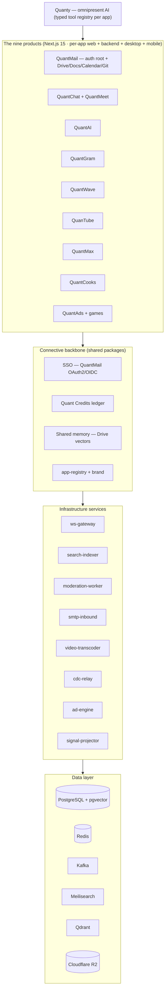

# Quant Ecosystem

[](https://github.com/quantrinitylab/Quant-Ecosystem/actions)
[](https://codecov.io/gh/quantrinitylab/Quant-Ecosystem)
[](https://www.typescriptlang.org/)
[](https://nodejs.org/)
[](https://pnpm.io/)

**Quant is not a suite of apps. It is one operating system for a person's digital life, wearing nine faces.** A single identity (QuantMail SSO), a single currency (Quant Credits, 1 credit ≈ $1), a single memory (the Drive vector store), and a single AI (**Quanty**) run *underneath* all nine products — so the instant you do something in one app, every other app already knows. Built as a TypeScript monorepo: **nine flagship products** (each with its own embedded sub-apps), **100+ shared packages**, and fourteen infrastructure services.

> **📖 The whole vision — deep architecture, per-app competitor teardowns, the UI/UX + Three.js/WebGL/WebGPU plan, and how every surface connects — lives in [`GOAL.md`](GOAL.md).** This README is the map; `GOAL.md` is the territory.

> **Sab alag, fir bhi connected** — separate, yet one. Each product is independently buildable and a category-killer on its own, yet all share one identity, one currency, one memory, and one AI.

## The nine products

The "sub-apps" below are **features inside a host app, not standalone apps**; the horizontal shells (`marketing`, `admin-enterprise`, `quant-desktop`, `quant-mobile`) are being folded *into* each product — see [the restructure](#platform-presence--the-active-restructure). Maturity legend: ✅ shipped · 🟡 partial/scaffolded · 🔴 not built yet.

| Product | Kills | Embedded sub-apps | Maturity |
|---|---|---|---|
| **QuantMail** | Gmail · Google Workspace · GitHub · Claude Code | QuantDrive, QuantDocs, QuantCalendar, QuantGit / CodeHub | 🟡 most mature (~900 files; SSO + drive/calendar/repos live) |
| **QuantChat** | WhatsApp · Snapchat · Telegram · Discord | QuantMeet (video) | 🟡 scaffolded, deep |
| **QuantAI** | ChatGPT · Gemini · Notion AI · Perplexity | — | 🟡 scaffolded |
| **QuantGram** | Instagram · Facebook · Pinterest | — | 🟡 scaffolded |
| **QuantWave** | X / Twitter · Threads · Reddit | multiplayer games platform | 🟡 scaffolded |
| **QuanTube** | YouTube · Bilibili · Spotify | — | 🟡 scaffolded |
| **QuantMax** | TikTok · Omegle · Tinder | — | 🟡 scaffolded |
| **QuantCooks** | CapCut · After Effects · Figma · Higgsfield | — | 🟡 scaffolded |
| **QuantAds** | Meta Ads · Google Ads | 🟡 scaffolded |

**Not one of the nine — [QuantTrinity](GOAL.md#the-economy--quant-credits)** is the *economy control-plane* (it tunes credit value, free allowance, commission, plan catalog, and overage defaults). It governs the ecosystem; it is not a consumer product.

## Why it wins — the unfair advantages

Each app alone is engineered to dethrone its category king. But the reason a user **stays** is that the nine are connected in ways the incumbents structurally cannot copy — no incumbent owns email *and* social *and* video *and* a creation studio *and* an ad exchange *and* a payments rail *and* an agent that drives all of them **and** your device.

1. **One identity + one memory.** Log in once (QuantMail OAuth2). What you watch on QuanTube tunes your QuantGram feed; who you email becomes who QuantChat suggests. Cross-app context is the moat.
2. **One currency, closed loop.** Quant Credits are *earned* (creator payouts, ad revenue) and *spent* (AI, boosts, marketplace, tips) inside the walls — money that enters rarely wants to leave.
3. **Quanty owns the apps *and* the device.** Assistants bolted onto other companies' apps are permanently second-class there. Quanty is a first-class actor in every Quant app via a typed tool registry, and controls the device with consent.
4. **Per-app depth, not tabs.** Every one of the nine is a genuine category killer with its own backend, admin, and roadmap — not a thin shell around a shared feed.
5. **True omnipresence.** Web + desktop (Tauri) + mobile (Capacitor) parity for every product, from one codebase per app.
6. **The creator flywheel.** QuantCooks *creates* → QuanTube / QuantGram / QuantWave *distribute* → QuantAds *monetizes* → Credits *pay out* → spent back in-ecosystem.

Full teardown of each advantage, and the competitor architectures we exploit, is in [`GOAL.md`](GOAL.md).

## Architecture

Apps never talk to infrastructure directly. They compose **shared packages**, which call **services**, which own the **data** — and Quanty rides on top of every app through its typed tool registry.



## Quanty — the omnipresent AI

Quanty is one assistant with one memory, present in every app as a **first-class user of it**: if a human can do it in the UI, Quanty can do it via a **typed tool registry** — with permission and metering. It reads the shared memory (your Drive vector store), acts across apps (draft an email, cut a QuantCooks edit, post to QuantGram), and — with consent — drives the device itself. Every Quanty call is metered through the credits `UsageGate` (fail-closed). Deep design in [`GOAL.md`](GOAL.md#quanty--the-omnipresent-ai-layer).

## Platform presence & the active restructure

**Law #1: each product owns its *entire* platform presence — web, backend, desktop, mobile, marketing, admin — inside its own `apps/<app>/` folder.** Connection happens through shared `packages/` and SSO, never by merging products into one mega-shell. The old horizontal shells are being folded *into* each product; ecosystem-wide views become thin aggregators.

| Old shell | Becomes |
|---|---|
| `quant-desktop` (one Tauri window for all) | `@quant/desktop-kit` + per-app `desktop/` |
| `quant-mobile` (one Capacitor launcher) | `@quant/mobile-kit` + per-app `mobile/` |
| `marketing` (one all-apps landing) | per-app `marketing/` route segment + thin `marketing-home` hub |
| `admin-enterprise` (one org console) | per-app `admin/` route segment + thin `enterprise-admin` hub |
| `quanttrinity` | stays the economy **control-plane** (not one of the nine) |

Nothing is deleted until its per-app replacement is proven. Full plan: [the restructure spec](docs/superpowers/specs/2026-09-30-per-app-platform-presence-restructure-design.md). Single sources of truth — `@quant/app-registry` (the 9-product catalog) and `@quant/brand` (visual identity) — keep the surfaces from drifting.

## Quant Credits economy

One currency runs the whole ecosystem — **Quant Credits** (1 credit ≈ $1) — implemented in `@quant/credits` over an **append-only ledger** (balance is always `SUM(ledger)`; entries are never mutated). It is the same unit on *both* sides of every transaction: humans pay for AI/compute/boosts in credits, and creators get paid in credits.

- **Wallet & metering** — `CreditWallet` (durable, owner-scoped) and `UsageGate` (estimate → reserve → settle, **fail-closed**, idempotent) meter every paid action. AI usage draws a **daily free allowance** first.
- **Overage opt-in** — off by default for every owner; no surprise charges unless explicitly enabled.
- **Plans & tiers** — `PlanService` resolves entitlements, rate limits, and monthly included credits, activated idempotently on payment webhooks.
- **Top-up** — provider-hosted checkout via a vendor-neutral `PaymentProvider` port (Stripe, Razorpay/UPI, PayPal/crypto adapters); card data never touches our servers; unconfigured providers fail closed.
- **Creator payouts** — `PayoutService` turns earned credits into withdrawals with no-overdraw guards, a per-day limit, compliance holds, and refund-on-failure.
- **Marketplace** — `MarketplaceLedger` settles in-credit purchases atomically (buyer debit + seller earn + platform commission), idempotent per purchase.
- **Central control** — credit value, free allowance, commission, plan catalog, and overage defaults are tuned from **QuantTrinity**.

Spec: `.kiro/specs/unified-quant-credits-economy/`.

## Quick start

```bash
git clone https://github.com/quantrinitylab/Quant-Ecosystem.git && cd Quant-Ecosystem
pnpm install
pnpm dev:all
```

> Requires Node.js 22+, pnpm 10, and Docker for infrastructure services. See [docs/development.md](docs/development.md) for detailed setup.

## Tech stack

- **Language**: TypeScript (strict mode)
- **Runtime**: Node.js 22+
- **Monorepo**: pnpm 10 workspaces + Turborepo 2
- **Frontend**: Next.js 15, React 19, Tailwind CSS
- **Backend**: Fastify 5 (via server-core), Next.js API routes
- **Native**: Tauri (desktop) + Capacitor (mobile), one thin target per app
- **Database**: PostgreSQL with pgvector extension (Prisma ORM)
- **Cache/Queues**: Redis 7, BullMQ, Redis Streams
- **Messaging**: Kafka (CDC events)
- **Search**: Meilisearch (full-text) + Qdrant (vector/semantic)
- **Real-time**: Custom WebSocket server, WebRTC (QuantMeet/QuantMax)
- **AI**: Multi-model routing via OpenRouter (Claude, GPT, Gemini, open models)
- **3D/graphics**: Three.js / React Three Fiber, WebGL, WebGPU where it wins
- **Object storage**: Cloudflare R2
- **Observability**: OpenTelemetry, Prometheus, Grafana, Jaeger
- **Deployment**: Docker Compose, Kubernetes (Helm), ArgoCD, Terraform

## Development commands

```bash
pnpm install                 # Install dependencies
docker compose up -d         # Start infra (PostgreSQL, Redis, Meilisearch, ...)
pnpm dev:all                 # Run all apps in development mode
pnpm turbo typecheck         # Type-check all packages
pnpm turbo test              # Run tests
pnpm turbo build             # Build everything
pnpm turbo lint              # Lint
```

> CI's single required check is **`gate`** (`turbo typecheck lint test build` on changed workspaces). Installs are frozen-lockfile, so a new/removed workspace package needs a matching `pnpm-lock.yaml` importer entry.

## Monorepo structure

Top level:

```
Quant-Ecosystem/
├── apps/                    # the nine products (+ horizontal shells being folded in)
├── packages/               # 100+ shared libraries (@quant/*)
├── services/               # infrastructure workers & gateways
├── infra/                  # Kubernetes (Helm), Terraform, ArgoCD, monitoring
├── docs/                   # documentation (incl. docs/goal → GOAL.md)
├── e2e/                    # Playwright end-to-end tests
├── scripts/                # build & dev tooling
├── docker-compose.yml      # full development stack
├── turbo.json              # Turborepo pipeline
└── GOAL.md                 # the deep north-star blueprint
```

**Target per-app layout** (the restructure destination — each product owns its full platform presence in one folder):

```
apps/<app>/
  src/                      # Next.js 15 web app
    app/
      admin/                # this app's OWN admin panel (role-gated segment)
      marketing/            # this app's OWN landing/content (segment)
      ...                   # product routes
  backend/                  # Fastify 5 API
  desktop/                  # thin Tauri target → @quant/desktop-kit
  mobile/                   # thin Capacitor target → @quant/mobile-kit
  app.config.ts             # per-app manifest (id, name, icon, color, routes, ports)
```

## Key packages

| Package | Purpose |
|---|---|
| `@quant/app-registry` | Single source of truth for the 9-product catalog (id/name/route/category/color/hue/icon) |
| `@quant/brand` | Single visual-identity source: `--quant-*` design tokens, per-app accent hue, icons |
| `@quant/server-core` | Fastify 5 app factory: auth, prisma, health, metrics, observability, feature-flags, audit |
| `@quant/auth` | QuantMail OAuth2 + JWT + session management + PKCE |
| `@quant/database` | Prisma schemas and base CRUD model for all domains |
| `@quant/ai` | Multi-model AI engine via OpenRouter (Claude, GPT, Gemini, open models) |
| `@quant/credits` | Unified credits economy: append-only ledger wallet, usage metering, plans, overage (default OFF), provider-hosted billing, creator payouts, marketplace ledger |
| `@quant/realtime` | WebSocket server/client with presence, channels, delivery guarantees |
| `@quant/security` | Rate limiting, DDoS, CSRF, XSS, SQL-injection defenses, WAF, encryption |
| `@quant/observability` | Distributed tracing (OTel), structured logging, metrics, SLO tracking |
| `@quant/feature-flags` | Feature-flag service with percentage rollouts and targeting |
| `@quant/organizations` | Multi-tenancy with roles and permissions |
| `@quant/queue` | BullMQ job processing with dead-letter handling |
| `@quant/shared-ui` | React component library + hooks (`useAuth`, etc.) |

## Services

| Service | Purpose |
|---|---|
| `ws-gateway` | WebSocket connection management with JWT auth, presence, realtime fan-out |
| `search-indexer` | Kafka CDC consumer; indexes to Meilisearch + Qdrant |
| `cdc-relay` | Change Data Capture from PostgreSQL WAL |
| `signal-projector` | Derived feeds / recommendations projection |
| `smtp-inbound` | Inbound email reception (MX) for QuantMail |
| `smtp-submission` | Authenticated outbound mail submission (port 587) for QuantMail |
| `imap-server` | IMAP mailbox access for QuantMail clients |
| `git-server` | Git hosting backend (QuantGit / CodeHub) |
| `git-sshd` | SSH transport for Git hosting (clone/push/pull over SSH) |
| `ci-runner` | CI/CD pipeline execution for QuantMail repos |
| `dns-poller` | Custom-domain DNS verification & reconciliation |
| `moderation-worker` | AI-powered content-moderation pipeline |
| `video-transcoder` | Video ingest/transcode (QuanTube / QuantCooks) |
| `ad-engine` | QuantAds auction engine |

## Documentation

| Document | Description |
|---|---|
| [**GOAL.md**](GOAL.md) | **The deep north-star blueprint** — full vision, per-app competitor teardowns, UI/UX + 3D plan, integration backbone |
| [Restructure spec](docs/superpowers/specs/2026-09-30-per-app-platform-presence-restructure-design.md) | Per-app platform-presence restructure design |
| [Architecture](docs/architecture.md) | System architecture with Mermaid diagrams |
| [Deployment](docs/deployment.md) | Local, Docker, and Kubernetes deployment guides |
| [API Reference](docs/api-reference.md) | All backend API endpoints |
| [Development](docs/development.md) | Developer setup, conventions, contribution guide |
| [Security](docs/security.md) | Security architecture, auth flow, incident response |
| [Runbook](docs/runbook.md) | Operational procedures, monitoring, troubleshooting |
| [SLOs](docs/slos.md) | Service Level Objectives |
| [Threat Model](docs/threat-model.md) | Security threat model |
| [Federation](docs/federation.md) | Federation protocol |
| [Disaster Recovery](docs/disaster-recovery.md) | DR procedures |

## License

MIT
