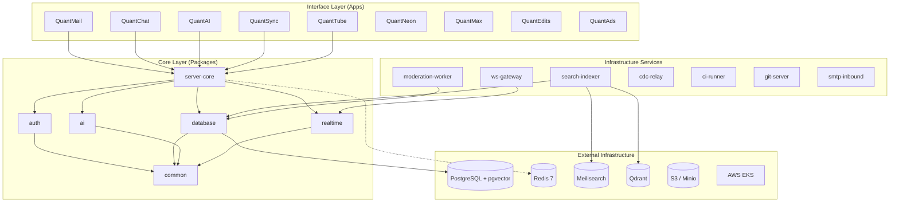
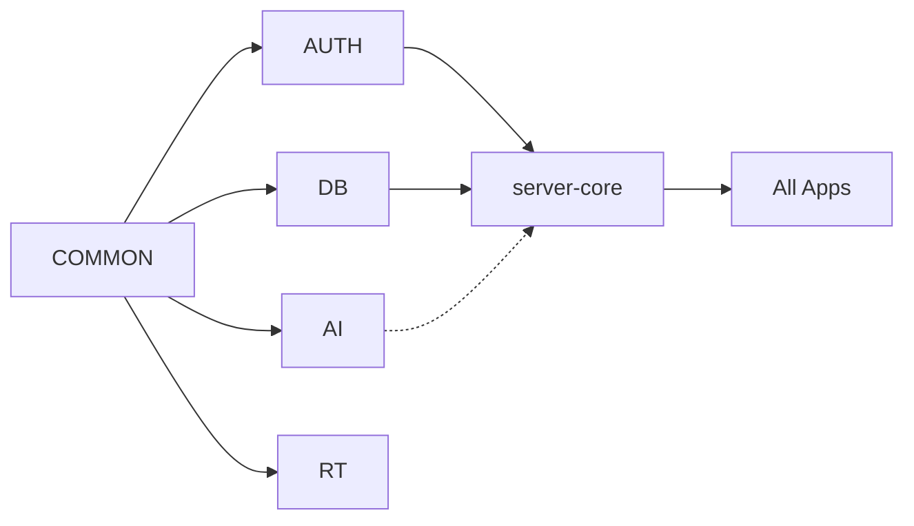
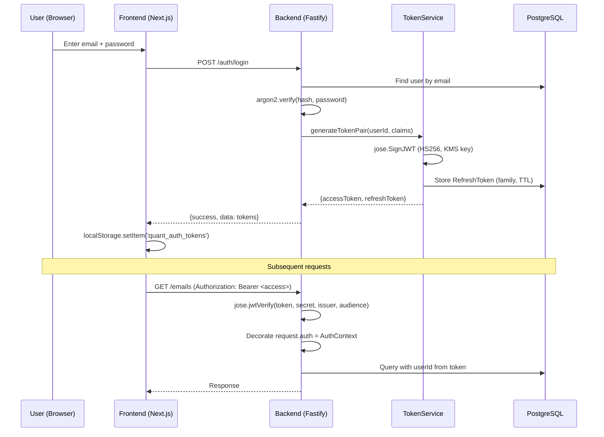
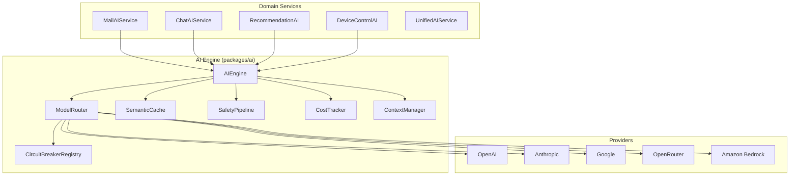
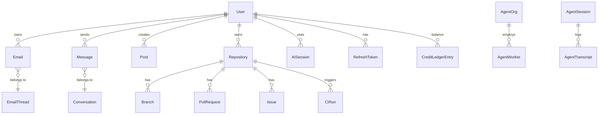

# Quant Ecosystem — Engineering Bible v1.0

> **CEO Order #0001** — Complete architecture audit before any implementation.
> This is the living constitution of the Quant platform. Every major architectural
> decision must be traceable to evidence in this document.
>
> **Principle:** _Migration code is temporary. Measurement infrastructure is permanent._
> Facades, dual-write, and shadow mode are scaffolding to get safely from old to
> new, and are deleted after cutover. The replay framework, evaluation harness,
> corpus, ADRs, and metrics are long-term assets — keep them clean and extensible.
>
> Generated: 2026-07-07 | Status: INITIAL AUDIT (Section 1-3)

---

## Table of Contents

1. [System Identity & Mission](#1-system-identity--mission)
2. [Architecture Overview](#2-architecture-overview)
3. [Module Dependency Graph](#3-module-dependency-graph)
4. [Authentication & Identity Architecture](#4-authentication--identity-architecture)
5. [AI Orchestration Architecture](#5-ai-orchestration-architecture)
6. [Data Architecture](#6-data-architecture)
7. [Realtime Architecture](#7-realtime-architecture)
8. [API Architecture](#8-api-architecture)
9. [Security Architecture](#9-security-architecture)
10. [Technical Debt Report](#10-technical-debt-report)
11. [Scalability Bottlenecks](#11-scalability-bottlenecks)
12. [Top 20 Critical Issues](#12-top-20-critical-issues)
13. [5-Year Evolution Roadmap](#13-5-year-evolution-roadmap)

---

## 1. System Identity & Mission

**Mission**: Build the Coordination Layer for Humans, AI, and Organizations.

**Vision**: Every organization, every AI, every developer, every robot uses one
trusted coordination layer. Its name: Quant.

**Product**: NOT a super-app. A **coordination protocol** that manifests as
apps (interfaces) on top of a shared core.

**Core Pillars (P0)**:

- Identity (single auth root)
- Memory (durable context for AI + users)
- AI Orchestrator (multi-model, multi-agent)
- Core APIs (the coordination primitives)

**Interface Layer (P1)**: Mail, Chat, Docs, Drive, Calendar, Meet

**Extension Layer (P2)**: Marketplace, Ads, Social, Games, etc.

---

## 2. Architecture Overview

### Key Numbers

| Metric                      | Value              |
| --------------------------- | ------------------ |
| Total workspace packages    | ~96                |
| Apps (frontends + backends) | 19                 |
| Infrastructure services     | 7                  |
| Prisma models               | 60+                |
| AI models registered        | 25+                |
| Lines of TypeScript         | ~500K+ (estimated) |
| Commits (last week)         | 97 PRs merged      |

---

## 3. Module Dependency Graph

### Core Dependency Chain

### Foundation Packages (consumed by everything)

| Package              | Purpose                            | Consumers              |
| -------------------- | ---------------------------------- | ---------------------- |
| `@quant/common`      | Types, constants, validators       | ALL                    |
| `@quant/database`    | Prisma client, repos, transactions | ALL apps + git-server  |
| `@quant/auth`        | JWT, argon2, TOTP, WebAuthn, PKCE  | ALL apps + server-core |
| `@quant/server-core` | Fastify factory + plugins          | ALL app backends       |

### Platform Packages

| Package                | Purpose                   | Real consumers                                              |
| ---------------------- | ------------------------- | ----------------------------------------------------------- |
| `@quant/ai`            | Multi-provider AI engine  | quantmail, quantchat, quantai, quantsync, quantads + 5 more |
| `@quant/realtime`      | WebSocket server/client   | quantmail, quantchat, quantai + ws-gateway                  |
| `@quant/shared-ui`     | React components          | ALL frontends                                               |
| `@quant/queue`         | BullMQ queue abstraction  | quantmail, moderation-worker, ci-runner                     |
| `@quant/storage`       | S3-compatible file ops    | quantdrive, ci-runner                                       |
| `@quant/search`        | Full-text + vector search | admin, search-indexer                                       |
| `@quant/notifications` | Push/email/in-app         | quantmail, quantchat, admin                                 |
| `@quant/encryption`    | E2E crypto primitives     | quantmail, quantchat                                        |
| `@quant/credits`       | Ledger, wallets, metering | quantmail, quantads                                         |

### ORPHANED Packages (~35 packages with zero or single consumers)

**Decision required**: These exist in the workspace but are NOT consumed by any
production path. They inflate install time, CI duration, and cognitive load.

Examples: `chaos-testing`, `co-presence`, `cross-app-workflows`, `data-pipeline`,
`data-warehouse`, `dev-platform`, `device-control`, `generative-media`,
`governance`, `iot-control`, `launch-beta`, `launch-public`, `local-first`,
`maps`, `robotics-bridge`, `spatial-ui`, `sync-engine`, `voice-first-os`,
`wearables`, `webrtc`

**Recommendation**: Evaluate each for P0/P1 relevance. Archive or delete the rest.

---

## 4. Authentication & Identity Architecture

### Flow: Login → Token → Request Authorization

### Security Properties (REAL, verified in code)

| Property          | Implementation                                     | File                                          |
| ----------------- | -------------------------------------------------- | --------------------------------------------- |
| Password hashing  | argon2id (default params)                          | `packages/auth/src/crypto/password.ts`        |
| Token signing     | jose HS256 with KMS key rotation                   | `packages/auth/src/services/token-service.ts` |
| Key rotation      | `kid` header + multi-key verify window             | `token-service.ts:verifyWithKms`              |
| Refresh rotation  | Family tracking + reuse detection (revokes family) | `token-service.ts:refreshToken`               |
| PKCE S256         | `crypto.subtle.digest('SHA-256')`                  | `packages/auth/src/crypto/pkce.ts`            |
| Random IDs        | `crypto.randomBytes`                               | `packages/auth/src/crypto/secure-random.ts`   |
| Rate limiting     | `@fastify/rate-limit` (Redis-backed in prod)       | `packages/server-core/src/app.ts`             |
| CORS              | `@fastify/cors` (configurable origins)             | `packages/server-core/src/app.ts`             |
| Helmet (CSP/HSTS) | `@fastify/helmet` (global)                         | `packages/server-core/src/app.ts`             |

### Gaps / Risks

| #   | Gap                                       | Severity | Evidence                                                  |
| --- | ----------------------------------------- | -------- | --------------------------------------------------------- |
| 1   | No mTLS between services                  | MEDIUM   | Services trust JWT at boundary; no wire-level auth        |
| 2   | No session revocation on password change  | MEDIUM   | `change-password` route doesn't revoke existing tokens    |
| 3   | No JWT blacklist for immediate revocation | LOW      | Access tokens (15min) expire naturally; no instant revoke |
| 4   | WebSocket auth is query-param based       | LOW      | Token in URL can leak in logs; header auth also supported |

---

## 5. AI Orchestration Architecture

### Model Selection Algorithm

1. Check if specific model requested → use if available
2. Check `AI_DEFAULT_MODEL` env override → use if provider configured
3. Infer capabilities from prompt keywords
4. Filter models by: provider available + capabilities match + context fits
5. Score remaining: quality(40) + latency(20) + cost(20) + load(10) + fit(10)
6. Fall through: fallback chain → env default → first available → gpt-4o-mini

### Status Assessment

| Component              | Status | Evidence                                       |
| ---------------------- | ------ | ---------------------------------------------- |
| Multi-provider routing | REAL   | 5 providers, 25+ models, circuit breakers      |
| Bedrock Converse API   | REAL   | Native AWS SDK, inference-profile IDs          |
| Safety pipeline        | REAL   | PII regex + moderation pre/post                |
| Semantic cache         | NAIVE  | String-key lookup, not vector similarity       |
| Context memory         | NAIVE  | In-memory Map, no pgvector retrieval           |
| Cost tracking          | NAIVE  | In-process, not persisted to ClickHouse        |
| Prompt registry        | REAL   | YAML files with version loading                |
| Streaming              | REAL   | SSE via Vercel AI SDK + Bedrock ConverseStream |

---

## 6. Data Architecture

### Prisma Schema (60+ models)

### Data Store Mapping

| Store                    | Purpose                    | Status                     |
| ------------------------ | -------------------------- | -------------------------- |
| PostgreSQL 16 + pgvector | Primary OLTP               | REAL (RDS in prod)         |
| Redis 7                  | Rate limit, sessions cache | REAL (ElastiCache in prod) |
| Meilisearch              | Full-text search           | REAL (pod running)         |
| Qdrant                   | Vector embeddings          | DEV ONLY (docker-compose)  |
| S3                       | Object storage             | REAL (configured in prod)  |
| ClickHouse               | Analytics/cost tracking    | MISSING                    |
| Kafka/NATS               | Event streaming            | MISSING in prod            |

---

_Sections 7-13 will be completed in the next iteration of this document._
_This is a living document — updated as the audit deepens._

---

## Document Status

- [x] Section 1: Mission & Identity
- [x] Section 2: Architecture Overview
- [x] Section 3: Module Dependency Graph
- [x] Section 4: Authentication Architecture
- [x] Section 5: AI Orchestration
- [x] Section 6: Data Architecture (partial)
- [ ] Section 7: Realtime Architecture
- [ ] Section 8: API Architecture
- [ ] Section 9: Security Architecture
- [ ] Section 10: Technical Debt Report
- [ ] Section 11: Scalability Bottlenecks
- [ ] Section 12: Top 20 Critical Issues
- [ ] Section 13: 5-Year Evolution Roadmap
