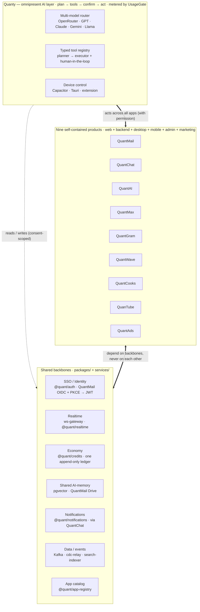

> This is the connective tissue that makes **nine independent products feel like one organism**. Each app (QuantMail, QuantChat, QuantWave, QuanTube, QuantAI, QuantMax, QuantCooks, QuantGram, QuantAds) is fully self-contained — web + backend + desktop + mobile + admin + marketing living inside its own `apps/<app>/` — yet every one of them plugs into the same identity, the same realtime fabric, the same currency, the same memory, and the same assistant. *Sab alag, fir bhi connected.*
>
> The four sections below describe the shared layers, in confident target-state voice: **Quanty** (the AI that is everywhere and can act everywhere), the **design system** (one visual language, per-app accent), the **3D/WebGL/WebGPU** strategy, and the **integration backbone** (the packages and services that wire the nine together). Package and service names are the real ones in this monorepo.

## Quanty — the omnipresent AI layer

### 1.1 Vision

Quanty is **one persona, present in every app, backed by one memory and one wallet.** You speak or type once — in any app, on any device — and Quanty either answers or *acts*: it plans, calls typed actions across whichever apps are involved, asks you to confirm anything risky, and reports back. It is not a chatbot bolted onto a sidebar; it is a first-class actor with the same reach a power user has, plus the ability to drive the device itself (with explicit, revocable permission).

The product promise is blunt: **"barely touch your phone."** Triaging mail, replying to DMs, publishing a clip, booking a table, topping up an ad budget, muting a noisy thread for the weekend — these become one sentence to Quanty, not twenty taps across five apps. Because we own the apps *and* the device layer *and* the memory *and* the currency, Quanty can do the whole errand end-to-end instead of narrating steps for you to perform.

Three properties make this real rather than aspirational:

- **Typed, first-party actions.** Every app publishes a tool registry of typed actions (`@quant/agent-runtime`, `@quant/ai` assistant). Quanty calls `quantmail.archiveThread(id)` or `quantube.publish(clipId, …)` directly — never by screenshotting a page and guessing where to click.
- **One metered economy.** Every model call and every side-effect flows through the credits `UsageGate` (`@quant/credits`): estimate → reserve → settle, fail-closed. You always know what an errand costs, and Quanty can never silently overspend.
- **One consented memory.** What you tell Quanty in QuantMail is available (only with scope-checked consent) to Quanty in QuantGram. Context compounds across the whole ecosystem instead of resetting per app.

### 1.2 Agentic architecture

Quanty is a **planner→executor loop** wrapped in guardrails, metering, and human-in-the-loop confirmation. The runtime lives in `@quant/agent-runtime` and `@quant/agentic`; the user-facing persona, intent routing, and per-app tools live in `@quant/ai` (`src/assistant/`). The model layer is `@quant/ai` provider adapters.

**Multi-model routing.** Quanty is model-agnostic. `@quant/ai` defines a provider set — OpenAI (`gpt-4o`, `gpt-4o-mini`), Anthropic (`claude-sonnet-4`, `claude-3-5-haiku`), Google (`gemini-2.0-flash`, `gemini-1.5-pro`), and an **OpenRouter** aggregator that fronts `openai/gpt-4o`, `anthropic/claude-3.5-sonnet`, `google/gemini-2.0-flash-001`, `meta-llama/llama-3.1-70b-instruct`, `deepseek/deepseek-chat` and more. Each provider carries a `costMultiplier` and an `isAvailable()` probe; a `FallbackChainConfig` (primary → secondary → tertiary) degrades gracefully when a provider is down or rate-limited. The router picks a model **per task** on three axes:

- **Capability** — heavy planning / long-context reasoning → a frontier model (Claude Sonnet, GPT-4o, Gemini Pro); classification, routing, extraction, and cheap tool-arg synthesis → a small/fast model (Haiku, `gpt-4o-mini`, Gemini Flash, Llama).
- **Cost** — priced against the credits ledger; `costMultiplier` and the estimated token budget feed the `UsageGate` estimate before a call is ever made.
- **Latency** — interactive turns favor low-TTFT streaming models; background/batch jobs may take a slower, cheaper model.

Users can bring their own preference: `resolveUserModel(preference, { allowed, default })` honors a user-chosen OpenRouter model id against an optional allow-list and falls back to a safe default, returning the resolution `source` for telemetry.

**Per-app tool registry.** Each app exposes typed actions through `TypedToolRegistry` (`@quant/agent-runtime`). A `ToolDefinition` is `{ name, description, parameters (Zod-validated), requiredTier, category, handler }`, and every handler returns a `ToolExecutionResult { success, data, undoable, undoFn? }`. Registration validates the schema up front (`ToolDefinitionSchema.parse`), and `validateArgs()` type-checks every call at the boundary, so Quanty can only invoke actions that actually exist with arguments that actually type-check — no hallucinated endpoints, no malformed payloads. Tools are discoverable by `category` and filtered by permission `tier`, which is how the planner knows what it is *allowed* to attempt for a given user and consent scope.

**Planner → executor loop.** `plan-generator` turns an intent into an `AgentPlan { intent, steps[], estimatedCost, status }`. Each `PlanStep { toolName, args, tier, requiresApproval, status }` names one typed tool call. `task-decomposer` splits compound goals into ordered steps across apps; `orchestrator` + `execution-engine` walk the plan through a `state-machine` (`draft → approved → executing → completed | failed`), running independent steps concurrently and serializing dependent ones. `conflict-resolver` handles two steps that would touch the same resource. `undo-engine` composes the per-step `undoFn`s into a single reversible transaction, so a multi-app errand can be rolled back as a unit.

**Human-in-the-loop & guardrails.** Risk is graded by **action tier** (`AgentActionTier`), and the tier decides whether a step runs autonomously or waits at the `approval-queue`:

| Tier | Name | Examples | Default gate |
|------|------|----------|--------------|
| 0 | Read-only | search mail, read feed, summarize a thread | auto |
| 1 | Draft-only | draft a reply, compose a post (not sent) | auto, shown for review |
| 2 | Low-risk | archive, label, mute, add to playlist, RSVP | auto within budget, undoable |
| 3 | High-risk | send message, publish, spend credits, delete, book | **explicit confirm** |
| 4 | Admin | change permissions, billing, device automation, bulk ops | **explicit confirm + step-up auth** |

Before anything executes, `safety-classifier` labels each step `safe | caution | blocked` (`SafetyClassificationResult` with the rules triggered); `blocked` is dropped from the plan, `caution` is force-elevated to a confirmation regardless of tier. `trust-score` raises or lowers autonomy per user over time; `spending-limit` + `BudgetConfig` cap spend per period; `sandbox` isolates side-effecting handlers; and a global `kill-switch` halts an agent mid-plan. Everything is written to an append-only `audit-trail` (who/what/when/which tool/which tier/what result), so every autonomous action is explainable and reversible after the fact.

**Streaming tool-use.** Turns stream: partial tokens render live, tool calls surface as structured function-calling events (name + args) the moment the model emits them, results stream back in, and the loop continues — the user sees the plan *think and act* in real time, and can hit stop (the `kill-switch`) at any point.

**Metering — the credits `UsageGate`.** Every metered action — each model call *and* each billable side-effect — passes through the single choke point in `@quant/credits` (`UsageGate`, the design's `CreditMeter`), wired to the runtime by `agent-budget-adapter`:

1. **estimate** — `estimateCost(action)` prices the action via the `PricingEngine`.
2. **reserve** — `checkAndReserve(ownerRef, action)` verifies plan entitlements, checks *available* balance (`getBalance − open holds`) against the estimate, and records an idempotent hold keyed by `action.actionKey`. It **fails closed**: `OUT_OF_CREDITS` (402) if the balance can't fund the estimate, `UPGRADE_REQUIRED` (402) if the plan forbids the action kind. No metered action ever proceeds without a successful reservation.
3. **settle** — `settle(reservation, actualCost)` reconciles estimate vs. actual (refunds or charges the delta) and appends the debit to the wallet. Settling the same reservation twice is a no-op.

Because reserve and settle are both idempotent by `actionKey`, retries and network flakes never double-charge, and a plan's `estimatedCost` (`CostEstimate` breakdown per step) is shown to the user *before* they approve. One wallet, one currency (Quant Credits, 1 credit ≈ $1), one place where spend is enforced.

### 1.3 Memory

Quanty's memory is a **two-tier store with consent as a first-class citizen** (`@quant/ai-memory`, embeddings in PostgreSQL + `pgvector`, files in QuantMail Drive / Cloudflare R2).

- **Long-term memory** — durable facts about *you*, stored as `MemoryEntry` records categorized as `people | places | projects | preferences | skills | goals | schedules | routines`. Each entry records its `sourceApp`, a human-readable `explanation` of why it was remembered, a `writeSignal` (`explicit` | `digest-approved` | `pending-review` — nothing is silently memorized; ambient observations queue for review), an `expiresAt` for time-boxed facts, and an `accessScopes[]` list. Content is embedded and indexed in pgvector for semantic recall.
- **Short-term / per-app context** — the working set for the current session and app (open thread, current draft, recent tool results), assembled per turn and discarded or promoted to long-term via a `writeSignal`.

**Consent-scoped retrieval.** Every read is gated by `accessScopes` and logged: each `MemoryEntry.accessLog` appends `{ accessedAt, reason, requestingApp }`. So when QuantGram's Quanty pulls a preference that was learned in QuanTube, that cross-app read is *scoped* (the user granted "QuanTube → QuantGram" personalization) and *auditable* (the entry shows exactly who read it and why). `memory-explainer` turns any entry into a plain-language "here's what I know and where it came from," and `memory-export` gives the user a full JSON/Markdown/CSV dump — the memory is the user's, portable and inspectable.

**How memory from one app improves another.** This is the compounding advantage:

- **QuanTube watch history → QuantGram feed.** Semantic embeddings of what you watch and finish become retrieval context for QuantGram's ranking (via `@quant/recommendation` + `signal-projector`), so a new social feed is warm on day one instead of cold-starting.
- **QuantMail threads → QuantChat replies.** Quanty drafts a chat reply already knowing the deal terms you negotiated over email.
- **QuantCooks activity → QuantMax planning.** The recipes you cook inform grocery/shopping automations and calendar blocks QuantMax proposes.
- **QuantMax goals → everywhere.** A stated goal ("ship the launch by Friday", "eat less sugar") biases what every app's Quanty surfaces and suggests.

Retrieval is always **scope-checked, logged, revocable, and exportable** — the difference between "one assistant that knows you across your whole digital life" and "nine assistants that each forget you at the app boundary."

### 1.4 Device control

Quanty can drive the device itself, not just our apps. `@quant/device-control` exposes a **capability model** — `accessibility`, `bluetooth`, `camera`, `contacts`, `files`, `location`, `notifications`, `phone`, `sensors`, `sms`, `wifi` — each behind a `CapabilityRegistry` entry, a permission grant, and an audit log. Capabilities are surfaced to Quanty as high-tier tools (mostly Tier 3–4), so device actions always pass safety classification, confirmation, and metering like any other tool.

**Per-platform implementation:**

- **Mobile (Capacitor).** Native capabilities are Capacitor plugins bridging to iOS/Android APIs (contacts, SMS/`phone`, camera, location, sensors, notifications). Cross-app *UI* automation — tapping through a third-party app when no first-party API exists — uses the **OS accessibility APIs** (Android AccessibilityService, iOS Accessibility/App Intents) via the `accessibility` capability. First-party apps are always driven by typed tools; accessibility is the fallback for the rest.
- **Desktop (Tauri).** A Tauri (Rust) shell exposes OS automation to Quanty: window/app control, filesystem, clipboard, keyboard/mouse synthesis, and shell escape hatches behind capability grants. Native-speed, small footprint, and a hard permission boundary between the webview and the OS.
- **Web (browser extension).** Where there's no native shell, a companion extension gives Quanty DOM-level reach into the active tab (read/fill/click) plus our own web apps' typed tools — the graceful-degradation tier.

**Phone-free mode.** The `phone-free` module (`mode-controller`, `session-logger`, `ui-state`, `emergency-access`) is the concrete expression of "barely touch your phone": you hand Quanty a batch of intents ("clear my inbox, reply to family, mute work until Monday"), it executes them via voice + device control, logs every action, and keeps an always-available emergency-access escape. Voice is first-class: `@quant/device-control/voice` provides an `intent-parser`, `command-grammar`, `alias-registry` (user-defined shortcuts), and `command-executor`, so a spoken command becomes a typed, tiered, metered plan.

**Safety & permission model.** Device control is the highest-blast-radius surface, so it is the most constrained: capabilities are **off by default**, granted explicitly and **revocably** per capability (not all-or-nothing), scoped and time-boxed where possible, always Tier 3+ (confirmation, often step-up auth), always sandboxed, always audited, and always killable mid-action. `@quant/identity-permissions` is the authority for what a grant means; `@quant/device-control/audit` records every exercise of it. The user can see, in one place, everything Quanty is allowed to touch and everything it has touched.

### 1.5 Cross-app orchestration — worked examples

Each example is: **user intent → Quanty plans (typed tools across apps) → confirms risky steps → executes → done.** Tiers and the `UsageGate` are shown where they bite.

**A. "Turn my best QuanTube clip this week into a QuantGram post and tell my close friends."**
Plan: `quantube.listClips({ range: '7d', sort: 'engagement' })` *(T0)* → `quantube.exportClip(top.id, { format: 'vertical' })` *(T2)* → `quantgram.createPost({ media, caption })` — caption drafted from the video's transcript + your memory of past captions *(T1 draft → shown)* → **confirm publish** → `quantgram.publish(post.id)` *(T3)* → `quantchat.notify({ audience: 'close-friends', ref: post.url })` *(T2)*. Cost estimated (export transcode + post) and reserved before publish; settled after.

**B. "I'm double-booked Thursday 3pm — sort it out."**
Plan: `quantmax.getConflicts({ day: 'Thu' })` *(T0)* → cross-references `quantmail.search({ q: 'Thursday meeting' })` and QuantChat threads to learn which is movable *(T0)* → drafts reschedule messages *(T1)* → **confirm** → `quantchat.send(...)` / `quantmail.send(...)` to the lower-priority party *(T3)* → `quantmax.moveEvent(...)` *(T2)* → `quantmeet.updateInvite(...)` *(T2)*. Memory supplies who's VIP; nothing is sent without confirmation.

**C. "Boost the campaign that's converting and pause the one that isn't — cap it at 50 credits."**
Plan: `quantads.getCampaignStats({ range: '24h' })` *(T0)* → identifies winner/loser → **confirm spend** → `quantads.setBudget(winner.id, +credits)` *(T3, metered)* → `quantads.pause(loser.id)` *(T2)*. The 50-credit cap is enforced by `spending-limit` + `UsageGate.checkAndReserve`; if the boost would exceed available balance it fails closed with `OUT_OF_CREDITS` and Quanty proposes a smaller boost.

**D. "Plan Saturday dinner for six from what's in my kitchen, and invite the group."**
Plan: `quantcooks.suggestMenu({ pantry, servings: 6, diet: memory.preferences })` *(T0)* → `quantcooks.buildShoppingList(menu)` for the gaps *(T0)* → **confirm** any purchase → `quantmax.addTasks(shoppingList)` *(T2)* → `quantchat.createGroup({ members, name: 'Sat Dinner' })` + `quantchat.send(invite)` *(T3)* → `quantmax.addEvent('Sat 7pm')` *(T2)*. Dietary constraints and who's vegetarian come from cross-app memory (`preferences`, `people`).

**E. "Someone's impersonating me — lock it down." (device + identity + safety)**
Plan: `quantmail.searchLogins({ suspicious: true })` *(T0)* → `identity.listActiveSessions()` *(T0)* → **confirm + step-up auth** → `identity.revokeSessions({ except: current })` *(T4)* → `auth.rotateTokens()` *(T4)* → `quantchat.send({ to: 'contacts-who-were-messaged', text: warning })` *(T3)*. Every step is Tier 4 / high-risk: safety-classifier forces confirmation, step-up auth is required, and the full sequence is written to the audit trail and is undoable.

**F. "Weekend mode: mute work, keep family, wake me for anything urgent." (phone-free)**
Plan: `notifications.setPolicy({ mute: ['work'], allow: ['family'], urgentBreakthrough: true })` *(T2)* → `quantchat.setStatus('away')` *(T2)* → `device.phoneFree.enable({ until: 'Mon 8am', emergencyAccess: true })` *(T3)* → Quanty batches non-urgent items into a Monday digest. Cross-app notification policy is enforced through QuantChat as the single notification surface; emergency access is always live.

Across all six: **one sentence in, a typed multi-app plan out, confirmation only where it matters, one bill, one memory, fully reversible.**

### 1.6 Competitors — how they're built, and the weakness we exploit

Every serious assistant today shares one structural handicap: **it does not own the apps it acts in.** So it either screen-drives other people's UIs (brittle, permissioned by the host, no typed contract) or it waits for those apps to voluntarily expose intents. We own all nine apps *and* the device layer *and* the memory *and* the currency — a different category.

**OpenAI — ChatGPT + Operator / ChatGPT agent + Atlas.** Operator (Jan 2025) ran on the *Computer-Using Agent* (CUA): GPT-4o vision + RL that reads a rendered browser as pixels and emits clicks/keystrokes in a sandboxed cloud VM. In July 2025 Operator folded into **ChatGPT agent** ("agent mode") — a unified agent that browses, runs code, and produces artifacts. The **Atlas** browser (Oct 2025, "OWL" architecture) puts ChatGPT beside every page. → **Weakness we exploit:** it drives *other people's* apps by vision + synthetic clicks — slow, fragile, needs you to log in each time, breaks on redesigns, and gets no typed guarantees. Its memory is siloed inside ChatGPT; there is no cross-app economy, no first-party device layer, no unified identity. We call typed first-party actions with schema validation and settle spend on one ledger — no screenshot guessing, no per-site login theater.

**Google — Gemini as "universal assistant" + Astra + Mariner.** Gemini is replacing Assistant; **Project Astra** is the real-time, multimodal, memory-augmented core (feeds Gemini Live); **Project Mariner** is the browser agent — began as a Chrome extension, moved to cloud-hosted VMs (May 2025), runs on Gemini 2.5 Pro with computer-vision + browser automation. Deep Android + Workspace integration is the real strength. → **Weakness we exploit:** the same VM-and-CV browser-automation pattern for anything outside Google's own apps; a product line still fragmenting across Assistant → Gemini; and an ads-funded model whose incentives fight the user's. Google owns Workspace, not a nine-app consumer super-app with a single credit wallet. Our reach into *our* apps is a typed API, not a robot pretending to be a mouse, and our economics are credits the user buys, not attention we sell.

**Apple — Siri + Apple Intelligence.** The architecture is elegant: on-device models for small tasks, **Private Cloud Compute** for bigger ones, a third tier (external models, e.g. Gemini) for the hardest, and the **App Intents / App Schemas / App Entities** framework by which apps expose actions and entities Siri can invoke plus "onscreen awareness" and cross-app "personal context." The genuinely capable "Siri AI" finally shipped in 2026 — roughly two years late, and delayed further in the EU by the DMA. → **Weakness we exploit:** Siri can only orchestrate apps that adopt App Intents *on Apple's terms*, it's locked to Apple hardware (no Windows/Android/web parity), its "personal context" is Apple's private index rather than a portable, exportable memory the user owns, there's no currency/economy layer, and the track record is late-and-cautious. We ship the same "apps expose typed actions" idea, but we *are* every app in the suite (100% adoption on day one), on every platform, with an owned memory and a wallet Apple has no equivalent of.

**Notion AI.** RAG over your workspace + connectors, Q&A, writing, and increasingly "agents" that act inside Notion. → **Weakness we exploit:** the world ends at the Notion workspace and a handful of read-connectors. No device control, no reach into messaging/video/social/ads, no currency, no cross-consumer-app memory. It's a great assistant for one document tool; we're an assistant for your digital life.

**Perplexity.** A best-in-class answer engine — RAG + search over its own Sonar models — plus **Comet**, an agentic browser (2025) that acts on pages for you. → **Weakness we exploit:** it's search-and-answer first; it owns no productivity/social/comms apps to act *in*, so agentic actions again route through browser automation. No cross-app memory graph, no unified economy, no device layer.

**Rabbit R1.** Pitched a *Large Action Model* (LAM) that learns to operate app UIs by imitation ("teach mode"); shipped as a **web agent based on WebVoyager** that reasons out steps to complete web tasks — on separate, underpowered hardware. Widely panned ("LAM or SCAM"; "should've been an app") for unreliability. → **Weakness we exploit:** brittle web automation, a redundant device, and effectively no ecosystem or apps of its own. It's the cautionary tale for "action model without owning the actions."

**Our unfair advantage (structural, not a feature):** we own the **apps** (typed first-party tools, not screen-scraping), the **device layer** (Capacitor + Tauri + extension, permissioned and audited), **one cross-app memory** (pgvector in QuantMail Drive, consent-scoped and exportable), **one currency** (Quant Credits through a fail-closed `UsageGate`), and **one identity** (QuantMail SSO). An assistant that merely bolts onto other people's apps can never get first-party typed actions, a unified memory across those apps, or a single metered economy — the three things that make Quanty reliable, personal, and honest about cost. *That* is the moat.

Competitor architecture sources: OpenAI [ChatGPT agent](https://openai.com/index/introducing-chatgpt-agent/), [Computer-Using Agent](https://openai.com/index/computer-using-agent/), [Atlas / OWL](https://openai.com/index/building-chatgpt-atlas); Google [Gemini universal assistant](https://blog.google/innovation-and-ai/models-and-research/google-deepmind/gemini-universal-ai-assistant/), [Project Astra](https://deepmind.google/models/project-astra/), [Project Mariner](https://aiwiki.ai/wiki/project_mariner); Apple [Siri AI](https://www.apple.com/newsroom/2026/09/siri-ai-a-profoundly-more-capable-and-personal-assistant-is-here/), [App Intents / WWDC26](https://developer.apple.com/wwdc26/guides/apple-intelligence/), [DMA delay](https://www.apple.com/newsroom/2026/06/due-to-dma-siri-ai-delayed-in-eu-for-ios-27-and-ipados-27/); Rabbit [LAM / WebVoyager agent](https://techcrunch.com/2024/09/23/rabbits-web-based-large-action-model-agent-arrives-on-r1-as-early-as-this-week/).

---

## Ecosystem UI/UX design system

**The bar:** every product must feel *native and best-in-class on every device it runs on* — better UI/UX than the incumbent on web, on desktop (Tauri), and on mobile (Capacitor). One visual language, nine accents, zero "web app in a wrapper" feel.

### 2.1 Design language & tokens

`@quant/brand` is the single source of truth for visual identity, emitting **CSS custom properties** consumed everywhere. The system is **dark-first** (canvas `#090A0C`, primary surface `#111318`, elevated `#16181D`) with a full light theme, built on:

- **Color** — brand **primary (orange, `#FF8C42`)**, accent (amber, `#F59E0B`), neutral (slate ramp `50→950`), and semantic ramps (error/warning/success/info), each a 50–950 scale. Emitted as `--brand-primary-*`, `--brand-accent-*`, `--brand-neutral-*`, `--brand-{error,warning,success,info}-*`, plus `--brand-surface-*`. The consolidated `--quant-*` namespace (codegen `generated/quant-tokens.css`, `generate:tokens` + a drift guard) is the forward-looking token surface every app resolves against.
- **Per-app accent hue.** Each product has a canonical color + `hue` (QuantMail 217°, QuantChat 160°, QuantAI 263°, QuantMax 38°, QuantGram 330°, QuantWave 188°, QuantCooks 270°, QuanTube 350°, QuantAds 162°). `generateAppCSS(appId)` sets `--app-name`, `--app-color`, `--app-hue`, so shared components tint themselves to the current app **without forking** — one button component, nine identities. Visual identity is resolved from `@quant/brand` at read time (via `@quant/app-registry`'s `resolveApp`), never hard-coded per app.
- **Typography** — display / body / mono families, an `xs→6xl` type scale with matched line-heights, and a `thin→black` weight set, all tokenized (`--brand-font-*`, `--brand-text-*`, `--brand-leading-*`).
- **Theming** — `dark` / `light` / `system`, plus a **high-contrast** theme, applied via `:root[data-theme="…"]` semantic tokens (`--background`, `--foreground`, `--surface`, `--primary`, `--ring`, …). `system` follows the OS; the choice is user-overridable and persisted through SSO so it follows you across apps and devices.

### 2.2 Component library & composition

`@quant/shared-ui` is the one component library every app composes from: primitives (Button, Input, Select, Dialog, Popover, Toast, Tabs, Tooltip, Menu), data surfaces (Table, List, Card, Avatar, Badge), layout (AppShell, Sidebar, SplitView, Sheet), and cross-cutting pieces — the **Quanty dock/command surface**, the **cross-app command palette** (`@quant/command-palette`, ⌘K everywhere: jump to any app, run any Quanty tool, search across the ecosystem), the app switcher (fed by `@quant/app-registry`), and the notification center (`@quant/notifications`). Components are **headless-core + tokenized-skin**: behavior/a11y in the primitive, appearance from `--brand-*`/`--app-*` tokens, so an app re-skins by swapping its accent hue, not by re-implementing. Composition follows a strict layering — primitives → patterns (e.g. `EntityList`, `DetailPane`, `Composer`) → app screens — so QuantMail's thread list and QuantChat's message list are the *same* pattern with different data, giving instant familiarity as you move between apps. `@quant/spatial-ui` adds the "one workspace" scaffolding (panels, docking, spatial navigation) that makes the nine apps feel like rooms in one building rather than nine browser tabs.

### 2.3 Motion system

Motion is tokenized in `@quant/brand` and split across two engines by job:

- **Framer Motion** — component/state motion in React: enter/exit, layout animations, gesture-driven interactions, shared-element transitions. Driven by the brand **spring** set (`gentle` for modals/tooltips, `snappy` for buttons/toggles, `bouncy` for badges/notifications, `stiff` for menus/dropdowns) and the **easing/duration** tokens (`instant 50ms → fast 100 → normal 200 → moderate 300 → slow 500 → glacial 800`, with `--brand-ease-out/-in/-in-out/-bounce/-decelerate`).
- **GSAP** — timeline-heavy, scroll-driven, and cinematic sequences: marketing hero moments, onboarding, QuantCooks editor scrubbing, complex staged reveals where a spring isn't the right tool.

The feel is **"spatial navigation"**: shared-element transitions carry an object from list → detail so it never teleports; the app switcher and command palette move you between apps with a consistent directional metaphor (apps live in a coherent space, you travel to them); micro-interactions (button press, toggle, optimistic-send, pull-to-refresh, hover elevation) use `instant`/`fast` springs so the UI always feels *responsive* first and *decorative* second. Every animation reads its duration/easing from tokens, so a single change (or **`prefers-reduced-motion`**) retunes the whole ecosystem at once.

### 2.4 Accessibility & internationalization

Accessibility is a build-gate, not a retrofit. Target **WCAG 2.2 AA** across the ecosystem:

- **Contrast** — `@quant/brand`'s `contrast` utilities validate token pairings against AA (4.5:1 text / 3:1 large & UI); the high-contrast theme exceeds AAA for critical surfaces. This is checked in the token pipeline so a failing pairing can't ship.
- **Keyboard** — every interaction is reachable and operable by keyboard: full focus management, visible focus rings (`--ring`), logical tab order, roving-tabindex in composite widgets, ⌘K command palette as a keyboard-first spine, and no keyboard traps (WCAG 2.2's focus-appearance and dragging-alternatives included).
- **Screen readers** — headless primitives ship correct roles/ARIA, live regions for async/optimistic updates and Quanty's streaming output, and labeled controls; tested against VoiceOver / NVDA / TalkBack.
- **Reduced motion** — `prefers-reduced-motion` swaps spring/GSAP sequences for instant or minimal cross-fades globally, via the motion tokens.
- **i18n / RTL** — all copy externalized for localization; layouts are **logical-property-based** (`inline-start`/`inline-end`, not left/right) so **RTL** (Arabic, Hebrew, Urdu) mirrors correctly; locale-aware dates/numbers/currency (Quant Credits formatting), and CJK/bidi-safe typography. Quanty converses in the user's language.

### 2.5 Per-platform adaptation — native everywhere

The rule is **"better UI/UX than the incumbent on every device"**, not "the same web page in three wrappers." Shared *logic and design tokens*; per-platform *shell and interaction grammar*:

- **Web** — the reference surface (Next.js 15 / React 19, RSC + streaming). Fast, deep-linkable, keyboard-first, installable PWA.
- **Desktop (Tauri)** — a real desktop app: native menus, windowing/multi-window, tray, global shortcuts, OS notifications, offline, filesystem, and the device-control automation layer — Rust core, tiny binary, native performance, not an Electron tax.
- **Mobile (Capacitor)** — native gestures and navigation, platform-correct nav bars/sheets/haptics, push notifications, background sync, biometric unlock, and native capability plugins. It must feel like it was written for the phone.

Each app's `apps/<app>/{desktop,mobile}` composes the *same* `@quant/shared-ui` patterns but adopts the host platform's interaction grammar, so QuanTube-on-desktop feels like a desktop app and QuanTube-on-mobile feels like a phone app — while both are unmistakably QuanTube and unmistakably Quant.

## 3D / WebGL / WebGPU strategy

**Principle: 3D where it earns its bundle, 2D everywhere else.** Immersive rendering is a tool for spatial understanding, presence, and craft — not decoration. It ships lazily, degrades gracefully, and never blocks the core task. `@quant/spatial-ui` hosts the shared 3D scaffolding, loaders, and fallbacks.

### 3.1 Where immersive 3D genuinely wins (per surface)

- **Quanty 3D avatar (QuantAI / everywhere).** An optional embodied Quanty — real-time avatar with lip-sync to TTS, gaze, and emotion — as the face of voice/agent mode. Presence makes the assistant feel *there*; strictly optional and off on low-end/reduced-motion.
- **QuantMax — 3D dating + multiplayer game rooms + spatial voice.** Explorable 3D spaces for dates and hangouts; positional (spatial) voice so conversations feel located; lightweight multiplayer rooms and mini-games. This is where "presence" is the entire product.
- **QuantMeet — spatial-audio rooms.** Optional spatial layout of participants with positional audio, so large calls have the "who's near whom" legibility of a real room.
- **QuantGram — immersive 3D story / pin viewer.** Depth-parallax stories, 3D "pin boards" you fly through, AR lenses (`@quant/ar-lenses`) for capture. Browsing memories in space, not a flat grid.
- **QuanTube — spatial/immersive player + 3D music visualizers.** 180°/360° and spatial-video playback, a theater/immersive mode, and GPU music visualizers reacting to audio analysis. Depth where the content is spatial; flat where it isn't.
- **QuantCooks — GPU WebGL timeline/compositor + 3D scene editor.** A GPU-accelerated NLE: WebGL compositing of layers/effects/transitions on a scrubbable timeline (WebCodecs for decode/encode), and a 3D scene/title editor for motion graphics. This is professional creative tooling where GPU compositing is the difference between "toy" and "tool."
- **QuantMail — 3D knowledge-graph of Drive/AI-memory + QuantGit commit-graph.** Fly-through 3D graph of your Drive, AI-memory entities (`people/projects/…`), and their relationships; QuantGit renders repo history as a navigable 3D commit-graph. Spatializing structure makes large graphs legible.
- **QuantAds — Godot/WebGL multiplayer games + 3D analytics.** Playable ad units and mini-games (shippable via Godot/WebGL), plus 3D/spatial analytics dashboards for high-dimensional campaign data.

### 3.2 Tech stack — and when to use each

| Tool | Use it for | Notes |
|------|-----------|-------|
| **react-three-fiber + drei** | Default for React-embedded 3D (avatar, story/pin viewer, graph views, product scenes) | Declarative Three.js in React; drei gives cameras, controls, loaders, instancing helpers. |
| **Three.js (imperative)** | Engine-grade scenes where r3f's reconciler is overhead (visualizers, big graphs) | Drop to raw Three for hot render loops and custom pipelines. |
| **WebGL2** | Baseline renderer — universal support across our target devices | The safe default; everything must work here. |
| **WebGPU** | Compute-heavy or high-instance-count work (particles, large graphs, GPGPU visualizers, compositor) | Progressive enhancement with **WebGL2 fallback**; detect and switch at runtime. |
| **GLSL / WGSL shaders** | Custom materials, post-processing, music visualizers, timeline effects | GLSL for WebGL2, WGSL for WebGPU; share intent, compile per backend. |
| **rapier (WASM)** | Physics in QuantMax game rooms / playable ads | Rust physics compiled to WASM; deterministic, fast. |
| **Godot (HTML5/WASM export)** | Full multiplayer games users build and ship (QuantAds, QuantMax) | For real game logic beyond a scene; embedded as a WASM/WebGL canvas. |
| **WASM** | Perf-critical kernels (codec glue, physics, graph layout, DSP for visualizers) | The escape hatch when JS isn't fast enough. |
| **WebCodecs** | QuantCooks/QuanTube encode/decode, frame-accurate scrubbing, thumbnails | Hardware-accelerated media in the browser; pairs with the WebGL compositor. |
| **OffscreenCanvas + Web Workers** | Render/compositing off the main thread | Keeps UI at 60fps while the GPU pipeline runs in a worker. |

**Decision rule:** start at WebGL2 + r3f; escalate to raw Three.js for hot loops, to WebGPU for compute/instancing (always with a WebGL2 fallback), to WASM/WebCodecs for media/physics/DSP, and to Godot only when it's a *game*, not a scene.

### 3.3 Performance strategy

3D is opt-in and budget-bound. The rules that keep it fast on a mid-range phone:

- **Draw-call budgets & GPU instancing.** Hard per-scene draw-call ceilings; repeated geometry (feed cards, graph nodes, crowd/particles) rendered with **instanced meshes**. Batch aggressively; merge static geometry.
- **LOD & culling.** Distance-based level-of-detail, frustum + occlusion culling, and detail that scales with device tier — the 3D graph shows fewer nodes and simpler shaders on a phone than on a workstation.
- **Texture atlases & compression.** Atlased textures to cut binds; **KTX2/Basis** GPU-compressed textures and **Draco/meshopt** geometry compression to shrink both VRAM and download.
- **Lazy-loaded 3D bundles.** Three.js/r3f/Godot payloads are **code-split and dynamically imported** only when a 3D surface is actually opened, behind a `<Suspense>` boundary with a 2D skeleton — the 3D engine never sits in an app's critical bundle.
- **Off-main-thread rendering.** **OffscreenCanvas** + workers so scene graph and compositing don't jank scrolling or input.
- **Mobile fallbacks & graceful degradation.** Runtime capability detection (WebGPU? WebGL2? device memory? GPU tier?) selects a render path; when 3D can't run well, the app falls back to a **first-class 2D view** (the graph becomes a 2D force layout, the immersive player becomes the flat player) — never a broken canvas.
- **Battery & thermal awareness.** Cap frame-rate when idle or backgrounded, throttle on `navigator.getBattery()` low-power / thermal signals, pause render loops when the tab/scene isn't visible, and respect `prefers-reduced-motion` by disabling ambient animation. Immersive should never be the reason a phone gets hot or a battery dies.

The north-star: **60fps on flagship, smooth on mid-range, correct-and-usable everywhere** — and if a device can't do the 3D justice, it silently gets the excellent 2D experience instead.

## Platform integration backbone — how everything connects

Nine apps become one product through **seven shared backbones**, each a concrete package or service. An app depends on backbones, never directly on another app — so products stay self-contained (`apps/<app>/`) while everything they need to feel unified comes from `packages/` and `services/`.

### 4.1 Identity / SSO — `@quant/auth` + `@quant/identity-permissions`

**QuantMail is the sovereign identity provider.** It runs a full **OAuth2 / OIDC** authorization server with **PKCE**, issuing signed **JWT** access/refresh tokens. Every other app is an OIDC client: one QuantMail login yields SSO across all nine, and `resolveApp`/route metadata drive post-login redirects. Sessions are **persisted to PostgreSQL** (`SessionService`, not in-memory) so they survive restarts and scale horizontally; refresh rotation, revocation, and device/session listing are first-class (see orchestration example E). `@quant/auth` owns tokens/crypto/middleware/providers; `@quant/identity-permissions` owns the authorization model — roles, scopes, and the capability grants Quanty's tools and device control check against. One identity, one permission authority, everywhere.

### 4.2 Realtime — `@quant/realtime` + `services/ws-gateway`

`ws-gateway` is the ecosystem's realtime edge: authenticated **WebSocket** fan-out with **presence**, **channels/rooms**, **live cursors/co-presence** (`@quant/co-presence`), typing indicators, and notification delivery. `@quant/realtime` provides the client/server, an **event-bus**, an **event-schema-registry** (typed, versioned events so producers/consumers can't drift), **backpressure** and delivery guarantees, and a **NATS bridge** for server-to-server fan-out. This is how a QuantChat message, a QuantGram like, a QuanTube live-view count, and a Quanty "step completed" notification all arrive instantly — through the same authenticated, typed, back-pressured pipe. Presence is cross-app: your status set in one app is visible wherever it should be.

### 4.3 Data / events — Kafka + `services/cdc-relay` → `services/search-indexer` → Meilisearch + Qdrant/pgvector

State changes propagate as **events**, not point-to-point calls. Each app writes to PostgreSQL (Prisma); **`cdc-relay`** captures change-data-capture streams and publishes them to **Kafka**. Downstream consumers react without coupling to the source app:

- **`search-indexer`** projects entities into **Meilisearch** (typo-tolerant full-text) and **Qdrant / pgvector** (semantic vector search) — powering both ⌘K search and Quanty's retrieval.
- **`signal-projector`** derives feeds and cross-app signals (e.g. QuanTube watch events → QuantGram feed features, engagement → ranking inputs for `@quant/recommendation`).
- Any service (moderation, notifications, analytics) subscribes to the same log.

CDC + a Kafka log means new consumers can be added without touching producers, replays are possible, and "QuanTube history improves the QuantGram feed" is just another projection off the shared event stream — the mechanical basis for the memory-compounding described in §1.3.

### 4.4 Economy — `@quant/credits`

**One wallet, one currency (Quant Credits, 1 credit ≈ $1), one append-only ledger** shared by every app. Balance is `sum(ledger)`; the ledger is append-only for auditability. Every metered action across the ecosystem — AI calls, transcodes, sends, ad spend, marketplace purchases, creator payouts — debits the *same* wallet through the `UsageGate` (§1.2: estimate → reserve → settle, fail-closed, idempotent by `actionKey`). `PricingEngine` prices action kinds; `plan-service`/entitlements gate what a tier may do; `creator-earnings` / `payout-service` / `marketplace-ledger` handle the money flowing *to* users. **QuantAds** and **QuantTrinity** are the economy's control plane — tuning credit value, allowances, commissions, and campaign budgets against the same ledger. A user tops up once and spends anywhere; a creator earns in one currency across every app.

### 4.5 Notifications — `@quant/notifications`, delivered through QuantChat

Notifications are **cross-app and unified**. `@quant/notifications` provides a `UniversalNotificationCenter`: every app publishes typed notifications into one stream, deduplicated and grouped, delivered over `ws-gateway` in realtime and mirrored to push (mobile), OS (desktop), and email digests. **QuantChat is the notification and agent surface** — the one inbox where a QuantGram mention, a QuanTube comment, a QuantMail flag, and a Quanty "your plan needs approval" all land, and where you can reply or approve inline. Notification *policy* (mute, allow-lists, urgent breakthrough, weekend mode — orchestration example F) is set once and enforced everywhere.

### 4.6 Shared AI-memory — QuantMail Drive vector store → `@quant/ai-memory`

The memory layer of §1.3 is a **backbone**, not a QuantAI-only feature. `@quant/ai-memory` stores `MemoryEntry` records with embeddings in **pgvector**, files in **QuantMail Drive** (R2). Every app's Quanty reads and writes the *same* consent-scoped store, so context learned anywhere is available everywhere it's permitted — with `accessScopes`, per-read `accessLog`, `writeSignal` gating, `memory-explainer` transparency, and full export. This is the single most differentiating backbone: **one memory of the user, shared across nine apps, owned by the user.**

### 4.7 App catalog single-source — `@quant/app-registry`

`@quant/app-registry` is the **canonical catalog** — the single source of truth for every app's `id / name / route / category / maturity / surfaces`, replacing the old drifted per-shell lists (desktop/mobile/marketing each carried their own copy). Visual identity is *not* duplicated here: `resolveApp(id)` merges registry data with `@quant/brand`-derived `color / hue / iconRef` at read time (resolving each post-rename id to its legacy `@quant/brand` asset key, canonical→brand: `quantgram→quantneon`, `quantwave→quantsync`, `quantcooks→quantedits`). Launchers, the app switcher, marketing filters, admin, and Quanty's app-routing all read from this one list — add an app once, it appears everywhere correctly.

### 4.8 The ecosystem at a glance

*Apps depend only on backbones; Quanty sits over everything, acting across apps and reading/writing the shared backbones under consent and metering.*

---

## Competitive summary table

One row per product — what it beats, and the one-line structural edge no bolt-on competitor can copy (because they don't own the apps, the device, the memory, *and* the currency at once).

| Quant app | Incumbents it beats | Our unfair advantage (one line) |
|-----------|---------------------|----------------------------------|
| **QuantMail** | Gmail, Outlook, Superhuman, Proton | It *is* the ecosystem's OIDC identity provider and AI-memory Drive — the mail that signs you into all nine apps and remembers you across them. |
| **QuantChat** | WhatsApp, Slack, Discord, Telegram, iMessage | The single notification + Quanty agent surface for all nine apps, on one identity and one wallet — reply to, or approve, anything from one inbox. |
| **QuantAI** | ChatGPT, Gemini, Claude apps, Copilot | Quanty owns the apps *and* the device layer, with cross-app memory and metered credits — typed first-party actions, not screen-scraping other people's software. |
| **QuantMax** | Google Calendar, Todoist, Notion; Tinder, Bumble (rooms) | Productivity and spatial-presence dating in one, driven by an assistant that actually executes the plan across your other apps. |
| **QuantGram** | Instagram, Pinterest, Snapchat | Feed warm-started from your own consented ecosystem memory (no cold start), immersive 3D/AR viewer, creator earnings in shared credits. |
| **QuantWave** | Spotify, SoundCloud, Apple Music | One cross-app taste graph, creator payouts in the same currency, and a Quanty DJ that acts across your library, chats, and feed. |
| **QuantCooks** | YouTube/TikTok cooking, Tasty, CapCut | A GPU WebGL editor and 3D scene tool in the browser, plus a pantry-aware Quanty that plans the menu, shops the gaps, and books the time. |
| **QuanTube** | YouTube, Twitch, Vimeo | Spatial/immersive playback and creator credits, with watch-history that (only with consent) powers the rest of your ecosystem instead of feeding an ad machine. |
| **QuantAds** | Google Ads, Meta Ads Manager, TikTok Ads | Playable Godot/WebGL ad units billed on the same credit ledger users already hold, with Quanty auto-optimizing spend under hard, fail-closed credit caps. |

---

**The through-line:** one identity, one realtime fabric, one event log, one currency, one memory, one design system, and one assistant — nine products that are each excellent alone and unbeatable together. *Sab alag, fir bhi connected.*

