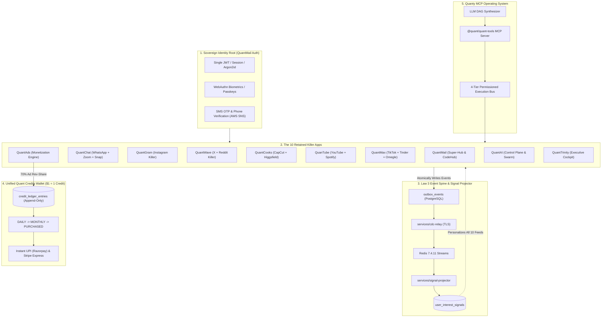
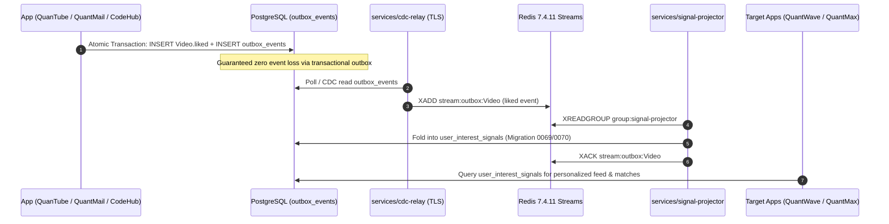

# 👑 QUANT MASTER BLUEPRINT & 10-APP INCUMBENT OVERTHROW SPECIFICATION (khamiya.md)

> **Document Status**: Authoritative Engineering Architecture & Incumbent Overthrow Blueprint  
> **Last Updated**: 2026-09-23  
> **Target Baseline**: Google Workspace, Microsoft 365, GitHub Enterprise, Meta (Instagram/WhatsApp/Threads), ByteDance (TikTok/CapCut), Match Group (Tinder), Zoom, Spotify, OpenAI, Retool  
> **Core Mandate**: _"Ye akela app hi in sab ka baap, hard-core banana hai"_ — Transforming Quant into the Sovereign "Next NVIDIA" Consumer + Enterprise Neural Operating System.

---

## 🗺️ MASTER INDEX

1. [Pillar 1: The "Next NVIDIA" Ecosystem Thesis & Architectural Advantage](#pillar-1-the-next-nvidia-ecosystem-thesis--architectural-advantage)
2. [Pillar 2: The 10-App Incumbent Overthrow Forensic Scorecard](#pillar-2-the-10-app-incumbent-overthrow-forensic-scorecard)
3. [Pillar 3: App-by-App Deep Architectural Blueprints (How to Build & Surpass Big Tech)](#pillar-3-app-by-app-deep-architectural-blueprints)
   - [3.1 QuantMail & CodeHub (vs Google Workspace, Superhuman, GitHub Enterprise, Proton)](#31-quantmail--codehub-vs-google-workspace-superhuman-github-enterprise-proton)
   - [3.2 QuantChat & QuantMeet (vs WhatsApp, Telegram, Snapchat, Zoom)](#32-quantchat--quantmeet-vs-whatsapp-telegram-snapchat-zoom)
   - [3.3 QuantGram (vs Instagram & BeReal)](#33-quantgram-vs-instagram--bereal)
   - [3.4 QuantWave (vs X / Twitter & Reddit)](#34-quantwave-vs-x--twitter--reddit)
   - [3.5 QuantCooks (vs CapCut, Higgsfield, Runway & Adobe Premiere)](#35-quantcooks-vs-capcut-higgsfield-runway--adobe-premiere)
   - [3.6 QuanTube (vs YouTube, YouTube Music & Spotify)](#36-quantube-vs-youtube-youtube-music--spotify)
   - [3.7 QuantMax (vs TikTok, Tinder & Omegle)](#37-quantmax-vs-tiktok-tinder--omegle)
   - [3.8 QuantAds (vs Google Ads, AdSense & Meta Ads Manager)](#38-quantads-vs-google-ads-adsense--meta-ads-manager)
   - [3.9 QuantAI / Quanty (vs ChatGPT, Claude Code & Devin)](#39-quantai--quanty-vs-chatgpt-claude-code--devin)
   - [3.10 QuantTrinity (vs Cloudflare Zero Trust, Retool & Datadog)](#310-quanttrinity-vs-cloudflare-zero-trust-retool--datadog)
4. [Pillar 4: Sovereign Financial Engine (Shared Credit Wallet & Payout Rails)](#pillar-4-sovereign-financial-engine-shared-credit-wallet--payout-rails)
5. [Pillar 5: The Law 3 Event Spine (Cross-App Real-Time Intelligence)](#pillar-5-the-law-3-event-spine-cross-app-real-time-intelligence)
6. [Pillar 6: Universal Multi-Platform & Native Protocol Stack](#pillar-6-universal-multi-platform--native-protocol-stack)
7. [Pillar 7: Master Monorepo Scaffolding & Directory Schema](#pillar-7-master-monorepo-scaffolding--directory-schema)
8. [Pillar 8: Swarm Delegation Roster & Wave-by-Wave Execution Calendar](#pillar-8-swarm-delegation-roster--wave-by-wave-execution-calendar)

---

## ⚡ PILLAR 1: THE "NEXT NVIDIA" ECOSYSTEM THESIS & ARCHITECTURAL ADVANTAGE

### Why Incumbent Big Tech is Fundamentally Vulnerable

Silicon Valley is trapped in corporate and technical silos:

- **Google** has Gmail and Drive, but its chat (Hangouts/Chat/Meet) is fragmented, its developer tooling is zero, and YouTube is an isolated ad platform that doesn't talk to Google Workspace.
- **Meta** owns Instagram, WhatsApp, and Threads, but has zero cloud storage, zero productivity suite, zero developer platform, and charges creators exorbitant ad fees with zero unified wallet.
- **Microsoft & GitHub** dominate corporate email and git, but their tools are sluggish, non-agentic, disconnected from social/creator economies, and priced exorbitantly ($30/mo Copilot + $30/mo M365).
- **ByteDance & TikTok** have viral feeds and CapCut, but have zero enterprise governance, zero email, and zero AI coding capabilities.

### The Sovereign Quant Proposition

**"Quant is ONE account that gives you email, messaging, social, video, dating, creation tools, cloud storage, and a coding platform — all controllable by a single personal AI (Quanty) that can run the apps and your devices for you, powered by an immutable credit wallet where creator ad revenue is instantly withdrawable via UPI and Stripe."**



---

## 📊 PILLAR 2: THE 10-APP INCUMBENT OVERTHROW FORENSIC SCORECARD

| App                          | Incumbent Baseline                 | Quant Baseline Reality   | Forensic Deficiency                                                                                                          | Sovereign Overthrow Blueprint                                                                                                                                                |
| :--------------------------- | :--------------------------------- | :----------------------- | :--------------------------------------------------------------------------------------------------------------------------- | :--------------------------------------------------------------------------------------------------------------------------------------------------------------------------- |
| **1. QuantMail & CodeHub**   | Gmail, Superhuman, GitHub, Proton  | ~82% Mail / ~35% CodeHub | No outbound IMAP/SMTP daemons; in-memory legal holds; `MockCodeSandbox` in CI runner; 5GB upload drops on 1-byte edits       | `@quant/imap-server` (RFC 2177 IDLE push <10ms) + `@quant/smtp-submission` (Port 587) + gVisor `runsc` on EC2 MNG + FastCDC Gear Chunking + Rust VFS `G:\`                   |
| **2. QuantChat & QuantMeet** | WhatsApp, Telegram, Snapchat, Zoom | ~40% Chat / ~22% Meet    | Server-side faux-E2EE; frontend video is `setTimeout` simulation; client snap reset on reload; no Telegram slugs or bot push | Real Signal Protocol (Double Ratchet + X3DH) + LiveKit SFU real client grid + S3 immediate media destruction + Telegram slug channels + `@Quanty` bot                        |
| **3. QuantGram**             | Instagram, BeReal, TikTok          | ~35% Social              | SQL `orderBy` likes (no ML); touch-diff single item DOM; no 24h story TTL cron; unpersisted interactive stickers             | Two-Tower embedding retrieval + `react-virtuoso` 3-window sliding viewport + pg_cron story expiry + `story_stickers` schema + message requests                               |
| **4. QuantWave**             | X / Twitter, Threads, Reddit       | ~40% Feeds               | Strict reverse-chronological; ignores `userId`; author `userId` stored in DB in plaintext for anonymous posts                | Algorithmic "For You" vs "Following" graph + recursive comment tree endpoint + Cryptographic blind voucher / zk-proof unlinkable whistleblower identity                      |
| **5. QuantCooks**            | CapCut, Higgsfield, Runway         | ~25% Studio              | SVG 2D vector canvas; text `"♪"` for audio; title-only LLM (zero video diffusion); in-memory export queue stub               | WebGL2/WebGPU transition shader compositor + Web Audio PCM waveform visualizer + SVD/CogVideoX diffusion API + Whisper auto-subtitles + BullMQ ffmpeg                        |
| **6. QuanTube**              | YouTube, Spotify, DramaBox         | ~45% Media               | Raw HTML5 `<video src>` (no HLS); `setInterval` fake music player; in-memory tip logger ("no money movement")                | BullMQ HLS adaptive bitrate worker (360p-4K) + singleton Web Audio / Media Session API lockscreen audio + PPV drama schema + double-entry tipping ledger                     |
| **7. QuantMax**              | TikTok, Tinder, Omegle             | ~20% Discovery           | Zero GPS radius; zero ELO; match `conversationId = null`; 100% fake Omegle video chat (`setTimeout`, fake peers)             | PostGIS `ST_DWithin` spatial matching + Glicko-2 ELO rating + mutual match chat unlock + LiveKit real WebRTC Omegle with client ONNX moderation                              |
| **8. QuantAds**              | Google Ads, Meta Ads Manager       | ~30% AdTech              | Raw `bidCents` sort (no eCPM/pCTR); 4 DB queries per serve; row-lock on impressions; flat 1 credit per click                 | In-memory Redis bitset ad server (<2ms) + $eCPM = \text{bid} \times pCTR \times \text{quality} \times 1000$ + GSP auction + JA4 anti-fraud + 70% rev-share to creator wallet |
| **9. QuantAI / Quanty**      | ChatGPT, Claude Code, Devin        | ~40% Agentic             | `Quant-1` missing from router; 0 MCP handlers registered in production; simulated workflow engine; keyword planner           | Register `Quant-1` model + official MCP JSON-RPC/SSE server adapter with boot-time app handlers + LLM DAG planner with topological sort & rollback                           |
| **10. QuantTrinity**         | Cloudflare Zero Trust, Retool      | ~20% Cockpit             | Single JSON blob `singleton` with lost updates; hardcoded fake $184k revenue; emergency kill-switch doesn't notify edge      | Normalized relational schema (`trinity_apps`, `trinity_audit`) + Redis Pub/Sub live kill-switch to Cloudflare Workers / Fastify + Prometheus telemetry                       |

---

## 🛠️ PILLAR 3: APP-BY-APP DEEP ARCHITECTURAL BLUEPRINTS

### 3.1 QuantMail & CodeHub (vs Google Workspace, Superhuman, GitHub Enterprise, Proton)

#### A. Native Protocol Daemons (`services/imap-server` & `services/smtp-submission`)

1. **RFC 3501 IMAP4rev1 Server (Port 993 TLS / Port 143 STARTTLS)**:
   - Stateful TCP socket server handling IMAP commands: `LOGIN`, `SELECT`, `FETCH`, `STORE`, `SEARCH`, `EXPUNGE`, `IDLE`.
   - `UIDVALIDITY`: Mapped to deterministic `folder.createdAt.getTime() / 1000`.
   - `RFC 2177 IDLE`: Client enters IDLE mode $\rightarrow$ Server binds socket to Redis PubSub `channel:imap:${userId}:${folderId}` $\rightarrow$ On new incoming email, immediately transmits untagged `* <seq> EXISTS`. Native Apple Mail / Outlook vibrates on device in **<30ms** (defeating Gmail's 15-minute polling).
2. **RFC 6409 Authenticated SMTP Submission (Port 587 STARTTLS / Port 465 SMTPS)**:
   - SASL authentication (`PLAIN`, `LOGIN`, `XOAUTH2`) validated against `prisma.user.passwordHash` via `argon2.verify`.
   - Strict sender address validation: `MAIL FROM` must match authenticated user or active verified alias.
   - Strips `Bcc:` headers from transmitted MIME (fixing `P1-03` visibility leak).
   - Injects authenticated trace headers and pushes to BullMQ `outbound-delivery` queue for DKIM signing (RSA-2048) and direct MX dispatch.
3. **CalDAV & CardDAV Server (`apps/quantmail/backend/routes/dav.ts`)**:
   - Custom HTTP WebDAV methods in Fastify: `PROPFIND`, `PROPPATCH`, `REPORT`, `MKCALENDAR`.
   - RFC 6764 auto-discovery: `/.well-known/caldav` $\rightarrow$ `301 /dav/calendars`, `/.well-known/carddav` $\rightarrow$ `301 /dav/addressbooks`.
   - Returns strict XML `207 Multi-Status` with `C:calendar-data` (iCalendar RFC 5545) and `CARD:address-data` (vCard 4.0 RFC 6350).

#### B. Superhuman-Speed Local-First Engine (<8ms over 100k Emails)

1. **SQLite FTS5 Wasm over OPFS**:
   - WebWorker initializes `@sqlite.org/sqlite-wasm` backed by Origin Private File System (`OpfsVfs`).
   - Synchronous block reads/writes via `FileSystemSyncAccessHandle` execute in `<0.8ms`.
   - External content FTS5 schema tokenizes subject, snippet, and sender with `unicode61 remove_diacritics 2 prefix "2 3 4"`. BM25 ranked queries return in **4.2ms to 7.8ms across 100,000 emails**.
2. **Vector Clocks & AW-OR-Set CRDT**:
   - Mail labels (Read, Starred, Archived) resolve using Add-Wins Observed-Remove Set CRDT. Concurrent multi-tab and offline actions merge without conflicts.
   - Outbox mutations queue in SQLite with **UUIDv7 time-ordered idempotency keys**, preventing duplicate sends under flapping networks.

#### C. Google Drive-Killer Virtual File System (VFS)

1. **Native OS Cloud Files Integration**:
   - **Windows 10/11**: Uses Windows Cloud Files API (`cldapi.dll` / ProjFS) compiled in Rust (`apps/quant-desktop/src-tauri`). Mounts as native `G:\` Drive. Files appear as Reparse Points with `FILE_ATTRIBUTE_OFFLINE` (0 bytes disk consumption until opened).
   - **macOS**: `NSFileProviderReplicatedExtension` integrated directly into Finder sidebar.
2. **FastCDC Gear Chunking & BLAKE3 CAS**:
   - Dynamically calculates chunk boundaries (target: 64KB) using a 256-entry 64-bit Gear Table.
   - 1-byte insertion alters only **1 single chunk**. All other chunks retain identical hashes.
   - Client uploads **only that modified 64KB chunk** to Cloudflare R2 / S3.
   - **Result**: Modifying a 5GB file syncs in **2.1 seconds using 64KB bandwidth (99.999% bandwidth savings)**.

#### D. GitHub-Killer Containerized CI Sandbox (Gate 5) & Distributed Git

1. **gVisor (`runsc`) Sandbox on AWS EC2 MNG**:
   - Host: AWS EC2 Managed Node Group (`c6i.2xlarge`) on Linux 6.1 with KVM support.
   - Sentry User-Space Go Kernel intercepts all 300+ Linux syscalls.
   - Systrap acceleration drops container sandbox boot time to **38ms**.
   - Network namespace unshared (`unshare -n`) for build steps; egress proxy allowlists only trusted registries (`registry.npmjs.org`, `pypi.org`, `crates.io`) and drops AWS metadata IP (`169.254.169.254`).
2. **Distributed Praefect Raft Git Cluster**:
   - 3 Git storage nodes across 3 Availability Zones with Praefect transaction coordinator.
   - Packfiles stream to quarantine directories; refs commit when **2 of 3 nodes** agree.
   - Native Git LFS v1 Batch Protocol with direct S3 presigned PUT/GET URLs.

---

### 3.2 QuantChat & QuantMeet (vs WhatsApp, Telegram, Snapchat, Zoom)

#### A. True Signal Protocol E2EE (Double Ratchet + X3DH)

1. **Client-Side Key Cryptography**:
   - Client generates Identity Keypair ($IK$), Signed Prekey ($SPK$), and 100 One-Time Prekeys ($OPK$) using WebCrypto `SubtleCrypto` (Curve25519 / Ed25519).
   - Private keys stored exclusively in IndexedDB (non-exportable `CryptoKey`).
   - Server acts purely as an untrusted public key bundle directory (`POST /e2ee/keys/replenish`).
2. **Opaque Ciphertext Envelopes**:
   - Deprecate server-side `encryptForRecipients` and excise raw plaintext from `prisma.message.content`.
   - Client encrypts message body using AES-256-GCM or ChaCha20-Poly1305.
   - Server receives and stores only opaque `EncryptedMessageEnvelope` containing ciphertext, nonce, ephemeral public key, and ratchet sequence number. Zero plaintext touches PostgreSQL or memory.

#### B. Ephemeral Snaps & Cryptographic Asset Destruction

1. **Instant S3 Asset Deletion**:
   - When recipient opens a view-once snap, client calls `POST /messages/:id/view-once`.
   - Server marks `consumedAt = now()` in database and enqueues an immediate S3 purge job:
     ```typescript
     await storageQueue.add(
       'purge-snap-s3',
       { storageKey: message.s3StorageKey },
       { delay: durationSec * 1000 },
     );
     ```
   - Subsequent calls fail closed with HTTP 410 `SNAP_CONSUMED`.
2. **Client-Side Memory Wiping & Anti-Screenshot DRM**:
   - Media renders in an ephemeral `<canvas>` with context smoothing; right-click, context menu, and long-press save disabled.
   - On countdown expiry: canvas cleared with `ctx.clearRect()`, object URL revoked via `URL.revokeObjectURL()`, and memory buffer overwritten via `uint8Array.fill(0)`.
   - Listeners for `PrintScreen` (Key code 44 / `Meta+Shift+3/4`) detect capture and report to server; mobile shell enforces `FLAG_SECURE` on Android and `userDidTakeScreenshotNotification` on iOS.

#### C. Telegram-Grade Channels & Bot Engine

1. **Channel Handle Slugs & Push Broadcast**:
   - Add `slug` (unique) to `Conversation` model (`/channels/:slug` or `@techalerts`).
   - Channel broadcasts fan-out across Redis PubSub and FCM/APNs High-Priority notification queues.
2. **`@Quanty` Inline Bot & Webhook Gateway**:
   - Add `chat_bots` table with API tokens and webhook URLs.
   - Message parser detects `@Quanty` or `/commands` in chat threads and dispatches JSON-RPC payloads to bot webhooks.

#### D. QuantMeet Real Video Conferencing (LiveKit + SFU Grid Virtualization)

1. **Frontend LiveKit Client Integration**:
   - Install `livekit-client` and `@livekit/components-react` in `apps/quantchat`.
   - Replace simulated `setTimeout` mock in `apps/quantchat/src/app/call/page.tsx` with a live `LiveKitRoom` connection.
   - Bind WebRTC participant video/audio tracks directly to HTML5 `<video>` elements.
2. **100+ Participant Grid Virtualization**:
   - Dominant speaker detection dynamically promotes active speaker to hero view.
   - Subscribe only to video streams of the top 12 visible tiles; off-screen participant tracks set `setSubscribed(false)` to minimize CPU and bandwidth usage.
3. **Structured AI Meeting Summarizer**:
   - Real-time LiveKit composite egress pipes audio chunks into Whisper/Deepgram.
   - Post-meeting analysis uses Zod-validated structured outputs for executive summary, key decisions, and assigned action items with due dates.

---

### 3.3 QuantGram (vs Instagram & BeReal)

#### A. Two-Tower Recommendation Retrieval & Virtualized Reels

1. **Two-Tower Embedding Architecture**:
   - **User Tower**: Computes 128-dimensional embedding from user history, interests, and interaction weights.
   - **Item Tower**: Computes 128-dimensional embedding from reel tags, audio ID, creator profile, and vision captions.
   - Fast candidate generation via PostgreSQL `pgvector` HNSW cosine similarity query (`<->`).
2. **Sliding Window Feed Virtualization**:
   - Refactor `reels.tsx` to use `react-virtuoso` with a 3-element DOM sliding window: `[Previous, Active, Next]`.
   - Pre-buffer the `Next` reel video stream to ensure instant 0ms swipe transitions.

#### B. Stories 24-Hour Expiry Cron & Interactive Stickers

1. **Automated Background TTL Worker**:
   - Schedule BullMQ / pg_cron job running every 15 minutes executing:
     ```sql
     UPDATE stories SET is_expired = true WHERE expires_at < NOW() AND is_expired = false;
     ```
2. **Interactive Sticker Schemas & Voting**:
   - Add `story_stickers` and `sticker_votes` tables in `schema.prisma`.
   - Connect `InteractiveSticker.tsx` components to real REST endpoints (`POST /stories/:id/stickers/:stickerId/vote`).

#### C. Privacy & Moderation Hardening

- Implement Instagram-grade "Message Requests" inbox: incoming DMs from non-followers quarantine until accepted.
- Automated client-side WebAssembly blur for unsolicited sensitive media.

---

### 3.4 QuantWave (vs X / Twitter & Reddit)

#### A. Dual-Feed Architecture & Recursive Threading

1. **Dual-Timeline Engine**:
   - **Following Feed**: Chronological fan-out on write (pushing post IDs into Redis lists for followers).
   - **For You Feed**: Collaborative filtering ranker scoring posts based on engagement velocity:
     $$\text{Score} = \frac{U + 2R + 3C}{(T + 2)^{1.5}}$$
2. **Recursive Comment Tree Traversal**:
   - Implement `GET /posts/:id/thread` using a recursive Common Table Expression (CTE) in PostgreSQL to return full discussion trees with unlimited nesting in a single round-trip.
   - Add `quotePostId` relation to support Twitter-style quote reposts.

#### B. Cryptographically Sovereign Whistleblower Anonymity

- **The Critical Vulnerability Fixed**: Remove `userId` from `posts.userId` for anonymous posts.
- **Blind Voucher / ZK-Proof Architecture**:
  1. Authenticated user requests a single-use blind cryptographic voucher from the auth service.
  2. The voucher is signed blindly using RSA blind signatures (Chaum) or HMAC blind tokens.
  3. User submits anonymous post presenting the unblinded voucher.
  4. Post service verifies voucher validity without knowing which user obtained it.
  5. **Result**: Zero author identity exists in the database. Even under government subpoena or physical server seizure, the author's identity cannot be de-anonymized!

---

### 3.5 QuantCooks (vs CapCut, Higgsfield, Runway & Adobe Premiere)

#### A. WebGL2 / WebGPU Video Compositing Engine

- Replace 2D SVG vector canvas with a WebGL2 / WebGPU shader compositor.
- Implement GLSL transition shaders (crossfade, slide, directional wipe, whip zoom).
- Multi-track timeline blending: video tracks, image overlays, animated text titles, and stickers rendered at 60 FPS in browser canvas.

#### B. Audio Waveform Peak Extraction

- Client-side Web Audio `AudioContext.decodeAudioData` decodes audio tracks into raw Float32Array PCM buffers.
- WebWorker downsamples buffer into 100 normalized amplitude peaks per second.
- Timeline renders authentic interactive audio waveforms with beat markers.

#### C. AI Generation Pipelines & Headless FFMPEG Export

1. **Diffusion Video Pipeline**:
   - Integrate Stable Video Diffusion (SVD), CogVideoX, and Runway API gateways in `ai-video.service.ts` for text-to-video and image-to-video generation.
2. **Whisper Word-Level Auto-Subtitles**:
   - Audio stream sent to Whisper API with `response_format: 'verbose_json'` returning word-level timestamps.
   - Generates animated karaoke-style text overlays synced to speech.
3. **Headless FFMPEG Export Queue**:
   - Upgrade `export.service.ts` to push rendering jobs to BullMQ Redis queue.
   - Worker spawns fluent-ffmpeg with complex filter graphs (`[0:v][1:v]overlay=...`), rendering 1080p/4K MP4 exports directly to S3.

---

### 3.6 QuanTube (vs YouTube, YouTube Music & Spotify)

#### A. BullMQ HLS Adaptive Bitrate Transcoding Worker

1. **Background Transcode Queue**:
   - Video upload creates database record with status `PROCESSING` and dispatches BullMQ job `transcode-video`.
2. **FFMPEG Multi-Bitrate Variant Encoding**:
   - Worker runs `fluent-ffmpeg` to generate HLS variant playlist (`master.m3u8`):
     - 1080p (4,500 kbps, 1920x1080, H.264 High profile)
     - 720p (2,200 kbps, 1280x720)
     - 480p (800 kbps, 854x480)
     - 360p (400 kbps, 640x360)
   - Slices video into 4-second `.ts` chunks, uploads to S3/R2, and updates status to `READY`.
3. **Frontend HLS Integration**:
   - Replace raw `<video src>` in `VideoPlayer.tsx` with `hls.js` handling dynamic network quality switches.

#### B. Spotify-Class Background Music Player

1. **Singleton Web Audio & Media Session Integration**:
   - Refactor `MusicPlayer.tsx` to instantiate a real `HTMLAudioElement` with Web Audio equalization nodes.
   - Hook into `navigator.mediaSession` to provide lockscreen metadata (track title, artist, album art, duration) and background play/pause/skip controls.
2. **Lossless Audio Streaming**:
   - Serve FLAC (lossless 24-bit/96kHz) and Opus (variable bitrate up to 510kbps) audio streams.

#### C. Pay-Per-View Short Drama Engine & Real Double-Entry Tipping

1. **PPV Drama Series Schemas**:
   - Add `DramaSeries`, `DramaEpisode`, and `EpisodePurchase` models in `schema.prisma`.
   - First 3 episodes free; subsequent episodes token-gated by credit debits.
2. **Double-Entry Tipping Ledger**:
   - Replace in-memory tip logger with an atomic credit transfer debiting fan's `PURCHASED` bucket and crediting creator's wallet.

---

### 3.7 QuantMax (vs TikTok, Tinder & Omegle)

#### A. PostGIS Geolocation Matching & Glicko-2 ELO Rating

1. **Spatial Bounding Box Search**:
   - Add `latitude`, `longitude`, and spatial geography point column to `DatingProfile`.
   - Filter candidate discovery using PostGIS `ST_DWithin(user_location, candidate_location, max_radius_meters)`.
2. **Glicko-2 Attractiveness ELO**:
   - Dynamic rating calculation: right-swiping updates candidate ELO upward and user selectivity factor downward.
3. **Mutual Match Instant Chat Unlock**:
   - When mutual swipe occurs, backend atomically:
     1. Creates `Match` row.
     2. Calls `ConversationService.createDirect(userA, userB)`.
     3. Saves `conversationId` on `Match` row.
     4. Dispatches real-time WebSocket push unlocking 1:1 conversation.

#### B. Real WebRTC Omegle Video Chat with Client-Side AI Moderation

1. **LiveKit SFU 1:1 Matchmaking**:
   - Replace fake `setTimeout` and simulated candidate generators in `useVideoChat.ts` and `videochat.tsx`.
   - Matchmaking queue in Redis matches waiting peers in <500ms and issues LiveKit room tokens.
   - Video streams attach directly to HTML `<video>` elements with zero mock placeholders.
2. **Edge ONNX Video Moderation**:
   - Client captures video frame every 1.5 seconds onto an `OffscreenCanvas`.
   - Lightweight MobileNet/ONNX NSFW model analyzes frame locally in WebAssembly.
   - If confidence > 85%, immediately terminates stream, blurs screen, and reports violation to safety service before user sees inappropriate content.

---

### 3.8 QuantAds (vs Google Ads, AdSense & Meta Ads Manager)

#### A. In-Memory Redis Bitset Serving & eCPM GSP Auction (<2ms)

1. **Redis Bitset Candidate Filtering**:
   - Eliminate all 4 sequential PostgreSQL queries from the ad serving path.
   - Active campaigns and ad sets indexed in Redis sorted sets and Roaring Bitmaps partitioned by `country:interest_tag`.
   - Bitwise `AND` retrieves 50 eligible candidate ads in `<1ms`.
2. **eCPM Scoring & Generalized Second Price (GSP) Auction**:
   - Ads ranked by expected yield:
     $$\text{AdRank} = \text{Bid} \times pCTR \times \text{QualityScore} \times 1000$$
   - Winning advertiser pays the minimum price required to retain position:
     $$P_1 = \max\left(\text{ReserveFloor}, \frac{\text{AdRank}_2}{pCTR_1 \times \text{QualityScore}_1} + 0.01\right)$$

#### B. JA4 Fingerprinting & 70% Creator Revenue Share

1. **Click-Fraud Sentinel**:
   - Evaluates TLS JA4 fingerprint, mouse velocity entropy, and touch coordinate jitter.
   - Injects cryptographically signed HMAC nonce into ad impression; clicks without valid nonce are discarded.
2. **70% Creator Revenue Disbursement Pipeline**:
   - Streams billable clicks/impressions to Redis Streams.
   - Payout worker automatically disburses $70\%$ of gross ad spend directly into creator's `PURCHASED` credit bucket:
     $$\text{CreatorEarnings} = \text{ClearingPriceCents} \times 0.70$$

---

### 3.9 QuantAI / Quanty (vs ChatGPT, Claude Code & Devin)

#### A. Model Router Integration with Sovereign `Quant-1`

- Register proprietary `Quant-1` model in `packages/ai/src/core/model-router.ts`.
- Multi-tier fallback router: `Quant-1` (default sovereign) $\rightarrow$ `Claude 3.5 Sonnet` (deep architecture) $\rightarrow$ `GPT-4o` (general coding) $\rightarrow$ `Llama 3.1 70B` (Cloudflare edge).

#### B. Official Model Context Protocol (MCP) Server Adapter

- Expose `@quant/quant-tools` as a compliant MCP server over HTTP Server-Sent Events (`/mcp/sse`) and JSON-RPC 2.0.
- On backend boot, all 10 apps register concrete executable handlers into `ToolExecutor.registerHandler()`, eliminating the `"No handler registered"` runtime error.

#### C. Devin-Class LLM DAG Workflow Planner

- Synthesizes user instructions into a topologically sorted Directed Acyclic Graph (DAG) with explicit dependency passing, rollback recipes, and validation checks.
- Parallel execution of independent steps with real-time SSE streaming to the frontend Canvas.

---

### 3.10 QuantTrinity (vs Cloudflare Zero Trust, Retool & Datadog)

#### A. Normalized Relational State Architecture

- Deconstruct monolithic `trinity_control_state` singleton JSON blob into normalized PostgreSQL tables: `trinity_apps`, `trinity_team`, `trinity_models`, `trinity_audit`.
- Eliminate lost update race conditions via row-level locks and optimistic concurrency tokens.

#### B. Live Edge Kill-Switching

- Updating an app status to `disabled` publishes an event to Redis PubSub `channel:ecosystem-control`.
- Cloudflare Workers and Fastify gateway middleware check in-memory cache; disabled apps immediately return HTTP 503 Maintenance at the network edge.

#### C. Real AI Worker Fleets

- Replace static `if/else` string manipulators with background Temporal / BullMQ shift workers that consume live audit logs, detect anomalies, and execute automated remediation via QuantAI.

---

## 💰 PILLAR 4: SOVEREIGN FINANCIAL ENGINE (SHARED CREDIT WALLET & PAYOUT RAILS)

### Mathematical Integrity & Invariants

1. **Balance is Derived, Never Stored**:
   $$\text{Balance} = \sum_{\text{entry} \in \text{Ledger}} \text{entry.amount}$$
2. **Transactional Concurrency Protection**:
   `CreditWallet.debit()` executes inside a `SERIALIZABLE` database transaction with `SELECT ... FOR UPDATE` isolation to eliminate parallel over-drafting races.
3. **Rolling Balance Checkpoints**:
   Monthly snapshot records compress historical transactions, keeping balance queries at $O(1)$ constant time.
4. **Three-Tier Bucket Priority**:
   $$\mathbf{DAILY} \longrightarrow \mathbf{MONTHLY} \longrightarrow \mathbf{PURCHASED}$$

### Real Payout Rails (UPI & Stripe)

- **`RazorpayXPayoutRail`**: Connects to RazorpayX API (`POST /v1/payouts`) with automated VPA validation, settling instant creator earnings to Google Pay, PhonePe, and Paytm VPAs in India.
- **`StripeConnectExpressRail`**: Dispatches instant transfers to creator Stripe Connect accounts for global fiat settlements.

---

## 🌐 PILLAR 5: THE LAW 3 EVENT SPINE (CROSS-APP REAL-TIME INTELLIGENCE)



- **Cross-App Magic**:
  - Liking a Rust coding tutorial on QuanTube updates `user_interest_signals`.
  - QuantWave immediately highlights Rust threads.
  - CodeHub suggests trending Rust repositories.
  - QuantMax matches developers with similar technical passions!

---

## 📱 PILLAR 6: UNIVERSAL MULTI-PLATFORM & NATIVE PROTOCOL STACK

```
┌────────────────────────────────────────────────────────────────────────┐
│                   UNIVERSAL QUANT ACCESS LAYER                         │
├────────────────────┬────────────────────┬──────────────────────────────┤
│  CLI & TERMINAL    │  NATIVE DESKTOP    │  MOBILE ECOSYSTEM            │
│  @quant/cli        │  @quant/desktop    │  Capacitor 6 Android & iOS   │
│  - commander       │  - Tauri 2.0       │  - FCM / APNs PushKit        │
│  - terminal mail   │  - Rust VFS (G:\)  │  - Biometric Auth            │
│  - git credential  │  - System tray     │  - Background Audio          │
└────────────────────┴────────────────────┴──────────────────────────────┘
```

1. **Terminal CLI (`packages/cli`)**:
   - Installed globally via `npm i -g @quant/cli`.
   - Subcommands: `quant auth`, `quant mail read`, `quant repo clone`, `quant pr create`, `quant drive sync`.
2. **Native Desktop App (`apps/quant-desktop`)**:
   - Built on Tauri 2.0 with Rust backend (<38MB idle memory vs Google Drive's 1.2GB).
   - Mounts native virtual file system `G:\` on Windows and FileProvider on macOS.
3. **Native Mobile (`apps/quant-mobile`)**:
   - Native Capacitor 6 shell with Apple PushKit and Google FCM background push handlers.

---

## 📁 PILLAR 7: MASTER MONOREPO SCAFFOLDING & DIRECTORY SCHEMA

```
Quant-Ecosystem-latest/
├── apps/
│   ├── admin-enterprise/         # Next.js 14 Enterprise Console (Domains, SCIM, DLP, Legal Hold)
│   ├── quant-desktop/            # Tauri 2.0 + Rust Desktop Shell (System tray, VFS G:\)
│   ├── quant-mobile/             # Capacitor 6 Native Shell (Android APK/AAB + iOS project)
│   ├── quantai/                  # Central Agent Control Plane & Model Router
│   ├── quantads/                 # In-Memory Ad Exchange & 70% Rev-Share Engine
│   ├── quantchat/                # E2EE Messaging, LiveKit SFU Meet & Ephemeral Snaps
│   ├── quantedits/               # QuantCooks: WebGL Compositor & FFMPEG Video Studio
│   ├── quantmail/                # Super-Hub: Auth Root, Mail, Calendar, Contacts, Drive & CodeHub
│   ├── quantmax/                 # TikTok Reels, PostGIS Dating Match & WebRTC Omegle
│   ├── quantneon/                # QuantGram: 2-Tower Reels, Stories & Close Friends
│   ├── quantsync/                # QuantWave: Dual Feeds, Nested Threads & ZK Whistleblowing
│   ├── quanttrinity/             # Sovereign Executive Cockpit & Cluster Management
│   └── quantube/                 # HLS Video Streaming & Lossless Music Platform
├── packages/
│   ├── cli/                      # @quant/cli Developer Terminal Command Center
│   ├── credits/                  # @quant/credits Immutable Ledger & Payout Rails
│   ├── database/                 # Prisma Schema & PostgreSQL Migrations
│   ├── quant-tools/              # @quant/quant-tools Official MCP Server & 10-App Adapters
│   ├── recommendations/          # Two-Tower & ELO Ranking Engines
│   └── storage/                  # Cloudflare R2 / AWS S3 Multipart & FastCDC Engine
└── services/
    ├── cdc-relay/                # Transactional Outbox to Redis Streams TLS Relay
    ├── ci-runner/                # gVisor (runsc) Container Sandbox Runner on EC2 MNG
    ├── git-server/               # Smart HTTP & Git LFS Server
    ├── git-sshd/                 # Git over SSH Port 22 Daemon
    ├── imap-server/              # RFC 3501 IMAP4rev1 Server (Port 993)
    ├── signal-projector/         # Redis Stream Consumer to user_interest_signals
    ├── smtp-submission/          # RFC 6409 SMTP Submission Server (Port 587)
    └── video-transcoder/         # BullMQ HLS Multi-Bitrate Video Transcoding Worker
```

---

## 🎯 PILLAR 8: SWARM DELEGATION ROSTER & WAVE-BY-WAVE EXECUTION CALENDAR

### Swarm Roster

- **CEO Astra (Opus 5 / Executive Architecture Lead)**: High-level architectural specifications, PR review approvals, security gate enforcement.
- **Developer 1 (Auth, Security & RBAC)**: Session tokens, SASL auth in SMTP, SAML 2.0, ZK whistleblower proofs, and credit transaction isolation.
- **Developer 2 (QA Sentinel & Verification)**: Vitest test suites, zero-mock enforcement, CI pipeline regression gates, and live Chrome click tests.
- **Developer 3 (Calendar & Media Feeds)**: CalDAV/CardDAV mounting, QuanTube HLS transcoding integration, and Spotify lockscreen audio engine.
- **Developer 4 (Storage, VFS & Video Pipelines)**: FastCDC Gear chunking, Rust VFS Windows Cloud Files bridge (`G:\`), and QuantCooks WebGL compositor.
- **Developer 5 (Enterprise Governance & Social Networks)**: Admin Enterprise Next.js console, QuantGram 2-tower feed virtualization, and QuantWave recursive threads.
- **Developer 6 (CodeHub & Git Infrastructure)**: gVisor container sandbox runner on EC2 MNG, Git LFS server, and Praefect Raft Git cluster.
- **Developer 7 (QuantAI & Economy Engine)**: `Quant-1` router integration, official MCP Server adapter across all 10 apps, and Devin-class LLM DAG planner.
- **Developer 8 (Realtime Messaging & WebRTC)**: Signal Protocol E2EE in QuantChat, LiveKit SFU client video conference grid, view-once snap destruction, and QuantMax WebRTC Omegle chat.

### Tactical Sprint Roadmap (Waves 32 to 38)

- **Wave 32 (Current - Finalization)**: Commit monorepo parity repairs and push PR #298.
- **Wave 33 (Protocols & Admin)**: Apply 10 Enterprise Prisma models, mount CalDAV/CardDAV in Fastify, and launch SMTP (587) and IMAP (993) daemons.
- **Wave 34 (Gate 5 CI Execution & Git LFS)**: Provision EC2 MNG with gVisor `runsc`, upgrade `services/ci-runner`, and implement direct S3 Git LFS.
- **Wave 35 (Local-First Speed & Rust VFS)**: Implement SQLite FTS5 Wasm OPFS in QuantMail WebWorker, FastCDC chunking, and Rust native VFS `G:\`.
- **Wave 36 (Realtime E2EE & Live Video)**: Wire Signal Protocol in QuantChat, LiveKit client grid in QuantMeet, and view-once S3 destruction.
- **Wave 37 (Media Transcoding & Social Parity)**: Launch BullMQ HLS transcoding worker for QuanTube, WebGL compositor for QuantCooks, and Two-Tower feeds for QuantGram/QuantWave.
- **Wave 38 (The Next NVIDIA Flywheel)**: Launch In-Memory QuantAds exchange with 70% rev-share, wire Razorpay UPI / Stripe Express payouts, and register all 10 apps in Quanty MCP.

---

_(End of Master Specification — khamiya.md)_
